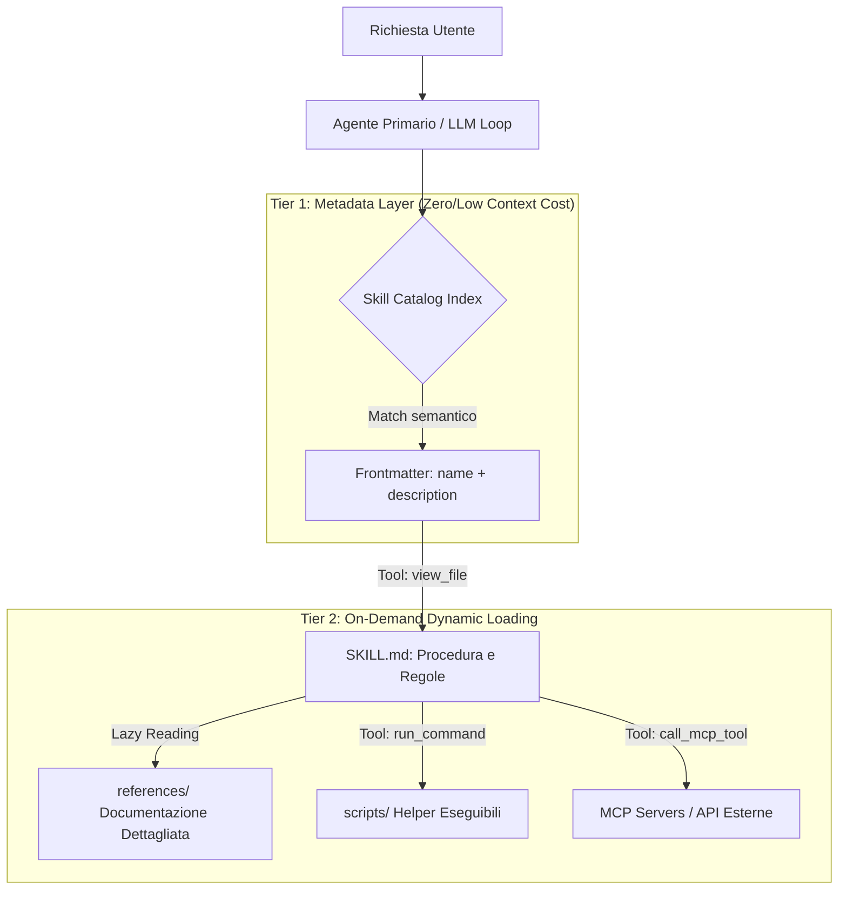
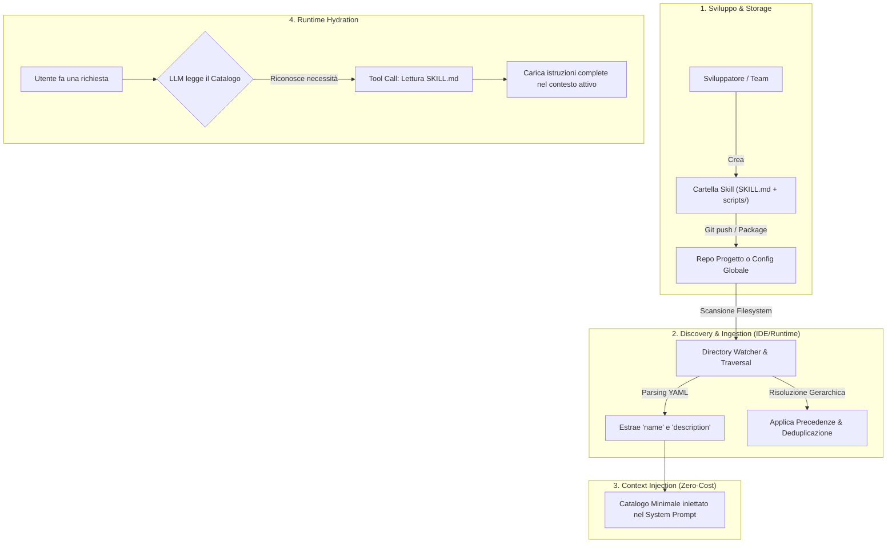

# Architettura, Portabilità e Distribuzione degli Skill nei Sistemi Agentici

Questo documento riassume in dettaglio l'architettura interna, l'analisi di portabilità cross-platform, i meccanismi di distribuzione negli IDE agentici e i riferimenti scientifici/standard per il pattern degli **Skill** e delle architetture **ReAct / Tool-augmented LLM**.

---

## 1. Il Pattern Architetturale degli Skill

Gli **Skill** sono moduli di conoscenza procedurale, regole operative e script esecutivi che estendono le capacità di un agente AI senza richiedere fine-tuning del modello. Si basano su una combinazione di pattern architetturali:



### A. Progressive Disclosure (Two-Tier Context Management)
* **Problema:** Caricare tutti i runbook e le guide nel prompt di sistema esaurisce la finestra di contesto, aumenta la latenza/costi e degrada l'attenzione del modello (*needle in a haystack*).
* **Soluzione a due livelli:**
  1. **Tier 1 (Metadata Index):** Nel system prompt viene iniettato solo l'indice compatto dei metadati (`name` e `description`).
  2. **Tier 2 (On-Demand Hydration):** Solo quando l'LLM riconosce che il task richiede uno skill, invoca un tool di lettura (`view_file`) caricando il corpo di `SKILL.md` e, se necessario, i file di approfondimento in `references/`.

### B. Microkernel / Plugin Architecture
* Il core dell'agente funge da **Microkernel** con primitive operative di base (lettura/scrittura file, esecuzione comandi sandbox, chiamate MCP, gestione task).
* Gli Skill operano come **Plugin** disaccoppiati: incapsulano logiche di dominio senza modificare l'engine di base.

### C. Convention-over-Configuration & Filesystem-as-API
* Struttura directory standardizzata:
  ```text
  skills/<skill_name>/
  ├── SKILL.md          # Entry point dichiarativo (YAML Frontmatter + Markdown)
  ├── scripts/          # Helper imperativi/eseguibili (Python/Bash)
  ├── references/       # Documentazione e manuali approfonditi (lazy-loaded)
  ├── examples/         # Casi d'uso e configurazioni di riferimento
  └── resources/        # Asset statici, template, schemi
  ```

### D. Hierarchical Discovery & Cascading Precedence (Chain of Responsibility)
* Gli skill vengono scoperti e risolti secondo un ordine gerarchico di precedenza:
  1. **Workspace Scope (`.agents/skills/`):** Specifico per il repository (priorità massima, versionabile su Git).
  2. **Declared Configurations (`skills.json`):** Mappature e registrazioni esplicite.
  3. **User Global Scope (`~/.gemini/config/skills/`):** Personalizzazioni globali per utente/macchina.
  4. **Built-in System Scope:** Skill predefiniti forniti dall'IDE/piattaforma.

### E. Separazione tra Guida Dichiarativa ed Esecuzione Imperativa
* **Markdown (`SKILL.md`):** Fornisce reasoning, criteri decisionali e logica di recupero errori.
* **Helper Scripts (`scripts/`):** Automatizzano sequenze complesse o deterministiche di comandi per azzerare il margine di allucinazione dell'LLM.

---

## 2. Analisi di Portabilità sulle Diverse Piattaforme

| Dimensione | Grado di Portabilità | Criticità Principale | Strategia di Mitigazione |
| :--- | :---: | :--- | :--- |
| **Formato & Documentazione** | **100%** | Nessuna (Markdown e YAML standard). | Mantenere descrizioni chiare nel frontmatter. |
| **Architettura di Caricamento (Lazy)** | **85%** | Framework senza supporto nativo a file-reading dinamico. | Usare script di aggregazione prompt o tool RAG. |
| **Script di Automazione (`scripts/`)** | **60-70%** | Script `.sh` non nativi su Windows; dialetti bash/zsh vs BSD. | Scrivere helper in **Python cross-platform** invece che in Bash. |
| **Dipendenze Esterne / CLI** | **50%** | Tool CLI mancanti o non autenticati sul sistema target. | Includere una sezione di pre-flight check all'inizio di `SKILL.md`. |
| **Sistemi Operativi** | **80%** | Separatori path (`/` vs `\`) e fine linea (CRLF vs LF). | Usare sempre percorsi POSIX e `.gitattributes` (`text eol=lf`). |

### Confronto tra Framework Agentici
* **Antigravity / Gemini Agent:** Supporto nativo completo (Two-tier progressive disclosure).
* **Claude Code / Anthropic Desktop:** Altissima compatibilità (YAML + Markdown + MCP servers via `claude_desktop_config.json` e prompt caching).
* **Cursor / Windsurf:** Supportano regole contestuali (`.cursorrules`, `.windsurfrules`), ma richiedono spesso inlining o linking esplicito anziché un discovery dinamico su cartelle modulari.
* **AutoGen / CrewAI / LangChain:** Richiedono un adapter/wrapper Python per mappare la cartella dello skill in tool o nodi del grafo.
* **OpenDevin / Devin:** Navigazione e lettura diretta della struttura filesystem all'interno di container sandbox.

---

## 3. Distribuzione degli Skill negli IDE Agentici

### Il Ciclo di Distribuzione (Pipeline)



### Operazioni Manuali vs Automatizzate

| Fase | 🛠️ Operazioni Manuali | ⚡ Operazioni Automatizzate (IDE/Runtime) |
| :--- | :--- | :--- |
| **1. Creazione** | • Scrittura di `SKILL.md` (frontmatter YAML) e script ausiliari. | • Validazione sintattica del manifest. |
| **2. Installazione** | • Posizionamento cartella (`.agents/skills/`, `.claude/skills/`) o Git submodule.<br>• Configurazione segreti/API token in `.env`. | • **Auto-Discovery:** Rilevamento istantaneo.<br>• **Watchdog:** Hot-reload al salvataggio dei file. |
| **3. Dipendenze** | • Installazione CLI di sistema (`kubectl`, `gcloud`, `docker`) e package Python/Node. | • Risoluzione venv/interprete e gestione della sandbox di sicurezza. |
| **4. Registrazione** | • (Opzionale) Mappature esplicite in `skills.json` per path custom. | • **Parsing & Deduplicazione:** Override tra workspace, global e built-in. |
| **5. Esecuzione** | • Interazione in linguaggio naturale. | • **Catalogo Dinamico & Lazy Hydration:** Iniezione token-efficient e Prompt Caching. |

### Esempi per Piattaforma
* **Google Antigravity:** Discovery automatico su `.agents/skills/` (workspace) e `~/.gemini/config/skills/` (globale). Risoluzione gerarchica nativa e caricamento on-demand tramite tool `view_file`.
* **Claude (Claude Code / Anthropic):** Integrazione con server MCP tramite `claude_desktop_config.json`. Il prompt caching abbatte costi e latenza riutilizzando la definizione degli skill nei turni successivi.
* **OpenCode / OpenDevin:** Esecuzione isolata in container Docker con volumi montati; l'agente interagisce con gli script tramite un Bash Tool integrato.
* **Hermes Agent (Open Source LLM):** Definizione degli schemi via JSON Schema o tag XML (`<tools>`, `<tool_call>`) iniettati nel template ChatML/Jinja, con parsing lato server (vLLM/Ollama).

---

## 4. Riferimenti, Standard e Risorse (ReAct / Tool-Augmented LLM)

### Paper Scientifici Seminali
1. **ReAct:** [ReAct: Synergizing Reasoning and Acting in Language Models (Yao et al., ICLR 2023)](https://arxiv.org/abs/2210.03629) — Formalizzazione del loop *Thought $\rightarrow$ Action $\rightarrow$ Observation*. Repository: [github.com/ysymyx/ReAct](https://github.com/ysymyx/ReAct)
2. **Toolformer:** [Toolformer: Language Models Can Teach Themselves to Use Tools (Schick et al., Meta AI, NeurIPS 2023)](https://arxiv.org/abs/2302.04761) — Auto-apprendimento supervisionato per l'invocazione di API e calcoli.
3. **Reflexion:** [Reflexion: Language Agents with Verbal Reinforcement Learning (Shinn et al., NeurIPS 2023)](https://arxiv.org/abs/2303.11366) — Memoria episodica e auto-riflessione verbale per correzione errori.
4. **MRKL Systems:** [MRKL Systems: A modular, neuro-symbolic architecture (Karpas et al., AI21 Labs, 2022)](https://arxiv.org/abs/2205.00445) — Architettura neuro-simbolica modulare.
5. **Gorilla:** [Gorilla: Large Language Model Connected with Massive APIs (Patil et al., UC Berkeley, 2023)](https://arxiv.org/abs/2305.15334) — Modello specializzato nella generazione di chiamate API affidabili. Progetto: [gorilla.cs.berkeley.edu](https://gorilla.cs.berkeley.edu/)
6. **Surveys di Riferimento:**
   * [A Survey on Large Language Model based Autonomous Agents (Wang et al., 2023)](https://arxiv.org/abs/2308.11432)
   * [Tool Learning with Large Language Models (Qin et al., 2023)](https://arxiv.org/abs/2304.08354)

### Standard e Protocolli Industriali
* **[Model Context Protocol (MCP)](https://modelcontextprotocol.io/):** Standard aperto (Anthropic) JSON-RPC per la connessione sicura tra agenti e risorse locali/remote ([GitHub Organization](https://github.com/modelcontextprotocol)).
* **[OpenAI Function Calling Guide](https://platform.openai.com/docs/guides/function-calling):** Specifica JSON Schema per l'invocazione strutturata di tool.
* **[Google Gemini Tool Use & Function Calling](https://ai.google.dev/gemini-api/docs/function-calling):** Documentazione per l'integrazione di tool e interprete Python su modelli Gemini.

### Framework Open-Source
* **[LangGraph](https://langchain-ai.github.io/langgraph/):** Orchestrazione agentica basata su grafi a stati ciclici.
* **[LlamaIndex Workflows](https://docs.llamaindex.ai/en/stable/module_guides/deploying/agents/):** Costruzione di agenti orientati a compiti RAG e query planning.
* **[Microsoft AutoGen](https://microsoft.github.io/autogen/):** Framework per sistemi multi-agente e code execution.
* **[Nous Research - Hermes Function Calling](https://github.com/NousResearch/Hermes-Function-Calling):** Specifiche per function calling su modelli open-source.

### Guide e Articoli di Approfondimento
* **[LLM Powered Autonomous Agents (Lilian Weng)](https://lilianweng.github.io/posts/2023-06-23-agent/):** Trattazione fondamentale sull'anatomia di un agente (Planning, Memory, Tool Use).
* **[Patterns for Building LLM-based Systems & Products (Eugene Yan)](https://eugeneyan.com/writing/llm-patterns/):** Analisi ingegneristica sui pattern di produzione per sistemi basati su LLM.
