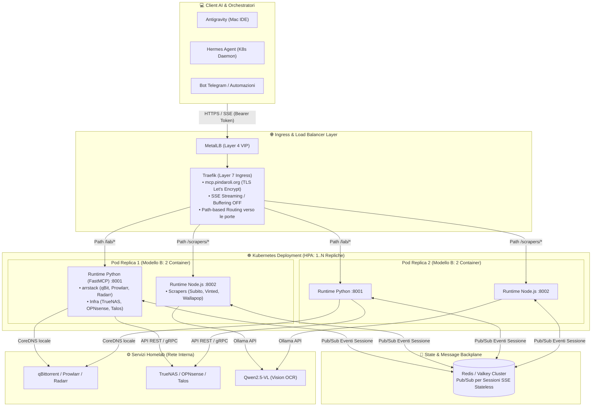
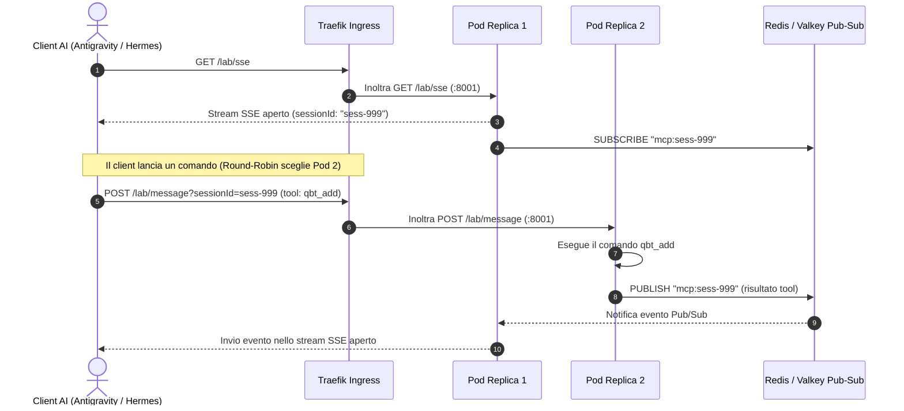

# 🏗️ Piano di Massima: Architettura MCP Hub su Kubernetes (Homelab)

Questo documento riassume le decisioni architetturali, i componenti e il piano di implementazione per consolidare e scalare i server **MCP (Model Context Protocol)** all'interno del cluster Kubernetes (Talos Homelab).

---

## 🎯 Obiettivi Architetturali

1. **Zero Spreco di Risorse**: Consolidare decine di strumenti e script sparsi in un'infrastruttura unificata, evitando la moltiplicazione di runtime/pod isolati.
2. **Accesso Diretto e Sicuro al Lab**: Connessione nativa ai servizi interni (`TrueNAS`, `OPNsense`, `qBittorrent`, `Prowlarr`, `Talos`) tramite DNS di cluster (`*.svc.cluster.local`), senza dipendere da VPN attive sul Mac.
3. **Architettura 100% Stateless**: Scalabilità orizzontale priva di vincoli di *Sticky Sessions*, con tolleranza ai riavvii e rolling updates a zero downtime.
4. **Interoperabilità Multi-Client**: Unico punto di accesso HTTPS/SSE per **Antigravity**, **Hermes Agent**, **Claude Desktop** e bot di automazione (Telegram/Discord).
5. **Topologia di Rete Semplificata**: Routing diretto Layer 4 (**MetalLB**) e Layer 7 (**Traefik**) direttamente alle porte dei container (senza proxy sidecar intermedi).

---

## 🏛️ Schema Architetturale Complessivo



---

## 🧱 Dettaglio dei Componenti

### 1. Il Pod Multi-Container (Modello B Semplificato)
Ogni replica del Pod racchiude **soltanto i 2 container applicativi**, eliminando qualsiasi proxy intermedio:

| Container | Runtime | Ruolo / Servizi Integrati | Porta | RAM Tipica |
| :--- | :--- | :--- | :---: | :---: |
| **`mcp-python`** | Python 3.12 (FastMCP) | `arrstack-mcp` (qBit, Prowlarr, Radarr, Lidarr), `truenas-mcp`, `opnsense-mcp`, `talos-mcp` | `:8001` | ~50 MB |
| **`mcp-node`** | Node.js 22 LTS | `subito-scraper`, `vinted-scraper`, `wallapop-scraper` | `:8002` | ~60 MB |

> **Consumo Totale per Pod**: **~110 MB di RAM** a riposo per gestire l'intero catalogo di oltre 60 tool MCP.

---

### 2. Ingress & Routing con Traefik
Traefik riceve il traffico dall'IP statico di MetalLB e lo smista direttamente alla porta specifica del container in base al path:

```yaml
apiVersion: traefik.io/v1alpha1
kind: IngressRoute
metadata:
  name: homelab-mcp-ingress
  namespace: mcp-system
spec:
  entryPoints:
    - websecure
  routes:
    # 1. Rotta per i Servizi Lab (Python FastMCP)
    - match: Host(`mcp.pindaroli.org`) && PathPrefix(`/lab`)
      kind: Rule
      services:
        - name: homelab-mcp-service
          port: 8001

    # 2. Rotta per gli Scrapers (Node.js)
    - match: Host(`mcp.pindaroli.org`) && PathPrefix(`/scrapers`)
      kind: Rule
      services:
        - name: homelab-mcp-service
          port: 8002
  tls:
    secretName: mcp-tls-cert
```

---

### 3. Scaling Orizzontale Stateless con Redis / Valkey

Nel protocollo MCP su SSE, un client apre `GET /sse` (ricevendo un `sessionId`) e poi invia comandi via `POST /message?sessionId=...`.



#### Vantaggi del Backplane Redis:
1. **Completamente Stateless**: I Pod possono essere riavviati, scalati o sostituiti da Kubernetes senza far cadere le sessioni.
2. **Zero Sticky Cookies**: Massima distribuzione del carico tra tutti i nodi worker del cluster Talos.

---

### 4. Criteri e Policy di Autoscaling (HPA)

Poiché i server MCP consumano quasi 0% CPU a riposo e hanno picchi improvvisi (*burst*) durante le ricerche o le ispezioni OCR, la policy di scalatura adotta:

- **Target CPU al 50%**: Aggiunge immediatamente un pod quando scatta un'elaborazione pesante.
- **Finestra di Raffreddamento di 300s**: Evita lo spegnimento prematuro dei pod tra un comando e l'altro.
- **Minimo 1 Replica / Massimo 5 Repliche**.

```yaml
apiVersion: autoscaling/v2
kind: HorizontalPodAutoscaler
metadata:
  name: homelab-mcp-hpa
  namespace: mcp-system
spec:
  scaleTargetRef:
    apiVersion: apps/v1
    kind: Deployment
    name: homelab-mcp-hub
  minReplicas: 1
  maxReplicas: 5
  metrics:
    - type: Resource
      resource:
        name: cpu
        target:
          type: Utilization
          averageUtilization: 50
  behavior:
    scaleDown:
      stabilizationWindowSeconds: 300
      policies:
        - type: Percent
          value: 100
          periodSeconds: 60
```

---

## 🗺️ Piano di Esecuzione Passo-Passo

| Fase | Attività | Output / Verifica |
| :--- | :--- | :--- |
| **Fase 1** | **Containerizzazione dei Moduli**<br/>• Creazione Dockerfile unificato Python (`arrstack` + infra)<br/>• Creazione Dockerfile Node.js (`scrapers` con supporto AI Inspector) | Immagini Docker buildate e pubblicate sul container registry locale / GitHub (GHCR). |
| **Fase 2** | **Setup Redis / Valkey**<br/>• Deploy istanza Redis leggera nel namespace `mcp-system` | Endpoint `redis.mcp-system.svc.cluster.local:6379` attivo. |
| **Fase 3** | **Deploy Multi-Container Pod (Modello B)**<br/>• Creazione Deployment con i 2 container (Python :8001, Node :8002)<br/>• Configurazione Secrets per credenziali Lab | Pod attivo e running con ~110 MB RAM. |
| **Fase 4** | **Configurazione Ingress Traefik**<br/>• Creazione `IngressRoute` con certificato TLS e buffering disattivato | Endpoint `https://mcp.pindaroli.org/lab/sse` e `/scrapers/sse` raggiungibili. |
| **Fase 5** | **Abilitazione HPA & Test di Carico**<br/>• Attivazione HorizontalPodAutoscaler con target CPU 50%<br/>• Verifica scaling con chiamate simultanee | Scaling orizzontale verificato da 1 a $N$ repliche senza errori 404. |
| **Fase 6** | **Collegamento Client AI**<br/>• Aggiornamento `mcp_config.json` di Antigravity ed Hermes Agent con l'URL remoto | Tutti i client usano l'MCP Hub remoto in modo trasparente. |
