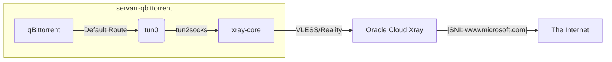

# Walkthrough: Xray Sidecar Deployment for qBittorrent

## Overview
We have successfully deployed a **Transparent Xray Proxy** sidecar for qBittorrent on Kubernetes. All traffic from the qBittorrent container is routed through a secure, encrypted VLESS/REALITY tunnel to your remote Oracle Cloud Xray instance.

### 🎯 Final Result
- **Public IP**: `79.72.44.199` (Oracle Cloud)
- **Encryption**: VLESS + REALITY (Vision Flow)
- **Leak Protection**: DNS and IP masked.
- **Stability**: MSS Clamping ensures no connection hangs.

## Architecture
The pod uses a Multi-Container Sidecar pattern:
1.  **`xray-core`**: The official Xray client listening on SOCKS5 (`127.0.0.1:10808`).
2.  **`tun2socks-gateway`**:
    - Creates `tun0` interface.
    - Routes `0.0.0.0/0` -> `tun0`.
    - Routes Remote Xray IP -> `eth0` (Loop prevention).
    - Routes `10.96.0.0/12` (K8s DNS) -> `eth0` (Local resolution).
    - **Clamps TCP MSS to 1300** via iptables.



## Critical Fixes Applied

### 1. Networking Stability (MSS Clamping)
Standard MTU (1500) caused packet drops due to Xray overhead. We solved this without breaking `tun2socks` by clamping the MSS:
```bash
iptables -t mangle -A POSTROUTING -o tun0 -p tcp -m tcp --tcp-flags SYN,RST SYN -j TCPMSS --set-mss 1300
```

### 2. Configuration Validations
- **ShortId**: Must be **Hex** (`aea8f6e00598`) in both Client and Server config.
- **SNI Matching**: Client `xray_sni` must match Server's expected `serverNames`. We aligned both to `www.microsoft.com`.
- **REALITY Fallback**: Changed remote config `dest` to `www.microsoft.com:443` to fix "No such host" errors.

### 3. Usage & Verification
To verify the tunnel is active, run:
```bash
kubectl exec -n arr deploy/servarr-qbittorrent -c servarr -- curl -s --max-time 10 ifconfig.me
```
**Expected Output**: `79.72.44.199`

## Maintenance (Ansible)
To update keys or IPs in the future, edit `xray/xray_secrets.yml` (encrypted) and run:
```bash
ansible-playbook ansible/playbooks/deploy_xray_secret.yml
kubectl rollout restart deploy servarr-qbittorrent -n arr
```
