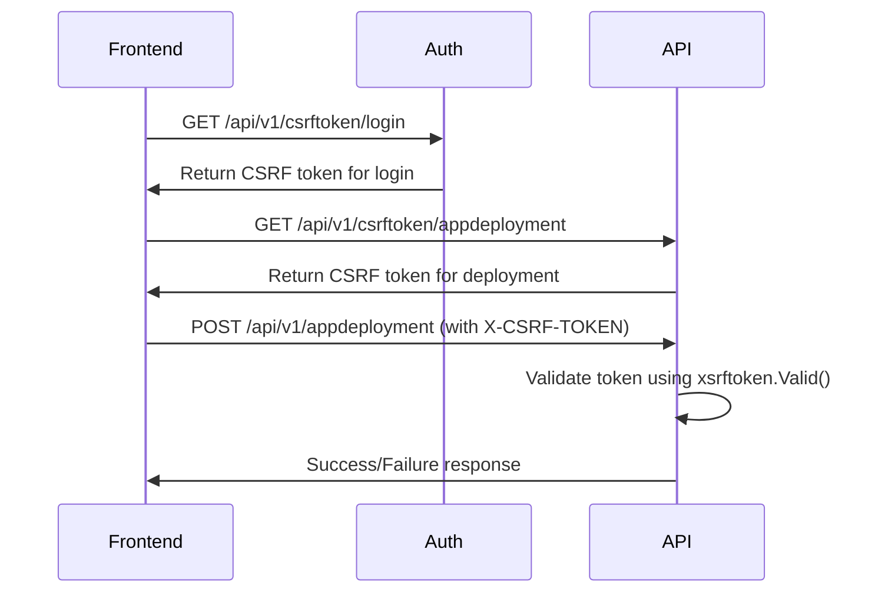

# Authentication and CSRF Token Considerations for Kubernetes Dashboard with Traefik

## Overview

This document outlines the authentication architecture and CSRF token handling in Kubernetes Dashboard, with specific considerations when replacing Kong Gateway with Traefik IngressRoute.

## Architecture Analysis

### Multi-Service Authentication Flow

Kubernetes Dashboard uses a multi-container architecture with distinct responsibilities:

1. **Auth Service** (`modules/auth/`)
   - Handles user login authentication
   - Generates CSRF tokens for login actions
   - Manages user sessions and JWT tokens
   - Endpoints: `/api/v1/login`, `/api/v1/csrftoken/login`, `/api/v1/me`

2. **API Service** (`modules/api/`)
   - Provides Kubernetes resource API endpoints
   - Generates CSRF tokens for resource operations
   - Validates CSRF tokens on POST requests
   - Endpoints: `/api/v1/csrftoken/{action}`, `/api/v1/*`

3. **Web Service** (`modules/web/`)
   - Serves frontend Angular application
   - Provides configuration endpoints
   - Handles static assets and routing
   - Endpoints: `/`, `/config`, `/settings`, `/systembanner`

## CSRF Token Implementation

### Token Generation Flow



### Key Components

1. **Token Generation** (`modules/auth/pkg/routes/csrftoken/handler.go`)
   - Uses `golang.org/x/net/xsrftoken.Generate()`
   - Action-specific tokens (e.g., "login", "appdeployment")
   - Shared secret key from `--csrf-key` flag or `CSRF_KEY` env var

2. **Token Validation** (`modules/common/csrf/middleware_*.go`)
   - Header: `X-CSRF-TOKEN`
   - Validates using `xsrftoken.Valid()`
   - Only POST requests are validated by default
   - Returns 401 Unauthorized on validation failure

3. **Frontend Usage** (`modules/web/src/common/services/global/csrftoken.ts`)
   - Service requests token before API calls
   - Includes token in request headers
   - Action-specific token requests

## Kong Gateway vs Traefik Routing Issues

### Kong Gateway Behavior (Expected)
- Single entry point with declarative routing
- Preserves all headers by default
- Routes based on exact path matching:
  - `/api/v1/csrftoken/login` → Auth Service
  - `/api/v1/csrftoken/*` → API Service (implicit)
  - `/api/v1/*` → API Service

### Traefik IngressRoute Challenges
1. **Routing Priority**: Need explicit priority handling for overlapping paths
2. **Header Forwarding**: Must explicitly preserve `X-CSRF-TOKEN` header
3. **Service Discovery**: Multiple services behind single ingress point
4. **Path Matching**: Different semantics than Kong's declarative config

## Solutions Implemented

### 1. Explicit Priority Routing
```yaml
# High priority for specific CSRF endpoints
- match: Path(`/api/v1/csrftoken/login`)
  priority: 100
  services: [auth-service]

- match: PathPrefix(`/api/v1/csrftoken/`)
  priority: 100  
  services: [api-service]

# Lower priority for general API routes  
- match: PathPrefix(`/api/v1/`)
  priority: 50
  services: [api-service]
```

### 2. Header Preservation Middleware
```yaml
apiVersion: traefik.containo.us/v1alpha1
kind: Middleware
metadata:
  name: kubernetes-dashboard-headers
spec:
  headers:
    customRequestHeaders:
      X-CSRF-TOKEN: ""  # Preserve CSRF token
      X-Forwarded-For: ""
      X-Real-IP: ""
```

### 3. Service-Specific Routing
- **Auth Service**: Login, user session, login CSRF tokens
- **API Service**: Resource operations, resource CSRF tokens  
- **Web Service**: Frontend, configuration, static assets

## Security Considerations

### CSRF Protection Mechanisms
1. **Token Uniqueness**: Each action gets unique token
2. **Time-based Validation**: Tokens have implicit expiration
3. **Action Binding**: Tokens tied to specific operations
4. **Header Validation**: Must use exact header name `X-CSRF-TOKEN`

### Potential Attack Vectors
1. **Header Manipulation**: Ensure proxy preserves security headers
2. **Token Leakage**: Tokens in logs (marked sensitive in code)
3. **Cross-Origin Requests**: Frontend must be same-origin
4. **Replay Attacks**: Tokens are one-time use

## Troubleshooting Guide

### Common Issues with Traefik

1. **401 CSRF Validation Failed**
   - Check header forwarding middleware
   - Verify routing priority
   - Ensure correct service endpoints

2. **Token Generation Fails**
   - Verify auth service routing for `/api/v1/csrftoken/login`
   - Check API service routing for other CSRF endpoints

3. **Headers Not Preserved**
   - Apply header middleware to all routes
   - Check Traefik configuration for custom headers

### Debugging Commands
```bash
# Check CSRF token generation
curl -k https://dashboard.example.com/api/v1/csrftoken/login

# Test with token
curl -k -H "X-CSRF-TOKEN: <token>" -X POST \
  https://dashboard.example.com/api/v1/appdeployment

# Debug headers
kubectl logs -n kubernetes-dashboard deployment/kubernetes-dashboard-api
```

## Configuration Options

### Alternative Solutions

1. **Disable CSRF Protection** (Development Only)
   ```yaml
   # Add to API service args
   - --csrf-protection-enabled=false
   ```

2. **Custom CSRF Key**
   ```yaml
   # Set consistent key across services
   env:
   - name: CSRF_KEY
     value: "base64-encoded-256-byte-key"
   ```

3. **API Mode Only**
   ```yaml
   # Helm chart values
   app:
     mode: 'api'  # Skip auth service complexity
   ```

## Best Practices

1. **Use TLS**: Always enable HTTPS for dashboard access
2. **Header Security**: Implement security headers middleware
3. **Network Policies**: Restrict pod-to-pod communication
4. **Monitoring**: Log CSRF validation failures
5. **Testing**: Verify token flow end-to-end

## References

- Kong Gateway Configuration: `hack/gateway/prod.kong.yml`
- CSRF Middleware: `modules/common/csrf/`
- Auth Service: `modules/auth/pkg/routes/csrftoken/`
- API Handler: `modules/api/pkg/handler/apihandler.go`
- Frontend Service: `modules/web/src/common/services/global/csrftoken.ts`