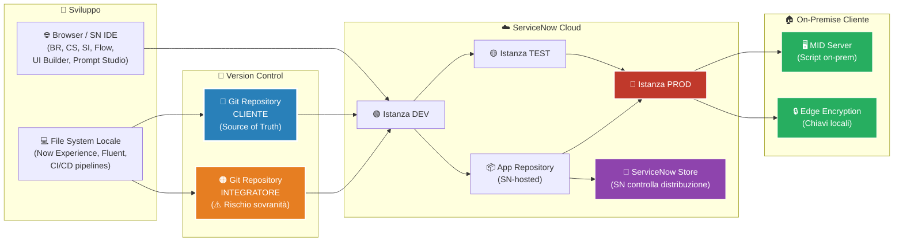
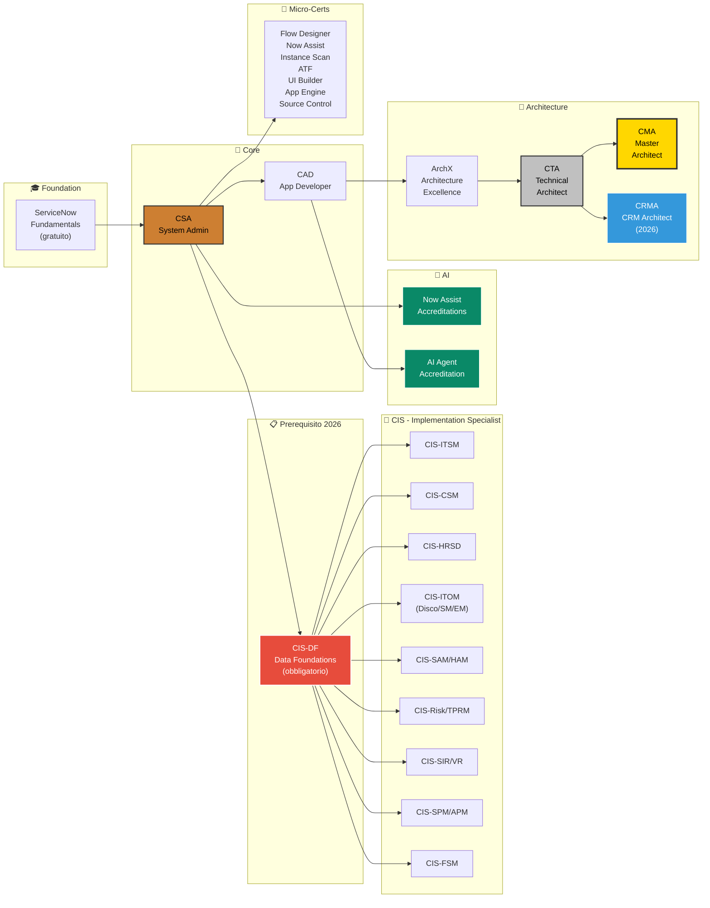

# 🏗️ Tassonomia Completa dei Metodi di Customizzazione ServiceNow
## Guida Architetturale per Clienti Enterprise — Mercato Italiano

> **Versione**: 3.0 — Agosto 2026  
> **Target**: Clienti Enterprise (Fortune 500 / Top Aziende Italiane)  
> **Edizioni ServiceNow**: Standard · Professional · Enterprise (legacy) → Foundation · Advanced · Prime (nuova nomenclatura 2025+)  
> **Now Assist SKU**: Pro Plus · Enterprise Plus → inclusi nei tier Prime  
> **Novità v3.0**: Aggiunta sezione "📦 Hosting del Codice & Sovranità" per ogni metodologia

---

## 📐 Tassonomia Visuale

```mermaid
graph TD
    ROOT["🏢 Customizzazione<br/>ServiceNow"]

    ROOT --> NC["⚙️ No-Code<br/>Configurazione Pura"]
    ROOT --> LC["🧩 Low-Code<br/>Citizen Developer"]
    ROOT --> PC["💻 Pro-Code<br/>Sviluppo Tradizionale"]
    ROOT --> PA["🚀 Pro-Code Avanzato<br/>Now Experience /<br/>Fluent / Scoped Apps"]
    ROOT --> AI["🤖 AI-Assisted<br/>Development"]
    ROOT --> DV["🔧 DevOps &<br/>Toolchain"]

    NC --> NC1["UI Policies"]
    NC --> NC2["Data Policies"]
    NC --> NC3["ACLs"]
    NC --> NC4["Business Rules<br/>(declarative)"]
    NC --> NC5["Service Catalog<br/>Items / Record Producers"]
    NC --> NC6["SLA / Assignment /<br/>Notification Rules"]
    NC --> NC7["Dashboards &<br/>Reporting"]
    NC --> NC8["CMDB<br/>CI Class Manager"]
    NC --> NC9["Agent Workspace<br/>Configuration"]

    LC --> LC1["Flow Designer"]
    LC --> LC2["IntegrationHub<br/>& Spokes"]
    LC --> LC3["App Engine Studio"]
    LC --> LC4["UI Builder"]
    LC --> LC5["Virtual Agent<br/>Topic Builder"]
    LC --> LC6["Playbooks"]
    LC --> LC7["Process Automation<br/>Designer"]
    LC --> LC8["Predictive Intelligence<br/>Config"]

    PC --> PC1["Client Scripts<br/>onChange/onLoad/onSubmit"]
    PC --> PC2["Business Rules<br/>(Scripted)"]
    PC --> PC3["Script Includes"]
    PC --> PC4["GlideRecord /<br/>GlideAggregate /<br/>GlideAjax"]
    PC --> PC5["Scripted REST API"]
    PC --> PC6["UI Pages<br/>(Jelly — Legacy)"]
    PC --> PC7["Service Portal<br/>Widgets (AngularJS)"]
    PC --> PC8["Scheduled Jobs /<br/>Fix Scripts"]
    PC --> PC9["Transform Map<br/>Scripts"]

    PA --> PA1["Now Experience<br/>Components<br/>(Seismic + React)"]
    PA --> PA2["ServiceNow Fluent<br/>(TypeScript DSL)"]
    PA --> PA3["Scoped Applications<br/>Full Lifecycle"]
    PA --> PA4["Store Apps<br/>Publishing"]
    PA --> PA5["MID Server<br/>Extensions"]
    PA --> PA6["Domain Separation"]
    PA --> PA7["Custom Auth<br/>SSO / MFA / SAML"]
    PA --> PA8["Edge Encryption"]

    AI --> AI1["Now Assist<br/>for Creator"]
    AI --> AI2["Now Assist<br/>Code Generation"]
    AI --> AI3["Generative AI<br/>Controller"]
    AI --> AI4["AI Search"]
    AI --> AI5["Document<br/>Intelligence"]
    AI --> AI6["Now Assist<br/>Skill Kit (NASK)"]
    AI --> AI7["AI Agent<br/>Orchestrator"]
    AI --> AI8["BYOLLM / BYOK<br/>Azure OpenAI /<br/>Vertex AI / Bedrock"]
    AI --> AI9["Prompt Studio"]

    DV --> DV1["ServiceNow CLI<br/>(snc)"]
    DV --> DV2["VS Code Extension<br/>+ ServiceNow IDE"]
    DV --> DV3["Source Control<br/>Git Integration"]
    DV --> DV4["CI/CD Pipelines<br/>Jenkins / GitHub Actions"]
    DV --> DV5["ATF<br/>Automated Test"]
    DV --> DV6["Instance Scan"]
    DV --> DV7["Update Sets &<br/>App Repository"]
    DV --> DV8["ServiceNow<br/>DevOps Module"]
    DV --> DV9["Developer<br/>Sandboxes"]

    style ROOT fill:#1a1a2e,stroke:#e94560,color:#fff,stroke-width:3px
    style NC fill:#0f3460,stroke:#16213e,color:#fff
    style LC fill:#533483,stroke:#16213e,color:#fff
    style PC fill:#e94560,stroke:#16213e,color:#fff
    style PA fill:#b91646,stroke:#16213e,color:#fff
    style AI fill:#0a8967,stroke:#16213e,color:#fff
    style DV fill:#e07c24,stroke:#16213e,color:#fff
```



---

## 🔑 Legenda Costi

| Stella | Significato | Range indicativo annuo (licenze) |
|:---:|---|---|
| ★☆☆☆☆ | Incluso / Trascurabile | €0 (incluso nel tier base) |
| ★★☆☆☆ | Contenuto | €10k–50k aggiuntivi |
| ★★★☆☆ | Significativo | €50k–200k aggiuntivi |
| ★★★★☆ | Elevato | €200k–500k aggiuntivi |
| ★★★★★ | Premium / Enterprise-only | €500k+ aggiuntivi |

> ⚠️ I costi ServiceNow sono soggetti a NDA e variano enormemente per cliente, volume, e negoziazione commerciale. Le stime qui riportate sono basate su dati di mercato pubblici e esperienza di settore nel contesto italiano.

---

## 📋 Nota sull'Evoluzione della Nomenclatura Licenze

> [!IMPORTANT]
> **Transizione in corso (2025–2026)**: ServiceNow ha riorganizzato il packaging commerciale da tier legacy (**Standard → Professional → Enterprise**) verso un modello AI-nativo:
> 
> | Legacy | Nuovo (2025+) | AI Incluso |
> |---|---|---|
> | Standard | **Foundation** | AI base (classification, routing) |
> | Professional | **Advanced** | Analytics avanzata, Process Mining, AI Voice |
> | Enterprise | **Prime** | Agenti AI autonomi, Now Assist completo, NASK |
> 
> I tier **Pro Plus** e **Enterprise Plus** (add-on AI) sono stati assorbiti nel tier **Prime**. Tuttavia, molti clienti enterprise italiani sono ancora contrattualmente sui tier legacy e migrano progressivamente. In questo documento useremo entrambe le nomenclature dove necessario.

---

## 1. ⚙️ No-Code — Configurazione Pura

> *Il fondamento: ogni cliente ServiceNow parte da qui. È il modo "nativo" di adattare la piattaforma senza scrivere una riga di codice.*

### Cosa comprende

| Metodo | Descrizione | Dove si configura |
|---|---|---|
| **UI Policies** | Mostrare/nascondere/rendere obbligatori campi in base a condizioni | Form Designer / UI Policy module |
| **Data Policies** | Validazione dati indipendente dal canale (form, API, import) | Data Policy module |
| **ACLs** | Controllo accesso granulare a tabelle, campi, righe | Security Rules > ACL |
| **Business Rules (declarative)** | Azioni automatiche su record (set field, abort, add message) senza JavaScript | Business Rules module, checkbox "No script" |
| **Service Catalog** | Items, Record Producers, Variable Sets, Order Guides, Catalog UI Policies | Service Catalog > Maintain Items |
| **SLA Definitions** | Tempi di risposta/risoluzione con escalation automatiche | SLA > SLA Definitions |
| **Assignment Rules** | Auto-assegnazione ticket basata su criteri | Assignment Rules module |
| **Notification Rules** | Email/SMS/Push automatiche su eventi | Notification module |
| **Dashboards & Reports** | Cruscotti real-time, report, liste personalizzate | Dashboards, Reports module |
| **CMDB CI Class Manager** | Definizione classi CI, relazioni, identification rules | CMDB module |
| **Agent Workspace Config** | Layout, liste, form dell'Agent Workspace | Workspace Builder |
| **Inactivity Monitors** | Azioni su ticket inattivi per N giorni | Inactivity Monitor module |

### 📚 Corsi e Certificazioni ServiceNow

| Corso / Certificazione | Tipo | Durata | Note |
|---|---|---|---|
| **ServiceNow Fundamentals** | On-demand (gratuito su Now Learning) | ~12h | Punto di partenza universale |
| **ITSM Fundamentals** | On-demand | ~8h | Focalizzato sui processi ITSM |
| **CSA — Certified System Administrator** | Certificazione + esame | Prep ~40h | **Obbligatorio** per qualsiasi altro percorso |
| **ITSM Implementation** | Instructor-led | 3 giorni | Setup ITSM end-to-end |
| **CMDB Fundamentals** | On-demand | ~6h | Data model CMDB / CSDM |
| **CIS-DF — Data Foundations** | Certificazione | Prep ~20h | ⚠️ **Nuova 2026: prerequisito obbligatorio per molti CIS** |

> **Path minimo**: ServiceNow Fundamentals → CSA.

### 📊 Adozione Clienti Enterprise

```
████████████████████████████████████████████████░░  95%
```

**95%** — Universale. Non esiste un'implementazione ServiceNow senza configurazione no-code.

### 💰 Costo

| Voce | Stella | Note |
|---|---|---|
| **Licenze** | ★☆☆☆☆ | Incluso in **tutti i tier** (Foundation/Advanced/Prime e legacy Standard/Professional/Enterprise) |
| **Effort** | ★☆☆☆☆ | 5–20 giornate uomo per un setup base ITSM |
| **Manutenzione** | ★☆☆☆☆ | 1 System Admin part-time |

### 🖥️ Dotazione HW/SW

| Requisito | Dettaglio |
|---|---|
| **Lato Developer** | Solo browser moderno (Chrome/Edge) |
| **Istanze** | 1× PDI (gratuita) per formazione; min. 2 istanze (Sub-prod + Prod) per il cliente |
| **Rete** | Accesso HTTPS alla piattaforma cloud |

### 🧠 Skill Richiesti

| Area | Livello | Dettaglio |
|---|---|---|
| **Coding** | ❌ Non richiesto | — |
| **ITIL** | ⭐⭐⭐ | Foundation v4 minimo, preferibilmente ITIL 4 Managing Professional |
| **ServiceNow** | ⭐⭐ | Navigazione, tabelle, form, liste, Update Sets |
| **Process Design** | ⭐⭐⭐ | Mappatura AS-IS/TO-BE, BPMN |
| **Data Modeling** | ⭐⭐ | Comprensione del data model ServiceNow (Task hierarchy, CI classes) |

### 📦 Hosting del Codice & Sovranità

> Il No-Code non produce "codice" nel senso tradizionale, ma produce **configurazioni** (record in tabelle di sistema) che hanno comunque un ciclo di vita, un proprietario, e necessitano di governance.

| Aspetto | Dettaglio |
|---|---|
| **Dove risiede** | **Istanza ServiceNow** — Le configurazioni sono record nelle tabelle di sistema (es. `sys_ui_policy`, `sys_security_acl`, `sys_choice`, `sc_cat_item`). Non esiste codice sorgente separato |
| **Formato di esportazione** | **Update Sets** (XML) — Il meccanismo nativo per spostare configurazioni tra istanze. Ogni modifica viene tracciata in un Update Set locale |
| **Repository Git** | ❌ Non standard — Le configurazioni no-code non vengono tipicamente sincronizzate con Git (anche se tecnicamente possibile con Source Control Integration per app scoped) |
| **Portabilità** | ⚠️ **Limitata** — Le configurazioni sono intrinseche alla piattaforma ServiceNow. Sono esportabili come XML (Update Sets) ma **non portabili** verso altre piattaforme (es. Jira, BMC) |
| **Sovranità del dato** | **Cliente** — Il cliente che paga la subscription è proprietario di tutti i dati e configurazioni nell'istanza. ServiceNow è il data processor, non il data owner |
| **Sovranità della configurazione** | **Dipende dal contratto** — Se l'integratore crea le configurazioni, la proprietà intellettuale è tipicamente del **cliente** (work-for-hire). Verificare le clausole IP nel contratto di implementazione |
| **Backup & Recovery** | ServiceNow effettua backup automatici dell'istanza. Il cliente può esportare Update Sets come backup incrementale |
| **Rischio vendor lock-in** | ⭐⭐⭐⭐⭐ **Massimo** — Le configurazioni no-code sono le più legate alla piattaforma. Non esiste un formato di interscambio standard |

---

## 2. 🧩 Low-Code — Citizen Developer

> *Il ponte tra configurazione e sviluppo. Permette automazioni complesse, integrazioni e app custom senza (quasi) scrivere codice. È la direzione strategica di ServiceNow.*

### Cosa comprende

| Metodo | Descrizione | Potenza |
|---|---|---|
| **Flow Designer** | Automazione visuale con trigger, azioni, condizioni, sub-flow, Now Assist Text-to-Flow | ⭐⭐⭐⭐ |
| **IntegrationHub** | Connettori pre-built (Spoke) per SAP, Salesforce, Jira, Teams, Slack + Custom Spoke Builder | ⭐⭐⭐⭐⭐ |
| **App Engine Studio (AES)** | IDE visuale per creare applicazioni custom complete (tabelle, form, flow, portale) | ⭐⭐⭐⭐⭐ |
| **UI Builder** | Costruzione interfacce Next-Gen drag-and-drop con data broker e client state parameters | ⭐⭐⭐⭐ |
| **Virtual Agent** | Chatbot builder con NLU integrato + GenAI topics | ⭐⭐⭐⭐ |
| **Playbooks** | Workflow guidati per agenti (CSM, HR) | ⭐⭐⭐ |
| **Process Automation Designer** | Orchestrazione cross-platform end-to-end | ⭐⭐⭐⭐ |
| **Predictive Intelligence** | ML auto-classificazione, assignment, prioritizzazione senza codice | ⭐⭐⭐⭐ |
| **Decision Builder** | Tabelle decisionali visuali per business logic | ⭐⭐⭐ |

### 📚 Corsi e Certificazioni ServiceNow

| Corso / Certificazione | Tipo | Prerequisito |
|---|---|---|
| **Flow Fundamentals** | On-demand | CSA |
| **Flow Designer: Advanced Data & Error Handling** | On-demand | CSA |
| **IntegrationHub Essentials** | On-demand | CSA |
| **Create Custom Spokes (Action Designer)** | On-demand / Instructor-led | CSA + API concepts |
| **Introduction to App Engine Studio** | On-demand | CSA |
| **App Engine Management Center (AEMC)** | On-demand | CSA |
| **CAD — Certified Application Developer** | Certificazione | CSA |
| **Virtual Agent Implementation** | On-demand | CSA |
| **Predictive Intelligence Fundamentals** | On-demand | CSA |
| **UI Builder Fundamentals & Advanced** | On-demand | CSA |
| **Citizen Developer Quest** | Gamified learning path | Nessuno |

> **Path consigliato**: CSA → CAD → Micro-cert Flow Designer + IntegrationHub.

### 📊 Adozione Clienti Enterprise

```
██████████████████████████████████████░░░░░░░░░░  75%
```

**~75%** — La stragrande maggioranza usa almeno Flow Designer. IntegrationHub è chiave in Italia per integrazioni SAP e gestionali legacy.

### 💰 Costo

| Voce | Stella | Note |
|---|---|---|
| **Flow Designer** | ★★☆☆☆ | Incluso in **Professional/Advanced** e superiori. NON incluso in Standard/Foundation |
| **IntegrationHub** | ★★★☆☆ | Licenza separata: per-transazione o unlimited. ~€50k–150k/anno per Enterprise |
| **App Engine** | ★★★☆☆ | Licenza separata basata su fulfiller o numero tabelle custom |
| **Virtual Agent + GenAI** | ★★★☆☆ | NLU base incluso in Professional+; GenAI topics richiedono Prime/Enterprise Plus |
| **Process Automation** | ★★★★☆ | Richiede Enterprise/Prime |
| **Effort** | ★★☆☆☆ | 15–50 giornate uomo |

### 🖥️ Dotazione HW/SW

| Requisito | Dettaglio |
|---|---|
| **Lato Developer** | Browser moderno, nessun software locale |
| **Istanze** | PDI con App Engine; Sub-prod + Prod per il cliente |
| **Sistemi target** | Account di test per i sistemi da integrare (SAP sandbox, Jira test, etc.) |
| **Documentazione API** | Swagger/OpenAPI dei sistemi target per Custom Spoke |

### 🧠 Skill Richiesti

| Area | Livello | Dettaglio |
|---|---|---|
| **Coding** | ⭐ Minimo | JS base utile per condizioni avanzate in Flow Designer |
| **Logic Design** | ⭐⭐⭐ | Pensiero algoritmico, condizioni, loop, error handling |
| **API Concepts** | ⭐⭐ | REST/SOAP, OAuth, JSON/XML |
| **ITIL / Process** | ⭐⭐⭐ | ITIL 4, BPMN, processi enterprise |
| **ServiceNow** | ⭐⭐⭐ | Conoscenza approfondita tabelle e architettura |
| **Integration Design** | ⭐⭐⭐ | ETL patterns, error handling, retry, idempotenza |

### 📦 Hosting del Codice & Sovranità

| Aspetto | Dettaglio |
|---|---|
| **Dove risiedono i Flow** | **Istanza ServiceNow** — I Flow sono record nella tabella `sys_hub_flow`. Contengono definizioni JSON/XML delle azioni, non codice sorgente testuale |
| **Dove risiedono gli Spoke** | **Istanza ServiceNow** — Gli Spoke pre-built (SAP, Salesforce, etc.) sono installati dal ServiceNow Store. I Custom Spoke creati dall'integratore risiedono nell'istanza |
| **Dove risiedono le App AES** | **Istanza ServiceNow** — Le app create in App Engine Studio risiedono nell'istanza e possono essere pubblicate nell'**Application Repository** (SN-hosted) |
| **Formato di esportazione** | **Update Sets** (XML) oppure **Application Repository** (versionamento gestito da SN). Da Yokohama+ possibile sync con Git tramite Source Control Integration |
| **Repository Git** | 🟡 **Opzionale** — Le Scoped App create in AES possono essere collegate a un repository Git del cliente/integratore. I Flow standalone tipicamente restano solo nell'istanza |
| **Portabilità** | ⚠️ **Molto limitata** — Flow, Spoke e app AES sono costrutti proprietari ServiceNow. Non sono convertibili verso Camunda, Power Automate, o altre piattaforme di automazione |
| **Sovranità** | |
| — *Spoke pre-built* | **ServiceNow** — Licenza d'uso, non proprietà. SN può aggiornare/deprecare Spoke. Il cliente non può modificare gli Spoke pre-built |
| — *Custom Spoke* | **Cliente o Integratore** — Chi lo crea ne detiene la IP (da definire contrattualmente). Il codice risiede nell'istanza del cliente |
| — *Flow custom* | **Cliente** — Tipicamente work-for-hire. Il cliente possiede i Flow nell'istanza |
| — *App AES* | **Cliente** — L'app risiede nell'istanza e nell'App Repository del cliente |
| **Backup** | Tramite Update Sets o Application Repository. Non esiste export in formato portabile |
| **Rischio vendor lock-in** | ⭐⭐⭐⭐ **Alto** — Flow e Spoke sono proprietari. Le Custom Spoke hanno logica riusabile ma solo dentro l'ecosistema SN |

---

## 3. 💻 Pro-Code — Sviluppo Tradizionale

> *Il cuore dello sviluppo ServiceNow. Quando la configurazione non basta, si scrive JavaScript — sia lato client (browser) che lato server (Rhino engine). Questa è la competenza core di ogni ServiceNow Developer.*

### Cosa comprende

#### Lato Server (Rhino / ES5)

| Metodo | Descrizione | Quando si usa |
|---|---|---|
| **Business Rules (scripted)** | Logica server su insert/update/delete/query | Validazioni complesse, auto-popolamento, integrazioni sync |
| **Script Includes** | Classi/funzioni riusabili server-side | Librerie condivise, business logic centralizzata |
| **GlideRecord** | ORM proprietario per CRUD | Qualsiasi operazione dati server-side |
| **GlideAggregate** | Aggregazioni ottimizzate (COUNT, SUM, AVG) | Report, KPI, dashboard data |
| **GlideAjax** | Bridge client→server asincrono | Form che richiedono dati server senza reload |
| **Scripted REST API** | Endpoint REST custom con gestione completa request/response | Integrazioni inbound |
| **Script Actions** | Script event-driven | Disaccoppiamento logica, async processing |
| **Scheduled Jobs** | Script su cron schedule | Batch processing, sincronizzazioni periodiche |
| **Fix Scripts** | Script one-time | Data migration, patching |
| **Transform Map Scripts** | Logica custom durante import dati | Import complessi con trasformazione |
| **Processors** | Endpoint HTTP custom (legacy) | Redirect, download, webhook legacy |

#### Lato Client (Browser / ES6)

| Metodo | Descrizione |
|---|---|
| **Client Scripts** | `onChange`, `onLoad`, `onSubmit`, `onCellEdit` — manipolano il form nel browser |
| **UI Policies (scripted)** | Condizioni avanzate con blocco "Run scripts" |
| **Catalog Client Scripts** | Client Scripts per form del Service Catalog |
| **UI Actions** | Bottoni/link custom con logica client e/o server |
| **UI Pages** | Pagine custom in **Jelly** (XML templating proprietario) — ⚠️ legacy |
| **UI Macros** | Componenti riusabili Jelly — ⚠️ legacy |

#### Service Portal (AngularJS 1.x)

| Metodo | Descrizione |
|---|---|
| **Widgets** | Componenti full-stack (HTML + CSS + Client AngularJS + Server Script) |
| **Angular Providers** | Service AngularJS riusabili cross-widget |
| **CSS/SCSS Themes** | Personalizzazione completa look & feel |
| **Page Routes** | Routing SPA custom |

### 📚 Corsi e Certificazioni ServiceNow

| Corso / Certificazione | Tipo | Prerequisito |
|---|---|---|
| **Scripting in ServiceNow Fundamentals** | On-demand / Instructor-led | CSA |
| **Application Development Fundamentals** | Instructor-led (5 gg) | CSA |
| **CAD — Certified Application Developer** | Certificazione | CSA |
| **Service Portal Fundamentals & Advanced** | On-demand | CAD |
| **REST API & IntegrationHub Scripting** | On-demand | CAD |
| **Micro-cert: Scripting** | Micro-certificazione | CSA |

> **Path consigliato**: CSA → Scripting in SN → CAD → Service Portal Development.
> **Complementare**: CIS (almeno 1 modulo: ITSM, CSM, o HRSD) per chi fa implementazioni.

### 📊 Adozione Clienti Enterprise

```
██████████████████████████████████░░░░░░░░░░░░░░  65%
```

**~65%** — La maggioranza ha almeno BR scriptate e Client Scripts. Service Portal custom è nel ~50%.

### 💰 Costo

| Voce | Stella | Note |
|---|---|---|
| **Licenze** | ★☆☆☆☆ | Lo sviluppo Pro-Code è **incluso in tutti i tier** |
| **Effort** | ★★★☆☆ | 30–100+ giornate per progetto con SP + integrazioni |
| **Profili** | ★★★☆☆ | Developer SN certificato: €400–700/giorno (mercato italiano) |
| **Manutenzione** | ★★☆☆☆ | Regression testing ad ogni upgrade (2×/anno) |
| **Debito tecnico** | ★★★☆☆ | Rischio elevato senza code review e Instance Scan |

> ⚠️ **Mercato italiano**: La scarsità di talenti ServiceNow certificati in Italia spinge le tariffe verso l'alto rispetto alla media europea. Un developer con CAD + CIS-ITSM può superare i €700/giorno come freelance.

### 🖥️ Dotazione HW/SW

| Requisito | Dettaglio |
|---|---|
| **IDE** | VS Code con **ServiceNow Extension for VS Code** (ufficiale) |
| **ServiceNow CLI** | `snc` — sync bidirezionale IDE ↔ istanza |
| **ServiceNow IDE** | ⚡ **Novità Xanadu+**: VS Code browser-native nell'istanza, zero setup locale |
| **Node.js** | v18+ (richiesto da snc) |
| **Git** | Version control + repository remoto |
| **xplore** | Tool community per debug server-side interattivo |
| **REST Client** | Postman / Thunder Client / Insomnia |
| **Istanze** | Min. 3: Dev → Test → Prod (raccomandato anche Stage) |

### 🧠 Skill Richiesti

| Area | Livello | Dettaglio |
|---|---|---|
| **JavaScript** | ⭐⭐⭐⭐ | ES5 (server/Rhino), ES6+ (client). Closures, prototypes, async patterns |
| **AngularJS 1.x** | ⭐⭐⭐ | Per Service Portal: directives, services, scope, two-way binding |
| **HTML/CSS/SCSS** | ⭐⭐⭐ | Service Portal widgets, UI Pages |
| **Jelly (XML)** | ⭐⭐ | Solo UI Pages legacy — in dismissione ma ancora diffuso |
| **GlideRecord API** | ⭐⭐⭐⭐⭐ | **Critico** — L'API fondamentale di ServiceNow |
| **REST/SOAP** | ⭐⭐⭐ | Design API, OAuth 2.0, JSON parsing, error handling |
| **SQL Concepts** | ⭐⭐ | Non si scrive SQL diretto, ma essenziale per query GlideRecord efficienti |
| **Debugging** | ⭐⭐⭐⭐ | `gs.log()`, System Diagnostics, Script Debugger, Transaction Logs |
| **Version Control** | ⭐⭐⭐ | Git branching, Update Sets vs Source Control |

### 📦 Hosting del Codice & Sovranità

> [!IMPORTANT]
> Questa è la categoria dove il tema della sovranità è più critico e più frequentemente oggetto di controversie contrattuali, perché il codice JavaScript scritto ha un valore intrinseco come proprietà intellettuale.

| Aspetto | Dettaglio |
|---|---|
| **Storage primario** | **Istanza ServiceNow (database)** — Tutto il codice risiede come record in tabelle di sistema: |
| | • Business Rules → `sys_script` |
| | • Client Scripts → `sys_script_client` |
| | • Script Includes → `sys_script_include` |
| | • UI Pages → `sys_ui_page` |
| | • UI Actions → `sys_ui_action` |
| | • Scheduled Jobs → `sysauto_script` |
| | • Scripted REST API → `sys_ws_operation` |
| | • SP Widgets → `sp_widget` (HTML + CSS + Client + Server in 4 campi separati) |
| **Mirror Git** | ✅ **Raccomandato** — Tramite **Source Control Integration** (nativa) o **ServiceNow CLI** (`snc`) è possibile sincronizzare bidirezionalmente il codice tra istanza e repository Git |
| **Repository di riferimento** | Dipende dalla maturità DevOps: |
| | • **Livello 1** (base): Solo istanza — nessun Git. Spostamento tra istanze via Update Sets XML |
| | • **Livello 2** (intermedio): Git come backup/mirror — source of truth resta l'istanza |
| | • **Livello 3** (maturo): Git come **source of truth** — deploy automatizzato via CI/CD verso le istanze |
| **Chi possiede il repository Git?** | |
| — *Scenario A* | **Repository del cliente** (es. GitHub Enterprise del cliente) — Il cliente ha piena sovranità. L'integratore contribuisce come collaboratore esterno |
| — *Scenario B* | **Repository dell'integratore** (es. GitLab dell'integratore) — ⚠️ **Rischio**: se il contratto termina, il cliente potrebbe non avere accesso al codice sorgente. Clausola di escrow raccomandata |
| — *Scenario C* | **Repository condiviso** — Organizzazione Git dedicata al progetto con accesso paritario |
| **Sovranità del codice** | |
| — *Codice nell'istanza* | **Cliente** — Il codice risiede nell'istanza pagata dal cliente. Anche se il contratto con l'integratore termina, il codice resta nell'istanza |
| — *IP del codice* | **Da definire contrattualmente** — Le clausole più comuni nel mercato italiano: |
| | • **Work-for-hire** (più comune): Il cliente possiede la IP di tutto il codice scritto per lui |
| | • **Licenza d'uso**: L'integratore mantiene la IP e concede una licenza perpetua al cliente |
| | • **Shared IP**: L'integratore mantiene IP su framework/utility riusabili, il cliente possiede la business logic specifica |
| **Portabilità del codice** | ⚠️ **Parziale** — Il JavaScript è standard, ma le API GlideRecord, GlideAjax, g_form, etc. sono **proprietarie ServiceNow**. Il codice non è eseguibile fuori dalla piattaforma senza riscrittura completa |
| **Export del codice** | ✅ Possibile — Tramite Update Sets (XML), export diretto, o sync Git. Il codice è sempre estraibile dall'istanza |
| **Accesso post-contratto** | Il cliente mantiene accesso al codice nell'istanza finché paga la subscription ServiceNow. Se cambia integratore, il nuovo integratore può leggere e modificare il codice esistente |
| **Rischio vendor lock-in** | ⭐⭐⭐ **Medio** — Il codice è estraibile e leggibile, ma non portabile verso altre piattaforme senza riscrittura. Le competenze JavaScript sono trasferibili |

> [!WARNING]
> **Consiglio per contratti italiani**: Nei contratti con integratori ServiceNow, inserire sempre:
> 1. **Clausola di proprietà IP** esplicita (work-for-hire o licenza perpetua)
> 2. **Obbligo di repository Git** del cliente come source of truth
> 3. **Clausola di escrow** se il repository è dell'integratore
> 4. **Obbligo di documentazione** del codice prodotto
> 5. **Knowledge transfer** obbligatorio a fine progetto

---

## 4. 🚀 Pro-Code Avanzato — Now Experience, Fluent & Scoped Apps

> *Il livello più alto di sviluppo. Qui si costruiscono componenti UI con Seismic (React-like), si definisce infrastruttura come codice con Fluent (TypeScript DSL), e si pubblicano app sullo Store. Richiede competenze full-stack moderne.*

### Cosa comprende

#### Now Experience Framework (Seismic)

| Metodo | Descrizione | Complessità |
|---|---|---|
| **Custom Components** | Componenti UI con framework **Seismic** (React-like, proprietario SN) | ⭐⭐⭐⭐⭐ |
| **UI Builder Custom Components** | Componenti registrati e usabili in UI Builder drag-and-drop | ⭐⭐⭐⭐ |
| **Custom Themes & Layouts** | Theming avanzato con UX Framework e design tokens | ⭐⭐⭐ |

#### ServiceNow Fluent (⚡ Novità Xanadu/Yokohama)

| Aspetto | Dettaglio |
|---|---|
| **Cosa è** | Un **DSL (Domain-Specific Language) dichiarativo basato su TypeScript** che rappresenta i metadati ServiceNow come puro codice |
| **Cosa sostituisce** | Update Sets XML → file `.now.ts` leggibili e versionabili |
| **Cosa si può definire** | Tabelle, Business Rules, ACLs, Flow definitions, ATF tests, UI Policies |
| **Two-way Sync** | Codice Fluent → compila in metadati SN al deploy; modifiche GUI → sync back nel codice sorgente |
| **Now SDK** | Toolchain Node.js locale che compila Fluent, esegue unit test, e pacchettizza applicazioni |
| **Legacy Converter** | Tool (Yokohama+) per convertire app esistenti costruite in Studio → progetti Fluent TypeScript |
| **Impatto** | **Game-changer** per il ciclo di vita delle applicazioni: finalmente "infrastructure as code" per ServiceNow |

#### Scoped Applications

| Metodo | Descrizione |
|---|---|
| **Scoped App Development** | Applicazioni complete con namespace isolato, tabelle, script, sicurezza |
| **Application Repository** | Versionamento e distribuzione tra istanze |
| **Store App Publishing** | Pubblicazione su ServiceNow Store (richiede Partner Program) |
| **Delegated Development** | Controllo chi può sviluppare cosa in quale scope |

#### Infrastruttura & Sicurezza

| Metodo | Descrizione |
|---|---|
| **MID Server Extensions** | Script custom eseguiti on-premise (discovery, orchestration) |
| **Domain Separation** | Multi-tenancy logico con separazione dati per BU/clienti |
| **Edge Encryption** | Crittografia dati a riposo con proxy on-premise |
| **Custom SSO/MFA** | Integrazione autenticazione con provider non standard |

### 📚 Corsi e Certificazioni ServiceNow

| Corso / Certificazione | Tipo | Prerequisito |
|---|---|---|
| **CAD — Certified Application Developer** | Certificazione | CSA |
| **CTA — Certified Technical Architect** | Certificazione apicale | CAD + CIS-DF + ArchX + 2× CIS |
| **CMA — Certified Master Architect** | Certificazione massima | CTA + board review |
| **CRMA — Certified CRM Architect** | ⚡ Nuova 2026 | CTA-level + CRM experience |
| **Next Experience Component Development** | On-demand (avanzato) | CAD + React/Node.js |
| **Micro-cert: Now Experience** | Micro-certificazione | CAD |
| **Micro-cert: UI Builder Advanced** | Micro-certificazione | CAD |
| **Domain Separation** | On-demand | CIS-ITSM o equivalente |

> **Path consigliato**: CSA → CAD → CIS (almeno 1 modulo) → **ArchX** → CTA → CMA.
> 
> **Nota CTA**: La certificazione più prestigiosa di SN. Board exam dal vivo davanti a panel di CTA/CMA. In Italia: **< 50 CTA** e **< 10 CMA** (stima 2026).

### 📊 Adozione Clienti Enterprise

```
████████████████░░░░░░░░░░░░░░░░░░░░░░░░░░░░░░░  30%
```

**~30%** — Solo i clienti più maturi. In Italia: grandi banche (Intesa, Unicredit), telco (TIM, Vodafone), utilities (Enel, Eni), PA centrale (Consip/INPS). La transizione SP → Now Experience è in corso ma lenta. **Fluent è in early adoption** (~5-10%).

### 💰 Costo

| Voce | Stella | Note |
|---|---|---|
| **App Engine Enterprise** | ★★★★☆ | ~€100k–300k/anno aggiuntivi per ciclo vita completo Scoped Apps |
| **Domain Separation** | ★★★★★ | Add-on premium + design architetturale significativo |
| **Edge Encryption** | ★★★★★ | Add-on premium + infrastruttura on-premise |
| **Store App Publishing** | ★★★★☆ | Partner Program (quota annuale) + review app |
| **Effort** | ★★★★★ | 100–500+ giornate per progetto Now Experience completo |
| **Profili** | ★★★★★ | Senior Architect/CTA: €800–1500/giorno (Italia) |

### 🖥️ Dotazione HW/SW

| Requisito | Dettaglio |
|---|---|
| **Node.js** | v18+ (obbligatorio per Now CLI, Now SDK, Seismic) |
| **ServiceNow CLI (`snc`)** | `snc ui-component` per scaffold/build/deploy componenti |
| **Now SDK** | Toolchain Fluent: compila `.now.ts`, esegue test, pacchettizza |
| **ServiceNow IDE** | ⚡ VS Code browser-native nell'istanza (zero setup locale) |
| **VS Code locale** | Con ServiceNow Extension + ESLint + Prettier |
| **Git** | Source control obbligatorio |
| **macOS o Linux** | Fortemente raccomandato per CLI tooling |
| **RAM** | Min. 16GB (build Seismic è memory-intensive) |
| **MID Server** (se necessario) | VM Linux/Windows, 8GB RAM, Java 11+ |
| **Istanze** | 4 min: Dev → Test → Stage → Prod + **Developer Sandboxes** (Zurich+: istanze effimere per sviluppo isolato) |

### 🧠 Skill Richiesti

| Area | Livello | Dettaglio |
|---|---|---|
| **JavaScript/TypeScript** | ⭐⭐⭐⭐⭐ | TypeScript per Fluent e Now Experience components |
| **React Concepts** | ⭐⭐⭐⭐ | Seismic: virtual DOM, state, lifecycle, props |
| **Web Components** | ⭐⭐⭐ | Shadow DOM, custom elements, slots |
| **Node.js** | ⭐⭐⭐ | Build toolchain, npm |
| **CSS/SCSS** | ⭐⭐⭐ | Design system, responsive, custom properties |
| **REST API Design** | ⭐⭐⭐⭐ | API enterprise, versionamento |
| **OAuth 2.0 / SAML** | ⭐⭐⭐ | Integrazioni SSO |
| **Architecture** | ⭐⭐⭐⭐⭐ | Domain modeling, multi-tenancy, performance |
| **CI/CD** | ⭐⭐⭐ | Pipeline automatizzate |
| **SN Platform Internals** | ⭐⭐⭐⭐⭐ | Scoping, sys_properties, glide stack, platform internals |

### 📦 Hosting del Codice & Sovranità

> Questa categoria presenta il modello di hosting più complesso, con codice che vive in **tre luoghi distinti**: istanza, file system locale, e repository Git. La sovranità varia significativamente per tipo di artefatto.

| Aspetto | Dettaglio |
|---|---|
| **Now Experience Components** | |
| — *Sviluppo* | **File system locale del developer** — Il componente Seismic viene scaffoldato con `snc ui-component create`, sviluppato localmente in TypeScript/SCSS, e buildato con Node.js |
| — *Repository* | **Git (obbligatorio)** — I sorgenti devono stare in un repository Git. La source of truth è il repository, non l'istanza |
| — *Deploy* | **Istanza ServiceNow** — Il componente buildato viene deployato nell'istanza con `snc ui-component deploy`. Nell'istanza risiede solo l'**artefatto compilato**, non il sorgente |
| — *Sovranità* | **Chi possiede il repository Git possiede il codice**. L'artefatto compilato nell'istanza non è facilmente decompilabile |
| **ServiceNow Fluent (.now.ts)** | |
| — *Sviluppo* | **File system locale** — File `.now.ts` scritti in TypeScript dichiarativo |
| — *Repository* | **Git (obbligatorio)** — Source of truth. Two-way sync con l'istanza |
| — *Deploy* | **Istanza ServiceNow** — Il Now SDK compila i file `.now.ts` in metadati SN e li deploya |
| — *Sovranità* | **Chi possiede il repository Git**. Il modello Fluent rende il codice più portabile e auditabile rispetto al Pro-Code tradizionale |
| **Scoped Applications** | |
| — *Sviluppo* | **Istanza ServiceNow** (via Studio/AES) oppure **locale** (via Fluent/SN CLI) |
| — *Repository* | **Application Repository** (SN-hosted) e/o **Git** (del cliente/integratore) |
| — *Deploy* | **Application Repository → istanze target** |
| — *Sovranità* | L'App Repo è gestito da ServiceNow come servizio. Il cliente ha accesso ai propri artefatti. Se si usa anche Git, la sovranità piena è sul repository Git |
| **Store Apps** | |
| — *Sviluppo* | **Locale + istanza PDI** del partner/integratore |
| — *Repository* | **Git del partner** + **ServiceNow Store** (per distribuzione) |
| — *Pubblicazione* | **ServiceNow** controlla la review, certificazione e distribuzione. Il partner firma un **Technology Partner Agreement** |
| — *Sovranità* | **Il partner mantiene la IP**. ServiceNow ha diritto di distribuzione e prende una revenue share. Il cliente finale acquista una **licenza d'uso**, non la proprietà del codice |
| **MID Server Extensions** | |
| — *Dove risiede* | **On-premise** — Script eseguiti sul MID Server (VM del cliente, nella rete del cliente) |
| — *Repository* | **Git del cliente** (raccomandato) oppure gestito dall'integratore |
| — *Sovranità* | **Cliente** — Il codice gira su infrastruttura del cliente. Piena sovranità. Non dipende dal cloud SN |
| **Edge Encryption Proxy** | |
| — *Dove risiede* | **On-premise** — Appliance/VM nella rete del cliente con chiavi crittografiche locali |
| — *Sovranità* | **Cliente** — Il cliente ha il controllo esclusivo delle chiavi di crittografia |

> [!IMPORTANT]
> **Fluent come game-changer per la sovranità**: Con l'adozione di Fluent, la source of truth migra dall'istanza ServiceNow al repository Git. Questo rappresenta un cambio di paradigma fondamentale:
> - **Prima (tradizionale)**: L'istanza è la source of truth → dipendenza dal cloud SN
> - **Dopo (Fluent)**: Il repository Git è la source of truth → sovranità piena del cliente sul codice

---

## 5. 🤖 AI-Assisted Development — Now Assist & Generative AI

> *La frontiera più recente e in rapida evoluzione. ServiceNow ha investito massicciamente nell'AI: Now LLM proprietario (partnership NVIDIA, architetture StarCoder/Nemotron), BYOLLM multi-cloud, AI Agent Orchestrator con reasoning autonomo. Questa sezione è il cuore del deep dive richiesto.*

### 5.1 Architettura Now Assist — Vista Completa

```mermaid
graph TB
    subgraph "👤 Interfaccia Utente"
        UA["Agent Workspace<br/>+ Now Assist Panel"]
        UC["Creator Studio /<br/>ServiceNow IDE<br/>+ Code Assist"]
        UV["Virtual Agent<br/>+ GenAI Topics"]
        UP["Service Portal /<br/>Employee Center"]
    end

    subgraph "🤖 AI Agent Orchestrator"
        ORCH["AI Agent Orchestrator<br/>ReAct + Chain-of-Thought<br/>Shared Memory + HITL"]
    end

    subgraph "🧠 Generative AI Controller"
        GAI["GAI Controller<br/>(Orchestratore Centrale)"]
        NASK["Now Assist Skill Kit<br/>(NASK)<br/>Pre-built + Custom"]
        PS["Prompt Studio<br/>Build / Version / Test"]
        GUARD["Guardrails &<br/>Safety Layer"]
        GROUND["Grounding Engine<br/>(RAG + AI Search)"]
    end

    subgraph "📚 Knowledge & Context"
        KB["Knowledge Base"]
        CMDB2["CMDB / CSDM"]
        HIST["Interaction History"]
        CATALOG["Service Catalog"]
        CUSTOM_DATA["Custom Data Sources"]
    end

    subgraph "🔮 LLM Layer"
        NOW_LLM["Now LLM<br/>(StarCoder + Nemotron)<br/>Domain fine-tuned"]
        AZURE["Azure OpenAI<br/>(GPT-4o / 4o-mini)"]
        VERTEX["Google Vertex AI<br/>(Gemini)"]
        AWS_B["AWS Bedrock<br/>(Claude 3.x)"]
        CUSTOM_LLM["Custom On-Prem<br/>LLM (BYOLLM)"]
    end

    subgraph "🔒 Sicurezza & Compliance"
        PII["PII Detection<br/>& Masking"]
        AUDIT["Audit Trail"]
        RBAC["Role-Based Access"]
        DATA_RES["Data Residency<br/>EU / Italy"]
    end

    subgraph "📊 Metering"
        ASSISTS["Assist Units<br/>(Consumption Metering)"]
    end

    UA --> ORCH
    UC --> ORCH
    UV --> ORCH
    UP --> ORCH

    ORCH --> GAI
    GAI --> NASK
    GAI --> PS
    GAI --> GUARD
    GAI --> GROUND

    GROUND --> KB
    GROUND --> CMDB2
    GROUND --> HIST
    GROUND --> CATALOG
    GROUND --> CUSTOM_DATA

    GAI --> NOW_LLM
    GAI --> AZURE
    GAI --> VERTEX
    GAI --> AWS_B
    GAI --> CUSTOM_LLM

    GUARD --> PII
    GUARD --> AUDIT
    GUARD --> RBAC
    GUARD --> DATA_RES

    GAI --> ASSISTS

    style ORCH fill:#1a5276,stroke:#fff,color:#fff,stroke-width:3px
    style GAI fill:#0a8967,stroke:#fff,color:#fff,stroke-width:3px
    style NOW_LLM fill:#2c3e50,stroke:#fff,color:#fff
    style AZURE fill:#0078d4,stroke:#fff,color:#fff
    style VERTEX fill:#4285f4,stroke:#fff,color:#fff
    style AWS_B fill:#ff9900,stroke:#16213e,color:#000
    style GUARD fill:#c0392b,stroke:#fff,color:#fff
    style ASSISTS fill:#8e44ad,stroke:#fff,color:#fff
```



### 5.2 Componenti AI — Dettaglio Massimo

#### A) Generative AI Controller — Il Cervello

| Aspetto | Dettaglio |
|---|---|
| **Ruolo** | Orchestratore centrale di **tutta** l'AI generativa sulla piattaforma. Ogni richiesta AI transita attraverso di esso |
| **Pipeline completa** | `Input` → `PII Masking` → `Context Assembly (RAG via AI Search)` → `Prompt Construction (Prompt Studio template)` → `LLM Routing & Call` → `Response Filtering (Guardrails)` → `PII Unmasking` → `Assist Metering` → `Output` |
| **LLM Routing** | Instrada richieste a LLM diversi in base a: tipo di skill, costo, latenza, data residency |
| **Prompt Templates** | Libreria versionata e auditabile di prompt template ottimizzati per SN |
| **Caching** | Cache risposte per prompt semanticamente simili (risparmio token/Assists) |
| **Monitoring** | Dashboard: token usage, latenza, error rate, costi per LLM, Assists consumed |
| **Config** | System Properties: modello default, temperature, max tokens, retry policy, fallback LLM |

#### B) Now LLM — Modelli Proprietari

| Aspetto | Dettaglio |
|---|---|
| **Partnership** | Sviluppato con **NVIDIA** su architetture **StarCoder** (code generation) e **Nemotron** (NLU/NLG) |
| **Fine-tuning** | Addestrato su vocabolario enterprise IT/HR/workflow: CSDM, ITIL, GlideRecord API, CMDB schema |
| **Privacy** | I dati dei clienti **non vengono mai usati** per addestrare i modelli globali. Processamento nella stessa region dell'istanza |
| **Specializzazioni** | Modelli distinti per: code generation, summarization, classification, conversational |

#### C) BYOLLM / BYOK (Bring Your Own)

| Provider | Modelli supportati | Data Residency |
|---|---|---|
| **Azure OpenAI** | GPT-4o, GPT-4o-mini, GPT-4 Turbo | West Europe (NL), France Central, ⚡ Italy North (su richiesta) |
| **Google Vertex AI** | Gemini 1.5 Pro, Gemini 1.5 Flash | europe-west1 (Belgium), europe-west4 (NL) |
| **AWS Bedrock** | Claude 3.5 Sonnet, Claude 3 Haiku | eu-west-1 (Ireland), eu-central-1 (Frankfurt) |
| **Custom endpoint** | Qualsiasi LLM via REST/gRPC attraverso NASK | On-premise o cloud privato |

> **Configurazione**: Tramite **LLM Provider Configuration** nel GAI Controller. Il cliente porta le proprie chiavi API e sceglie la region.

#### D) Now Assist for Creator (Code Generation) — Deep Dive

| Funzionalità | Descrizione | Maturità (2026) |
|---|---|---|
| **Code Suggestions** | Completamento automatico JavaScript in BR, CS, SI | ⭐⭐⭐⭐ Matura |
| **Flow Generation (Text-to-Flow)** | Generazione Flow Designer da linguaggio naturale | ⭐⭐⭐⭐ Matura |
| **Prompt-to-App** | Generazione completa di un'app (tabelle + form + flow) da descrizione naturale | ⭐⭐⭐ Buona |
| **Test Generation** | Generazione automatica test ATF da codice esistente | ⭐⭐⭐ Buona |
| **Code Explanation** | Code-to-text: spiega codice esistente in linguaggio naturale | ⭐⭐⭐⭐ Matura |
| **Code Transformation** | Refactoring, ottimizzazione, conversione pattern | ⭐⭐⭐ Buona |
| **Chat-to-Code** | Prompt naturale → codice SN completo | ⭐⭐⭐⭐ Matura |
| **Schema Generation** | Creazione tabelle/relazioni da descrizione | ⭐⭐⭐ In crescita |

#### E) Now Assist Skill Kit (NASK) — Custom AI Skills

| Aspetto | Dettaglio |
|---|---|
| **Cosa è** | Framework per creare **custom AI skills** che estendono Now Assist |
| **Come funziona** | Si definisce: prompt template + input/output schema + grounding sources → registrato nel GAI Controller |
| **Authoring** | Via **Prompt Studio**: ambiente low-code per build, versioning, test, grounding di prompt custom |
| **Linguaggio** | YAML/JSON per definizione + JavaScript per logica pre/post processing |
| **Few-Shot** | Supporto per few-shot prompting con esempi nel Prompt Studio |
| **Grounding** | Tabelle SN, KB articles, CMDB, o sorgenti custom come contesto RAG |
| **Esempio** | Skill che analizza change request e genera risk assessment basato su CMDB e storico incidenti |

#### F) AI Agent Orchestrator — Agenti Autonomi

| Aspetto | Dettaglio |
|---|---|
| **Cosa è** | Framework per costruire **agenti AI autonomi** che eseguono task multi-step |
| **Evoluzione** | Preview in Xanadu → GA in Yokohama → Maturo in Zurich → **Agent Studio** GA in Australia (2026) |
| **Architettura** | `Agent = Goal + Tools + Memory + Reasoning Loop` |
| **Reasoning** | **ReAct** (Reasoning + Acting) + **Chain-of-Thought (CoT)**: l'agente decompone goal complessi, esegue azioni, valida risultati |
| **Tools disponibili** | GlideRecord queries, Flow execution, REST calls, Knowledge search, Spoke invocation |
| **Memory** | Shared memory per persistere stato tra step e tra sessioni |
| **Guardrails** | HITL (Human-In-The-Loop) configurabile per azioni critiche. Soglie di confidenza per approvazione automatica vs umana |
| **Agent Studio** | ⚡ **Novità Australia 2026**: Studio visuale per build, test, deploy di agenti autonomi con permessi espliciti per tool |
| **Caso d'uso** | Agente che gestisce end-to-end una richiesta HR: verifica elegibilità → crea caso → assegna task → monitora SLA → escala se necessario |

#### G) Unità di Consumo: "Assists"

> [!IMPORTANT]
> **Novità commerciale 2025+**: ServiceNow ha introdotto le **"Assists"** come unità di consumo AI standardizzata, astraendo i costi variabili dei token LLM sottostanti.

| Tipo di operazione | Peso in Assists (indicativo) |
|---|---|
| Classificazione/routing ticket | ~1 Assist |
| Summarization case | ~1–2 Assists |
| Virtual Agent multi-turn | ~2–5 Assists |
| Code generation complesso | ~3–10 Assists |
| Agent Orchestrator multi-step | ~10–50 Assists |

| Aspetto commerciale | Dettaglio |
|---|---|
| **Inclusione** | Le licenze Prime / Enterprise Plus includono un **pool mensile/annuale di Assists** |
| **Overage** | Se si supera il pool: acquisto di **Assist Packs** aggiuntivi (tranches da 50k, 100k, 500k) |
| **Monitoraggio** | Dashboard dedicata per tracciare consumo per modulo, per team, per tipo di skill |

### 📚 Corsi e Certificazioni ServiceNow (AI)

| Corso / Certificazione | Tipo | Prerequisito |
|---|---|---|
| **Now Assist Essentials / GenAI Fundamentals** | On-demand | CSA |
| **Now Assist Executive Micro-Cert** | Micro-certificazione (governance) | Nessuno (per C-level) |
| **Now Assist Implementation — ITSM** | Accreditation | CSA + CIS-ITSM |
| **Now Assist Implementation — CSM** | Accreditation | CSA + CIS-CSM |
| **Now Assist Implementation — HRSD** | Accreditation | CSA + CIS-HRSD |
| **Now Assist Implementation — Creator** | Accreditation | CAD |
| **Prompt Studio & NASK** | On-demand (avanzato) | CAD + Now Assist basics |
| **AI Agent & Agentic Workflows** | ⚡ Accreditation (2025/2026) | CAD + Now Assist |
| **Predictive Intelligence Fundamentals** | Micro-certificazione | CSA |

> **Path consigliato**: CSA → Now Assist Essentials → GenAI Fundamentals → (per developer) CAD → Now Assist for Creator → Prompt Studio & NASK → AI Agent Accreditation.

### 📊 Adozione Clienti Enterprise

```
██████████████████░░░░░░░░░░░░░░░░░░░░░░░░░░░░░  35% ↑↑
```

**~35% (in rapida crescita)** — Dal ~10% (2024) al ~35% (2026). Previsione: **60%+ entro 2028**. Primi adottanti in Italia: banking (Intesa, Unicredit) e telco (TIM). PA italiana più cauta per data residency.

### 💰 Costo

| Voce | Stella | Note |
|---|---|---|
| **Now Assist (Prime / Enterprise Plus)** | ★★★★★ | **+40–60% sul costo base del modulo**. Per ITSM+CSM+HRSD enterprise: ~€200k–500k/anno aggiuntivi |
| **Assist Packs (overage)** | ★★★★☆ | Variabile in base al consumo |
| **BYOLLM consumption** | ★★★☆☆ | Token a carico del cliente (~€2k–10k/mese per ~5000 ticket/mese) |
| **NASK Custom Skills** | ★★★☆☆ | 10–30 giornate per skill custom |
| **AI Agent Orchestrator** | ★★★★★ | Richiede Prime + competenze di design significative |
| **Effort totale** | ★★★★☆ | 40–150 giornate per rollout completo (ITSM + CSM + KB tuning + NASK) |

### 🖥️ Dotazione HW/SW

| Requisito | Dettaglio |
|---|---|
| **Istanza SN** | Con Now Assist abilitato (provisioning da ServiceNow) |
| **LLM Provider** | Account Azure OpenAI / Vertex AI / Bedrock (se BYOLLM) |
| **VS Code + Now Assist Extension** | Code generation assistita nell'IDE locale |
| **ServiceNow IDE** | Code Assist direttamente nel browser |
| **Knowledge Base** | ⚠️ KB **ben strutturata e aggiornata** — è il **fuel** del RAG |
| **HW locale** | Nessun requisito speciale — AI tutta cloud-based |
| **Data Governance** | Mappatura PII, classificazione dati, policy retention |

### 🧠 Skill Richiesti

| Area | Livello | Dettaglio |
|---|---|---|
| **Prompt Engineering** | ⭐⭐⭐⭐ | Prompt efficaci, iterazione, valutazione qualità risposte |
| **LLM Architecture** | ⭐⭐⭐ | Tokenizzazione, temperature, top-p, embedding, RAG pipeline |
| **JavaScript** | ⭐⭐⭐ | Per NASK (pre/post processing) e AI Agent tools |
| **Knowledge Management** | ⭐⭐⭐⭐ | Strutturazione KB, tagging, categorizzazione per grounding |
| **ServiceNow Platform** | ⭐⭐⭐⭐ | Tabelle, ACL, data model per configurare grounding |
| **Responsible AI** | ⭐⭐⭐ | Bias detection, fairness, transparency, GDPR |
| **AI Testing** | ⭐⭐⭐ | Valutazione qualitativa, A/B testing, metriche (BLEU, ROUGE, human eval) |
| **Cloud Provider** | ⭐⭐ | Se BYOLLM: config Azure OpenAI / Vertex AI / Bedrock |

### 5.3 Deep Dive — Sviluppo Codice: Tradizionale vs AI-Assisted

#### Confronto Workflow

````carousel

### 🔧 Workflow Tradizionale (Pre-AI)

```
1. Requisito
       ↓
2. Analisi tecnica → Design soluzione
       ↓
3. Apertura Script Editor in piattaforma
       ↓
4. Scrittura codice manuale (JavaScript ES5)
   - Business Rule / Client Script / Script Include
   - Consultazione API docs (developer.servicenow.com)
   - Trial & error con gs.log() / xplore
       ↓
5. Test manuale nel form/lista
       ↓  
6. Debug con System Logs / Script Debugger
       ↓
7. Code Review (manuale, spesso assente!)
       ↓
8. Move to Test via Update Set
       ↓
9. UAT → Prod
```

**Tempo medio per Business Rule complesso**: 4–8 ore  
**Rischio**: Alto debito tecnico senza code review  
**Documentazione**: Spesso carente

<!-- slide -->

### 🤖 Workflow AI-Assisted (2025+)

```
1. Requisito
       ↓
2. Prompt in linguaggio naturale a Now Assist
       ↓
3. Now Assist genera codice candidato
   - GlideRecord, condizioni, error handling inclusi
   - Aderente a best practice SN
   - Basato su contesto istanza (grounding)
       ↓
4. Developer REVIEW del codice generato
   - Verifica logica business
   - Controlla performance (no query in loop)
   - Valida sicurezza (ACL, no privilege escalation)
       ↓
5. Raffinamento iterativo via prompt
   "Aggiungi gestione errori per gruppo inesistente"
       ↓
6. Test assistito (ATF auto-generated)
       ↓
7. Now Assist genera documentazione automatica
       ↓
8. Deploy via CI/CD pipeline
```

**Tempo medio per Business Rule complesso**: 1–3 ore (**riduzione 50–70%**)  
**Rischio**: Minore, ma richiede **review esperta**  
**Documentazione**: Auto-generata
````

#### Esempio Pratico — Business Rule: Tradizionale vs AI

````carousel

### 💻 Approccio Tradizionale

```javascript
// Business Rule: Auto-categorize VIP incident
// Table: incident | When: before insert
// Condition: caller_id.vip = true

(function executeRule(current, previous) {
    
    // Set priority to Critical for VIP callers
    current.priority = 1;
    current.impact = 1;
    
    // Auto-assign to VIP Support Group
    var grGroup = new GlideRecord('sys_user_group');
    grGroup.addQuery('name', 'VIP Support');
    grGroup.setLimit(1);
    grGroup.query();
    if (grGroup.next()) {
        current.assignment_group = grGroup.sys_id;
        
        // Notify the group manager
        var manager = grGroup.manager;
        if (!manager.nil()) {
            gs.eventQueue('vip.incident.created', current, 
                          manager.toString(), 
                          current.short_description);
        }
    } else {
        gs.addErrorMessage('VIP Support group not found');
        gs.log('WARNING: VIP Support group not found', 
               'VIP_AutoCategorize');
    }
    
    current.work_notes = 'Auto-categorized as VIP incident. ' +
        'Priority escalated to Critical. ' +
        'Assigned to VIP Support group.';
    
})(current, previous);
```

**Tempo**: ~2 ore (ricerca API + debug + test)

<!-- slide -->

### 🤖 Approccio AI-Assisted

**Prompt a Now Assist:**
> *"Crea una Business Rule before insert su incident. Quando il caller è VIP (caller_id.vip = true): imposta priorità Critical, assegna al gruppo 'VIP Support', notifica il manager via event queue, aggiungi work note. Gestisci il caso in cui il gruppo non esista."*

**Now Assist genera lo stesso codice** (o molto simile). Il developer:
1. ✅ Verifica logica
2. ✅ Controlla `setLimit(1)` (best practice performance)
3. ✅ Valida il nome dell'evento
4. ✅ Accetta o modifica
5. ✅ Click "Generate ATF Test" → test automatico creato

**Tempo**: ~30 minuti (incluso review + test)
````

#### Limiti Attuali dell'AI-Assisted Development (2026)

| Limite | Dettaglio | Impatto |
|---|---|---|
| **Contesto limitato** | Visibilità parziale sullo "state" dell'istanza (non conosce tutte le BR su una tabella) | Può generare codice duplicato o in conflitto |
| **Performance awareness** | Non sempre ottimizza (può usare `GlideRecord` dove `GlideAggregate` sarebbe meglio) | Richiede review esperto |
| **Security blindness** | Può generare codice che non rispetta ACL o eleva privilegi | ⚠️ **Rischio sicurezza** — review obbligatorio |
| **Service Portal** | Supporto limitato per widget AngularJS | Sviluppo SP resta prevalentemente manuale |
| **Now Experience** | Supporto iniziale per Seismic, non maturo | Componenti complessi = manuale |
| **Cross-artifact** | Non "vede" l'impatto su tutti gli artifact correlati | Analisi d'impatto resta manuale |
| **Fluent** | Supporto code generation per `.now.ts` è early-stage | Il DSL Fluent si scrive ancora prevalentemente a mano |

#### Best Practice per AI-Assisted Development

> [!IMPORTANT]
> **Regola d'oro**: L'AI è un **moltiplicatore di produttività**, non un sostituto della competenza.
> 
> Un developer junior + Now Assist = codice mediocre veloce.  
> Un developer senior + Now Assist = codice eccellente molto veloce.

1. **Prompt specifici** — Includi sempre: tabella, timing, condizioni, gestione errori
2. **Review sistematico** — Ogni riga: performance, sicurezza, idempotenza
3. **Iterazione** — Prompt di follow-up: "Aggiungi logging", "Rendi idempotente"
4. **Test sempre** — Non fidarsi senza ATF (manuale o auto-generato)
5. **Knowledge Base** — Investire nella qualità KB: fuel del RAG

### 📦 Hosting del Codice & Sovranità

> L'AI-Assisted Development introduce una nuova dimensione alla sovranità: chi possiede il **codice generato dall'AI**? E chi possiede i **prompt** e le **custom skills** che lo generano?

| Aspetto | Dettaglio |
|---|---|
| **Codice generato da Now Assist** | |
| — *Dove risiede* | **Istanza ServiceNow** — Il codice generato viene inserito negli stessi record delle tabelle di sistema (sys_script, sys_script_client, etc.) come il codice tradizionale. Non c'è differenza di storage |
| — *Sovranità* | **Cliente** — Il codice generato è trattato esattamente come codice scritto manualmente. La IP è del cliente (work-for-hire) o secondo clausola contrattuale. ServiceNow non rivendica diritti sul codice generato da Now Assist per il cliente |
| — *Tracciabilità AI* | Now Assist aggiunge metadati (audit trail) che indicano che il codice è stato generato/assistito da AI, ma il codice resta di proprietà del cliente |
| **Prompt Studio Templates** | |
| — *Dove risiedono* | **Istanza ServiceNow** — I prompt template creati in Prompt Studio sono record nella tabella `sys_gai_prompt` |
| — *Repository* | 🟡 **Sync Git possibile** — I prompt possono essere inclusi in Scoped App e sincronizzati con Git |
| — *Sovranità* | **Cliente** — I prompt custom sono proprietà del cliente. I prompt pre-built di ServiceNow sono di proprietà SN |
| **NASK Custom Skills** | |
| — *Dove risiedono* | **Istanza ServiceNow** — Le skill custom sono definite come record (YAML + JavaScript per pre/post processing) |
| — *Repository* | ✅ **Git raccomandato** — Le skill dovrebbero essere versionatate in Git come qualsiasi artefatto di sviluppo |
| — *Sovranità* | **Cliente o Integratore** — Chi crea la skill ne detiene la IP. Se l'integratore crea skill riusabili cross-cliente, può mantenerne la IP e concedere licenza |
| **AI Agent Definitions** | |
| — *Dove risiedono* | **Istanza ServiceNow** — Goal, tools, guardrails, memory config dell'agente |
| — *Sovranità* | **Cliente** — Le definizioni degli agenti sono configurazioni specifiche del cliente |
| **Dati di training / grounding** | |
| — *KB Articles* | **Istanza ServiceNow** — Proprietà del cliente |
| — *CMDB Data* | **Istanza ServiceNow** — Proprietà del cliente |
| — *Dati inviati al LLM* | ⚠️ **Transito** — I dati vengono inviati al LLM (Now LLM o BYOLLM) per l'inferenza. ServiceNow garantisce che **non vengono usati per il training** dei modelli. Con BYOLLM, il cliente controlla il data path |
| **Modelli LLM** | |
| — *Now LLM* | **ServiceNow** — Proprietà esclusiva di SN. Il cliente ha diritto d'uso, non proprietà del modello |
| — *BYOLLM* | **Provider cloud** (Microsoft/Google/AWS) o **Cliente** (se on-prem) — ServiceNow non ha alcuna sovranità sui modelli BYOLLM |

> [!WARNING]
> **Attenzione contrattuale per l'AI**: Nei contratti ServiceNow con Now Assist, verificare esplicitamente:
> 1. **Clausola di non-training**: Conferma che i dati del cliente non vengono usati per addestrare modelli
> 2. **Data residency AI**: Dove transitano i dati durante l'inferenza LLM
> 3. **IP del codice AI-generated**: Conferma che la proprietà è del cliente
> 4. **Audit trail AI**: Capacità di tracciare quali artefatti sono stati generati/modificati dall'AI

---

## 6. 🔧 DevOps & Toolchain

> *L'infrastruttura di supporto allo sviluppo. Come si versionano, testano, e deployano le customizzazioni. La maturità DevOps è spesso il fattore discriminante tra successo e incubo di manutenzione.*

### Cosa comprende

| Metodo | Descrizione | Maturità |
|---|---|---|
| **Update Sets** | Change tracking nativo e promotion tra istanze. Legacy ma universale | ⭐⭐⭐⭐⭐ |
| **Application Repository** | Repo centralizzato con versionamento semantico | ⭐⭐⭐⭐ |
| **Source Control** | Integrazione nativa Git (GitHub, GitLab, Bitbucket, Azure DevOps) | ⭐⭐⭐⭐ |
| **ServiceNow CLI (`snc`)** | CLI ufficiale: auth, sync, deploy, scaffolding, ui-component | ⭐⭐⭐⭐ |
| **VS Code Extension** | Estensione ufficiale con sync bidirezionale e IntelliSense Glide API | ⭐⭐⭐⭐ |
| **ServiceNow IDE** | ⚡ VS Code browser-native nell'istanza (zero setup) | ⭐⭐⭐ (nuovo) |
| **ATF** | Test automatici: unit, integration, regression, headless browser | ⭐⭐⭐⭐ |
| **Instance Scan** | Scanner best practice violations e debito tecnico | ⭐⭐⭐⭐ |
| **ServiceNow DevOps** | Integrazione CI/CD con pipeline esterne + change acceleration | ⭐⭐⭐ |
| **Developer Sandboxes** | ⚡ Istanze effimere isolate per branch development (Zurich+) | ⭐⭐⭐ (nuovo) |
| **AEMC v2** | ⚡ App Engine Management Center: CI/CD automatizzato, security scanning, policy gates | ⭐⭐⭐ (nuovo) |
| **Machine Identity Console** | ⚡ Gestione centralizzata API tokens, OAuth keys, service accounts (Zurich+) | ⭐⭐ (nuovo) |

### 📚 Corsi e Certificazioni ServiceNow

| Corso / Certificazione | Tipo | Prerequisito |
|---|---|---|
| **DevOps Fundamentals** | On-demand | CSA |
| **DevOps Change Velocity** | On-demand | CSA |
| **ATF Essentials** | On-demand + Micro-cert | CAD |
| **Micro-cert: Instance Scan** | Micro-certificazione | CSA |
| **Micro-cert: Source Control** | Micro-certificazione | CAD |

### 📊 Adozione Clienti Enterprise

```
██████████████████████████████░░░░░░░░░░░░░░░░░░  55%
```

**~55% per DevOps base** (Update Sets + ATF), **~25% per CI/CD completo**. La maturità DevOps è il punto debole delle implementazioni SN italiane. In miglioramento dal 2024.

### 💰 Costo

| Voce | Stella | Note |
|---|---|---|
| **Update Sets / App Repo / Source Control** | ★☆☆☆☆ | Incluso in tutti i tier |
| **ATF / Instance Scan** | ★★☆☆☆ | Incluso in Professional/Advanced+ |
| **ServiceNow DevOps module** | ★★★☆☆ | Modulo separato: ~€30k–80k/anno |
| **CI/CD tooling** | ★★☆☆☆ | Jenkins/GitHub Actions/GitLab CI gratuiti o inclusi |
| **Developer Sandboxes** | ★★★☆☆ | Inclusi in Enterprise/Prime, consumo istanze |
| **Effort setup** | ★★★☆☆ | 20–60 giornate per CI/CD completo |

### 🖥️ Dotazione HW/SW

| Requisito | Dettaglio |
|---|---|
| **Git** | Repository remoto (GitHub Enterprise, GitLab, Azure DevOps) |
| **CI/CD Server** | Jenkins, GitHub Actions, Azure Pipelines, GitLab CI |
| **ServiceNow CLI** | `snc` per automazione deploy e test |
| **VS Code / SN IDE** | Estensione ServiceNow |
| **Istanze** | Pipeline: 3–4 min (Dev → Test → Stage → Prod) + Developer Sandboxes |
| **Service Account** | Account tecnico SN con ruoli admin per le pipeline |

### 🧠 Skill Richiesti

| Area | Livello | Dettaglio |
|---|---|---|
| **Git** | ⭐⭐⭐ | Branching strategy, merge, conflict resolution, PR |
| **CI/CD** | ⭐⭐⭐ | Pipeline YAML, stage/environment management |
| **Shell Scripting** | ⭐⭐ | Bash/PowerShell per automazione |
| **Testing** | ⭐⭐⭐ | ATF design, test data management, regression strategy |
| **Release Management** | ⭐⭐⭐ | ITIL Change Management, rollback |
| **SN Admin** | ⭐⭐⭐ | Update Set management, cloning |

### 📦 Hosting del Codice & Sovranità

| Aspetto | Dettaglio |
|---|---|
| **Pipeline CI/CD (YAML/scripts)** | |
| — *Dove risiede* | **Repository Git del cliente o dell'integratore** — File YAML (GitHub Actions, Azure Pipelines, GitLab CI) o Jenkinsfile. Non risiede nell'istanza SN |
| — *Sovranità* | **Chi possiede il repository**. Se il setup DevOps è fatto dall'integratore nel proprio Git, il cliente rischia di perdere l'accesso alla pipeline a fine contratto |
| **ATF Test Scripts** | |
| — *Dove risiede* | **Istanza ServiceNow** — I test sono record nella tabella `sys_atf_test`. Possono essere sincronizzati con Git |
| — *Sovranità* | **Cliente** — I test risiedono nell'istanza del cliente |
| **Instance Scan Configs** | |
| — *Dove risiede* | **Istanza ServiceNow** — Check e suite custom nella tabella `scan_check` |
| — *Sovranità* | Check pre-built: **ServiceNow**. Check custom: **Cliente/Integratore** |
| **ServiceNow CLI profiles** | |
| — *Dove risiede* | **File system locale del developer** — Profili di autenticazione in `~/.snc/` |
| — *Sovranità* | **Developer/Azienda** — Credenziali locali |
| **Service Account / OAuth tokens** | |
| — *Dove risiedono* | **Istanza ServiceNow** + **CI/CD server** — Token di autenticazione per le pipeline |
| — *Sovranità* | **Cliente** — Ma se gestiti dall'integratore, richiedono rotazione a fine contratto |

> [!TIP]
> **Best practice contrattuale DevOps**: Il setup CI/CD dovrebbe sempre risiedere in un repository Git di proprietà del cliente. L'integratore configura, il cliente possiede. A fine contratto, il nuovo integratore eredita pipeline funzionanti.

---

## 📊 Matrice Comparativa Finale

### Per Metodo di Customizzazione

| Criterio | ⚙️ No-Code | 🧩 Low-Code | 💻 Pro-Code | 🚀 Pro-Code Avanzato | 🤖 AI-Assisted | 🔧 DevOps |
|---|:---:|:---:|:---:|:---:|:---:|:---:|
| **Adozione Enterprise** | 95% | 75% | 65% | 30% | 35% ↑↑ | 55% |
| **Costo Licenze** | ★☆☆☆☆ | ★★★☆☆ | ★☆☆☆☆ | ★★★★☆ | ★★★★★ | ★★☆☆☆ |
| **Costo Effort** | ★☆☆☆☆ | ★★☆☆☆ | ★★★☆☆ | ★★★★★ | ★★★★☆ | ★★★☆☆ |
| **Cert. Minima** | CSA | CSA | CAD | CAD + ArchX | CSA + AI Accr. | CAD |
| **Coding** | ❌ No | 🟡 Minimo | ✅ JS (ES5/6) | ✅ JS/TS/React | 🟡 Review | 🟡 Script |
| **Time-to-Value** | ⚡ Ore | ⚡ Giorni | 🕐 Settimane | 🕐 Mesi | ⚡ Giorni | 🕐 Settimane |
| **Debito Tecnico** | ★☆☆☆☆ | ★★☆☆☆ | ★★★★☆ | ★★★☆☆ | ★★★☆☆ | ★☆☆☆☆ |
| **Resilienza Upgrade** | ★★★★★ | ★★★★☆ | ★★★☆☆ | ★★★☆☆ | ★★★★☆ | ★★★★★ |
| **Tier Minimo** | Foundation | Advanced | Foundation | Enterprise/Prime | Prime | Advanced |

### Per Hosting & Sovranità del Codice

| Criterio | ⚙️ No-Code | 🧩 Low-Code | 💻 Pro-Code | 🚀 Pro-Code Avanzato | 🤖 AI-Assisted | 🔧 DevOps |
|---|:---:|:---:|:---:|:---:|:---:|:---:|
| **Storage primario** | Istanza SN | Istanza SN | Istanza SN | Git + Istanza SN | Istanza SN | Git + Istanza SN |
| **Source of Truth** | Istanza | Istanza | Istanza (o Git L3) | **Git** | Istanza | **Git** |
| **Sync Git possibile** | 🟡 Limitato | 🟡 Parziale | ✅ Sì | ✅ Obbligatorio | 🟡 Parziale | ✅ Sì |
| **Sovranità default** | Cliente | Cliente | Cliente | Dipende da Git owner | Cliente | Dipende da Git owner |
| **Portabilità** | ❌ Nulla | ❌ Nulla | ⚠️ Parziale (JS standard, API proprietarie) | ⚠️ Parziale (TS standard, framework proprietario) | ⚠️ Parziale (codice JS, prompt non portabili) | ✅ Buona (pipeline YAML standard) |
| **Vendor lock-in** | ⭐⭐⭐⭐⭐ | ⭐⭐⭐⭐ | ⭐⭐⭐ | ⭐⭐⭐ | ⭐⭐⭐⭐ | ⭐⭐ |
| **Estraibilità** | Update Set (XML) | Update Set / App Repo | Update Set / Git / Export | Git (sorgenti) + App Repo | Update Set / Git | Git (pipeline YAML) |
| **Rischio a fine contratto integratore** | ★☆☆☆☆ Basso | ★★☆☆☆ | ★★★☆☆ Medio | ★★★★☆ Alto se Git è dell'integratore | ★★☆☆☆ | ★★★★☆ Alto se pipeline è dell'integratore |

### Flusso di Hosting — Vista d'Insieme



> [!CAUTION]
> **Regola d'oro per i clienti enterprise italiani**: Il repository Git deve **sempre** essere di proprietà del cliente. L'integratore deve contribuire come collaboratore esterno. Questo vale per:
> - Codice Pro-Code (Script Includes, Business Rules, Widget)
> - Componenti Now Experience e file Fluent
> - Pipeline CI/CD (YAML)
> - Custom NASK Skills e Prompt Studio templates
> - Documentazione tecnica
>
> In caso di cambio integratore, il cliente deve poter consegnare il repository al nuovo partner senza interruzione.

### Per Scenario Cliente Italiano

| Scenario | Approccio | Tier | Budget Annuo |
|---|---|---|---|
| **Mid Enterprise (500–5000)** — ITSM + CSM | No-Code + Low-Code + Pro-Code | Advanced | €250k–600k |
| **Large Enterprise (5000+)** — Full suite | Tutti i livelli | Enterprise/Prime | €600k–2M+ |
| **Large Enterprise + AI** — Full + Now Assist | Tutti + AI Agent Orchestrator | Prime | €1M–3M+ |
| **PA (Consip)** | No-Code + Low-Code (focus compliance) | Advanced (gara Consip) | Variabile |
| **Banking / Financial Services** | Tutti + Domain Sep. + Edge Encryption | Prime | €2M–5M+ |

---

## 🏗️ Appendice A — Quadro Certificazioni ServiceNow (2026)



---

## 🏗️ Appendice B — GDPR, Data Residency & Compliance Italia

| Aspetto | Dettaglio |
|---|---|
| **Data Center SN** | EU: **Amsterdam (NL)**, **Frankfurt (DE)**, **London (UK)**. No DC italiano dedicato |
| **GDPR** | Certificato ISO 27001, SOC 1/2/3, CSA STAR. DPA conforme GDPR |
| **ACN (Agenzia Cybersicurezza Nazionale)** | ⚡ SN qualificato sotto framework **ACN Cloud SaaS** (sostituisce vecchia qualificazione AgID) |
| **Data Residency AI** | Now LLM: stessa region dell'istanza. BYOLLM: scelta del cliente (Azure West Europe, France Central, Italy North su richiesta) |
| **Consip** | Presente in Accordi Quadro "Servizi Applicativi Cloud e PMO" (lotti PAC/PAL). RTI con Almaviva, Engineering, Accenture, NTT DATA |
| **Piano Triennale PA** | Allineato con PDND (Piattaforma Digitale Nazionale Dati), interoperabilità API-first |
| **Schrems II / DPF** | Trasferimenti dati verso LLM US: riferimento a EU-US Data Privacy Framework. SN e provider LLM certificati DPF |

---

## 🏗️ Appendice C — Partner Italiani ServiceNow

| Tier | Partner | Focus principale |
|---|---|---|
| **Elite** | **Accenture Italia** | Full suite, large transformations |
| **Elite** | **Deloitte** | ITSM, CSM, GRC, Banking |
| **Elite** | **NTT DATA Italia** | ITSM, CSM, HRSD, PA |
| **Elite** | **Sopra Steria** | Digital transformation |
| **Premier** | **DXC Technology** | ITSM, ITOM, Discovery |
| **Premier** | **Capgemini** | Full suite |
| **Premier** | **Lutech S.p.A.** | ITSM, integrations |
| **Premier** | **KPMG / PwC / EY** | GRC, Risk, Compliance |
| **Specialist** | **Engineering Ingegneria** | ITSM, custom dev, PA |
| **Specialist** | **Almaviva S.p.A.** | PA, Consip, custom dev |
| **Specialist** | **Reply (Storm/Portaltech)** | ITSM, ITOM, Industry |
| **Specialist** | **Devoteam Italia** | Digital transformation |
| **Specialist** | **Maticmind** | ITSM, SecOps, mid-market |
| **Specialist** | **Exprivia** | Healthcare, PA regionale |
| **Specialist** | **Fastweb** | Telco, ITSM |

---

## 🏗️ Appendice D — Glossario

| Sigla | Significato |
|---|---|
| **CSA** | Certified System Administrator |
| **CAD** | Certified Application Developer |
| **CIS** | Certified Implementation Specialist |
| **CIS-DF** | CIS Data Foundations (prerequisito 2026) |
| **CTA** | Certified Technical Architect |
| **CMA** | Certified Master Architect |
| **CRMA** | Certified CRM Architect (nuovo 2026) |
| **ArchX** | Architecture Excellence Accreditation |
| **PDI** | Personal Developer Instance |
| **NASK** | Now Assist Skill Kit |
| **GAI** | Generative AI (Controller) |
| **RAG** | Retrieval Augmented Generation |
| **BYOLLM** | Bring Your Own Large Language Model |
| **BYOK** | Bring Your Own Key |
| **HITL** | Human-In-The-Loop |
| **ReAct** | Reasoning + Acting (pattern agente AI) |
| **CoT** | Chain-of-Thought (ragionamento step-by-step) |
| **CSDM** | Common Service Data Model |
| **AES** | App Engine Studio |
| **AEMC** | App Engine Management Center |
| **ATF** | Automated Test Framework |
| **ACN** | Agenzia per la Cybersicurezza Nazionale |
| **DPF** | EU-US Data Privacy Framework |
| **PDND** | Piattaforma Digitale Nazionale Dati |

---

## 🏗️ Appendice E — Timeline Release ServiceNow

| Release | Periodo | Highlights Development |
|---|---|---|
| **Washington DC** | Q1 2024 | Now Assist GA, Predictive Intelligence enhanced |
| **Xanadu** | Q3 2024 | ServiceNow IDE, Fluent DSL, Now Assist for Creator, Prompt Studio, NASK |
| **Yokohama** | Q1 2025 | Advanced Fluent Compiler, Legacy-to-Fluent Converter, AI Agent preview |
| **Zurich** | Q3 2025 | Agent Studio GA, Developer Sandboxes, AEMC v2, Machine Identity Console |
| **Australia** | Q1 2026 | ⚡ Nuovo naming (da città a paesi). Agent Studio maturo, Assists metering |

---

> [!NOTE]
> **Nota**: Questo report è stato redatto con conoscenze aggiornate ad agosto 2026. Il panorama ServiceNow — in particolare AI e licensing — evolve rapidamente. Verificare prezzi e disponibilità con il proprio Account Executive ServiceNow o partner di riferimento. Le stime di adozione e costo sono basate su esperienza di settore e dati pubblici.
