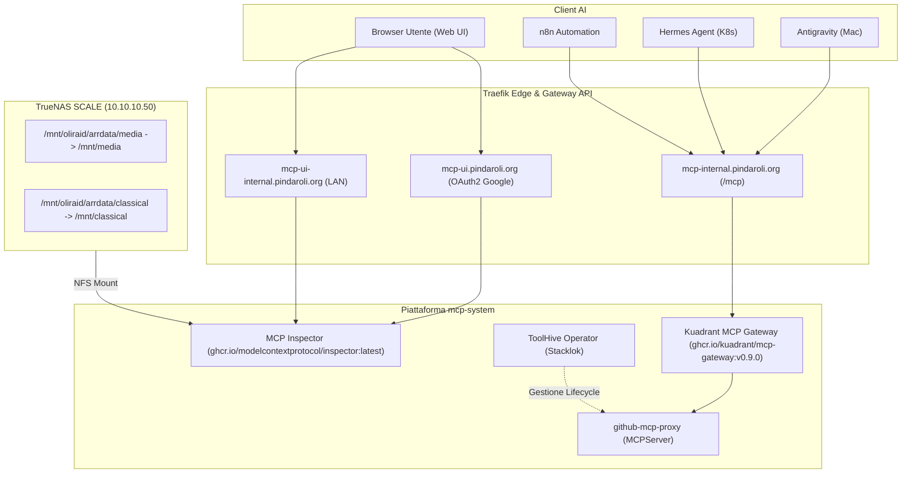

# Piattaforma MCP (Model Context Protocol)

## 🎯 Visione & Obiettivo Architetturale (MCP-as-a-Service)

L'obiettivo fondamentale dell'infrastruttura MCP nel cluster homelab GEMINI (`k8s-lab`) è:
1. **Centralizzazione su Kubernetes (Provider)**: Installare, containerizzare e orchestrare tutti i Server MCP all'interno del cluster (`mcp-system`), consentendo loro l'accesso diretto e privilegiato allo storage TrueNAS (NFS), alle reti VLAN interne e ai segreti di sistema protetti da SOPS.
2. **Accessibilità Agnostica per i Client (Consumer)**: Esporre i server tramite endpoint remoti standard (HTTP/SSE e Kuadrant Gateway) in modo che QUALSIASI **MCP Client** — come **Antigravity** su macOS, **Hermes Agent** nel cluster, flussi **n8n** o bot Telegram — possa invocare i tool via rete, eliminando la necessità di eseguire runtime locali (Python/Node), duplicare credenziali o montare share sui singoli computer degli sviluppatori.
3. **Ruolo di MCP Inspector**: Inspector è declassato a utility opzionale di debug manuale per sviluppatori (disabilitato di default tramite `inspector.enabled: false`) e non fa parte del percorso dati dei client AI operativi.

---

## 1. Architettura e Topologia

L'architettura risiede nel namespace dedicato `mcp-system` ed è articolata in 4 componenti cooperanti:

1. **Kuadrant MCP Gateway (`mcp-broker-router`)**:
   - Router e federatore centrale per tutti i server MCP del lab.
   - Esposto internamente su `mcp-internal.pindaroli.org` tramite HTTPRoute su Gateway Traefik.
   - Firma le sessioni con token JWT (`mcp-gateway-signing-key`).
2. **Stacklok ToolHive Operator**:
   - Gestore del ciclo di vita dei micro-server MCP tramite CRD `MCPServer` (`toolhive.stacklok.dev/v1beta1`).
   - Isola ciascun server in pod dedicati ed esegue il bridging `stdio` -> `HTTP/SSE`.
3. **MCP Inspector (Web UI & File Access)**:
   - Portale di collaudo e test interattivo per strumenti e prompt.
   - Protezione anti-DNS rebinding con `ALLOWED_ORIGINS`.
   - Accesso al file system ZFS di TrueNAS tramite mount NFS diretti su `/mnt/media` e `/mnt/classical`.
4. **Traefik IngressRoute**:
   - Routing split-horizon: accesso esterno su `mcp-ui.pindaroli.org` protetto da Google OAuth2, e accesso LAN diretto su `mcp-ui-internal.pindaroli.org`.

---

## 2. Politica "Chart di Progetto" (Project Chart)

Ai sensi della regola aurea [[GEMINI#3. Security & Operational Policies (The Golden Rules)|HELM DEPLOYMENT & PROJECT CHARTS]]:
- **Motivazione dell'incompatibilità upstream**: La chart ufficiale Kuadrant (`oci://ghcr.io/kuadrant/charts/mcp-gateway`) impone la presenza della Service Mesh Istio/Envoy e una dozzina di controller/CRD enterprise non presenti nel cluster.
- **Implementazione**: Viene mantenuta la Chart di Progetto `helm-charts/mcp-gateway/` (versione semantica `0.2.0`) che aggrega in modo snello sia il Broker Kuadrant sia l'Inspector Web UI.
- **Configurazione Centralizzata**: L'intero deployment di produzione è governato dichiarativamente dal file [mcp-gateway/mcp-gateway-values.yaml](file:///Users/olindo/prj/k8s-lab/mcp-gateway/mcp-gateway-values.yaml).

---

## 3. Storage e Volumi NFS

L'Inspector monta direttamente le condivisioni NFS di primo livello da TrueNAS (`10.10.10.50`):
* `nfs-media`: `/mnt/oliraid/arrdata/media` montato su `/mnt/media`.
* `nfs-classical`: `/mnt/oliraid/arrdata/classical` montato su `/mnt/classical`.

I dataset rispettano lo schema NFS standard del lab: `chmod 777`, ownership `olindo:k8s`, export con `maproot_user="root"` e `maproot_group="wheel"`.
