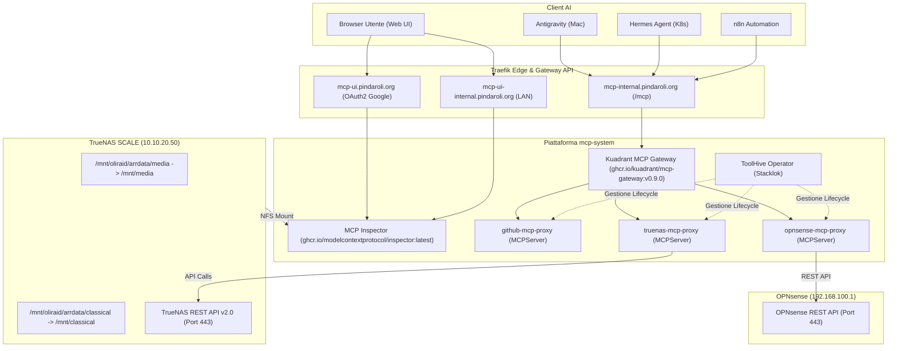

# Piattaforma MCP (Model Context Protocol)

## 🎯 Visione & Obiettivo Architetturale (MCP-as-a-Service)

L'infrastruttura MCP del lab adotta un'architettura **High-Availability 24/7 su TrueNAS SCALE bare-metal (`10.10.20.50`)**:
1. **Operatività Ininterrotta 24/7 su TrueNAS Docker (Provider Primario Attivo)**: La suite completa di 9 server MCP risiede ed è orchestrata tramite Docker Compose su TrueNAS bare-metal (`/mnt/stripe/truenas-docker/mcp/docker-compose.yaml`). Questo garantisce la piena operatività dell'agente AI (Antigravity) anche quando i nodi Proxmox e il cluster Kubernetes Talos vengono spenti per risparmio energetico (`shutdown_to_truenas_only.yml`).
2. **Accessibilità LAN Diretta su Porte Dedicate (Opzione A)**: Ciascun server MCP è mappato su una porta host dedicata (`8101`–`8109`) sull'IP di TrueNAS (`10.10.20.50`), garantendo zero dipendenze da Ingress Traefik, certificati TLS esterni o resolver DNS Unbound.
3. **Disabilitazione Conservativa K8s (Standby Reversibile)**: Nel namespace Kubernetes `mcp-system`, la configurazione Helm (`mcp-gateway-values.yaml`) è mantenuta intatta al 100% nel repository con `replicas: 0` ed `enabled: false`. Nessun file, chart o secret SOPS è stato eliminato.
4. **Ruolo di MCP Inspector**: Inspector rimane opzionale per collaudo manuale.

---

## 1. Architettura e Topologia

L'architettura risiede nel namespace dedicato `mcp-system` ed è articolata in 4 componenti cooperanti:

```mermaid
flowchart TD
    subgraph Client["Client AI"]
        AG["Antigravity (Mac)"]
        HA["Hermes Agent (K8s)"]
        N8N["n8n Automation"]
        USER["Browser Utente (Web UI)"]
    end

    subgraph Edge["Traefik Edge & Gateway API"]
        TR_EXT["mcp-ui.pindaroli.org (OAuth2 Google)"]
        TR_INT["mcp-ui-internal.pindaroli.org (LAN)"]
        GW_INT["mcp-internal.pindaroli.org (/mcp)"]
    end

    subgraph Core["Piattaforma mcp-system"]
        INSP["MCP Inspector (ghcr.io/modelcontextprotocol/inspector:latest)"]
        ROUTER["Kuadrant MCP Gateway (ghcr.io/kuadrant/mcp-gateway:v0.9.0)"]
        TH["ToolHive Operator (Stacklok)"]
        GH["github-mcp-proxy (MCPServer)"]
        TN["truenas-mcp-proxy (MCPServer)"]
        OPN["opnsense-mcp-proxy (MCPServer)"]
    end

    subgraph Storage["TrueNAS SCALE (10.10.20.50)"]
        NFS_MED["/mnt/oliraid/arrdata/media -> /mnt/media"]
        NFS_CLA["/mnt/oliraid/arrdata/classical -> /mnt/classical"]
        API_TN["TrueNAS REST API v2.0 (Port 443)"]
    end

    subgraph Firewall["OPNsense (192.168.100.1)"]
        API_OPN["OPNsense REST API (Port 443)"]
    end

    USER --> TR_EXT & TR_INT --> INSP
    AG & HA & N8N --> GW_INT --> ROUTER
    ROUTER --> GH & TN & OPN
    TH -.->|Gestione Lifecycle| GH & TN & OPN
    TN -->|API Calls| API_TN
    OPN -->|REST API| API_OPN
    Storage -->|NFS Mount| INSP
```

1. **Kuadrant MCP Gateway (`mcp-broker-router`)**:
   - Router e federatore centrale per tutti i server MCP del lab.
   - Esposto internamente su `mcp-internal.pindaroli.org` tramite HTTPRoute su Gateway Traefik.
   - Firma le sessioni con token JWT (`mcp-gateway-signing-key`).
2. **Stacklok ToolHive Operator**:
   - Gestore del ciclo di vita dei micro-server MCP tramite CRD `MCPServer` (`toolhive.stacklok.dev/v1beta1`).
   - Isola ciascun server in pod dedicati ed esegue il bridging `stdio` -> `HTTP/SSE`.
3. **MCP Inspector (Web UI & File Access)**:
   - Portale di collaudo e test interattivo per strumenti e prompt.
   - Protezione anti-DNS rebinding con `ALLOWED_ORIGINS`.
   - Accesso al file system ZFS di TrueNAS tramite mount NFS diretti su `/mnt/media` e `/mnt/classical`.
4. **Traefik IngressRoute**:
   - Routing split-horizon: accesso esterno su `mcp-ui.pindaroli.org` protetto da Google OAuth2, e accesso LAN diretto su `mcp-ui-internal.pindaroli.org`.

---

## 2. Politica "Chart di Progetto" (Project Chart)

Ai sensi della regola aurea [[GEMINI#3. Security & Operational Policies (The Golden Rules)|HELM DEPLOYMENT & PROJECT CHARTS]]:
- **Motivazione dell'incompatibilità upstream**: La chart ufficiale Kuadrant (`oci://ghcr.io/kuadrant/charts/mcp-gateway`) impone la presenza della Service Mesh Istio/Envoy e una dozzina di controller/CRD enterprise non presenti nel cluster.
- **Implementazione**: Viene mantenuta la Chart di Progetto `helm-charts/mcp-gateway/` (versione semantica `0.2.7`) che aggrega sia il Broker Kuadrant, sia i server federati gestiti da ToolHive (GitHub, TrueNAS, OPNsense, Talos, Gemini DeepSearch, Kubernetes), sia l'Inspector Web UI.
- **Pattern di Sicurezza & Segreti**: Tutti i carichi di lavoro ToolHive adottano lo standard architetturale [[mcp-secret-projection-pattern]] (Archetipo 1 per credenziali scalari in RAM, Archetipo 2 per certificati mTLS e configurazioni proiettate come volumi di sola lettura dal Kubelet con filesystem immutabile, e RBAC In-Cluster Native con `ClusterRoleBinding` a `cluster-admin` per il server `kubernetes`).
- **Configurazione Centralizzata**: L'intero deployment di produzione è governato dichiarativamente dal file [mcp-gateway/mcp-gateway-values.yaml](file:///Users/olindo/prj/k8s-lab/mcp-gateway/mcp-gateway-values.yaml).

---

## 3. Storage e Volumi NFS

L'Inspector monta direttamente le condivisioni NFS di primo livello da TrueNAS (`10.10.50`):
* `nfs-media`: `/mnt/oliraid/arrdata/media` montato su `/mnt/media`.
* `nfs-classical`: `/mnt/oliraid/arrdata/classical` montato su `/mnt/classical`.

I dataset rispettano lo schema NFS standard del lab: `chmod 777`, ownership `olindo:k8s`, export con `maproot_user="root"` e `maproot_group="wheel"`.

---

## 4. Catalogo Server MCP Attivi 24/7 su TrueNAS Docker (`10.10.20.50`)

Lo stack Docker Compose in `/mnt/stripe/truenas-docker/mcp/` ospita i 9 server MCP attivi, mappati su porte dedicate:

| Server MCP | Immagine Container | Transport MCP | Host Port | URL Client Antigravity | Protocollo e Target Backend |
| :--- | :--- | :--- | :--- | :--- | :--- |
| **`truenas-master-mcp`** | `local/truenas-master-mcp:latest` | Stdio -> SSE `/mcp` (Supergateway) | **`8101`** | `http://10.10.20.50:8101/mcp` | WebSocket JSON-RPC 2.0 (`wss://10.10.20.50/api/current`) |
| **`opnsense`** | `local/opnsense-mcp:latest` | Stdio -> SSE `/mcp` (Supergateway) | **`8102`** | `http://10.10.20.50:8102/mcp` | OPNsense Firewall REST API (`https://192.168.100.1:443`) |
| **`talos`** | `local/talos-mcp:latest` | Stdio -> SSE `/mcp` (Supergateway) | **`8103`** | `http://10.10.20.50:8103/mcp` | Talos Control Plane gRPC API (`10.10.20.141/55:50000`) |
| **`gemini-deepsearch`** | `ghcr.io/pindaroli/gemini-deepsearch-mcp:latest` | Nativo FastMCP SSE `/sse` | **`8104`** | `http://10.10.20.50:8104/sse` | Google Gemini Cloud API |
| **`kubernetes`** | `ghcr.io/containers/kubernetes-mcp-server:latest` | Nativo Streamable HTTP `/mcp` | **`8105`** | `http://10.10.20.50:8105/mcp` | Kubernetes API Server VIP (`10.10.20.55:6443`) |
| **`ollama`** | `local/ollama-mcp:latest` | Stdio -> SSE `/mcp` (Supergateway) | **`8106`** | `http://10.10.20.50:8106/mcp` | Demone Ollama Mac Studio (`10.10.20.100:11434`) |
| **`kef`** | `ghcr.io/pindaroli/kef-mcp:1.0.0` | Nativo Uvicorn Streamable HTTP `/mcp` | **`8107`** | `http://10.10.20.50:8107/mcp` | Casse KEF LSX II LT (`10.10.20.210`) |
| **`nowaikit`** | `local/nowaikit-mcp:latest` | Stdio -> SSE `/mcp` (Supergateway) | **`8108`** | `http://10.10.20.50:8108/mcp` | ServiceNow Cloud REST API (`dev395227.service-now.com`) |
| **`github-mcp-server`** | `local/github-mcp-server:latest` | Stdio -> SSE `/mcp` (Supergateway) | **`8109`** | `http://10.10.20.50:8109/mcp` | GitHub Cloud REST/GraphQL API (`api.github.com`) |

*(Nota: La flotta originaria su Kubernetes in `mcp-system` è mantenuta integra e pronta in standby dichiarativo con `replicas: 0` ed `enabled: false` in `mcp-gateway/mcp-gateway-values.yaml`)*.

---

## 5. Server MCP Standalone & Dashboard Bridges (`mcp_config.json`)

Server MCP nativi o integrati in applicazioni terze gestiti tramite script bridge standard library in `scripts/<mcp-name>/`:

| Server | Trasporto Client | Target Endpoint | Script Bridge | Funzionalità Esposte |
| :--- | :--- | :--- | :--- | :--- |
| **`homepage-k8s`** | Stdio (Python) | `https://home-internal.pindaroli.org/api/mcp` | `scripts/homepage-mcp/bridge.py` | Ispezione, validazione e documentazione YAML K8s Homepage |
| **`homepage-truenas`** | Stdio (Python) | `http://10.10.20.50:3000/api/mcp` | `scripts/homepage-mcp/bridge.py` | Ispezione, validazione e documentazione YAML TrueNAS Homepage |

