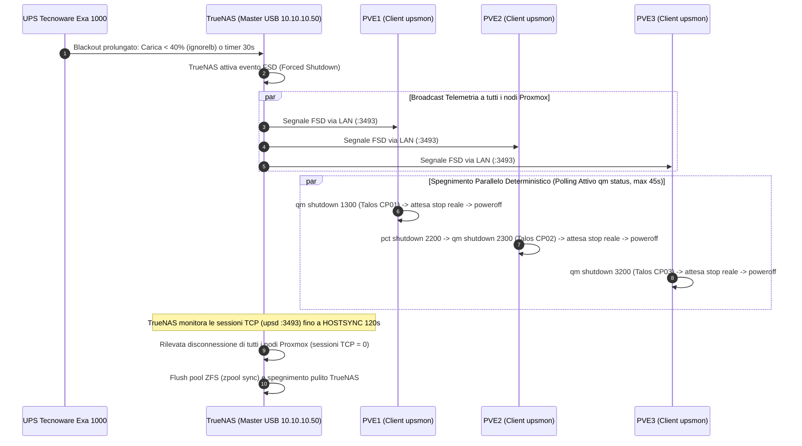

# NUT UPS Architecture & Monitoring

Questo nodo documenta l'architettura di alimentazione di continuità e lo spegnimento ordinato (Graceful Shutdown) del lab tramite **NUT (Network UPS Tools)**.

## 1. Hardware e Collegamento Fisico
- **Dispositivo**: UPS Tecnoware Exa 1000.
- **Interfaccia**: USB HID (Vendor ID `0665`, Product ID `5161`, Chip Cypress Semiconductor USB-to-Serial).
- **Host Master**: **TrueNAS SCALE** (`10.10.10.50`, Bare Metal). Il cavo USB è attestato fisicamente su TrueNAS.
- **Host Client (Slave)**: **PVE1** (`10.10.10.11`), **PVE2** (`10.10.10.21`), **PVE3** (`10.10.10.31`), che monitorano lo stato energetico tramite il demone NUT `upsd` esposto da TrueNAS sulla porta standard `3493`.

## 2. Topologia Runtime Master / Client Distribuita

## 3. Configurazione su TrueNAS (Master)
- **Servizio**: Servizio UPS nativo di TrueNAS SCALE abilitato in modalità Master (`mode: MASTER`).
- **Driver**: `nutdrv_qx$(Various USB)` con porta `auto`.
- **Soglia Software Batteria Cautelativa**:
  - `ignorelb`: ignora il flag hardware dell'inverter che scatterebbe a 10.40V (collasso imminente).
  - `override.battery.charge.low = 40`: dichiara lo stato `LOWBATT` via software non appena la batteria scende sotto il 40%, garantendo diversi minuti di riserva energetica durante lo shutdown.
- **Sincronizzazione Master-Slave (`hostsync: 120`)**:
  - NUT master monitora i socket TCP dei client. Appena tutti i client si scollegano a seguito del poweroff, TrueNAS si arresta immediatamente.
  - In caso di rallentamenti, concede fino a 120 secondi prima dello spegnimento forzato.
- **Ascolto di Rete**: Porta `3493` aperta (`rmonitor: true`) per la rete server.
- **Credenziali**: Utente `upsmon` locale e utente secondario `pvemon` per il cluster Proxmox.

## 4. Configurazione sui Nodi Proxmox (Client PVE1, PVE2, PVE3)
- **Modalità**: `MODE=netclient` in `/etc/nut/nut.conf`.
- **Monitoraggio**: `/etc/nut/upsmon.conf` configurato per monitorare `ups@10.10.10.50:3493` con utente `pvemon`.
- **Script di Shutdown Deterministico (`/etc/nut/shutdown_sequence.sh`)**:
  - Ciascun nodo riceve il segnale `FSD` e lancia lo spegnimento della propria VM Talos.
  - Implementa un loop attivo su `qm status` (ogni 2s con timeout a 45s) che esegue `poweroff` non appena la VM si arresta, eliminando i tempi morti.

## 5. Gestione e Automazione
L'intera configurazione su TrueNAS e sui nodi Proxmox è dichiarativa e gestita tramite il playbook Ansible:
`ansible/playbooks/infrastructure/setup_ups.yml`

## Relazioni
- Master: [[TrueNAS]] (`10.10.10.50`)
- Client: PVE1 (`10.10.10.11`), PVE2 (`10.10.10.21`), PVE3 (`10.10.10.31`)
- Piani: [[nut-distributed-ups-orchestration]], [[truenas-baremetal-migration-pve1-reconfig]]
