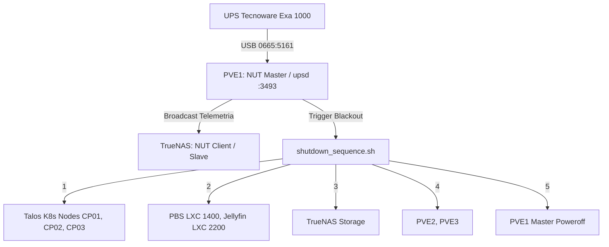

# NUT UPS Architecture & Monitoring

Questo nodo documenta l'architettura di alimentazione di continuità e lo spegnimento ordinato (Graceful Shutdown) del lab tramite **NUT (Network UPS Tools)**.

## 1. Hardware e Collegamento Fisico
- **Dispositivo**: UPS Tecnoware Exa 1000.
- **Interfaccia**: USB HID (Vendor ID `0665`, Product ID `5161`, Chip Cypress Semiconductor USB-to-Serial).
- **Host Master**: **PVE1** (`10.10.10.11`). Il cavo USB è attestato fisicamente su PVE1.

## 2. Topologia Runtime Master / Client

## 3. Configurazione su PVE1 (Master)
- **Driver**: `nutdrv_qx` (protocollo Voltronic-QS) con porta `auto`.
- **Regola Udev**: `/etc/udev/rules.d/99-nut-ups.rules` (`MODE="0660", GROUP="nut"`).
- **Modalità**: `MODE=netserver` in `/etc/nut/nut.conf`.
- **Ascolto**: `127.0.0.1:3493` e `10.10.10.11:3493` in `/etc/nut/upsd.conf`.
- **Script di Shutdown**: `/etc/nut/shutdown_sequence.sh` eseguito da `upsmon` al raggiungimento della soglia `LOWBATT` / `ONBATT`.

## 4. Gestione e Automazione
L'intera configurazione su PVE1 e TrueNAS è gestita tramite il playbook Ansible:
`ansible/playbooks/infrastructure/setup_ups.yml`

## Relazioni
- Master: PVE1 (`10.10.10.11`)
- Client: [[TrueNAS]] (`10.10.10.50`)
- Piani: [[setup-ups-nut-orchestration]], [[truenas-baremetal-migration-pve1-reconfig]]
