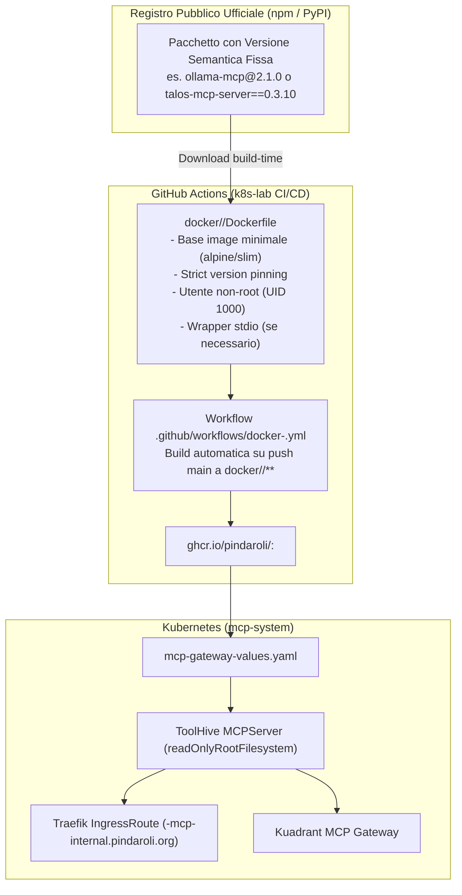

# Pattern: Registry-Backed Packaging for Published MCP Servers

Questo pattern definisce lo standard architetturale del lab per impacchettare, manutenere e distribuire server MCP open-source di terze parti che **dispongono di pacchetti ufficiali versionati rilasciati su registri pubblici** (come **npm** per Node.js o **PyPI** per Python).

---

## 🗺️ Mappe Concettuali e Relazioni
- [[MCP_Platform]] (Infrastruttura dei server MCP e ToolHive Operator in `mcp-system`)
- [[mcp-upstream-tracking-pattern]] (Pattern gemello per server da repository Git upstream privi di pacchetti)
- [[mcp-secret-projection-pattern]] (Proiezione dei segreti SOPS e immutabilità)
- [[SCHEMA]] (Regole di governance e catalogazione del Wiki)

---

## 1. Problema e Ambito di Applicazione

Quando un server MCP viene rilasciato come modulo pubblico (es. `ollama-mcp` o `@richard-stovall/opnsense-mcp-server` su npm, oppure `talos-mcp-server` su PyPI), non è necessario né desiderabile clonare il repository Git sorgente o gestirne la compilazione interna:
* Il gestore di pacchetti ufficiale (`npm` o `pip`) garantisce la risoluzione automatica delle dipendenze, l'installazione dei binari eseguibili nel `$PATH` e la verifica crittografica dell'integrità degli archivi.
* Tuttavia, eseguire questi pacchetti direttamente sul sistema operativo dell'host o in container non standardizzati introdurrebbe eterogeneità, rischi di sicurezza (esecuzione come root) e incompatibilità con ToolHive Operator.

Questo pattern stabilisce la **struttura canonica del Dockerfile**, le **politiche di version pinning** e la **pipeline CI/CD** per trasformare un pacchetto di registro in un container OCI pronto per Kubernetes.

---

## 2. Architettura della Soluzione



---

## 3. Regole Fondamentali del Pattern

### 1. Strict Version Pinning (Divieto di versioni mobili)
Nel `Dockerfile` è **tassativamente vietato** installare pacchetti senza specificare la versione esatta o usando il tag generico `@latest`.
* **Node.js (npm)**:
  ```dockerfile
  RUN npm install -g @richard-stovall/opnsense-mcp-server@0.5.3
  ```
* **Python (pip)**:
  ```dockerfile
  RUN pip install --no-cache-dir "talos-mcp-server==0.3.10"
  ```
Questo garantisce che la build del container sia deterministicamente riproducibile nel tempo.

### 2. Utente Non-Root Unprivileged (UID 1000)
Tutti i container devono obbligatoriamente rilasciare i privilegi di root e impostare un utente unprivileged con UID fisso `1000`:
* In immagini Node alpine: `USER node` (già preconfigurato con UID 1000).
* In immagini Python slim:
  ```dockerfile
  RUN useradd -u 1000 -m -s /bin/bash appuser && \
      chown -R appuser:appuser /app
  USER appuser
  ```
Questo assicura la piena conformità con la policy di sicurezza `securityContext.readOnlyRootFilesystem: true` imposta dal ToolHive Operator.

### 3. Supporto al Trasporto `stdio` e Wrapper di Compatibilità
I server MCP pacchettizzati devono comunicare nativamente tramite `stdio`. Qualora il pacchetto richieda parametri CLI specifici, variabili d'ambiente non standard o intercettazione di log verbosi (come nel caso di `talos-mcp-server` che loggava su file locale non scrivibile), è consentito affiancare un wrapper minimale:
* File: `docker/<app>/<app>_wrapper.py`
* Esempio: `talos_mcp_wrapper.py` reindirizza i log su `/dev/null` per rispettare il filesystem read-only.

### 4. Tag OCI Immutabili su GHCR
La pipeline CI/CD (`.github/workflows/docker-<app>.yml`) deve taggare l'immagine su GHCR sia con la versione semantica del pacchetto (es. `ghcr.io/pindaroli/ollama-mcp:2.1.0`), sia con il floating tag `:latest` e il commit short SHA (`sha-xxxxxxx`).

### 5. Configurazione Dichiarativa Helm
Nessun manifesto loose: il container compilato viene censito in [mcp-gateway-values.yaml](file:///Users/olindo/prj/k8s-lab/mcp-gateway/mcp-gateway-values.yaml) all'interno del blocco `servers`, specificando:
* Nome del server e prefisso Kuadrant (`prefix: "<name>_"`).
* Host Ingress LAN (`<name>-mcp-internal.pindaroli.org`).
* Risorse CPU/Memoria (`requests: 50m/64Mi`, `limits: 300m/256Mi`).
