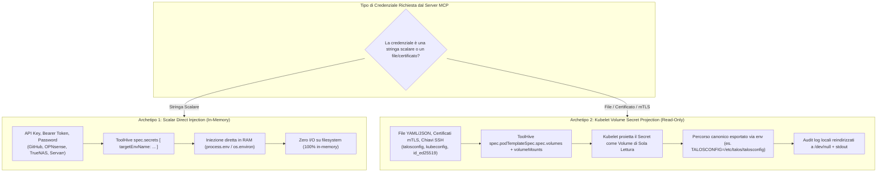

# Pattern: MCP Secret Projection & Workload Immutability

Questo pattern definisce lo standard architetturale per la gestione delle credenziali, dei certificati e dell'immutabilità del filesystem per tutti i server Model Context Protocol (MCP) in esecuzione sul cluster Kubernetes homelab (namespace `mcp-system`, orchestrati da ToolHive Operator).

---

## 🗺️ Mappe Concettuali e Relazioni
- [[MCP_Platform]] (Piattaforma server MCP e ToolHive Operator in `mcp-system`)
- [[Secret_Registry]] (Cifratura dei secret con SOPS + Age)
- [[SCHEMA]] (Regole di governance e catalogazione del Wiki)

---

## 1. Problema e Contesto Architetturale

I pod dei server MCP in Kubernetes sono sottoposti alla baseline di sicurezza restrittiva `securityContext.readOnlyRootFilesystem: true` applicata di default da ToolHive Operator. Il filesystem root del container è sigillato in sola lettura: **nessun file o directory può essere creato o modificato a runtime**.

I server MCP necessitano di autenticarsi verso sistemi eterogenei (API REST, DB, demoni di sistema, socket mTLS), ma le credenziali si dividono in due categorie radicalmente diverse:
1. **Credenziali Scalari**: semplici stringhe (API Key, Bearer Token, username/password).
2. **File Strutturati & mTLS**: configurazioni complesse (kubeconfig, talosconfig, chiavi SSH, certificati X.509) che i binari CLI sottostanti (es. `talosctl`, `kubectl`, `ssh`) pretendono di leggere esclusivamente da un percorso fisico su disco.

Se si tenta di passare un file strutturato come variabile d'ambiente (es. `TALOSCONFIG_DATA`) costringendo il codice ad estrarlo e scriverlo su disco all'avvio (`with open('/tmp/...', 'w')`), l'avvio fallirà con **`OSError: [Errno 30] Read-only file system`**.

---

## 2. I Due Archetipi del Pattern



---

### Archetipo 1: Scalar Direct Injection (In-Memory)

Adottato per server MCP che consumano token o API key direttamente tramite chiamate HTTP REST/GraphQL:
- **Server Esemplari**: `github-mcp`, `opnsense-mcp`, `truenas-mcp`, `arrstack-mcp`.
- **Implementazione**:
  ```yaml
  toolhive:
    enabled: true
    transport: stdio
    secrets:
      - name: opnsense-mcp-api-key
        key: OPNSENSE_API_KEY
        targetEnvName: OPNSENSE_API_KEY
  ```
- **Caratteristiche**:
  - Nessun accesso o scrittura su disco.
  - Il processo applicativo legge la credenziale in memoria da `os.environ` o `process.env`.
  - Pienamente compatibile con `readOnlyRootFilesystem: true` out-of-the-box.

---

### Archetipo 2: Kubelet Volume Secret Projection (Read-Only)

Adottato per server MCP che integrano binari o librerie esterne che esigono percorsi su filesystem per file di configurazione, certificati mTLS o chiavi private:
- **Server Esemplari**: `talos-mcp` (`talosconfig`), `kubernetes-mcp` (`kubeconfig`), futuri server `ansible/semaphore` (chiavi SSH `id_ed25519`).
- **Implementazione Dichiarativa** (in `mcp-gateway-values.yaml`):
  ```yaml
  toolhive:
    enabled: true
    name: talos-mcp
    image: ghcr.io/pindaroli/talos-mcp:latest
    transport: stdio
    proxyPort: 8080
    podTemplateSpec:
      spec:
        volumes:
          - name: talosconfig-vol
            secret:
              secretName: talos-mcp-credentials
        containers:
          - name: mcp
            volumeMounts:
              - name: talosconfig-vol
                mountPath: /etc/talos
                readOnly: true
    env:
      - name: TALOSCONFIG
        value: "/etc/talos/talosconfig"
      - name: TALOS_MCP_AUDIT_LOG_PATH
        value: "/dev/null"
  ```
- **Regole Fondamentali dell'Archetipo 2**:
  1. **Nessun Unpacking Manuale**: È severamente vietato scrivere codice o wrapper che serializzino stringhe da variabili d'ambiente a file su disco. Il file deve essere proiettato nativamente dal Kubelet tramite `secret` volume mount.
  2. **Mount Sola Lettura Esplicito**: Il `volumeMount` deve sempre specificare `readOnly: true`.
  3. **Reindirizzamento Log**: Eventuali librerie o wrapper con log di audit su file devono essere configurati per puntare a `/dev/null` (o stdout). I log operativi devono andare esclusivamente su standard output, dove Kubernetes li raccoglie tramite `kubectl logs`.
  4. **Filesystem Immutabile Intatto**: Non è richiesto alcun volume `emptyDir` o permessi di scrittura, preservando l'immutabilità totale del container.

---

## 3. Benefici e Garanzie di Sicurezza

- **Zero Data Leakage su Disco Epimero**: Nessun certificato o chiave privata risiede in `/tmp` o in storage scrivibile locale non tracciato.
- **Conformità PodSecurity Standards**: I pod rispettano pienamente il profilo `Restricted` di Kubernetes.
- **Risoluzione Immediata dei Problemi di Avvio**: Elimina definitivamente i crash dovuti a `Read-only file system` all'inizializzazione del container.
- **Audit Centralizzato**: Tutta l'osservabilità delle chiamate MCP converge su Traefik IngressRoute e sui log nativi del container in `mcp-system`.
