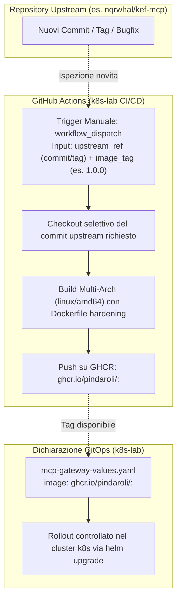

# Pattern: Controlled Upstream Tracking for Custom MCP Containers

Questo pattern definisce lo standard architetturale del lab per integrare e manutenere server MCP open-source di terze parti che non dispongono di pacchetti ufficiali versionati (es. PyPI o NPM) o di immagini container OCI ufficiali manutenute su registry pubblici.

---

## 🗺️ Mappe Concettuali e Relazioni
- [[MCP_Platform]] (Infrastruttura dei server MCP e ToolHive Operator in `mcp-system`)
- [[mcp-secret-projection-pattern]] (Proiezione dei secret e immutabilità del container)
- [[SCHEMA]] (Regole di governance e catalogazione del Wiki)

---

## 1. Problema e Motivazione

Molti server Model Context Protocol (MCP) della community open-source (es. `nqrwhal/kef-mcp`) risiedono esclusivamente come repository Git su GitHub senza:
1. Immagini Docker pre-compilate su GHCR o DockerHub.
2. Pacchetti pubblicati su PyPI o NPM.
3. Rilasci frequenti di tag semantici formali.

Copiare staticamente ("vendoring") il codice sorgente all'interno del monorepo (`docker/<app>/`) presenta gravi rischi:
* **Disallineamento dal codice upstream**: bugfix, aggiornamenti a librerie di streaming (es. `yt-dlp`), modifiche API o nuove feature non vengono recepite.
* **Inquinamento del repository**: centinaia di righe di codice di terze parti non pertinenti alla configurazione dell'infrastruttura.
* **Perdita di tracciabilità**: non è chiaro da quale commit upstream provenga il codice compilato nel container.

D'altra parte, compilare ad ogni build sempre il branch `main` in modo automatico (es. con cron schedulati o ad ogni push) violerebbe il principio di **stabilità e controllo GitOps**:
* Rischio di breaking changes introdotte a monte a insaputa dell'amministratore.
* Impossibilità di rollback riproducibile se il tag `latest` cambia a runtime.

---

## 2. Architettura della Soluzione (Controlled Upstream Tracking)

Il pattern concilia l'aggiornabilità con il pieno controllo dell'amministratore mediante una pipeline CI/CD parametrizzata e tag immutabili:

---

## 3. Regole Fondamentali del Pattern

1. **Nessuna Build Schedulata Silente (No Cron Surprise)**:
   La pipeline di build **NON deve contenere trigger cron automatici** che compilano e sovrascrivono le immagini all'insaputa dell'utente.
2. **Parametrizzazione Upstream Esplicita (`workflow_dispatch`)**:
   Il workflow GitHub Actions deve prevedere l'esecuzione on-demand con input espliciti:
   * `upstream_ref`: commit SHA, branch o tag specifico da compilare (default `main`).
   * `image_tag`: versione semantica da assegnare all'immagine finale su GHCR (es. `1.0.0`, `1.1.0`).
3. **Immutabilità dei Tag OCI**:
   In produzione su Kubernetes ([mcp-gateway-values.yaml](file:///Users/olindo/prj/k8s-lab/mcp-gateway/mcp-gateway-values.yaml)), il deployment deve puntare a tag semantici versionati (es. `1.0.0`) o commit SHA corti, evitando l'uso esclusivo di `:latest`.
4. **Hardening del Container**:
   Anche se il codice upstream gira come root, il `Dockerfile` locale deve creare un utente non-root (UID 1000 `appuser`) e garantire la conformità con `securityContext.readOnlyRootFilesystem: true` imposto da ToolHive Operator.
5. **Adattatore di Trasporto (`entrypoint.py`)**:
   I server MCP progettati per HTTP/SSE standalone devono essere dotati di un wrapper minimale che instradi lo stream su `stdio` quando avviati all'interno di ToolHive Operator.
