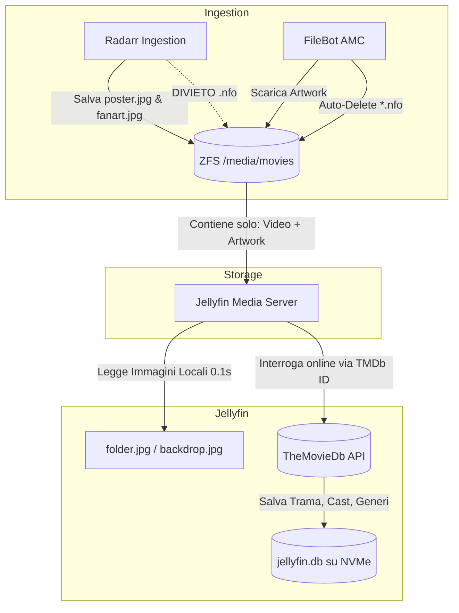

# Pattern: Architettura Metadati e Artwork Ibrida (Jellyfin / Radarr / FileBot)

Questo pattern stabilisce lo standard architetturale per la gestione, la memorizzazione e la sincronizzazione dei metadati e degli artwork grafici per tutti i film ospitati nello storage NFS/ZFS dell'homelab (`/media/movies/` su pool `oliraid`).

---

## 🗺️ Mappe Concettuali e Relazioni
- [[Jellyfin]] (Media server centrale, database SQLite su NVMe in LXC 2200)
- [[Servarr]] (Stack applicativo di automazione, Radarr, FileBot AMC)
- [[SCHEMA]] (Regole del Wiki)
- [[2026-09-13-jellyfin-duplicate-posters-and-nfo-metadata-conflict]] (Incidente risolto con l'introduzione di questo pattern)

---

## 1. Problema e Obiettivo Architetturale

La coesistenza di molteplici strumenti di catalogazione e normalizzazione (Radarr per l'ingestion nativa, FileBot AMC per i flussi non standard, e Jellyfin come media server di streaming) ha generato storicamente:
1. **Conflitti di Metadati e Schede Multiple**: la presenza di file XML `.nfo` locali multipli (es. `movie.nfo` e `<titolo>.nfo`) generava locandine duplicate o letture parziali e incoerenti in Jellyfin.
2. **Spreco di Storage**: la proliferazione di file di metadati testuali ridondanti sul pool ZFS.
3. **Disallineamento dei Flussi**: Radarr scaricava senza artwork, mentre FileBot scaricava artwork e creava obbligatoriamente NFO.

**Obiettivo del Pattern**:
Definire una strategia a **Separazione delle Competenze (Separation of Concerns)** che garantisca:
- Persistenza offline degli artwork grafici sul NAS.
- Abolizione totale dei file `.nfo` sul filesystem.
- Gestione centralizzata dei metadati testuali da parte di Jellyfin tramite database SQLite su disco NVMe veloce.

---

## 2. Definizione del Pattern (Regole Auree dei Metadati)



### Regola 1: Divieto Assoluto di File `.nfo` sul Filesystem
È categoricamente vietata la creazione, il mantenimento o l'importazione di file con estensione `.nfo` all'interno della directory `/media/movies/`:
- **Radarr**: Il modulo metadati `Kodi (XBMC) / Emby` deve mantenere il parametro `movieMetadata: false`.
- **FileBot AMC**: Lo script di normalizzazione [`normalize-video.sh`](file:///Users/olindo/prj/pindaroli-arr-helm/custom-docker-images/custom-normalizer/normalize-video.sh) deve eseguire immediatamente post-elaborazione la rimozione forzata di tutti gli NFO generati:
  ```bash
  find "$TARGET_DIR" -maxdepth 2 -type f -name "*.nfo" -delete
  ```
- **Jellyfin**: L'opzione `Metadata savers -> Nfo` nelle impostazioni della libreria Film deve rimanere disabilitata.

### Regola 2: Persistenza Locale degli Artwork Grafici
Per garantire un caricamento istantaneo dell'interfaccia di Jellyfin e la totale indipendenza da riconnessioni esterne per le immagini:
- Sia **Radarr** (`movieImages: true`) che **FileBot** (`--def artwork=y`) devono salvare localmente nella cartella del film i seguenti file standard:
  - `folder.jpg` o `poster.jpg` (Locandina principale)
  - `backdrop.jpg` o `fanart.jpg` (Sfondo fanart ad alta risoluzione)
  - `logo.png` (Logo trasparente del titolo)
  - `disc.png` (Immagine del disco, se reperibile)

### Regola 3: Gestione Centralizzata dei Metadati Testuali in Jellyfin
Jellyfin è l'unica autorità per la memorizzazione dei dati testuali:
- L'associazione univoca avviene leggendo l'identificativo TheMovieDb incorporato direttamente nel nome della cartella o del file:
  - Formato Radarr: `Titolo (Anno) {tmdb-XXXXX}`
  - Formato FileBot: `Titolo (Anno) {tmdb-XXXXX}` (con parentesi quadre `[...]` riservate esclusivamente a versione, codec e gruppo nel nome file)
- Jellyfin interroga le API di TheMovieDb (TMDb) online e scrive trame, registi, attori, generi e voti nel proprio database SQLite interno (`jellyfin.db`), posizionato su storage NVMe locale del nodo PVE3 (`rpool/data/jellyfin-db`).

---

## 3. Implementazione e Codice di Riferimento

### Ingestion Radarr (Configurazione REST API)
```json
{
  "id": 1,
  "name": "Kodi (XBMC) / Emby",
  "enable": true,
  "fields": [
    { "name": "movieMetadata", "value": false },
    { "name": "movieImages", "value": true }
  ]
}
```

### Normalizzatore FileBot (`normalize-video.sh`)
```bash
filebot -script fn:amc "$src" \
    --output "$TARGET_DIR" \
    --action hardlink \
    --conflict override \
    -non-strict \
    --lang it \
    --def movieDB=TheMovieDB \
    --def "movieFormat={n} ({y}) {'{tmdb-' + id + '}'}/{n} ({y}) {'{tmdb-' + id + '}'}{ ' [' + edition + ']' } - [{ any{source + ' '}{''} }{vf} {vc}]{ ' [' + group + ']' }" \
    --def artwork=y \
    --def ignore="subrip,sample,trickplay"

# Pulizia post-processo: rimuove i file .nfo generati preservando gli artwork
find "$TARGET_DIR" -maxdepth 2 -type f -name "*.nfo" -delete
```

---

## 4. Benefici Operativi Validati
1. **Zero Locandine Multiple**: eliminazione completa dei conflitti di metadati locali e risoluzione definitiva dei poster doppi/tripli.
2. **Resilienza Storage**: se Jellyfin viene reinstallato o subisce un reset della cache, le immagini non devono essere riscaricate da internet poiché già residenti sul NAS ZFS.
3. **Massima Pulizia**: eliminati 971 file spazzatura orfani dal pool `oliraid`.
