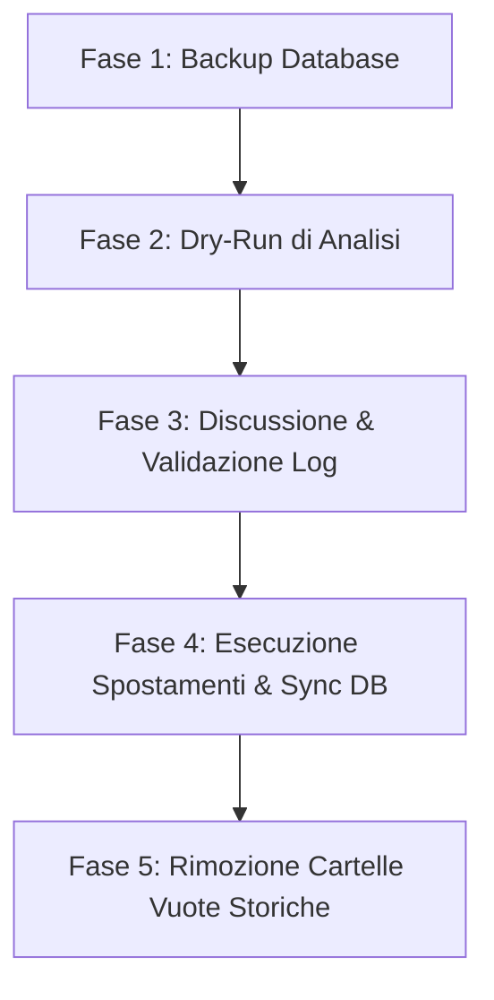

# Piano di Standardizzazione: Formato Directory Album `[Anno] Titolo`

L'obiettivo di questo piano è uniformare la struttura delle cartelle degli album all'interno della Landing Zone `/Volumes/arrdata/media/music_backup/` nel formato standardizzato **`[Anno] Titolo Album`** (es. `[1980] Back in Black`).

Attualmente coesistono due formati a causa di importazioni storiche e post-processing recenti:
* 🆕 **Nuovo standard**: `[Anno] Titolo Album` (es. `[1978] Powerage`)
* 🏛️ **Formato storico**: `Titolo Album (Anno)` (es. `Ballbreaker (2014)`)

---

## 1. Analisi dello Stato Attuale & Sfide

1. **Integrità del Database Beets**:
   Ogni traccia musicale è censita nel database SQLite `musiclibrary.db` con il suo percorso assoluto (`path` nella tabella `items`). Modificare le cartelle direttamente da filesystem romperebbe tutti i collegamenti, rendendo il database inconsistente.
   * *Soluzione*: Lo spostamento deve essere effettuato tramite uno script Python che sposta i file fisicamente e contemporaneamente aggiorna i record nel database Beets (`item.path = nuovo_path` e `item.store()`).

2. **Gestione dell'Anno nei Metadati**:
   Alcuni album potrebbero avere l'anno impostato a `0` o mancante nel database.
   * *Soluzione*: Per gli album senza anno valido nei metadati Beets, useremo il prefisso `[0000]` o tenteremo di estrarre l'anno dal nome attuale della cartella (es. da `(2014)` estrarre `2014`).

3. **Collisioni e Normalizzazione**:
   * Bisogna gestire le normalizzazioni dei caratteri (NFC) per evitare problemi su sistemi Mac/Linux.
   * Bisogna gestire eventuali case clashes (es. cartelle con nomi simili ma maiuscole/minuscole diverse).

---

## 2. Fasi dell'Esecuzione



### Fase 1: Backup di Sicurezza del Database Beets
Prima di qualunque operazione massiva sul database e sul filesystem, effettueremo una copia fredda del database:
```bash
cp /Users/olindo/prj/k8s-lab/import_music/musiclibrary.db /Users/olindo/prj/k8s-lab/import_music/musiclibrary.db.bak.$(date +%F)
```

### Fase 2: Sviluppo dello Script `standardize_album_paths.py`
Svilupperemo uno script Python dedicato che eseguirà le seguenti azioni:
1. Legge tutti gli `items` dal database di Beets.
2. Raggruppa i file per **Album** (identificato da `albumartist` e `album`).
3. Per ciascun album:
   * Determina il percorso attuale della cartella sul filesystem.
   * Estrae il nome dell'artista e dell'album normalizzati.
   * Recupera l'anno dell'album (dai metadati o provando a fare il parsing dell'attuale cartella `(YYYY)`).
   * Costruisce il nuovo nome della directory dell'album: `[YYYY] Nome Album` (sostituendo l'eventuale `(YYYY)` finale).
   * Se il percorso di destinazione è diverso da quello attuale:
     * Genera la mappatura del cambiamento di percorso per tutti i file dell'album.
4. Esegue un **Dry-Run dettagliato** che mostra esattamente quali cartelle cambieranno nome e quanti file verranno spostati.

### Fase 3: Esecuzione e Test
Una volta approvato il Dry-Run, lo script verrà lanciato in modalità `run`:
* Creerà le nuove directory di destinazione (es. `[2009] Highway To Hell`).
* Sposterà fisicamente i file all'interno delle nuove cartelle.
* Aggiornerà il database Beets per mantenere la consistenza al 100%.
* Rimuoverà le vecchie directory ormai vuote (es. `Highway To Hell (2009)`).

---

## 3. Bozza dello Script di Standardizzazione (`standardize_album_paths.py`)

Lo script opererà nel modo seguente:

```python
# Pseudo-codice della logica centrale dello script
for album_id, items in albums.items():
    current_dir = os.path.dirname(items[0].path)
    artist = items[0].albumartist or items[0].artist
    album_name = items[0].album
    year = max([int(item.year) for item in items if item.year] or [0])

    # Se l'anno è 0 ma la cartella ha (YYYY), estrai l'anno
    if year == 0:
        match = re.search(r'\((\d{4})\)$', current_dir)
        if match:
            year = int(match.group(1))

    # Costruisci il nuovo nome cartella
    year_str = f"[{year:04d}]"
    new_album_dir = f"{year_str} {album_name}"
    ...
```

---

## 4. Guardrail di Sicurezza & Protezione dai Disastri (Anti-Disaster Rules)
1. **Verifica Esistenza Sorgente**: Il file viene spostato solo se esiste fisicamente sul disco.
2. **Nessun File Sovrascritto**: Lo script verificherà che non ci siano collisioni distruttive nella cartella di destinazione.
3. **Rollback Facile**: Avendo il backup del database `musiclibrary.db`, in caso di problemi possiamo ripristinare il database e rimettere a posto le cartelle (essendo le operazioni locali su ZFS, sono istantanee).

---

## 5. Stato dell'Esecuzione & Consolidamento (2026-05-19)

Il piano è stato **interamente completato ed eseguito con successo**:

1. **Standardizzazione Massiva (`standardize_album_paths.py`)**:
   * Eseguito su **1101** album totali.
   * **675** album ristrutturati correttamente nel formato standard `[Anno] Titolo`.
   * **5626** tracce riposizionate fisicamente e allineate nel database SQLite di Beets.

2. **Risoluzione Duplicati e Mirror Clean (`clean_all_zeros_duplicates.py`)**:
   * Rilevata una criticità legata a duplicazioni ad Anno 0 (sia su cartelle separate `[0000]` che case-clash nella stessa cartella ZFS).
   * Eseguito il master script di pulizia speculare che ha eliminato con successo **165** record ridondanti a DB e **129** file duplicati sul filesystem, rimuovendo **5** cartelle orfane vuote.
   * La tecnica è stata integrata ufficialmente come **Regola 7** nelle linee guida di **[[music-library-governance]]**.

La Landing Zone `music_backup` è ora normalizzata, consolidata e pronta per lo **ZFS Swap finale** e l'importazione in produzione.
