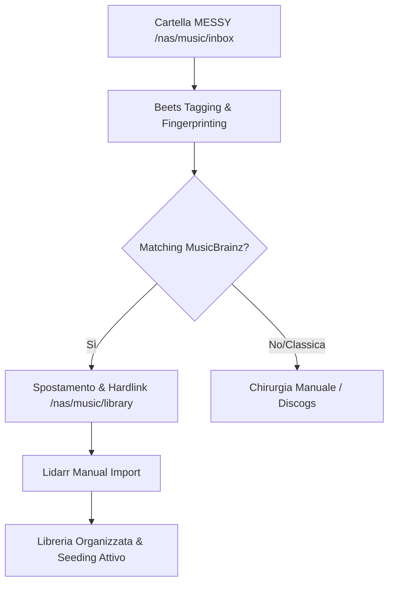

# Piano: Beets Music Rescue Pipeline

**Target**: Mac Studio (Host) · **Data**: 2026-05-11
**Stato**: 🟢 In Esecuzione
**Obiettivo**: Bonifica della libreria musicale "messy" tramite Beets per importazione perfetta in Lidarr, **escludendo categoricamente i bootleg**, e **preservando rigorosamente gli hardlink** con la directory `downloads/lidarr` per mantenere attivo il seeding su qBittorrent senza duplicazione di spazio.

---

## 1. Architettura e Flusso Dati



## 2. Requisiti Hardware & Software (Mac Studio)

### 2.1 Dipendenze Core
- [x] **Beets**: Installato via `pipx` per isolamento.
- [x] **Chromaprint (`fpcalc`)**: Via Homebrew per fingerprinting acustico.
- [x] **ImageMagick**: Via Homebrew per ridimensionamento cover art.
- [x] **Permessi**: Terminale/IDE con `Full Disk Access` nelle impostazioni Privacy di macOS.

### 1. Analisi della Situazione Attuale (AS-IS)

- **Sorgente Dati (NAS)**: Share NFS `/mnt/oliraid/arrdata/media`
- **Stato Libreria**:
    - `.../music`: File riconosciuti da Lidarr (gestiti con **Hardlink** verso `downloads/lidarr`). **NON toccare** in fase di bonifica iniziale.
    - `.../<altre_dir>`: File "sporchi", non riconosciuti da Lidarr, senza hardlink. **Target primario della bonifica**.
- **Stato Software (Mac Studio)**:
    - Beets: **Già installato**, ma non configurato (`config.yaml` assente o default).
    - Accesso: Mac Studio ha mount NFS attivo verso il NAS.

## 2. Requisiti e Vincoli Operativi

### 2.1 Percorsi e Mount (Mac Studio)
- **Root Share**: `/Volumes/arrdata/media`
- **Libreria Finale (TARGET)**: `/Volumes/arrdata/media/music`
- **Sorgente Bonifica**: `/Volumes/arrdata/media/downloads/lidarr` + cartelle messy.
- **ZONA PROTETTA (IGNORE)**: `/Volumes/arrdata/media/downloads/incomplete`

### 2.2 Requisiti Tecnici & Validazione
- **Modalità Operativa**: **COPY + WRITE**. I file originali rimangono intatti nella sorgente. Beets crea una copia pulita nella cartella di backup.
- **Seeding**: Preservato nella sorgente originale (poiché non muoviamo i file).
- **Protocollo**: **NFS** con opzioni ottimizzate: `noresvport,locallocks`.
- **Target Primario**: `/Volumes/arrdata/media/music_backup` (Landing Zone).
- **Naming Pattern (Allineamento Lidarr)**:
    - Standard: `{Album Title} ({Release Year})/{Artist Name} - {Album Title} - {track:02} - {Track Title}`
    - Multi-Disc: `{Album Title} ({Release Year})/CD {medium:02}/{Artist Name} - {Album Title} - {track:02} - {Track Title}`

---

## 3. Configurazione Beets (`config.yaml`) - Strategia "Rescue"

In fase di bonifica complessa (frammentazione, metadati ambigui), la configurazione deve minimizzare i "Phantom Skip" in modalità `quiet` ed escludere i metadati di sistema (macOS):

```yaml
directory: /Volumes/arrdata/media/music_backup
import:
    copy: yes          # NON tocca i file originali
    move: no           # Forza la copia
    write: yes         # Scrive i tag MusicBrainz nella copia
    incremental: yes
    incremental_skip_later: yes # Permette di riprovare gli "skip" in sessioni future
    quiet_fallback: asis        # In modalità quiet, se incerto, importa "così com'è" invece di saltare
match:
    strong_rec_thresh: 0.10     # Abbassa la soglia per considerare un match "Strong"
    max_rec:
        missing_tracks: strong  # Non declassare match con tracce mancanti
        unmatched_tracks: strong
ignore:
    - ".*"
    - "*~"
    - ".DS_Store"
    - "incomplete"
    - "lidarr-incomplete"
```

### Configurazione "No Bootlegs" (ihate plugin):
```yaml
ihate:
    warn: [release_status: bootleg, albumtype: bootleg]
    skip: [release_status: bootleg, albumtype: bootleg]
```

### Plugin Selezionati (I Chirurghi):
- **`chroma`**: Identificazione tramite impronta acustica (AcoustID).
- **`scrub`**: Rimuove tutti i tag esistenti prima di scrivere quelli nuovi (tabula rasa).
- **`zero`**: Azzera campi specifici non desiderati (comments, encoder, etc).
- **`parentwork`**: Analizza le relazioni MusicBrainz per identificare l'opera "madre" (es. la Sinfonia intera).
- **`ftintitle`**: Gestione intelligente dei featuring nel titolo della traccia.
- **`lastgenre`**: Recupera i generi da Last.fm per una libreria omogenea.
- **`discogs`**: Database di fallback per release rare o bootleg.

---

## 4. Fasi di Esecuzione

### Fase 0: Cold Lockdown (Preparazione)
1.  **Total Servarr Shutdown**: ✅ **ESEGUITO**. Tutti i deployment nel namespace `arr` sono stati scalati a 0 via `kubectl`.
2.  **Mount Verify**: ✅ **ESEGUITO**. Mount NFS riallineato con opzioni `rw,tcp,hard,intr,resvport,locallocks`.
3.  **Storage Exclusive Lock**: Il Mac Studio ha ora l'accesso esclusivo allo storage musicale.

### Fase 1: Preparazione Ambiente
1. Installazione tool via Homebrew (`fpcalc`, `imagemagick`). ✅ **ESEGUITO**
2. Installazione Beets e plugin python necessari (es. `pyacoustid`). ✅ **ESEGUITO**
3. Creazione del file `config.yaml` su misura in `~/.config/beets/config.yaml`. ✅ **ESEGUITO**

### Fase 2: Pilot Test (Chirurgia su piccolo campione)
1. Selezione di 2-3 album "difficili".
2. Esecuzione `beet import -p` (preview mode).
3. Verifica dei metadati iniettati (MusicBrainz ID presenti).

### Fase 3: Bonifica Massiva & Hardlinking
1. Processamento incrementale della cartella "messy".
2. Verifica che i file siano spostati mantenendo il seeding su qBittorrent tramite hardlink.
3. **Stato Attuale (2026-05-14)**:
    - Album importati: 458
    - Tracce totali: 4782
    - Spazio occupato: 114.8 GiB
    - Batch successivo: 100 album.

### Fase 4: Landing Zone (music_backup) e Risoluzione Phantom Skips
1.  **Configurazione Ambientale**: Prima di avviare `beet`, esportare `export LC_CTYPE="en_US.UTF-8"` in ZSH per garantire che Python gestisca correttamente la normalizzazione Unicode (NFD) di macOS. (Evitare l'uso di `$path` come variabile per le query).
2.  **Pulizia Atomica dello Stato (In caso di "Phantom Skips" persistenti)**:
    - **Livello DB Relazionale**: Eliminare i record obsoleti usando regex sui path: `beet remove -f path::/Volumes/.../Artist`.
    - **Livello Runtime**: Operare una "chirurgia" sul file `~/.config/beets/state.pickle` tramite script Python per rimuovere i path bloccanti dalla `taghistory` incrementale senza cancellare l'intera memoria.
    - **Livello File System**: Pulire la destinazione da `.DS_Store` e directory parziali.
3.  **Processamento (Rescue Import) con Terminale Dedicato**: Lanciare l'importazione in una nuova finestra di Terminale (tramite `osascript`) reindirizzando contemporaneamente l'output su un file di log per il monitoraggio passivo: `beet import -q "/Volumes/arrdata/media/music/<Artist>/" | tee /tmp/beets_import.log`.
4.  **Monitoraggio Passivo (Anti-DB Lock)**:
    - **Lato Utente**: L'utente può osservare l'avanzamento in tempo reale direttamente nella nuova finestra di Terminale che si aprirà automaticamente (stile "hacker movie").
    - **Lato AI**: L'agente leggerà esclusivamente il file di log (`/tmp/beets_import.log`) per conoscere lo stato, astenendosi rigorosamente dal fare query su SQLite (`beet ls`) finché il processo è in corso.
5.  **Deduplicazione & Verifica**: Solo a processo concluso, verificare con `beet duplicates artist:"<Artist>"` e ispezionare il database per validare la congruenza in `music_backup`.

### Fase 4.1: Automated Anomaly Recovery (Rescue Pipeline)
Invece di procedere manualmente, si adotta una strategia a tre fasi per automatizzare il recupero degli scarti loggati in `import_anomalies.log`.

1.  **Fase 1: Hard Recovery (Algoritmico)**:
    - Sviluppo/Uso di uno script Python che parsa il log, calcola la durata totale dei file locali e interroga le API di MusicBrainz per trovare un match univoco.
    - Esecuzione forzata via ID: `beet import --search-id <MBID> --quiet <PATH>`.
    - *Obiettivo*: Risolvere l'80% delle anomalie di bassa confidenza.

2.  **Fase 2: Soft Recovery (Permissivo)**:
    - **Isolamento**: Estrazione dei path che hanno fallito i passaggi precedenti dal log:
      `grep "skip" import_anomalies.log | cut -d ' ' -f 2- > paths_to_recover.txt`
    - **Importazione Forzata**: Uso di `soft_recovery_config.yaml` (permissivo) con tagging flessibile per rintracciabilità:
      `beet import -q --set recovery_status=soft --set recovery_phase=2 --from-logfile paths_to_recover.txt`
    - **Obiettivo**: Spostare fisicamente ogni file residuo nella struttura `Artist/Album` su TrueNAS, marcandoli nel DB SQLite per l'elaborazione a "bocce ferme".

3.  **Fase 3: Post-Processing & Enrichment**:
    - **Chroma Enrichment**: Esecuzione del plugin `chroma` sugli album marcati `soft` per generare AcoustID e tentare il recupero degli MBID mancanti tramite impronta acustica.
    - **MBSync Mirato**: `beet mbsync recovery_status:soft` per scaricare i metadati ufficiali una volta ottenuto l'ID.
    - **Audit Automatizzato**:
        - `beet missing`: Generazione report tracce assenti da passare a Lidarr per il completamento.
        - `beet bad`: Identificazione di file fisicamente corrotti che bloccherebbero Lidarr.
    - **Sincronizzazione Finale**:
        - In Lidarr, impostare `Write Audio Tags: Never` per proteggere il lavoro di Beets.
        - `beet update`: Allineamento finale dei path nel DB di Beets prima dello swap definitivo.

### Fase 5: Final Sync & Swap
> [!CAUTION]
> **ESECUZIONE MANUALE**: Questa fase e la successiva devono essere eseguite **esclusivamente dall'utente** direttamente sul NAS per garantire la massima velocità e sicurezza. L'AI non deve intervenire sui processi o sui file.

1.  **Backup Database**: Eseguire backup manuale del DB di Lidarr e del file `musiclibrary.db` di Beets.
2.  **Lidarr Offline**: Scalare il deployment di Lidarr a 0 (`kubectl scale deployment lidarr -n arr --replicas=0`).
3.  **Permission Sync**: Allineamento di owner (1000:1000) e permessi (777) di `music_backup`.
4.  **Lo Swap fisico**:
    - `mv /Volumes/arrdata/media/music /Volumes/arrdata/media/music_old`
    - `mv /Volumes/arrdata/media/music_backup /Volumes/arrdata/media/music`
5.  **Lidarr Recovery (Smart Mapping)**:
    - Riavviare Lidarr.
    - Utilizzare lo strumento **Library > Import** (e NON il semplice Rescan) puntando alla "nuova" cartella `music`.
    - Lidarr riconoscerà la struttura pulita di Beets e permetterà il match di massa, aggiornando i percorsi nel database senza perdere la storia degli artisti.
6.  **Verifica**: Test di riproduzione via Jellyfin per confermare che i nuovi percorsi siano corretti.

### Fase 6: Riallineamento Manuale Seeding (Hardlinks)
Questa fase ripristina il seeding su qBittorrent per i file che Beets ha spostato/rinominato.

1.  **Identificazione**: Per ogni album in seeding che risulta "Missing" su qBittorrent:
    - Trovare la nuova posizione in `media/music`.
    - Verificare il nome della cartella originale in `downloads/lidarr`.
2.  **Hardlinking**: Ricreare il legame fisico (Zero spazio extra occupato):
    - `cp -al "/Volumes/arrdata/media/music/Artista/Album/." "/Volumes/arrdata/downloads/lidarr/Cartella_Originale_Torrent/"`
3.  **qBittorrent Validation**:
    - Selezionare i torrent interessati.
    - Eseguire **"Force Recheck"**.
    - Una volta raggiunto il 100%, il torrent riprenderà il seeding direttamente dai file della libreria "pulita".
4.  **Cleanup**: Dopo 48h di stabilità, eliminazione definitiva di `music_old`.

---

## 5. Clausole di Sicurezza e Mitigazioni

- **Clausola 1: Protezione Download Attivi**
    - *Rischio*: Beets tenta di processare un file che qBittorrent sta ancora scaricando.
    - *Mitigazione*: Esclusione esplicita della cartella `incomplete` nella configurazione.
- **Discogs Auth**: Utilizzato token personale (registrato in [[Secret_Registry]]) per bypassare OAuth e sbloccare matching avanzato.

- **Clausola 2: Conflitto Metadati (Lidarr)**
    - *Rischio*: Lidarr sovrascrive i tag puliti da Beets.
    - *Mitigazione*: Impostare Lidarr su **"Metadata: Never Write Tags"**.

- **Clausola 3: Tune-up Mount NFS**
    - *Azione*: Verificare che il mount sia eseguito con `noresvport`. Se necessario, smontare e rimontare con:
      `sudo mount -t nfs -o rw,tcp,hard,intr,noresvport,locallocks <IP_NAS>:/mnt/oliraid/arrdata/media /Volumes/arrdata/media`

---
*Piano redatto da Antigravity AI Engineering — 2026-05-11*
