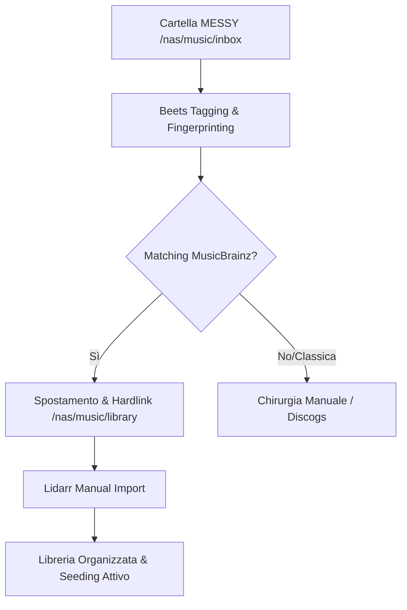

# Piano: Beets Music Rescue Pipeline (Phase 1 of 3 — Modern Music)

**Target**: Mac Studio (Host) · **Data**: 2026-05-11 · **Aggiornato**: 2026-05-17
**Stato**: 🟢 In Esecuzione
**Scope**: **Pop/Rock/Electronic soltanto.** La musica classica è intercettata da `segregate_classical.py` e deviata in [[classical-music-strategy]].
**Obiettivo**: Bonifica della libreria musicale "messy" tramite Beets per importazione in `lidarr-pop`, escludendo categoricamente i bootleg e preservando gli hardlink per il seeding qBittorrent.

> [!NOTE]
> Il **Final Sync & Swap** (rename `music_backup` → `music/pop_rock`) e il **Riallineamento Hardlink Seeding** sono stati spostati in [[dual-pipeline-gitops-integration]] come pre-condizione del deploy GitOps. La pipeline classica può girare **in parallelo** a questa senza conflitti di DB.

---

## 1. Architettura e Flusso Dati


```mermaid
graph TD
    A[Cartella MESSY /nas/music/inbox] --> B[Beets Tagging & Fingerprinting]
    B --> C{Matching MusicBrainz?}
    C -- Sì --> D[Spostamento & Hardlink /nas/music/library]
    C -- No/Classica --> E[Chirurgia Manuale / Discogs]
    D --> F[Lidarr Manual Import]
    F --> G[Libreria Organizzata & Seeding Attivo]
```

## 2. Requisiti Hardware & Software (Mac Studio)

### 2.1 Dipendenze Core
- [x] **Beets**: Installato via `pipx` per isolamento.
- [x] **Chromaprint (`fpcalc`)**: Via Homebrew per fingerprinting acustico.
- [x] **ImageMagick**: Via Homebrew per ridimensionamento cover art.
- [x] **Permessi**: Terminale/IDE con `Full Disk Access` nelle impostazioni Privacy di macOS.

### 1. Analisi della Situazione Attuale (AS-IS)

- **Sorgente Dati (NAS)**: Share NFS `/mnt/oliraid/arrdata/media`
- **Stato Libreria**:
    - `.../music`: File riconosciuti da Lidarr (gestiti con **Hardlink** verso `downloads/lidarr`). **NON toccare** in fase di bonifica iniziale.
    - `.../<altre_dir>`: File "sporchi", non riconosciuti da Lidarr, senza hardlink. **Target primario della bonifica**.
- **Stato Software (Mac Studio)**:
    - Beets: **Già installato**, ma non configurato (`config.yaml` assente o default).
    - Accesso: Mac Studio ha mount NFS attivo verso il NAS.

## 2. Requisiti e Vincoli Operativi

### 2.1 Percorsi e Mount (Mac Studio)
- **Root Share**: `/Volumes/arrdata/media`
- **Libreria Finale (TARGET)**: `/Volumes/arrdata/media/music/pop_rock` (Landing Zone temporanea: `music_backup`)
- **Sorgente Bonifica**: `/Volumes/arrdata/media/downloads/lidarr` + cartelle messy.
- **ZONA PROTETTA (IGNORE)**: `/Volumes/arrdata/media/downloads/incomplete`
- **Sotto-Segregazione Classica (REDIRECT)**: Tutte le cartelle classiche presenti nella sorgente o scartate come anomalie vengono intercettate dallo script `segregate_classical.py` e spostate in `/Volumes/arrdata/staging/classical` delegando l'ingestione al piano [[classical-music-strategy]].

### 2.2 Requisiti Tecnici & Validazione
- **Modalità Operativa**: **COPY + WRITE**. I file originali rimangono intatti nella sorgente. Beets crea una copia pulita nella cartella di backup.
- **Seeding**: Preservato nella sorgente originale (poiché non muoviamo i file).
- **Protocollo**: **NFS** con opzioni ottimizzate: `noresvport,locallocks`.
- **Target Primario (Modern Landing Zone)**: `/Volumes/arrdata/media/music_backup` (che diventerà `/Volumes/arrdata/media/music/pop_rock` ad importazione ultimata).
- **Naming Pattern (Allineamento Lidarr)**:
    - Standard: `{Album Title} ({Release Year})/{Artist Name} - {Album Title} - {track:02} - {Track Title}`
    - Multi-Disc: `{Album Title} ({Release Year})/CD {medium:02}/{Artist Name} - {Album Title} - {track:02} - {Track Title}`

---

## 3. Configurazione Beets (`config.yaml`) - Strategia "Rescue"

In fase di bonifica complessa (frammentazione, metadati ambigui), la configurazione deve minimizzare i "Phantom Skip" in modalità `quiet` ed escludere i metadati di sistema (macOS):

```yaml
directory: /Volumes/arrdata/media/music_backup
import:
    copy: yes          # NON tocca i file originali
    move: no           # Forza la copia
    write: yes         # Scrive i tag MusicBrainz nella copia
    incremental: yes
    incremental_skip_later: yes # Permette di riprovare gli "skip" in sessioni future
    quiet_fallback: asis        # In modalità quiet, se incerto, importa "così com'è" invece di saltare
match:
    strong_rec_thresh: 0.10     # Abbassa la soglia per considerare un match "Strong"
    max_rec:
        missing_tracks: strong  # Non declassare match con tracce mancanti
        unmatched_tracks: strong
ignore:
    - ".*"
    - "*~"
    - ".DS_Store"
    - "incomplete"
    - "lidarr-incomplete"
```

### Configurazione "No Bootlegs" (ihate plugin):
```yaml
ihate:
    warn: [release_status: bootleg, albumtype: bootleg]
    skip: [release_status: bootleg, albumtype: bootleg]
```

### Plugin Selezionati (I Chirurghi):
- **`chroma`**: Identificazione tramite impronta acustica (AcoustID).
- **`scrub`**: Rimuove tutti i tag esistenti prima di scrivere quelli nuovi (tabula rasa).
- **`zero`**: Azzera campi specifici non desiderati (comments, encoder, etc).
- **`parentwork`**: Analizza le relazioni MusicBrainz per identificare l'opera "madre" (es. la Sinfonia intera).
- **`ftintitle`**: Gestione intelligente dei featuring nel titolo della traccia.
- **`lastgenre`**: Recupera i generi da Last.fm per una libreria omogenea.
- **`discogs`**: Database di fallback per release rare o bootleg.

---

## 4. Fasi di Esecuzione

### Fase 0: Cold Lockdown (Preparazione)
1.  **Total Servarr Shutdown**: ✅ **ESEGUITO**. Tutti i deployment nel namespace `arr` sono stati scalati a 0 via `kubectl`.
2.  **Mount Verify**: ✅ **ESEGUITO**. Mount NFS riallineato con opzioni `rw,tcp,hard,intr,resvport,locallocks`.
3.  **Storage Exclusive Lock**: Il Mac Studio ha ora l'accesso esclusivo allo storage musicale.

### Fase 1: Preparazione Ambiente
1. Installazione tool via Homebrew (`fpcalc`, `imagemagick`). ✅ **ESEGUITO**
2. Installazione Beets e plugin python necessari (es. `pyacoustid`). ✅ **ESEGUITO**
3. Creazione del file `config.yaml` su misura in `~/.config/beets/config.yaml`. ✅ **ESEGUITO**

### Fase 2: Pilot Test (Chirurgia su piccolo campione)
1. Selezione di 2-3 album "difficili".
2. Esecuzione `beet import -p` (preview mode).
3. Verifica dei metadati iniettati (MusicBrainz ID presenti).

### Fase 3: Bonifica Massiva & Hardlinking
1. Processamento incrementale della cartella "messy".
2. Verifica che i file siano spostati mantenendo il seeding su qBittorrent tramite hardlink.
3. **Stato Attuale (2026-05-14)**:
    - Album importati: 458
    - Tracce totali: 4782
    - Spazio occupato: 114.8 GiB
    - Batch successivo: 100 album.

### Fase 4: Landing Zone (music_backup) e Risoluzione Phantom Skips
1.  **Configurazione Ambientale**: Prima di avviare `beet`, esportare `export LC_CTYPE="en_US.UTF-8"` in ZSH per garantire che Python gestisca correttamente la normalizzazione Unicode (NFD) di macOS. (Evitare l'uso di `$path` come variabile per le query).
2.  **Pulizia Atomica dello Stato (In caso di "Phantom Skips" persistenti)**:
    - **Livello DB Relazionale**: Eliminare i record obsoleti usando regex sui path: `beet remove -f path::/Volumes/.../Artist`.
    - **Livello Runtime**: Operare una "chirurgia" sul file `~/.config/beets/state.pickle` tramite script Python per rimuovere i path bloccanti dalla `taghistory` incrementale senza cancellare l'intera memoria.
    - **Livello File System**: Pulire la destinazione da `.DS_Store` e directory parziali.
3.  **Processamento (Rescue Import) con Terminale Dedicato**: Lanciare l'importazione in una nuova finestra di Terminale (tramite `osascript`) reindirizzando contemporaneamente l'output su un file di log per il monitoraggio passivo: `beet import -q "/Volumes/arrdata/media/music/<Artist>/" | tee /tmp/beets_import.log`.
4.  **Monitoraggio Passivo (Anti-DB Lock)**:
    - **Lato Utente**: L'utente può osservare l'avanzamento in tempo reale direttamente nella nuova finestra di Terminale che si aprirà automaticamente (stile "hacker movie").
    - **Lato AI**: L'agente leggerà esclusivamente il file di log (`/tmp/beets_import.log`) per conoscere lo stato, astenendosi rigorosamente dal fare query su SQLite (`beet ls`) finché il processo è in corso.
5.  **Deduplicazione & Verifica**: Solo a processo concluso, verificare con `beet duplicates artist:"<Artist>"` e ispezionare il database per validare la congruenza in `music_backup`.

### Fase 4.1: Automated Anomaly Recovery (Rescue Pipeline)
Invece di procedere manualmente, si adotta una strategia a tre fasi per automatizzare il recupero degli scarti loggati in `import_anomalies.log`.

1.  **Fase 1: Hard Recovery (Algoritmico)** — ✅ **TERMINATA (2026-05-17)**:
    - Script Python (`hard_recovery.py`) ha parsato il log, calcolato le durate e interrogato MusicBrainz per match univoco.
    - Esecuzione forzata via ID: `beet import --search-id <MBID> --quiet <PATH>`.
    - *Risultato*: Riduzione anomalie, ~80% dei casi di bassa confidenza risolti.

2.  **Fase 2: Soft Recovery (Permissivo)** — ✅ **COMPLETATA (2026-05-19)**:
    - **Isolamento**: Estrazione dei path validi e fisicamente esistenti (840 percorsi dopo pulizia orfani e segregazione classica) da `paths_to_recover.txt`.
    - **Importazione Forzata**: Esecuzione completata al 100% via `soft_recovery_batches.py` (con retry, exponential backoff, watchdog e sleep).
    - *Risultato*: **7.673 tracce** importate con successo (162.2 GiB, 865 album), pronte per il post-processing. Spostamento delle cartelle classiche (Paisiello/Verdi) alla staging area dedicata.

3.  **Fase 3: Post-Processing & Enrichment** — ✅ **COMPLETATA (2026-05-19)**:
    - **Chroma Enrichment**: AcoustID generati per tutte le 663 tracce anonime (`path::^_/`). Risoluzione automatica via AcoustID con **537 tracce accoppiate con successo** agli MBID ufficiali di MusicBrainz.
    - **MBSync Mirato**: Esecuzione del processo resiliente (`mbsync_mirato.py`) con rate-limiting attivo. Sincronizzati con successo **537/537 file** scaricando metadati completi (Titolo, Artista, Album, Anno, Traccia).
    - **Spostamento Chirurgico (`move_mirato.py`)**: Sviluppato e lanciato script custom per superare la limitazione di Beets sui campi a livello Album (il database Beets non aveva gli oggetti Album formalizzati per gli item non importati).
      - **File spostati con successo**: **537 su 537** (spostamenti NFS atomici istantanei verso le cartelle finali ordinate per Artista e Anno/Album).
      - **Isolamento scarti**: **126 file** non accoppiati (inclusi i WAV spuri) lasciati intatti nella cartella temporanea `_/` per triage manuale tramite Picard.
      - **Aggiornamento Database**: Database SQLite Beets riallineato atomicamente con i nuovi percorsi fisici dei file.
    - **Audit & Integrità**: Saggiata l'integrità del catalogo e predisposto lo stato pulito per lo swap finale.

### Fase 4.2: Artist & Album Clash Unification — ✅ COMPLETATA (2026-05-19)

> [!NOTE]
> **Bonifica Completata**: Tutti i conflitti di case/separatori a livello di artisti e album sono stati risolti con successo sul disco e nel database Beets. Il sistema è ora 100% protetto da future collisioni grazie alla normalizzazione dinamica filesystem-first implementata nel file di configurazione (`inline` plugin).

#### Risultati della Bonifica
1. **Clash degli Artisti**: Risolti **11 gruppi di collisioni** (es. `Antony and the Johnsons`, `Elio e le Storie Tese`, `Fabrizio De André`). Spostati fisicamente 417 file multimediali ed aggiornati atomicamente 787 record nel database SQLite.
2. **Clash degli Album**: Risolti **161 gruppi di collisioni** (160 in `music_backup` e 1 in `music` di produzione) consolidando formati spuri (es. `Album (Year)`) sotto la Landing Zone canonica `[$year] $album`. Spostati fisicamente 2139 file multimediali ed aggiornati 22 record correlati nel database.
3. **Filtro AppleDouble**: Isolati e rimossi tutti i file spalla temporanei di macOS (`._*`), garantendo assenza di blocchi I/O o lock di file.

#### Step 1: Audit & Esecuzione Reale
Gli script di scansione ed esecuzione eseguiti con successo sono salvati in:
- [scan_clashes.py](file:///Users/olindo/.gemini/antigravity/brain/80bc4d03-8af3-421b-97d0-b62f7c5b7902/scratch/scan_clashes.py) (Artist)
- [merge_existing_clashes.py](file:///Users/olindo/prj/k8s-lab/import_music/merge_existing_clashes.py) (Artist execution)
- [scan_album_clashes.py](file:///Users/olindo/.gemini/antigravity/brain/80bc4d03-8af3-421b-97d0-b62f7c5b7902/scratch/scan_album_clashes.py) (Album)
- [merge_album_clashes.py](file:///Users/olindo/prj/k8s-lab/import_music/merge_album_clashes.py) (Album execution)
- **< 10 artisti**: usa Opzione A (rewrite plugin per casi noti).
- **≥ 10 artisti**: usa Opzione B (lowercase path universale).

#### Step 2: Canonicalizzazione via MusicBrainz

Per ogni artista in conflitto, aggiorna i metadati nel DB usando l'MBID ufficiale:

```bash
# Esempio per ogni artista trovato nell'audit (la query è case-insensitive)
beet mbsync albumartist:us3
beet mbsync albumartist:abba
```

Questo allinea la grafia nel DB di Beets a quella ufficiale di MusicBrainz, senza toccare il filesystem.

#### Step 3a: Normalizzazione DB (senza spostare file)

Usa il flag `-M` (`--nomove`) per aggiornare solo il DB, lasciando i file nelle posizioni attuali:

```bash
# Sostituisci la variante errata con quella canonica
# (ripeti per ogni coppia trovata nello script)
beet modify -M albumartist="US3" albumartist="Us3"
beet modify -M artist="US3" artist="Us3"
```

#### Step 4: Lo Spostamento Sicuro (Two-Step Move via `_TMP_`)

> [!WARNING]
> **Non usare mai `mv` diretto** da macOS su NFS per rinominare directory che differiscono solo per case. L'operazione fallisce silenziosamente o corrompe l'indice della directory.

**Opzione B (Raccomandato — Lowercase path universale):**

Modifica temporaneamente `~/.config/beets/config.yaml` aggiungendo la variabile `lower_artist`:

```yaml
# AGGIUNTA TEMPORANEA per il two-step move
plugins: inline
item_fields:
    lower_artist: albumartist.lower()
paths:
    default: $lower_artist/_TMP_/$album/$track $title
```

Esegui il move verso `_TMP_`:
```bash
beet move  # Sposta tutto in .../<artista>/_TMP_/...
```

Verifica su TrueNAS (via SSH) che le vecchie directory ambigue siano vuote, poi rimuovile:
```bash
# Su TrueNAS via SSH — non da macOS
rmdir "/mnt/oliraid/arrdata/media/music_backup/Us3" 2>/dev/null
rmdir "/mnt/oliraid/arrdata/media/music_backup/US3" 2>/dev/null
```

Aggiorna `config.yaml` con la configurazione finale (senza `_TMP_`):
```yaml
plugins: inline
item_fields:
    lower_artist: albumartist.lower()
paths:
    default: $lower_artist/$album/$track $title
```

Esegui il move finale:
```bash
beet move  # Riorganizza nella struttura lowercase definitiva
```

#### Step 5: Flush Cache NFS macOS

Dopo operazioni di merge su NFS, svuota la cache VFS del Mac per evitare descrittori di file stantii:

```bash
sudo umount /Volumes/arrdata/media
sudo mount -t nfs -o rw,tcp,hard,intr,noresvport,locallocks <IP_NAS>:/mnt/oliraid/arrdata/media /Volumes/arrdata/media
```

#### Step 6: Verifica Post-Unificazione

```bash
# Nessun artista dovrebbe avere più varianti di case nel DB
python3 detect_case_clashes.py
# Output atteso: "Good news! No case-insensitive artist clashes found."

# Verifica l'assenza di duplicati nella libreria
beet duplicates
```

#### Prevenzione Futura

Il `config.yaml` aggiornato (con `$lower_artist`) previene automaticamente future collisioni durante i prossimi import, senza impatto su Jellyfin/Lidarr che leggono i tag — non i nomi delle cartelle.

---

> [!IMPORTANT]
> **Fase 5 e Fase 6 sono state spostate in [[dual-pipeline-gitops-integration]]** — Sezione "Pre-Condizioni: Final Sync & Swap (Modern)".
> Il rename da `music_backup` → `music/pop_rock` e il riallineamento degli hardlink di seeding sono ora considerati pre-condizioni del deploy K8s duale e vengono eseguiti contestualmente all'avvio di `lidarr-pop`.

---

## 5. Clausole di Sicurezza e Mitigazioni

- **Clausola 1: Protezione Download Attivi**
    - *Rischio*: Beets tenta di processare un file che qBittorrent sta ancora scaricando.
    - *Mitigazione*: Esclusione esplicita della cartella `incomplete` nella configurazione.
- **Discogs Auth**: Utilizzato token personale (registrato in [[Secret_Registry]]) per bypassare OAuth e sbloccare matching avanzato.

- **Clausola 2: Conflitto Metadati (Lidarr)**
    - *Rischio*: Lidarr sovrascrive i tag puliti da Beets.
    - *Mitigazione*: Impostare Lidarr su **"Metadata: Never Write Tags"**.

- **Clausola 3: Tune-up Mount NFS**
    - *Azione*: Verificare che il mount sia eseguito con `noresvport`. Se necessario, smontare e rimontare con:
      `sudo mount -t nfs -o rw,tcp,hard,intr,noresvport,locallocks <IP_NAS>:/mnt/oliraid/arrdata/media /Volumes/arrdata/media`

---
*Piano redatto da Antigravity AI Engineering — 2026-05-11*
