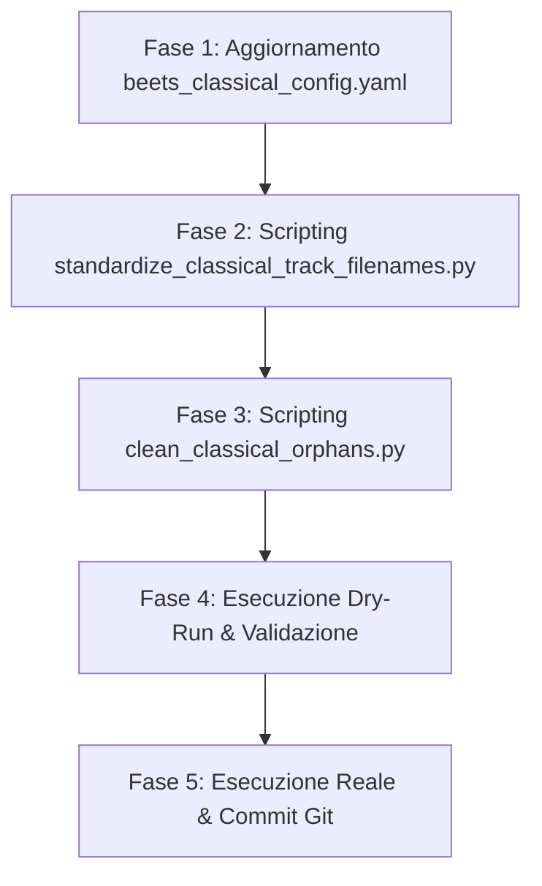

# Piano: Standardizzazione e Bonifica della Libreria di Musica Classica

> [!IMPORTANT]
> **Stato**: 🟡 Pianificato (In attesa di approvazione) · **Data**: 2026-05-19
> **Obiettivo**: Estendere la pulizia e la standardizzazione della pipeline Modern (Pop/Rock) anche all'Isola Classica (`/Volumes/classical/library`), risolvendo il rumore visivo dei prefissi delle tracce e bonificando il filesystem dai file fantasma di macOS (`._*`).

---

## 🗺️ Razionale e Analogia con la Pipeline Pop/Rock

Il successo del consolidamento della pipeline Pop/Rock ha evidenziato l'efficacia di due azioni principali che ora applichiamo alla Musica Classica:

1. **Rimozione dei prefissi CD ridondanti per album a disco singolo**:
   * *Pop/Rock*: Traccia singola `01 - Titolo.ext`, traccia multi-disco `01-02 - Titolo.ext`.
   * *Classica (Attuale)*: Qualunque traccia ha il formato fisso `01-01 - Titolo.ext`, anche se l'opera risiede su un unico CD (es. `01-01 - Beethoven - Symphony #9...`).
   * *Soluzione*: Mantenere il prefisso doppio **solo** quando l'album ha `disctotal > 1` (o appartiene a un boxset/multidisco come Mozart 225). Per le opere a disco singolo, passare al prefisso pulito `01 - Titolo.ext`.

2. **Pulizia speculare dei file spazzatura e di risorsa macOS (`._*`)**:
   * *Pop/Rock*: Rimozione dei file orfani lasciati da vecchi import.
   * *Classica*: Il filesystem classico è basato su collegamenti simbolici (symlinks) verso lo staging `/Volumes/classical/staging/` per permettere a qBittorrent di continuare il seeding. La copia e l'esplorazione da macOS hanno creato una grandissima quantità di file di risorsa Apple Double (`._*`) che inquinano l'indicizzazione dei media player.
   * *Soluzione*: Eseguire una pulizia profonda dei file di risorsa e degli orfani non-audio.

---

## 🛠️ Fasi dell'Esecuzione



### Fase 1: Aggiornamento dell'Inline Field in `beets_classical_config.yaml`
Modificheremo l'inline field `disc_and_track` nella configurazione Beets classica per calcolare dinamicamente il prefisso corretto. La nuova logica verificherà se l'album è multidisco oppure se il percorso contiene indicazioni esplicite di dischi multipli:

```python
  disc_and_track: |
    disc = getattr(db_obj, 'disc', 1) or 1
    track = getattr(db_obj, 'track', 1) or 1
    disctotal = getattr(db_obj, 'disctotal', 1) or 1

    is_multi = (disc > 1 or disctotal > 1)

    if not is_multi:
        try:
            path_str = db_obj.path.decode('utf-8', 'ignore').lower()
            import re
            if re.search(r'\b(cd|disc|disco|vol|volume)\s*\d+', path_str):
                is_multi = True
        except Exception:
            pass

    if is_multi:
        return f"{disc:02d}-{track:02d}"
    return f"{track:02d}"
```

---

### Fase 2: Sviluppo di `standardize_classical_track_filenames.py`
Svilupperemo uno script Python dedicato all'Isola Classica che:
1. Si connetterà al database Beets della classica (`classical_musiclibrary.db`).
2. Scansionerà tutti i record delle tracce (`items`).
3. Per ciascuna traccia, calcolerà il nuovo percorso unificato in base alla presenza di dischi multipli e al formato `$clean_composer/$clean_work$year_bracket - $albumartist/$disc_and_track - $clean_title`.
4. Trattandosi di **symlink**, lo script:
   * Leggerà il target originale del symlink esistente (in staging).
   * Creerà il nuovo symlink rinominato in `library` che punta allo stesso file in staging.
   * Rimuoverà il vecchio symlink in `library`.
   * Aggiornerà il database Beets classica (`classical_musiclibrary.db`) richiamando `item.path = nuovo_path` e `item.store()`.
5. Non toccherà in alcun modo i file fisici nello staging, lasciando qBittorrent a seedare senza alcuna interruzione.

---

### Fase 3: Bonifica dei File Risorsa macOS (`._*`)
Svilupperemo una funzione di pulizia speculare (o richiameremo `dot_clean` in modo mirato e ricorsivo) per rimuovere i file Apple Double `._*` orfani presenti in `/Volumes/classical/library/` che non corrispondono ad alcun file traccia reale.

---

### Fase 4: Esecuzione in Modalità Dry-Run
Prima di applicare qualunque modifica fisica al filesystem o al database SQLite, lo script mostrerà:
* Il numero totale di symlink da ri-allineare.
* Un'anteprima dettagliata dei vecchi percorsi e dei nuovi percorsi (es. da `01-01 - ...` a `01 - ...` per CD singoli).
* L'elenco dei file risorsa `._*` pronti per la rimozione.

---

## 🛡️ Guardrail di Sicurezza
1. **Backup Preventivo del DB**: Copia fredda di `classical_musiclibrary.db` prima di lanciare qualunque script.
2. **Nessun impatto su qBittorrent**: I file reali in `/Volumes/classical/staging/` sono considerati intangibili; modifichiamo solo i puntatori simbolici in `library`.
3. **Preservazione dei tag Jellyfin**: I tag musicali all'interno dei file reali non vengono riscritti (essendo i file originali in staging e in sola lettura), garantendo che Jellyfin-Classic non debba effettuare una nuova scansione pesante ma solo un aggiornamento veloce dei percorsi dei symlink.

---
*Piano redatto da Antigravity AI Engineering — 2026-05-19*
*Collegato a: [[classical-music-strategy]], [[music-library-governance]]*
