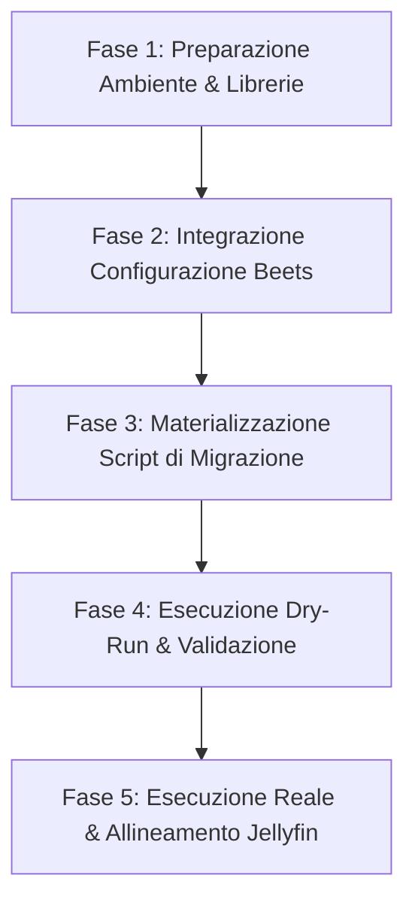

# Piano: Ottimizzazione della Tassonomia per la Musica Classica

> [!IMPORTANT]
> **Stato**: 🟢 Completato · **Data**: 2026-05-20
> **Obiettivo**: Implementare un modello di tassonomia ibrida che separi automaticamente le Monografie dai Recital multi-autore, introducendo un motore di normalizzazione linguistica dei nomi a tre livelli ed allineando Jellyfin-Classic per prevenire la frammentazione degli album.

---

## 🗺️ Razionale Architetturale

La musica classica non segue la struttura lineare `Artista -> Album -> Traccia` tipica della musica leggera. Un singolo album può essere:
1. **Monografia**: Interamente dedicato alle opere di un unico compositore (es. Sinfonie di Beethoven dirette da Karajan). Deve essere organizzato sotto il compositore: `Monographs/Compositore/Opera/[Anno] Album/`.
2. **Recital**: Un esecutore che interpreta brani di molteplici compositori (es. Vladimir Horowitz che esegue Scarlatti, Chopin e Liszt). Se organizzato per compositore, verrebbe frammentato fisicamente sul disco in decine di cartelle orfane. Deve essere organizzato sotto l'esecutore: `Recitals/Esecutore/[Anno] Album/`.

Questo piano implementa un rilevamento dinamico basato sul plugin `inline` di Beets 2.x, calcolando la cardinalità dei compositori unici nell'album per deviare automaticamente il percorso sul filesystem.

---

## 🛠️ Fasi del Piano ed Azioni



### Fase 1: Preparazione Ambiente & Librerie
Installazione delle librerie specializzate per la normalizzazione fonetica cirillica e la scomposizione Unicode all'interno del virtual environment di Beets:
```bash
/Users/olindo/prj/k8s-lab/import_music/import_classical/venv/bin/pip install cyrtranslit transliterate unidecode
```

### Fase 2: Integrazione Configurazione Beets
Modifica del file [beets_classical_config.yaml](file:///Users/olindo/prj/k8s-lab/import_music/import_classical/beets_classical_config.yaml) per:
* Rilevare l'album dell'item a livello di database tramite `db_obj.get_album()`.
* Calcolare `is_recital` se i compositori dell'album sono $> 1$.
* Integrare la chiamata alla funzione `normalize_artist_name` definita in `reorganize_recitals.py` per garantire coerenza assoluta tra il database e lo script offline.
* Applicare la sintassi condizionale `%if{is_recital, ...}` per la diramazione dinamica dei percorsi.

### Fase 3: Materializzazione di `reorganize_recitals.py` e `artist_normalization.json`
* Creare lo script offline `reorganize_recitals.py` che scansiona la libreria Beets, rileva i recital storici non allineati e sposta in sicurezza i relativi symlinks.
* Creare il file `artist_normalization.json` con la tabella di mapping iniziale per i nomi famosi.

### Fase 4: Esecuzione Dry-Run e Auditing
* Eseguire la migrazione in modalità simulata per validare ogni singolo symlink pianificato.
* Validare la compilazione sintattica dei template di Beets.

### Fase 5: Esecuzione Reale ed Allineamento Jellyfin-Classic
* Applicare le modifiche sul disco e sul database Beets.
* Configurare Jellyfin-Classic con l'opzione "Prefer ARTISTS tag if available" ed installare `jellyfin-musictags-plugin`.

---

## 🛡️ Guardrail di Sicurezza
1. **Preservazione Integrità ZFS & Seeding**: I symlink in `/Volumes/classical/library` puntano all'area di staging `/Volumes/classical/staging`. Lo spostamento operato dallo script **risolve e ricrea esclusivamente i symlink** usando `os.readlink`, garantendo il seeding illimitato delle sorgenti torrent. Tutti i nuovi symlink vengono generati come **relativi** per garantire la portabilità assoluta su NFS tra macOS e Kubernetes (vedi [[nfs-symlink-portability]]).
2. **Backup Preventivo del DB**: Backup freddo di `classical_musiclibrary.db` prima di ogni transizione.
3. **Modalità Provvisoria (Dry-Run)**: Attiva di default nello script di migrazione.

---
*Piano redatto da Antigravity AI Engineering — 2026-05-19*
*Collegato a: [[classical-music-standardization]], [[classical-music-strategy]]*
