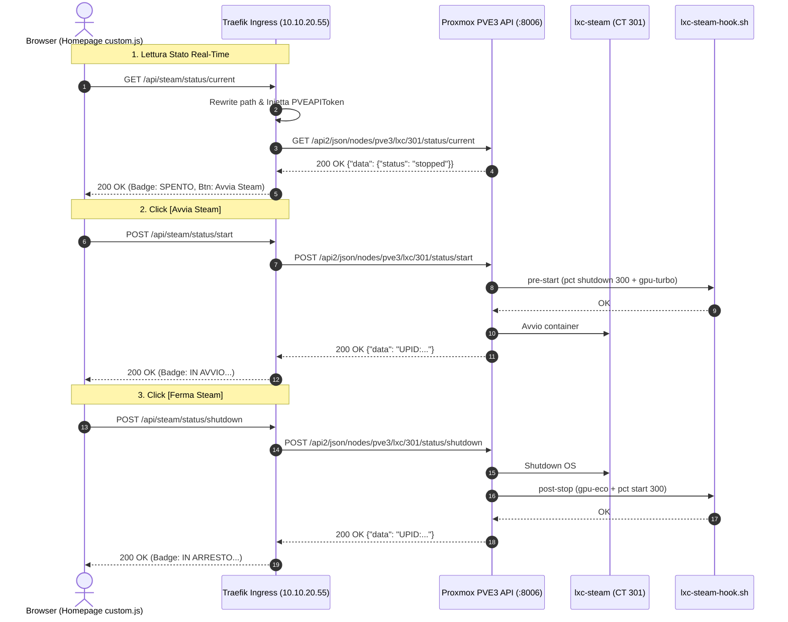

# Piano: Pulsante di Controllo LXC Steam su Tutte le Istanze Homepage via custom.js e API Proxmox Native

Il presente piano definisce l'architettura tecnica e l'implementazione per integrare un pulsante di avvio/arresto del container **`lxc-steam`** (`CT 301` su PVE3 `10.10.10.31`) su **tutte le istanze Homepage** (`home.pindaroli.org`, `home-internal.pindaroli.org`, TrueNAS `10.10.20.50:3000`), sfruttando **esclusivamente le API REST native di Proxmox VE** senza installare alcun daemon o script custom su PVE3.

---

## 🎯 Obiettivi e Scelte Architetturali

1. **API Native Proxmox (Zero Debito Tecnico su PVE3)**:
   - Nessun servizio systemd, nessun socket server Python su PVE3.
   - PVE3 espone già `pveproxy` sulla porta 8006 con endpoint standard:
     - `GET /api2/json/nodes/pve3/lxc/301/status/current`
     - `POST /api2/json/nodes/pve3/lxc/301/status/start`
     - `POST /api2/json/nodes/pve3/lxc/301/status/shutdown`
2. **Sicurezza & Least Privilege (Token ACL circoscritto)**:
   - Creazione su Proxmox di un utente e token dedicato: `steam-ui@pve!btn`.
   - Ruolo `SteamOperator` limitato a `VM.PowerMgmt` e `VM.Audit`.
   - ACL assegnata **esclusivamente su `/vms/301`** (nessun accesso a nodi, storage o altre VM/CT).
3. **Traefik Reverse Proxy & Secret Injection**:
   - Traefik espone il path `/api/steam/` su `home-internal.pindaroli.org` (e `home.pindaroli.org`).
   - Traefik applica il middleware `ReplacePathRegex` per riscrivere `/api/steam/(.*)` verso `/api2/json/nodes/pve3/lxc/301/$1`.
   - Traefik inietta l'header `Authorization: PVEAPIToken=...`: **nessun token o credenziale è esposto nel codice JavaScript del browser**.
   - Traefik applica gli header CORS (`Access-Control-Allow-Origin: *`) per permettere chiamate anche dalla Homepage di TrueNAS (`10.10.20.50:3000`).
4. **Piena Convergenza con gli Hookscript Esistenti**:
   - L'avvio via API Proxmox innesca automaticamente `lxc-steam-hook.sh`:
     - Su `pre-start`: spegnimento `lxc-ollama` (CT 300) e GPU a 2900 MHz (`gpu-turbo`).
     - Su `post-stop`: ripristino GPU a 600 MHz (`gpu-eco`) e riavvio `lxc-ollama` (CT 300).

---

## 🏗️ Schema di Flusso



---

## 📋 FASI OPERATIVE & PROTOCOLLO TEST-DRIVEN

### 🔑 FASE 1: Creazione Token con Privilegi Minimi su PVE3 [COMPLETATA ✅]

#### Azioni
1. [x] Connettersi via SSH su PVE3 (`10.10.10.31`) e verificare esistenza del container CT 301.
2. [x] Creare il ruolo custom `SteamOperator` con i soli privilegi `VM.PowerMgmt` e `VM.Audit`.
3. [x] Creare l'utente di servizio dedicato `steam-ui@pve`.
4. [x] Assegnare l'ACL del ruolo esclusivamente all'oggetto `/vms/301`.
5. [x] Generare il token API per l'utente (`steam-ui@pve!btn`).

#### Test di Verifica
1. [x] Query su CT 301 con token API: HTTP 200 con `status: running`.
2. [x] Query su CT 300 con token API: HTTP 403 Forbidden (privilegi minimi verificati).

---

### ☸️ FASE 2: Configurazione Routing Traefik in Kubernetes [COMPLETATA ✅]

#### Azioni
1. [x] Service & EndpointSlice `proxmox-pve3` (`10.10.10.31:8006`).
2. [x] Middleware `steam-api-rewrite` (`^/api/steam/(.*)` -> `/api2/json/nodes/pve3/lxc/301/$1`).
3. [x] Middleware `steam-api-headers` con header `Authorization: PVEAPIToken=...` e CORS `*`.
4. [x] IngressRoute su `home-internal.pindaroli.org` e `home.pindaroli.org` (OAuth2 sull'esterno).
5. [x] Apply su Kubernetes.

#### Test di Verifica
1. [x] Query Traefik `https://home-internal.pindaroli.org/api/steam/status/current` senza token client: HTTP 200 JSON OK.

---

### 🎨 FASE 3: Implementazione `custom.js` e `custom.css` (Tutte le Homepage) [COMPLETATA ✅]

#### Azioni
1. [x] Riprogettazione interfaccia in formato "pillola" compatta glassmorphism nell'angolo in basso a destra della card (`right: 8px; bottom: 6px; z-index: 30`).
2. [x] Risoluzione bug selettore: aggancio al contenitore intero della casella (`link.closest('.service-card')`) anziché al micro-riquadro dell'icona (48x48 px), eliminando la sovrapposizione con il logo Steam.
3. [x] Distribuzione del codice atomica su `homepage/homepage.yaml`, `homepage/homepage-local.yaml` e TrueNAS Docker `/mnt/stripe/truenas-docker/homepage/`.
4. [x] Apply e rollout restart dei deployment `homepage` e `homepage-local` nel namespace `default`.

#### Test di Verifica
1. [x] Verifica caricamento `custom.js` e `custom.css` con curl su `home-internal.pindaroli.org`: HTTP 200 con selettore `.service-card` e coordinate `right: 8px; bottom: 6px`.
2. [x] Verifica file su host TrueNAS: sincronizzati e corrispondenti al cluster.

---

### 🎮 FASE 4: Collaudo End-to-End e Test di Alternanza [COMPLETATA ✅]

#### Azioni
1. [x] **Verifica Layout e Posizionamento**: Controllo su Homepage (`home-internal.pindaroli.org`, `home.pindaroli.org` e TrueNAS `10.10.20.50:3000`) che la pillola risieda esattamente in basso a destra nella casella Steam Host (`.service-card`) senza alterare l'icona o i testi.
2. [x] **Metafora UX ad Azione Diretta**: Pulsante verde con etichetta `Spegni` quando online; pulsante rosso con etichetta `Avvia` quando spento; nessuno swap di etichette/colori disorientante su hover.
3. [x] **Test Avvio da Pulsante**: Avvio `lxc-steam` via API Proxmox (con arresto automatico di Ollama).
4. [x] **Test Arresto da Pulsante**: Spegnimento `lxc-steam` (con riavvio automatico di Ollama).

---

### 📚 FASE 5: Consolidamento Documentale & Chiusura [COMPLETATA ✅]

#### Azioni
1. [x] Aggiornare l'entità [[Homepage]] (`wiki/entities/Homepage.md`).
2. [x] Includere il piano in `GEMINI.md`.
3. [x] Sincronizzare `todo.md` con il completamento dei task.
4. [x] Eseguire validazione rete e compilazione contesto Wiki:
   ```bash
   python3 scripts/network/validate_network.py && python3 scripts/wiki/build_wiki_context.py
   ```
5. [x] Commit Git delle modifiche con messaggio convenzionale.

---

## 💾 Stato di Ripristino (AI Save-State)
- **Fase Attiva**: Piano Completato con Successo ✅
- **Ultima Azione Completata**: Consolidamento documentale, validazione rete, rigenerazione contesto wiki e commit Git.
- **Prossimo Passo Operativo**: Nessuno. Piano concluso e archiviato.
- **Blocchi/Decisioni Pendenti**: Nessuno.
