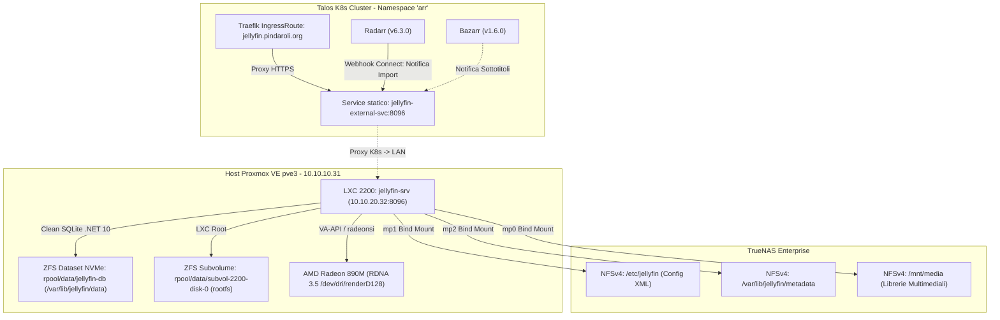

# Piano: Jellyfin 12.0 Clean Slate su Proxmox VE (RDNA 3.5 & Storage Ibrido NFS)

> [!NOTE]
> **Stato**: 🟢 **COMPLETATO CON SUCCESSO (2026-09-12)**
> **Decisione Operativa**: **Opzione A (Rifacimento Ex-Novo / Clean Slate)**.
> A seguito dell'audit dell'infrastruttura reale (assenza di Jellyseerr, Sonarr e Readarr; assenza totale di client Apple TV, Infuse e Smart TV), la strategia di ripartenza da zero ha eliminato radicalmente qualsiasi debito tecnico di schema SQLite, lock DDL o tabelle orfane da Jellyfin 10.x. Tutte le fasi (backup atomico ZFS, upgrade a 12.0 e jellyfin-ffmpeg8, validazione GPU RDNA 3.5, setup wizard, scansione librerie, riconnessione Radarr e monitoraggio Homepage) sono state convalidate con successo.

---

## 1. Architettura As-Is vs To-Be



### Parametri Chiave dell'Infrastruttura
- **Nodo Host Proxmox**: `pve3` (IP `10.10.10.31`), Proxmox VE 9.2, kernel `7.0.x-pve`.
- **Container LXC**: ID `2200` (`jellyfin-srv`), IP statico `10.10.20.32/24` (VLAN 20 `vmbr20`), SO Ubuntu 24.04 LTS (`noble`).
- **Storage Database**: Dataset locale ZFS NVMe `rpool/data/jellyfin-db` montato su `/var/lib/jellyfin/data`.
- **Storage Condiviso NFS**: TrueNAS Enterprise per `/etc/jellyfin` (`mp1`), `/var/lib/jellyfin/metadata` (`mp2`) e `/mnt/media` (`mp0`).
- **Hardware GPU**: APU AMD Strix Point con iGPU Radeon 890M (`gfx1150`, RDNA 3.5, VCN 5.0), driver Gallium `radeonsi`, Mesa 25.2.8, libva 2.12.0 / VA-API 1.20 via `/dev/dri/renderD128`.
- **Ingress K8s**: Traefik IngressRoute `jellyfin-external` con TLS Wildcard ed Endpoint `jellyfin-external-svc` (`10.10.20.32:8096`).
- **Stack Servarr Connesso**: Solo **Radarr** (`servarr-radarr`) riceve notifiche Connect per l'aggiornamento della libreria film.

---

## 2. Runbook Operativo di Produzione (Opzione A - Clean Slate)

### FASE 1: Backup di Sicurezza, Arresto e Snapshot ZFS

#### Passo 1.1: Arresto del servizio Jellyfin corrente (LXC 2200)
Arresta il demone Jellyfin 10.11 e libera tutti i lock sui file:
```bash
systemctl stop jellyfin
```
```bash
killall -9 jellyfin jellyfin-ffmpeg ffmpeg 2>/dev/null || true
```
*Verifica*:
```bash
systemctl is-active jellyfin || echo "Jellyfin arrestato con successo."
```

#### Passo 1.2: Generazione Snapshot ZFS di Sicurezza Pre-Aggiornamento (Host `pve3`)
Anche se procediamo con l'installazione pulita, eseguiamo snapshot atomici su `pve3` per garantire la reversibilità istantanea verso lo stato 10.11:
```bash
SNAPSHOT_TAG="pre-jellyfin12-clean-$(date +%Y%m%d-%H%M%S)"
```
```bash
zfs snapshot rpool/data/jellyfin-db@${SNAPSHOT_TAG}
```
```bash
zfs snapshot rpool/data/subvol-2200-disk-0@${SNAPSHOT_TAG}
```
*Verifica*:
```bash
zfs list -t snapshot | grep "${SNAPSHOT_TAG}"
```

#### Passo 1.3: Archiviazione e Reset della Cartella Dati SQLite (LXC 2200)
Poiché `/var/lib/jellyfin/data` è il mountpoint ZFS `mp3` (`rpool/data/jellyfin-db`), creiamo una cartella di archivio al suo interno e vi spostiamo tutti i file/tabelle della versione 10.11:
```bash
mkdir -p /var/lib/jellyfin/data/archive_v10_backup
```
```bash
find /var/lib/jellyfin/data -maxdepth 1 ! -name 'data' ! -name 'archive_v10_backup' ! -name '.' ! -name '..' -exec mv {} /var/lib/jellyfin/data/archive_v10_backup/ \;
```
```bash
chown -R jellyfin:jellyfin /var/lib/jellyfin/data
```
```bash
chmod 755 /var/lib/jellyfin/data
```
*Verifica*:
```bash
ls -la /var/lib/jellyfin/data
```

#### Passo 1.4: Messa in Sicurezza Configurazioni NFS `/etc/jellyfin` e Quarantena Plugin (LXC 2200)
Crea un tarball locale delle configurazioni XML attuali, archivia i vecchi file di configurazione in una sottodirectory per permettere a Jellyfin 12.0 di avviare il setup wizard pulito ed isola i vecchi plugin:
```bash
mkdir -p /root/pre-upgrade-backup && tar -czvf /root/pre-upgrade-backup/etc-jellyfin-backup-$(date +%F_%H%M%S).tar.gz -C /etc/jellyfin .
```
```bash
mkdir -p /etc/jellyfin/archive_v10_config && find /etc/jellyfin -maxdepth 1 \( -name "*.xml" -o -name "*.json" \) -exec mv {} /etc/jellyfin/archive_v10_config/ \;
```
```bash
if [ -d "/var/lib/jellyfin/plugins" ]; then mv /var/lib/jellyfin/plugins /var/lib/jellyfin/plugins.quarantine && mkdir -p /var/lib/jellyfin/plugins && chown -R jellyfin:jellyfin /var/lib/jellyfin/plugins && chmod 755 /var/lib/jellyfin/plugins; fi
```
*Verifica*:
```bash
ls -lh /root/pre-upgrade-backup/
```
```bash
ls -la /etc/jellyfin
```
```bash
ls -ld /var/lib/jellyfin/plugins.quarantine
```

---

### FASE 2: Aggiornamento Pacchetti Software & Stack jellyfin-ffmpeg8

#### Passo 2.1: Configurazione Repository Ufficiale deb822 (LXC 2200)
Configura la sorgente APT ufficiale di Jellyfin per Ubuntu noble:
```bash
cat << 'EOF' > /etc/apt/sources.list.d/jellyfin.sources
Types: deb
URIs: https://repo.jellyfin.org/ubuntu
Suites: noble
Components: main
Architectures: amd64
Signed-By: /etc/apt/keyrings/jellyfin.gpg
EOF
```
```bash
apt-get update
```
*Verifica*:
```bash
apt-cache policy jellyfin-server
```

#### Passo 2.2: Installazione Jellyfin 12.0 e Switch a `jellyfin-ffmpeg8` (LXC 2200)
Installa il server 12.0 e i binari FFmpeg 8.1:
```bash
apt-get install --no-install-recommends -y jellyfin-server jellyfin-web jellyfin jellyfin-ffmpeg8
```
*Verifica*:
```bash
dpkg -l | grep -E "jellyfin|ffmpeg"
```

---

### FASE 3: Primo Avvio Pulito & Validazione Accelerazione GPU

#### Passo 3.1: Avvio del Servizio Jellyfin 12.0 (LXC 2200)
Avvia il demone che genererà automaticamente il database SQLite nativo pulito EF Core .NET 10:
```bash
systemctl start jellyfin
```
*Verifica*:
```bash
systemctl is-active jellyfin
```
```bash
journalctl -u jellyfin -n 50 --no-pager
```

#### Passo 3.2: Validazione Hardware Transcodifica AMD Radeon 890M (LXC 2200)
Verifica l'esposizione corretta dei profili VA-API ed esegue i test di codifica HEVC 10-bit e AV1:
```bash
/usr/lib/jellyfin-ffmpeg/vainfo --display drm --device /dev/dri/renderD128
```
```bash
/usr/lib/jellyfin-ffmpeg/ffmpeg -v error -hwaccel vaapi -hwaccel_device /dev/dri/renderD128 -hwaccel_output_format vaapi -f lavfi -i testsrc=size=3840x2160:rate=60 -c:v hevc_vaapi -profile:v main10 -b:v 20M -frames:v 300 -f null - && echo "Test HEVC 10-bit VA-API: SUPERATO"
```
```bash
/usr/lib/jellyfin-ffmpeg/ffmpeg -v error -hwaccel vaapi -hwaccel_device /dev/dri/renderD128 -hwaccel_output_format vaapi -f lavfi -i testsrc=size=1920x1080:rate=30 -c:v av1_vaapi -b:v 5M -frames:v 300 -f null - && echo "Test AV1 VA-API: SUPERATO"
```
*Verifica*: Entrambi i comandi terminano con `SUPERATO`.

---

### FASE 4: Setup Guidato Iniziale & Riconnessione Radarr

#### Passo 4.1: Completamento Setup Wizard via WebUI
Accedere da browser web a `https://jellyfin.pindaroli.org` (o `http://10.10.20.32:8096`):
1. **Lingua**: Italiano.
2. **Utente Amministratore**: Impostare username e password.
3. **Librerie**:
   - Film: Cartella `/mnt/media/movies` (Content type: *Movies*).
   - Musica: Cartella `/mnt/media/music` (Content type: *Music*).
4. **Metadati & Immagini**:
   - Salva artwork nelle cartelle dei media: **DISABILITATO** (come da standard homelab).
5. **Transcodifica Hardware** (*Dashboard -> Riproduzione -> Transcodifica*):
   - Accelerazione hardware: **VA-API**.
   - Dispositivo VA-API: `/dev/dri/renderD128`.
   - Abilitare decodifica hardware per H.264, HEVC, HEVC 10-bit, VP9, AV1.
   - Abilitare codifica hardware per H.264, HEVC, AV1.
   - Abilitare Tonemapping VPP.

#### Passo 4.2: Generazione API Key e Aggiornamento Radarr
1. In Jellyfin: *Dashboard -> Avanzate -> Chiavi API* -> Cliccare su **+** e creare una chiave con nome `Radarr`. Copiare il token generato.
2. In Radarr WebUI (`https://radarr.pindaroli.org`):
   - Andare su *Settings -> Connect*.
   - Selezionare o aggiungere la notifica **Jellyfin**.
   - Host: `http://jellyfin-external-svc.arr.svc.cluster.local:8096` (oppure `http://10.10.20.32:8096`).
   - Incollare la nuova **API Key**.
   - Cliccare su **Test** (deve restituire spunta verde) e salvare.

#### Passo 4.3: Verifica Monitoraggio Homepage
Verificare che il widget di Jellyfin nella sezione `ArrServices` di Homepage (`https://homepage.pindaroli.org`) visualizzi il badge verde online via probe HTTP `/health`.

---

### FASE 5: Procedura di Ripristino ZFS di Emergenza (< 2 minuti)
Nel caso remoto in cui si desideri annullare l'operazione e tornare allo stato 10.11 con i dati storici:
1. **Host `pve3`**:
   ```bash
   pct stop 2200
   ```
2. **Host `pve3`**: Rollback snapshot:
   ```bash
   TARGET_SNAP=$(zfs list -t snapshot -H -o name | grep "rpool/data/jellyfin-db@pre-jellyfin12-clean-" | tail -n 1 | cut -d'@' -f2)
   ```
   ```bash
   zfs rollback -r rpool/data/jellyfin-db@${TARGET_SNAP}
   ```
   ```bash
   zfs rollback -r rpool/data/subvol-2200-disk-0@${TARGET_SNAP}
   ```
   ```bash
   pct start 2200
   ```
3. **LXC 2200**: Ripristino tarball configurazione e avvio Jellyfin 10.11:
   ```bash
   systemctl stop jellyfin
   ```
   ```bash
   LATEST_BACKUP=$(ls -t /root/pre-upgrade-backup/etc-jellyfin-backup-*.tar.gz | head -n 1)
   tar -xzvf "$LATEST_BACKUP" -C /etc/jellyfin
   ```
   ```bash
   chown -R jellyfin:jellyfin /etc/jellyfin /var/lib/jellyfin
   ```
   ```bash
   systemctl start jellyfin
   ```

---

## 💾 Stato di Ripristino (AI Save-State)
- **Fase Attiva**: Nessuna (Piano completato con successo)
- **Ultima Azione Completata**: Fase 4 e Fase 5 completate (Setup wizard, librerie indicizzate, transcodifica VA-API Radeon 890M salvata, connessione Radarr verificata con spunta verde su `jellyfin-external-svc:8096`, widget Homepage verificato online `Healthy`)
- **Prossimo Passo Operativo**: Nessuno (Operatività standard)
- **Blocchi/Decisioni Pendenti**: Nessuno
