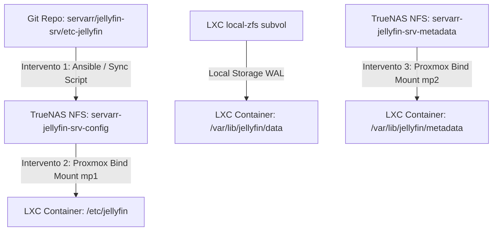

# Piano: Migrazione Storage Ibrido Jellyfin LXC (`jellyfin-srv`)

Questo documento rappresenta lo studio di fattibilità, lo stato corrente (**As-Is**), lo stato desiderato (**To-Be**) e la procedura operativa per la migrazione a caldo delle directory di configurazione del server Jellyfin LXC (`jellyfin-srv`, VM `2200`, IP `10.10.20.32`) su storage NFS condiviso (**TrueNAS ZFS Stripe NVMe**).

---

## Decisioni Architetturali e Compromesso SQLite

> [!IMPORTANT]
> **Il Compromesso su SQLite**:
> La validazione architetturale conferma che posizionare un database SQLite transazionale (`jellyfin.db`) su rete (anche su NFSv4.2 a 10GbE) è altamente instabile a causa dei lock di rete e dell'impossibilità di usare la memoria condivisa (`mmap`) in modalità WAL.
> **La Soluzione Ibrida di Livello Premium**:
> *   **DB locale e transazionale**: La directory `/var/lib/jellyfin/data` (che ospita il database SQLite `jellyfin.db` da 113MB) **rimarrà localmente** sul volume ZFS a stato solido veloce dell'hypervisor (`subvol-2200-disk-0`), garantendo performance massime in modalità WAL ed evitando stalli o eccezioni `SQLITE_BUSY`.
> *   **Metadati su NFS**: Spostiamo su NFS ad alte prestazioni (Stripe NVMe) la directory `/var/lib/jellyfin/metadata` (la cartella con poster, foto attori e biografie che pesa **1.8 GB** su 1.9 GB totali). Si tratta di file statici con sole letture/scritture una tantum, esenti da lock transazionali.
> *   **Configurazione su NFS**: Spostiamo su NFS `/etc/jellyfin` (41 KB di XML di configurazione), in quanto statica e scritta solo a modifiche impostazioni.

---

## 🛠️ Strategia GitOps e Riproducibilità (Infrastruttura come Codice)

Per mantenere l'istanza di Jellyfin completamente riproducibile ed escludere configurazioni manuali a deriva (config drift), viene adottato un approccio **IaC / Git-driven**:

### 1. La Fonte di Verità in Git (Source of Truth)
Creiamo una directory dedicata nel repository locale gestito in Git:
`/Users/olindo/prj/k8s-lab/servarr/jellyfin-srv/etc-jellyfin/`
All'interno di questa directory verranno mantenuti e tracciati tutti i file XML di configurazione stabili e pre-configurati (ripuliti da ID effimeri o segreti dinamici):
*   `network.xml` (Parametri di rete, reverse proxy, binding HTTPS)
*   `system.xml` (Opzioni generali, path delle librerie, configurazioni transcodifiche hardware)
*   `encoding.xml` (Tuning FFmpeg e impostazioni di decodifica GPU)
*   `logging.json` (Filtri per la formattazione dei log)

### 2. Punti di Intervento delle Procedure di Provisioning (Ansible & Sync)
Il provisioning dell'infrastruttura si interfaccerà con la migrazione in tre punti strategici:



*   **Punto di Intervento A (Fase Pre-Boot / Provisioning)**:
    Prima dell'avvio dell'LXC, un playbook Ansible (o uno script locale `sync_jellyfin.sh`) esegue la sincronizzazione speculare (tramite `rsync`) dei file XML da Git direttamente alla cartella NFS montata su macOS o sull'host Proxmox `/mnt/pve/k8s-arr/servarr-jellyfin-srv-config/`.
*   **Punto di Intervento B (Fase Runtime / Container Bind)**:
    L'LXC container, all'avvio, trova le configurazioni XML pre-iniettate montate in sola lettura/scrittura in `/etc/jellyfin` tramite il bind-mount di Proxmox. Qualsiasi modifica effettuata dalla WebUI può essere successivamente "riassorbita" in Git tramite un comando `git diff` o script di pull inverso.
*   **Punto di Intervento C (Fase K8s Helm Migration)**:
    In caso di migrazione in Kubernetes, le configurazioni in Git verranno iniettate come `ConfigMap` native K8s ed i file XML montati come volumi di sola lettura nel Pod Helm, completando la transizione a un modello Cloud-Native puro.

---

## Architettura dei Mountpoint e ID Mapping

### 1. Schema dei Mountpoint dell'LXC `2200`
```conf
# Mountpoint esistente (Media HDD)
mp0: /mnt/pve/truenas-media,mp=/mnt/media

# Nuovi Mountpoint Ibridi su NFS (Stripe NVMe)
mp1: /mnt/pve/k8s-arr/servarr-jellyfin-srv-config,mp=/etc/jellyfin
mp2: /mnt/pve/k8s-arr/servarr-jellyfin-srv-metadata,mp=/var/lib/jellyfin/metadata
```

### 2. ID Mapping Personalizzato (Metodo A - Consigliato)
Per permettere all'utente `jellyfin` (UID/GID `1000` interno all'LXC) di scrivere sulla share NFS con UID `1000` reale dell'host (preservando la portabilità immediata del volume verso Kubernetes senza ricorrere a squashing lato TrueNAS), applicheremo il passthrough degli ID utente a livello Proxmox:
```conf
# Mappa l'intervallo 0-999 su UID 100000+ dell'host per sicurezza
lxc.idmap: u 0 100000 1000
lxc.idmap: g 0 100000 1000

# Passthrough diretto e pulito per l'utente jellyfin (1000)
lxc.idmap: u 1000 1000 1
lxc.idmap: g 1000 1000 1

# Mappa l'intervallo rimanente 1001-65535 su UID 101001+
lxc.idmap: u 1001 101001 64535
lxc.idmap: g 1001 101001 64535
```

### 3. Esclusione Caching Hardware (Systemd Override)
Le cache GPU temporanee ed hardware-dipendenti saranno escluse tramite l'override di Systemd per bloccare micro-scritture sincrone continue su rete:
```ini
[Service]
Environment=XDG_CACHE_HOME=/var/cache/jellyfin
```

---

## Procedura Operativa di Dettaglio

### Fase 1: Creazione Cartelle su TrueNAS (via Mac Studio)
Dal tuo terminale locale Mac Studio:
```bash
# Creazione cartelle su share Stripe NVMe
mkdir -p /Volumes/k8s-arr-1/servarr-jellyfin-srv-config
mkdir -p /Volumes/k8s-arr-1/servarr-jellyfin-srv-metadata

# Impostazione permessi corretti per UID/GID 1000
chown -R 1000:1000 /Volumes/k8s-arr-1/servarr-jellyfin-srv-*
chmod -R 775 /Volumes/k8s-arr-1/servarr-jellyfin-srv-*
```

### Fase 2: Configurazione dello Storage NFS su Proxmox
Se non già eseguito, aggiungeremo la share NFS `k8s-arr` in `/etc/pve/storage.cfg` via SSH su `pve1`:
```conf
nfs: k8s-arr
	export /mnt/stripe/k8s-arr
	path /mnt/pve/k8s-arr
	server 10.10.10.50
	content images
	options vers=4.2
	nodes pve,pve2,pve3
```

### Fase 3: Spegnimento Container e Iniezione Iniziale Config da Git
1. SSH su `pve1` e spegnimento controllato di Jellyfin nell'LXC `2200`:
   ```bash
   ssh -o StrictHostKeyChecking=no root@10.10.10.31 "pct exec 2200 -- systemctl stop jellyfin"
   ```
2. Dal nodo `pve3` (NFS `k8s-arr` montato), copiamo a freddo le sole cartelle migrate preservando permessi e timestamp:
   ```bash
   # Sincronizza i metadati statici (1.8 GB)
   cp -a /var/lib/lxc/2200/rootfs/var/lib/jellyfin/metadata/. /mnt/pve/k8s-arr/servarr-jellyfin-srv-metadata/
   ```
3. **Punto di Iniezione Provisioning (IaC da Git)**:
   Invece di copiare i vecchi file di configurazione dall'LXC, creiamo la directory Git nel nostro repository e vi copiamo i file correnti stabili per congelarli in Git history. Dopodiché, eseguiamo l'iniezione dichiarativa da Git a NFS:
   ```bash
   # 1. Creiamo la directory Git sul nostro Mac Studio
   mkdir -p /Users/olindo/prj/k8s-lab/servarr/jellyfin-srv/etc-jellyfin

   # 2. Copiamo i file XML correnti stabili nella directory Git per metterli sotto controllo versione
   cp -a /Volumes/k8s-arr-1/servarr-jellyfin-classic-config/*.xml /Users/olindo/prj/k8s-lab/servarr/jellyfin-srv/etc-jellyfin/

   # 3. Sincronizziamo dichiarativamente da Git alla nuova share NFS di configurazione
   rsync -avz --delete /Users/olindo/prj/k8s-lab/servarr/jellyfin-srv/etc-jellyfin/ /Volumes/k8s-arr-1/servarr-jellyfin-srv-config/
   ```

### Fase 4: Applicazione ID Mapping e Configurazione Systemd
1.  **Autorizzazione UID/GID su Proxmox Host `pve3`**:
    Accedere via SSH a `pve3` (passando per `pve1`) e aggiungere l'autorizzazione di delega ID per root nei file di configurazione dell'host:
    ```bash
    ssh -o StrictHostKeyChecking=no root@10.10.10.31 "echo 'root:1000:1' >> /etc/subuid"
    ssh -o StrictHostKeyChecking=no root@10.10.10.31 "echo 'root:1000:1' >> /etc/subgid"
    ```
2.  **Configurazione Mountpoint e ID Mapping in `2200.conf`**:
    Editare `/etc/pve/lxc/2200.conf` su `pve3` per inserire i blocchi di `lxc.idmap` e i due mountpoint `mp1` e `mp2`:
    ```conf
    lxc.idmap: u 0 100000 1000
    lxc.idmap: g 0 100000 1000
    lxc.idmap: u 1000 1000 1
    lxc.idmap: g 1000 1000 1
    lxc.idmap: u 1001 101001 64535
    lxc.idmap: g 1001 101001 64535
    mp1: /mnt/pve/k8s-arr/servarr-jellyfin-srv-config,mp=/etc/jellyfin
    mp2: /mnt/pve/k8s-arr/servarr-jellyfin-srv-metadata,mp=/var/lib/jellyfin/metadata
    ```
3.  **Tuning Caching in Systemd (LXC Container)**:
    Iniettare l'override per deviare la cache temporanea su locale ed eseguire il reload dei daemon:
    ```bash
    ssh -o StrictHostKeyChecking=no root@10.10.10.31 "pct exec 2200 -- mkdir -p /etc/systemd/system/jellyfin.service.d"
    ssh -o StrictHostKeyChecking=no root@10.10.10.31 "pct exec 2200 -- sh -c 'echo \"[Service]\nEnvironment=XDG_CACHE_HOME=/var/cache/jellyfin\" > /etc/systemd/system/jellyfin.service.d/override.conf'"
    ssh -o StrictHostKeyChecking=no root@10.10.10.31 "pct exec 2200 -- systemctl daemon-reload"
    ```
4.  **Pulizia Metadati Locali & Ripristino Permessi Locali**:
    Prima di avviare, puliamo la vecchia cartella dei metadati locali nell'LXC per liberare spazio sul disco dell'hypervisor e assicuriamoci che la cartella data locale mantenga i permessi corretti dopo la modifica dell'ID mapping:
    ```bash
    # Rimuove i metadati locali migrati su NFS
    ssh -o StrictHostKeyChecking=no root@10.10.10.31 "rm -rf /var/lib/lxc/2200/rootfs/var/lib/jellyfin/metadata/*"
    # Ripristina la titolarità per l'UID 1000 reale sull'host per i restanti file locali (es. jellyfin.db)
    ssh -o StrictHostKeyChecking=no root@10.10.10.31 "chown -R 1000:1000 /var/lib/lxc/2200/rootfs/var/lib/jellyfin"
    ```
5.  **Riavvio e Start**:
    ```bash
    ssh -o StrictHostKeyChecking=no root@10.10.10.31 "pct shutdown 2200 && pct start 2200"
    ```

### Fase 5: Allineamento Fonte di Verità (`storage.json`)
Aggiorneremo il file `storage.json` del repository inserendo la nuova architettura ibrida e documentando la suddivisione delle share NFS (`servarr-jellyfin-srv-config` e `servarr-jellyfin-srv-metadata`).

---

## Verification Plan

### Verifiche Post-Migrazione
*   **Verifica Mount Ibridi**:
    ```bash
    ssh -o StrictHostKeyChecking=no root@10.10.10.31 "pct exec 2200 -- df -h | grep -E 'jellyfin|media'"
    ```
    *Dovrà mostrare `/etc/jellyfin` e `/var/lib/jellyfin/metadata` montati su NFS, mentre `/var/lib/jellyfin` rimarrà locale.*
*   **Verifica Permessi ID Mapping**:
    ```bash
    ssh -o StrictHostKeyChecking=no root@10.10.10.31 "pct exec 2200 -- ls -la /var/lib/jellyfin/data/jellyfin.db"
    ```
    *Il database SQLite locale dovrà essere leggibile/scrivibile dall'utente jellyfin (UID 1000).*
*   **Verifica Cache Redirect**:
    ```bash
    ssh -o StrictHostKeyChecking=no root@10.10.10.31 "pct exec 2200 -- ls -la /var/cache/jellyfin/"
    ```
    *La cache GPU (mesa_shader_cache) dovrà essere generata localmente.*
*   **Verifica Funzionamento WebUI**:
    Verifica visiva all'indirizzo `http://10.10.20.32:8096`.

---

## 💾 Stato di Ripristino (AI Save-State)
- **Fase Attiva**: In fase di elaborazione (Proposta Iniziale e Design Ibrido/GitOps terminati).
- **Ultima Azione Completata**: Materializzazione del piano nel Wiki `wiki/plans/jellyfin-srv-storage-migration.md` e allineamento di `todo.md` e `SCHEMA.md` completati con successo.
- **Prossimo Passo Operativo**: Avviare la **Fase 1** (Creazione directory su TrueNAS in `/Volumes/k8s-arr-1/` ed estrazione + iniezione della configurazione XML stabile da Git).
- **Blocchi/Decisioni Pendenti**: In attesa di approvazione per l'inizio dell'esecuzione operativa.
