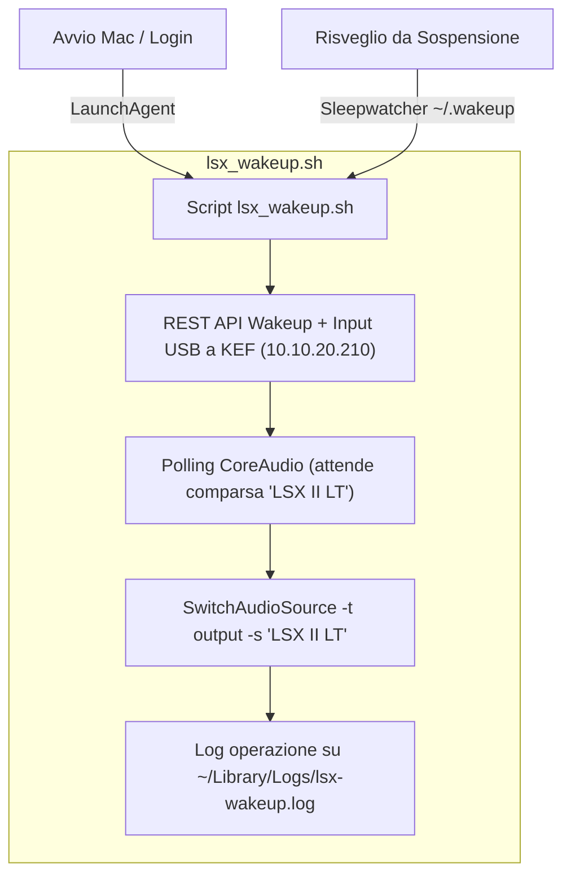

# Piano: Automazione Startup & Wake Casse KEF LSX II LT

> [!NOTE]
> **Stato**: ✅ **CONCLUSO & ARCHIVIATO (2026-09-08)**
> **Obiettivo**: Accendere automaticamente le casse KEF LSX II LT e selezionarle come sorgente audio predefinita del Mac Studio sia al boot/login che all'uscita dalla sospensione/standby (wake-from-sleep), in modo totalmente trasparente per l'utente ("zero-touch").

---

## 1. Architettura Tecnica

### Vincolo USB vs Rete
Lo standard USB Audio Class 2 (UAC2) implementato dalle KEF non supporta comandi software di accensione (`power on`) inviabili via bus USB da parte del sistema operativo. Tuttavia, le casse rimangono in *Network Standby* alimentate sulla LAN:
* **Canale REST API Locale**: Un comando `POST` a `http://10.10.20.210/api/setData` risveglia istantaneamente le casse dallo standby e seleziona l'ingresso fisico `usb`.
* **Canale USB Audio**: Rilevamento dinamico tramite polling su CoreAudio e commutazione con `SwitchAudioSource`.

---

## 2. Componenti Realizzati

1. **Script Operativo (`/Users/olindo/scripts/lsx_wakeup.sh`)**:
   * Esegue la richiesta HTTP POST all'endpoint KEF.
   * Esegue polling fino a 7.5s (step da 0.5s) per attendere l'aggancio del dispositivo USB da parte di macOS.
   * Commuta l'output audio con `/opt/homebrew/bin/SwitchAudioSource -t output -s "LSX II LT"`.
   * Logga gli eventi su `~/Library/Logs/lsx-wakeup.log`.

2. **LaunchAgent Utente (`~/Library/LaunchAgents/org.pindaroli.lsx-startup.plist`)**:
   * Caricato nel subsystem `launchd` utente per l'attivazione automatica al login (`RunAtLoad: true`).

3. **Demone Wake-from-Sleep (`sleepwatcher`)**:
   * Installato tramite Homebrew (`brew install sleepwatcher`).
   * Avviato come servizio in background (`brew services start sleepwatcher`).
   * Hook `~/.wakeup` impostato per richiamare `/Users/olindo/scripts/lsx_wakeup.sh`.

4. **Infrastruttura Rete & DHCP**:
   * Prenotazione statica Kea DHCP creata su OPNsense per MAC `84:17:15:07:a8:28` con IP fisso `10.10.20.210` e hostname `kef-lsx`.
   * Registrato nodo `kef-lsx` nel file canonico `rete.json` sotto VLAN 20.

---

## 3. Risultati dei Test

* **Chiamata REST API**: Risposta KEF `{"value":{"kefPhysicalSource":"usb"...}}` ricevuta con successo.
* **CoreAudio Switch**: Confermato switch su `LSX II LT` verificato tramite `SwitchAudioSource -c`.
* **Launchd Boot Test**: Confermato codice di uscita `0` nel job `org.pindaroli.lsx-startup`.
* **Sleepwatcher Wake Test**: Trigger `~/.wakeup` simulato ed eseguito regolarmente con trace nei log.
* **Sincronizzazione Kea**: Lease verificato attivo tramite API OPNsense Kea.
