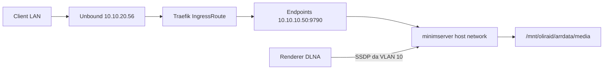

# MinimServer da Kubernetes a Docker su TrueNAS

Spostare MinimServer dal Deployment Kubernetes allo stack Docker Compose già in esecuzione su TrueNAS, conservando indice e profilo, e riallineare Traefik, le homepage e lo spegnimento del pod.

Supera [[minimserver-deployment]].

## Stato di partenza

- Pod `servarr-minimserver` nel namespace `arr`, immagine `minimworld/minimserver:2.2`, `hostNetwork: true` su `talos-cp-02` (`10.10.20.142`). Accanto girava il sidecar `autosymlink` che crea i symlink `.m3u8` sulla libreria.
- Console HTTP `9790` e status `9791`. Il Service era solo ClusterIP (`servarr-minimserver`). Non esisteva un LoadBalancer MetalLB dedicato.
- DNS Unbound: `minimserver.pindaroli.org` e `minimserver-internal.pindaroli.org` sono A record di `10.10.20.56` (VIP Traefik), come Jellyfin. Restano lì: l'OAuth sul nome pubblico resta sul Traefik del cluster.
- IngressRoute in `traefik/all-arr-ingress-routes.yaml`: host pubblico con middleware `oauth2-auth`, host `minimserver` / `minimserver-internal` senza auth.
- Config persistente: NFS `10.10.10.50:/mnt/stripe/k8s-arr/servarr-minimserver` montato su `/opt/minimserver/data`. Libreria in sola lettura (`contentDir = /media/classical`).
- Stack di destinazione: `servarr/truenas-docker/docker-compose.yaml` su `10.10.10.50`. Il compose di failover in `servarr/compose/` è superato da [[servarr-truenas-permanent-migration]] e non va toccato.
- Homepage coinvolte: `homepage/homepage.yaml`, `homepage/homepage-local.yaml`, e la config viva su TrueNAS in `/mnt/stripe/truenas-docker/homepage`.

## Rete DLNA

Il bridge Docker non inoltra SSDP. Il servizio Compose usa `network_mode: host`, come il precedente `hostNetwork`. Gli annunci UPnP escono da `10.10.10.50` (VLAN 10) invece che da `10.10.20.142` (VLAN 20).

## Sequenza

1. **Copia a freddo della config.** Scale a 0 del Deployment. Copia `/mnt/stripe/k8s-arr/servarr-minimserver` in `/mnt/stripe/truenas-docker/minimserver` con owner `1000:1000`. Non rigenerare `default.profile`.
2. **Compose.** In `servarr/truenas-docker/docker-compose.yaml`:
   - `minimserver`: `minimworld/minimserver:2.2`, `network_mode: host`, `JAVA_TOOL_OPTIONS=-Dfile.encoding=UTF-8`, data dir sul nuovo percorso, musica `/mnt/oliraid/arrdata/media` in sola lettura su `/media`.
   - `minimserver-autosymlink`: lo stesso loop Alpine del chart, con `/mnt/oliraid/arrdata/media` scrivibile.
   - Avvio solo dopo la copia. `9790` deve rispondere su `10.10.10.50` con il pod Kubernetes ancora a zero.
3. **Traefik, stesso schema di Jellyfin.** Service ed Endpoints `minimserver-external-svc` verso `10.10.10.50:9790`. L'IngressRoute non punta più a `servarr-minimserver`. I nomi host e l'OAuth sul pubblico non cambiano. Gli A record Unbound e gli alias in `rete.json` restano sul VIP `10.10.20.56`.
4. **Homepage.** `siteMonitor` nelle homepage Kubernetes: `http://minimserver-external-svc.arr.svc.cluster.local:9790`. Gli `href` restano `https://minimserver.pindaroli.org` e `https://minimserver-internal.pindaroli.org`. Apply e rollout di `homepage` e `homepage-local`. Voce sulla homepage TrueNAS verso `http://10.10.10.50:9790`, poi restart del container `homepage`.
5. **Spegnimento Kubernetes.** In `servarr/arr-values.yaml` `minimserver.enabled: false`, poi `helm upgrade` della release `servarr`. I template in `pindaroli-arr-helm` restano.
6. **Wiki.** Questo piano, il link in `GEMINI.md` e il task in `todo.md`.

## Esito (2026-09-25)

- [x] Copia identica del data dir, profilo invariato, owner `1000:1000`.
- [x] Container `minimserver` e `minimserver-autosymlink` avviati. Console su `127.0.0.1:9790` HTTP 200. Log: 4017 file audio, `Startup complete`.
- [x] `https://minimserver-internal.pindaroli.org` HTTP 200. `https://minimserver.pindaroli.org` redirect OAuth.
- [x] Homepage Kubernetes applicate e rollout eseguito. Tile TrueNAS su `http://10.10.10.50:9790`.
- [x] Helm release `servarr` revisione 178, chart `1.10.0` (la `1.10.1` locale non è stata applicata: cambia solo `trigger-job.sh`). Nessun pod `servarr-minimserver`.
- [x] SSDP in ascolto su `239.255.255.250:1900` da Java sull'host TrueNAS.
- [ ] Un renderer in LAN deve ancora confermare di vedere il server sulla VLAN 10.

La directory originale `/mnt/stripe/k8s-arr/servarr-minimserver` è rimasta sul disco (`onDelete: retain` del volume NFS). Il container usa solo la copia in `/mnt/stripe/truenas-docker/minimserver`.
