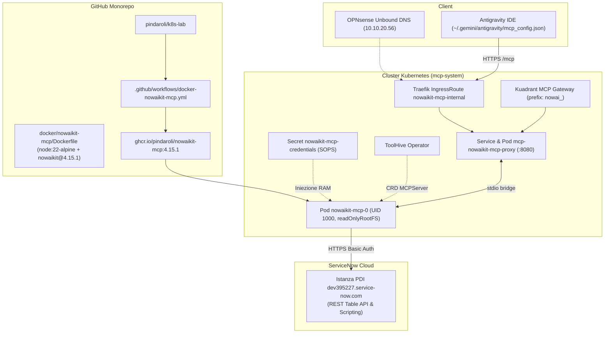

# Piano: Migrazione e Onboarding Kubernetes di NowAIKit MCP Server

Questo piano ha guidato l'onboarding e il deployment su Kubernetes del server MCP ufficiale di ServiceNow (**`nowaikit`**), trasformandolo da processo locale disallineato a microservizio OCI standardizzato e clusterizzato nel namespace `mcp-system`.

Il lavoro è stato condotto secondo la procedura standard dello skill [[k8s-mcp-server-onboarding]] e il pattern [[mcp-registry-package-pattern]].

---

## 🗺️ Mappe Concettuali e Relazioni
- [[MCP_Platform]] (Catalogo server federati e ToolHive Operator in `mcp-system`)
- [[mcp-registry-package-pattern]] (Pattern di packaging basato su registry npm)
- [[mcp-secret-projection-pattern]] (Proiezione in RAM delle credenziali ServiceNow)
- [[Network_Registry]] (Record DNS `nowaikit-mcp-internal.pindaroli.org` su Traefik VIP `10.10.20.56`)
- [[OPNsense]] (Host Override Unbound DNS)

---

## 1. Architettura Implementata

---

## 2. Azioni Operative Eseguite

1. **Packaging Dockerfile**:
   - Creato `docker/nowaikit-mcp/Dockerfile` basato su `node:22-alpine` con versione fissa `nowaikit@4.15.1`, utente non-root `USER node` (UID 1000) ed entrypoint `nowaikit-mcp`.
2. **Workflow GitHub Actions**:
   - Creato `.github/workflows/docker-nowaikit-mcp.yml` con trigger su `docker/nowaikit-mcp/**` e compilazione `linux/amd64` con push su `ghcr.io/pindaroli/nowaikit-mcp:4.15.1`.
   - Pipeline completata con successo in 38s (Run #34305322758).
3. **Segreti SOPS**:
   - Creato `secrets-sops/nowaikit-mcp-credentials.enc.yaml` cifrato con chiave Age.
   - Applicato nel namespace `mcp-system` per proiettare `SERVICENOW_BASIC_PASSWORD` in RAM.
4. **Routing GitOps Helm**:
   - Aggiornato `mcp-gateway/mcp-gateway-values.yaml` aggiungendo il blocco `nowaikit`.
   - Incrementata versione chart in `helm-charts/mcp-gateway/Chart.yaml` a `0.2.10`.
   - Eseguito `helm upgrade mcp-gateway helm-charts/mcp-gateway -f mcp-gateway/mcp-gateway-values.yaml -n mcp-system`.
   - Pod `nowaikit-mcp-0` e proxy `mcp-nowaikit-mcp-proxy` verificati in stato 1/1 Running con 496 tool attivi.
5. **DNS & Rete**:
   - Aggiunto alias `nowaikit-mcp-internal` in `rete.json` sotto `traefik-lb` (`10.10.20.56`).
   - Creato Host Override in OPNsense Unbound DNS via API REST.
   - Validata congruenza di rete al 100% con `validate_network.py`.
6. **Client Antigravity**:
   - Aggiornato `~/.gemini/antigravity/mcp_config.json` puntando all'endpoint LAN `https://nowaikit-mcp-internal.pindaroli.org/mcp`.

---

## 3. Risultati della Validazione
* **Handshake JSON-RPC**: `initialize` risponde con protocolVersion `2025-11-25` e serverInfo `{"name":"nowaikit","version":"4.15.1"}`.
* **Tool Discovery**: 496 tool esposti correttamente su `stdio` e instradati su HTTP/SSE.
* **Stato Sicurezza**: Esecuzione unprivileged con utente UID 1000 e filesystem read-only; permessi di scrittura e CMDB write disabilitati di default.

---

## 💾 Stato di Ripristino (AI Save-State)
- **Fase Attiva**: Chiusura / Archiviazione
- **Ultima Azione Completata**: Validazione test-driven end-to-end e documentazione wiki completata.
- **Prossimo Passo Operativo**: Nessuno, migrazione completata con successo.
- **Blocchi/Decisioni Pendenti**: Nessuno.
