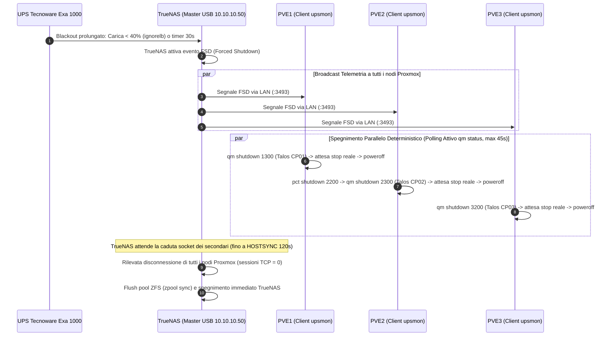

# Piano: Architettura UPS NUT Distribuita (TrueNAS Master & Proxmox PVE1/2/3 Client)

**Target**: TrueNAS SCALE Bare Metal & Proxmox Cluster (PVE1, PVE2, PVE3) · **Data**: 2026-09-10  
**Autore**: Antigravity AI Engineering

> [!IMPORTANT]
> Questo piano definisce l'architettura distribuita di alimentazione di emergenza per l'homelab GEMINI:
> - **TrueNAS SCALE Bare Metal** (`10.10.10.50`), con cavo USB attestato fisicamente, opera come **NUT Master**.
> - **PVE1, PVE2 e PVE3** operano in parallelo come **NUT Client (Slave)** indipendenti, spegnendo contemporaneamente le proprie VM locali (Talos CP01, CP02, CP03).
> - **Soglia di Batteria Cautelativa Software**: Impostazione di `ignorelb` e `override.battery.charge.low = 40` su TrueNAS, ignorando la soglia hardware critica (10.40V) e scatenando `FSD` al 40% di carica residua.
> - **Sincronizzazione Deterministica Nativa**: `HOSTSYNC 120` su TrueNAS (monitoraggio socket client su porta 3493) e **ciclo di polling attivo `qm status`** (timeout max 45s) sui nodi Proxmox. TrueNAS spegne se stesso non appena tutti i client si disconnettono (tipicamente in 25-35s), con un massimale di sicurezza garantito di 120s.
> - **PVE1** bonificato da tutti i residui del vecchio ruolo Master (driver in errore, demone upsd locale e regole udev).

---

## 1. Architettura di Spegnimento Coordinato



---

## 2. Analisi Energetica e Parametri Operativi

### 2.1 Sovrascrittura Soglia Hardware (`ignorelb` + `battery.charge.low = 40`)
- **Problema**: Il firmware dell'UPS Tecnoware Exa 1000 invia il flag hardware `LB` (Low Battery) solo a `10.40V` (`battery.voltage.low`). A 10.40V una batteria al piombo 12V è chimicamente esausta (0-5% di carica), causando un crollo verticale della tensione in meno di un minuto e rendendo inefficace qualsiasi grazia di spegnimento.
- **Risoluzione NUT**:
  - `ignorelb`: ordina al driver `nutdrv_qx` di ignorare il flag hardware low-battery.
  - `override.battery.charge.low = 40`: imposta via software la soglia a `40%`.
  - **Risultato collaudato live**: `upsc ups@localhost` restituisce `driver.flag.ignorelb: enabled` e `battery.charge.low: 40`. L'evento `LOWBATT` scatta con largo anticipo garantendo autonomia utile durante tutta la fase di arresto.

### 2.2 Sincronizzazione Master-Slave (`HOSTSYNC 120`)
- Il monitoraggio dei client secondari su TrueNAS avviene tramite le connessioni TCP aperte su `upsd:3493`.
- `HOSTSYNC 120` non è un ritardo forzato: se i client si spengono in 25 secondi, TrueNAS avvia subito lo shutdown al secondo 26.
- Qualora un nodo Proxmox subisca un rallentamento nell'I/O storage o un blocco durante lo spegnimento di una VM, TrueNAS concede un margine fino a 120 secondi prima di procedere forzatamente allo spegnimento.
- Con la soglia della batteria al 40%, il consumo di 120 secondi ai carichi del lab (~80-120W) consuma solo una frazione minima della riserva residua.

### 2.3 Polling Attivo su Proxmox (`qm status` vs `sleep 30`)
- Il precedente approccio con `sleep 30` era cieco: non verificava se Talos si fosse realmente spento prima di lanciare `poweroff`, né velocizzava la chiusura se Talos si spegneva in anticipo.
- Il nuovo script implementa un loop di verifica su `qm status` ogni 2s con timeout a 45s:
  - Se Talos si spegne in 10s, Proxmox si arresta immediatamente.
  - Se Talos subisce ritardi, attende fino a 45s forzando poi lo stop pulito. In entrambi i casi il nodo si spegne ben prima dello scadere dei 120s del master.

---

## 3. Fasi Operative e Dettaglio Tecnico

### Fase 1: Bonifica Totale di PVE1 (Completata ✅)
- Stop e disabilitazione di `nut-server.service` e `nut-driver@ups.service`.
- Rimozione regola udev `/etc/udev/rules.d/99-nut-ups.rules` e ricaricamento regole.
- Neutralizzazione dei file di configurazione server (`ups.conf`, `upsd.conf`, `upsd.users`).
- Pulizia dei file PID orfani in `/run/nut/`.
- Rimozione del pacchetto `nut-server` (mantenendo solo `nut-client`).
- Configurazione `/etc/nut/nut.conf` con `MODE=netclient`.

### Fase 2: Configurazione TrueNAS Master (Collaudata a Caldo ✅)
- Configurazione tramite API middleware TrueNAS (`midclt call ups.update`):
  - `mode: MASTER`
  - `identifier: ups`
  - `driver: nutdrv_qx$(Various USB)`
  - `port: auto`
  - `options: "vendorid = 0665\nproductid = 5161\nignorelb\noverride.battery.charge.low = 40\n"`
  - `rmonitor: true` su porta `3493`
  - `extrausers: [pvemon]\n  password = {{ vault_ups_mon_password }}\n  upsmon slave\n`
  - `shutdown: BATT`
  - `shutdowntimer: 30`
  - `hostsync: 120`
  - `powerdown: false`
- Servizio `ups` attivo e verificato su TrueNAS (`upsc ups@localhost`).

### Fase 3: Rollout Distribuito Client su PVE1, PVE2, PVE3
- Installazione di `nut-client` su tutti e tre i nodi Proxmox via Ansible.
- Configurazione unificata di `/etc/nut/nut.conf` (`MODE=netclient`) e `/etc/nut/upsmon.conf`:
  - `MONITOR ups@10.10.10.50 1 pvemon {{ vault_ups_mon_password }} slave`
  - `SHUTDOWNCMD "/etc/nut/shutdown_sequence.sh"`
  - `MINSUPPLIES 1`
- Distribuzione dello script atomico locale con ciclo attivo `/etc/nut/shutdown_sequence.sh`:
  ```bash
  #!/bin/bash
  echo "[$(date)] Blackout / LOWBATT rilevato da TrueNAS! Avvio spegnimento locale..."

  
  echo "[$(date)] Spegnimento pulito Talos VM {{ talos_vmid }}..."
  qm shutdown {{ talos_vmid }} || true
  TIMEOUT=45; COUNT=0
  while qm status {{ talos_vmid }} 2>/dev/null | grep -q "status: running"; do
      sleep 2; COUNT=$((COUNT+2))
      if [ $COUNT -ge $TIMEOUT ]; then 
          echo "[$(date)] Timeout superato, forzatura stop..."
          qm stop {{ talos_vmid }} || true
          break
      fi
  done
  

  
  echo "[$(date)] Spegnimento carichi ausiliari LXC..."
  pct shutdown 2200 || true
  

  echo "[$(date)] Spegnimento del nodo host {{ inventory_hostname }}..."
  poweroff
  ```
- Riavvio ed abilitazione `systemctl enable --now nut-client` su PVE1, PVE2 e PVE3.

---

## 4. Piano di Verifica Test-Driven
1. `upsc ups@10.10.10.50` eseguito da PVE1, PVE2 e PVE3 (verifica lettura telemetria e soglia low battery al 40%).
2. Verifica assenza allarmi o errori nei log `journalctl -u nut-client` su tutti i nodi.
3. Verifica stato TrueNAS: `midclt call ups.config` per confermare la persistenza di `hostsync: 120` e `ignorelb`.

---

## 💾 Stato di Ripristino (AI Save-State)
- **Fase Attiva**: Completato con Successo ✅
- **Ultima Azione Completata**: Rollout completato via Ansible su TrueNAS Master (`HOSTSYNC 120`, `ignorelb`, soglia 40%) e Proxmox Cluster (PVE1, PVE2, PVE3) con ciclo attivo di polling `qm status` (max 45s); validazione live della telemetria superata al 100% su tutti i nodi.
- **Prossimo Passo Operativo**: Nessuno (orchestrazione pienamente operativa e documentata)
- **Blocchi/Decisioni Pendenti**: Nessuno
