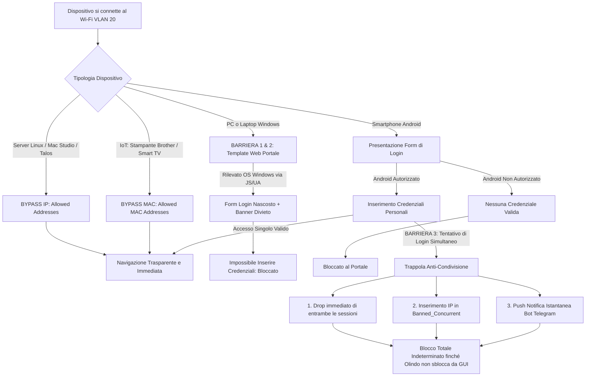

# Piano: Captive Portal con Rilevamento Windows (Livello 1), Anti-Sharing e Allarme Telegram

Questo piano descrive l'implementazione del **Captive Portal nativo di OPNsense** per il filtraggio selettivo della rete Wi-Fi/LAN client (VLAN 20), integrando il **Rilevamento Windows (Livello 1 - Browser & Client Hints)** nel template web, la protezione **Anti-Sharing con blocco a tempo indeterminato e allarme Telegram**, e il **bypass automatico per server Linux, Mac Studio e apparati IoT**.

Questa soluzione **sostituisce integralmente Zenarmor**, eliminando l'installazione di pacchetti terze parti, azzerando l'impatto su CPU e RAM (8 GB) del Mini PC firewall (**Intel Celeron J4125**) e garantendo massima stabilità e zero manutenzione.

---

## 1. Obiettivi e Architettura di Difesa

1. **Barriera 1 (Nessuna Credenziale per Windows)**:
   - Su OPNsense esistono solo gli account individuali degli utenti Android autorizzati.
   - I PC e laptop Windows non hanno credenziali valide per superare il Captive Portal.
2. **Barriera 2 (Livello 1 — Rilevamento OS a Video)**:
   - Il template personalizzato del Captive Portal analizza l'identità del sistema operativo (`User-Agent` e `Client Hints`).
   - Se il dispositivo è Windows, lo script **nasconde completamente il modulo di login** e mostra un banner rosso di divieto: l'utente Windows non ha nemmeno la casella dove inserire un'eventuale password "rubata".
3. **Barriera 3 (Trappola Anti-Condivisione & Allarme Telegram)**:
   - Se un account viene usato contemporaneamente su due dispositivi, entrambe le sessioni cadono all'istante, gli IP finiscono nella tabella firewall permanente `Banned_Concurrent` (blocco totale WAN a tempo indeterminato) e parte un allarme istantaneo via Telegram bot all'amministratore (`chat_id=554585346`). Lo sblocco avviene solo manualmente da WebGUI OPNsense.
4. **Bypass Trasparente per Linux e IoT**:
   - I server (VLAN 10), i nodi Talos K8s e il Mac Studio navigano direttamente senza portale via IP (`Allowed Addresses`).
   - La stampante Brother e i dispositivi domotici navigano direttamente via MAC address hardware fisso (`Allowed MAC Addresses`).
5. **Zero Impatto Hardware**:
   - 100% nativo OPNsense (FreeBSD `ipfw` / `pf`), nessun demone aggiuntivo o database pesante, CPU del J4125 a riposo e RAM libera per ZFS ARC.

---

## 2. Flusso Operativo della Difesa

---

## 3. Fasi Operative

### Fase 0: Backup Preventivo e Verifica Risorse (Pre-Flight)
* **Azione 0.1**: Download del backup XML corrente (`config.xml`) da Web GUI (**System $\rightarrow$ Configuration $\rightarrow$ Backups**).
* **Azione 0.2**: Ispezione memoria e carico CPU iniziale sul Mini PC J4125.

### Fase 1: Creazione Utenti Autorizzati Android
* **Azione 1.1**: In **System $\rightarrow$ Access $\rightarrow$ Users**, creazione degli account individuali per ciascun utente Android autorizzato.
* **Azione 1.2**: Assegnazione a un gruppo minimale senza privilegi di gestione sul firewall.

### Fase 2: Configurazione Zona Captive Portal su Interfaccia TRANSIT
* **Azione 2.1**: In **Services $\rightarrow$ Captive Portal $\rightarrow$ Administration**, configurazione della zona su interfaccia `TRANSIT` (`igc1`):
  * `Authenticate using`: Local Database
  * `Concurrent user logins`: **DISABILITATO** *(disconnessione immediata in caso di sessione duplicata)*
  * `Idle timeout`: 1440 min (24 ore)
  * `Hard timeout`: 10080 min (7 giorni)
* **Azione 2.2**: Configurazione `Allowed Addresses` (Bypass IP infrastruttura):
  * Subnet Server: `10.10.10.0/24`
  * Cluster K8s Pods: `10.244.0.0/16`
  * Talos CP & VIP: `10.10.20.141`, `10.10.20.142`, `10.10.20.143`, `10.10.20.55-61`
  * Mac Studio: `10.10.20.100`, `10.10.20.101`
  * DNS Unbound: `192.168.2.254`
  * Rete OOB: `192.168.100.0/24`
* **Azione 2.3**: Configurazione `Allowed MAC Addresses` (Bypass hardware IoT):
  * Stampante Brother: `d8:b3:2f:1e:0f:1c`
  * Eventuali smart TV / hub IoT con MAC fisso.

### Fase 3: Personalizzazione Template Portale (Rilevamento Windows Livello 1)
* **Azione 3.1**: In **Services $\rightarrow$ Captive Portal $\rightarrow$ Templates**, clonare il template predefinito creando `pindaroli-secure-hotspot`.
* **Azione 3.2**: Iniezione script di rilevamento OS (`User-Agent` & `Client Hints`):
  * Se il client è Windows, il form di login viene rimosso dal DOM e sostituito dal messaggio di divieto: *"Accesso non consentito da computer Windows. Hotspot riservato a smartphone autorizzati"*.
* **Azione 3.3**: Associazione del template alla zona attiva.

### Fase 4: Configurazione Anti-Sharing con Allarme Telegram e Sblocco Manuale
* **Azione 4.1**: Creazione tabella firewall permanente (`Banned_Concurrent`):
  * In **Firewall $\rightarrow$ Aliases**, creare alias `Banned_Concurrent` (tipo *IP List / Host(s)*).
  * Regola di blocco in cima su interfaccia `TRANSIT` (`Action: Block`, `Source: Banned_Concurrent`, `Destination: any`).
* **Azione 4.2**: Configurazione trigger di collisione e invio notifica Telegram:
  * Al rilevamento della collisione concorrente, inserisce gli IP in `Banned_Concurrent` e invia notifica push Telegram al bot homelab (`chat_id=554585346`).
* **Azione 4.3**: Procedura di sblocco manuale:
  * In **Firewall $\rightarrow$ Diagnostics $\rightarrow$ Aliases $\rightarrow$ Banned_Concurrent**, rimozione manuale dell'IP autorizzato con un clic.

### Fase 5: Collaudo Test-Driven End-to-End
* **Test 1 (Windows)**: Connessione PC Windows $\rightarrow$ apertura portale $\rightarrow$ form di login inibito e banner di divieto.
* **Test 2 (Android non autorizzato)**: Apertura portale $\rightarrow$ form presente, credenziali assenti $\rightarrow$ navigazione bloccata.
* **Test 3 (Android autorizzato)**: Login con successo $\rightarrow$ navigazione abilitata regolarmente.
* **Test 4 (Linux/Mac/IoT)**: Verifica che Mac Studio, Talos K8s e stampante Brother navighino/funzionino direttamente in bypass trasparente.
* **Test 5 (Collisione Anti-Sharing)**: Secondo login simultaneo con lo stesso account $\rightarrow$ caduta istantanea di entrambi i dispositivi, ricezione notifica su Telegram, blocco a tempo indeterminato.
* **Test 6 (Sblocco Manuale)**: Rimozione dell'IP autorizzato dall'alias e ripristino immediato della navigazione.

---

## 4. Piano di Rollback (Emergenza)
* In caso di anomalie o necessità di ripristino immediato, deselezionare la casella **Enabled** nella zona Captive Portal su OPNsense (**Services $\rightarrow$ Captive Portal $\rightarrow$ Administration**) e cliccare su **Apply**: la rete torna istantaneamente allo stato originario senza filtri.

---

## 💾 Stato di Ripristino (AI Save-State)
- **Fase Attiva**: Fase 0 (Pre-Flight & Backup)
- **Ultima Azione Completata**: Persistenza del nuovo piano nativo `opnsense-captive-portal-windows-detection.md` e archiviazione del piano Zenarmor.
- **Prossimo Passo Operativo**: Avviare la Fase 0: Backup preventivo OPNsense (`config.xml`) e ispezione telemetria baseline.
- **Blocchi/Decisioni Pendenti**: Approvazione utente per avviare la Fase 0.
