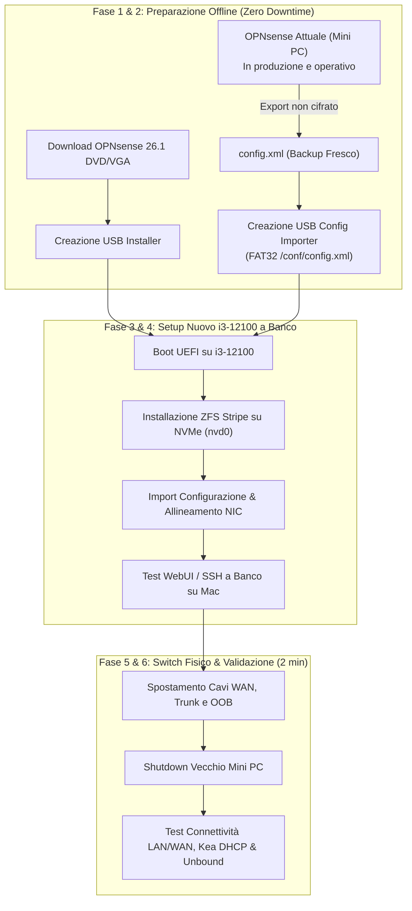

# Migrazione Macchina OPNsense su i3-12100 con NVMe e ZFS

Questo piano definisce la strategia operativa **più veloce e sicura** per migrare il firewall OPNsense dall'attuale Mini PC (4x 2.5GbE Intel i225/i226) alla nuova macchina con processore **Intel Core i3-12100**, **16 GB di RAM** e disco **NVMe**.

La procedura garantisce **zero rischi** e **downtime ridotto a meno di 2 minuti**, lasciando il vecchio firewall completamente intatto e operativo fino al momento dello switch fisico dei cavi (con rollback istantaneo in caso di imprevisti).

### 🚀 Specifiche Hardware di Destinazione
- **CPU**: Intel Core i3-12100 (4C/8T, architettura Alder Lake, alta frequenza IPC per packet filtering ad alta velocità).
- **RAM**: 16 GB (ampio dimensionamento per ZFS ARC Cache, Kea DHCP e Unbound DNSBL in RAM).
- **Storage**: SSD NVMe ad alte prestazioni con ZFS (`zroot`, compressione LZ4).
- **Swap ZFS consigliata**: 8 GB.
- **Scheda di Rete 10G**: **HPE StoreFabric CN1200E** (Dual-Port 10GbE SFP+, controller Emulex OneConnect OCe14102-NX / Broadcom Skyhawk).

---

## ⚠️ Specifiche Critiche Scheda di Rete: HPE CN1200E (Driver `oce`)

> [!IMPORTANT]
> **Riconoscimento & Driver FreeBSD**:
> - La scheda è supportata nativamente in OPNsense 26.1 / FreeBSD 14 tramite il modulo kernel **`if_oce.ko`** ([`man 4 oce`](https://man.freebsd.org/cgi/man.cgi?query=oce&sektion=4)).
> - Le due porte SFP+ 10G vengono identificate come **`oce0`** e **`oce1`**.
> - Se non caricato automaticamente al boot, si attiva dichiarando in `/boot/loader.conf.local`: `if_oce_load="YES"`.

> [!CAUTION]
> **Tuning Obbligatorio di Stabilità (Disabilitazione Hardware Offloading)**:
> Il driver `oce` su FreeBSD presenta storiche instabilità se combinato con l'offload hardware e le **VLAN 802.1Q** (essenziali nel nostro lab).
> **Azione obbligatoria post-installazione** in **Interfaces > Settings**:
> 1. Spuntare **Disable Hardware Checksum Offload**.
> 2. Spuntare **Disable Hardware TCP Segmentation Offload (TSO)**.
> 3. Spuntare **Disable Hardware Large Receive Offload (LRO)**.
> 4. Spuntare **Disable VLAN Hardware Filtering**.
> 
> *Impatto prestazionale*: **Nullo**. La CPU i3-12100 gestisce 10 Gbps di throughput software a livello kernel consumando meno dell'1-2% di CPU, azzerando completamente ogni rischio di packet drop, freeze o kernel panic.

> [!WARNING]
> **Raffreddamento Termico**:
> La CN1200E è una scheda enterprise per server rack con dissipatore passivo progettato per flussi d'aria forzati ad alti CFM. In un case desktop è raccomandato assicurare un flusso d'aria diretto (ventola del case o ventolina dedicata puntata sul dissipatore) per prevenire surriscaldamenti (>75°C) e thermal throttling.

---

## 🗺️ Mappatura Porte Consigliata (Topologia 10G Homelab)

| Porta Fisica | Interfaccia OPNsense | Connessione Fisica | Ruolo & Configurazione |
| :--- | :--- | :--- | :--- |
| **CN1200E Porta 1** | `oce0` (10G SFP+) | Cavo DAC SFP+ verso Porta Trunk Switch 10G (Extreme / Horaco) | **Trunk LAN Master (10 Gbps)**: VLAN 10, 20, 30, 40, 99 + Transit SVI `192.168.2.254`. Upgrade radicale di banda verso i server. |
| **Porta Onboard Mobo** | `re0` o `igc0` (RJ45) | Cavo rame verso Modem | **WAN**: Ricezione IP pubblico / DHCP dal provider internet. |
| **CN1200E Porta 2** (o 2a onboard) | `oce1` o `igc1` | Switch Porta 4 (VLAN 99) | **ADMIN_LAN (OOB)**: Gestione out-of-band isolata `192.168.100.1`. |

---

## 🎯 Obiettivi & Principi Architetturali

1. **Massima Sicurezza (Zero Rischio & Rollback Istantaneo)**:
   - Il vecchio OPNsense rimane intatto al 100% e acceso fino al cutover finale. Non viene né sovrascritto né alterato.
   - In caso di qualsiasi problema sulla nuova macchina (es. incompatibilità driver, crash), il rollback consiste semplicemente nel ricollegare i 3 cavi al vecchio Mini PC, tornando operativi in 30 secondi.
2. **Massima Velocità (Preparazione Parallela a Banco)**:
   - Installazione pulita di OPNsense 26.1 con filesystem **ZFS nativo su NVMe** (`zroot`), abilitando prestazioni disco ottimali e supporto agli snapshot ZFS per disaster recovery.
   - Import della configurazione (`config.xml`) eseguito a banco senza interrompere la connessione internet domestica né i servizi dell'homelab.
3. **Cutover Rapido (< 2 minuti)**:
   - Il solo periodo di disconnessione è il tempo materiale per spostare i 3 cavi di rete (WAN, Trunk LAN, OOB).



---

## 🏗️ Fasi Operative Dettagliate

### 1. FASE 1: Esportazione Backup Fresco da OPNsense Attuale
- Accedere all'attuale WebUI OPNsense (`https://192.168.100.1` o `https://192.168.2.254`).
- Navigare in **System > Configuration > Backups**.
- Esportare un backup completo:
  - Spuntare **Do not encrypt** (per consentire all'OPNsense Importer di leggerlo senza password interattiva al boot).
  - Deselezionare **Backup RRD data** (per mantenere il file snello e pulito).
  - Cliccare su **Download configuration** salvando il file come `config.xml`.
- Archiviazione di sicurezza nel repository:
  ```bash
  cp ~/Downloads/config.xml ./opnsense_migration_backup_$(date +%Y%m%d).xml
  ```

### 2. FASE 2: Preparazione Supporti USB
- **USB 1 (Installer)**: OPNsense 26.1 `vga` o `dvd` (formato `.img.bz2` o `.iso.bz2`) per architettura `amd64`. Decomprimere e flashare su pen drive tramite BalenaEtcher o `dd`.
- **USB 2 (Config Importer)**: Pen drive USB comune formattata in FAT32 con label `OPNSENSE`, contenente cartella `/conf/config.xml`:
  ```bash
  mkdir -p /Volumes/OPNSENSE/conf
  cp ./opnsense_migration_backup_*.xml /Volumes/OPNSENSE/conf/config.xml
  ```

### 3. FASE 3: Installazione ZFS su NVMe sul nuovo i3-12100
- Boot UEFI su i3-12100 da USB 1 con USB 2 inserita.
- BIOS i3-12100:
  - **AC Power Recovery**: `Power On`.
  - **Secure Boot**: `Disabled`.
  - **Storage Controller**: `AHCI / NVMe`.
- Esecuzione OPNsense Importer al prompt del bootloader (selezionare la chiavetta FAT32).
- Login utente `installer` (password: `opnsense` o root password del backup).
- Selezione:
  - **Keymap**: Default / Italian.
  - **Filesystem**: **ZFS**.
  - **Pool Type**: **Stripe** (disco NVMe singolo).
  - **Disk Selection**: Disco NVMe interno (`nvd0` o `nda0`).
  - **Swap**: 8 GB.
- Conferma e installazione. Al termine, confermare il mantenimento della configurazione e riavviare rimuovendo le chiavette.

### 4. FASE 4: Verifica Interfacce & Test a Banco (Offline)
- Se i nomi porte corrispondono (`igc0`, `igc1`, `igc3`), OPNsense parte direttamente configurato.
- Se i nomi differiscono (es. `re0`, `em0`, `ix0`), assegnare le interfacce dal menu console:
  - `WAN` -> Porta collegata al modem.
  - `LAN` (OOB) -> Porta collegata alla porta 4 dello switch (VLAN 99).
  - `TRANSIT` (opt4) -> Porta collegata alla porta 7 dello switch (Trunk VLAN).
- Collegare temporaneamente il Mac con cavo diretto alla porta OOB (`192.168.100.1` con Mac su `192.168.100.100`) per verificare login WebUI, plugin e regole firewall.

### 5. FASE 5: Cutover Fisico (Downtime: ~90-120s)
- Spostare i 3 cavi di rete dal vecchio Mini PC al nuovo i3-12100:
  1. **Cavo 1**: Modem WAN $\rightarrow$ Porta WAN i3-12100.
  2. **Cavo 2**: Trunk Switch Extreme (Porta 7) $\rightarrow$ Porta Trunk LAN i3-12100.
  3. **Cavo 3**: OOB Switch Extreme (Porta 4) $\rightarrow$ Porta ADMIN_LAN i3-12100.
- Spegnere il vecchio Mini PC e lasciarlo da parte per sicurezza (senza formattarlo).

### 6. FASE 6: Validazione Post-Cutover & Test di Rete
- Eseguire i test automatici dal Mac Studio:
  - `./scripts/infrastructure/test_internet.sh` (Connettività WAN & Gateway).
  - `./scripts/network/test_dns.sh` (Unbound DNS interno ed esterno).
  - `./scripts/network/test_dhcp.sh` (Kea DHCP Relay su VLAN 20).
  - `python3 scripts/opnsense/check_opnsense_plugins.py` (API REST & plugin).
- Controllo pool ZFS via SSH:
  ```bash
  ssh root@192.168.100.1 "zpool status zroot && zfs list"
  ```

---

## 💾 Stato di Ripristino (AI Save-State)
- **Fase Attiva**: Pianificazione (Attesa feedback utente)
- **Ultima Azione Completata**: Creazione piano e artefatto di migrazione `opnsense-i3-12100-nvme-migration.md`.
- **Prossimo Passo Operativo**: Risoluzione delle domande aperte sulle porte fisiche della macchina i3-12100 e preparazione file `config.xml`.
- **Blocchi/Decisioni Pendenti**: Attesa dettagli sulle schede di rete installate sull'i3-12100.
