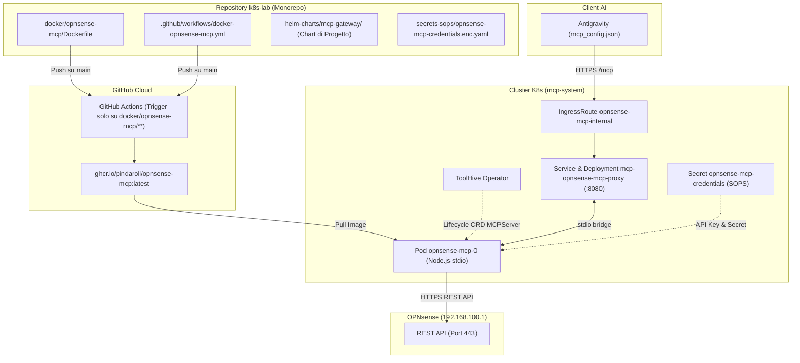

# Piano: Migrazione Kubernetes di OPNsense MCP Server (Pattern Monorepo)

Questo piano definisce i passaggi operativi per migrare il server MCP **`opnsense`** dall'esecuzione locale con `npx` su macOS (`@richard-stovall/opnsense-mcp-server`) al cluster Kubernetes homelab nel namespace dedicato `mcp-system`.

Il piano adotta il pattern **Monorepo Homelab**: il `Dockerfile` risiede direttamente in `k8s-lab` (`docker/opnsense-mcp/`), con automazione CI via GitHub Actions con path filtering selettivo per pubblicare su `ghcr.io/pindaroli/opnsense-mcp:latest`. L'orchestrazione del lifecycle e il bridging stdio-to-HTTP/SSE sono governati da **ToolHive Operator**, le credenziali sono cifrate con **SOPS**, e l'esposizione è gestita dichiarativamente tramite la Project Chart **`mcp-gateway`** e **Traefik IngressRoute**.

---

## 🗺️ Mappe Concettuali e Relazioni
- [[MCP_Platform]] (Piattaforma Kuadrant & ToolHive in `mcp-system`)
- [[OPNsense]] (Firewall core `192.168.100.1` OOB / `192.168.2.254` Transit)
- [[Traefik]] (IngressRoute split-horizon per `opnsense-mcp-internal.pindaroli.org`)
- [[Secret_Registry]] (Gestione credenziali cifrate con SOPS)

---

## 1. Architettura di Riferimento



---

## 2. Fasi Operative

### Fase 1: Creazione Dockerfile Monorepo & GitHub Actions CI
1. Eliminare il repository temporaneo `pindaroli/opnsense-mcp` da GitHub.
2. Creare `docker/opnsense-mcp/Dockerfile` (`node:22-alpine`, `@richard-stovall/opnsense-mcp-server@0.5.3`, entrypoint `opnsense-mcp-server`).
3. Creare `.github/workflows/docker-opnsense-mcp.yml` con trigger `paths: ['docker/opnsense-mcp/**', '.github/workflows/docker-opnsense-mcp.yml']`.
4. Effettuare commit e push su `main` di `k8s-lab` e attendere il push dell'immagine su `ghcr.io/pindaroli/opnsense-mcp:latest`.

### Fase 2: Provisioning Segreto SOPS
1. Creare `secrets-sops/opnsense-mcp-credentials.enc.yaml` cifrato con chiave Age contenente:
   - `OPNSENSE_API_KEY`
   - `OPNSENSE_API_SECRET`
2. Applicare il secret decifrato nel namespace `mcp-system`:
   ```bash
   sops --decrypt secrets-sops/opnsense-mcp-credentials.enc.yaml | kubectl apply -f -
   ```

### Fase 3: Integrazione Helm Project Chart (`mcp-gateway`)
1. Incrementare la versione in `helm-charts/mcp-gateway/Chart.yaml` (`0.2.3` → `0.2.4`).
2. Aggiungere il server `opnsense` a `mcp-gateway/mcp-gateway-values.yaml`:
   - ToolHive: `image: ghcr.io/pindaroli/opnsense-mcp:latest`, `transport: stdio`, `proxyPort: 8080`.
   - IngressRoute: `host: opnsense-mcp-internal.pindaroli.org`.
   - Environment: `OPNSENSE_URL: https://192.168.100.1`, `OPNSENSE_VERIFY_SSL: false`.
3. Eseguire il deploy:
   ```bash
   helm upgrade --install mcp-gateway helm-charts/mcp-gateway -f mcp-gateway/mcp-gateway-values.yaml -n mcp-system
   ```

### Fase 4: Networking & DNS Split-Horizon
1. Aggiungere l'alias `opnsense-mcp-internal` al VIP Traefik (`10.10.20.56`) in `rete.json`.
2. Eseguire `python3 scripts/network/validate_network.py`.
3. Registrare l'host override in OPNsense Unbound per `opnsense-mcp-internal.pindaroli.org` → `10.10.20.56`.

### Fase 5: Migrazione Configurazione Client Antigravity
1. Modificare `~/.gemini/antigravity/mcp_config.json`:
   ```json
   "opnsense": {
     "serverUrl": "https://opnsense-mcp-internal.pindaroli.org/mcp"
   }
   ```

### Fase 6: Validazione Test-Driven & Wiki Consolidation
1. Verificare l'avvio regolare dei pod in `mcp-system`.
2. Testare l'handshake JSON-RPC su Traefik con curl.
3. Verificare l'invocazione di uno strumento da Antigravity.
4. Aggiornare `wiki/entities/MCP_Platform.md`.
5. Rigenerare il contesto wiki: `python3 scripts/wiki/build_wiki_context.py`.

---

## 3. Verification Plan

### Test Automatizzati
- `helm lint helm-charts/mcp-gateway`
- `python3 scripts/network/validate_network.py`
- `python3 scripts/wiki/build_wiki_context.py`

### Test Manuali
- `kubectl get pods -n mcp-system -l toolhive-name=opnsense-mcp`
- `kubectl get ingressroute opnsense-mcp-internal -n mcp-system`
- Handshake test con curl su `https://opnsense-mcp-internal.pindaroli.org/mcp`.

---

## 💾 Stato di Ripristino (AI Save-State)
- **Fase Attiva**: Completato (Archiviato)
- **Ultima Azione Completata**: Migrazione Kubernetes completata con successo al 100%. Immagine compilata con CI GitHub Actions su GHCR, secrets SOPS applicati, ToolHive Operator e Traefik IngressRoute attivi in mcp-system, DNS Unbound registrato, endpoint remoto integrato in mcp_config.json.
- **Prossimo Passo Operativo**: Nessuno.
- **Blocchi/Decisioni Pendenti**: Nessuno.
