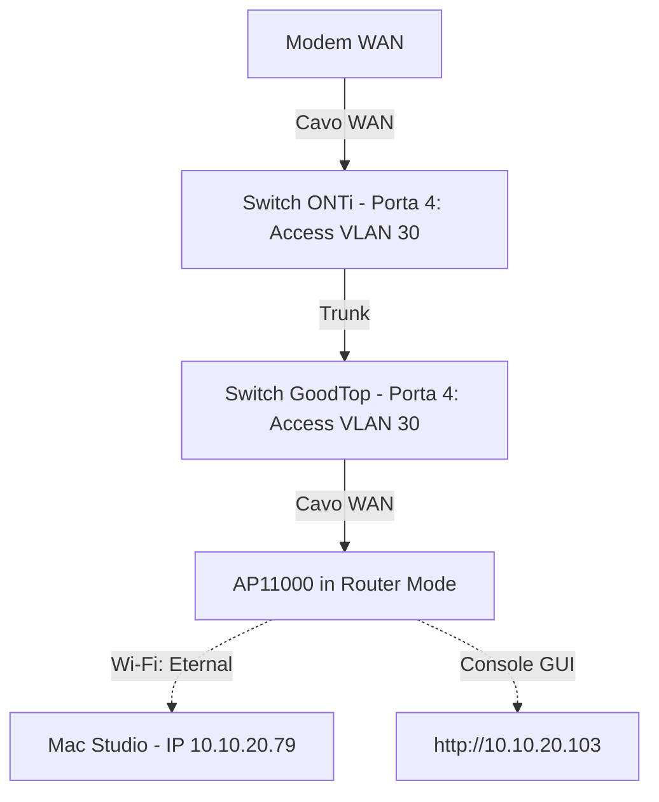

# Spegnimento Lab, Rete Temporanea (AP11000 Router) e Ripristino OPNsense

Questo piano descrive la gestione dell'emergenza legata al guasto del disco di OPNsense. È diviso in due parti: la configurazione della rete temporanea (già eseguita) e la procedura di ripristino e rientro alla topologia finale (da eseguire all'arrivo del ricambio).

---

## PARTE 1: Configurazione Rete Temporanea (GIA FATTA)

Questa sezione documenta come la rete è stata temporaneamente configurata per garantire la connettività Internet al Mac Studio mentre l'infrastruttura del laboratorio è spenta.

### Stato Attuale dell'Infrastruttura
* **Nodi Server**: PVE1, PVE2, PVE3 e TrueNAS sono **completamente spenti** in sicurezza per prevenire perdite di dati.
* **OPNsense**: Spento fisicamente a causa del guasto dell'SSD interno.

### Topologia WAN-over-VLAN Temporanea
Per consentire la navigazione internet senza ricollegare fisicamente cavi lunghi tra i locali, è stato creato un bridge Layer 2 temporaneo usando la **VLAN 30** sugli switch di transito.

* **Switch 10G ONTi (Sala Server)**: Porta 4 configurata come **Access VLAN 30** (collegata al modem).
* **Switch GoodTop (Camera)**: Porta 4 configurata come **Access VLAN 30** (collegata alla porta WAN del Cudy).
* **Cudy AP11000**: Configurato in modalità **Wireless Router** (IP LAN `10.10.20.103`). Riceve IP pubblico via DHCP sulla WAN (VLAN 30) e distribuisce indirizzi nella subnet `10.10.20.0/24` via Wi-Fi.
* **Mac Studio**: Connesso al Wi-Fi `Eternal` (IP `10.10.20.79`, gateway `10.10.20.103`). Cavo Ethernet scollegato per evitare conflitti di routing.

---

## PARTE 2: Ripristino OPNsense (DA FARE)

Questa procedura dovrà essere eseguita non appena il nuovo SSD di ricambio per il mini PC OPNsense sarà disponibile.

### Supporti e File Preparati
1. **Chiavetta USB Installer VGA**: Scritta usando l'immagine ufficiale VGA di OPNsense (`.img` scaricata ed estratta, non il file `.iso` DVD) tramite BalenaEtcher.
2. **Chiavetta USB FAT32 (`OPNSENSE`)**: Contiene il file di configurazione corretto nel percorso: `conf/config.xml` (SHA-256: `d67671e63b295fbb4f22f0d421ca3e1664cad9a4d1e597f20d8ba08d1668cdc9`).
   * *Nota*: Il file `config.xml` è stato patchato con successo per includere la subnet dei Pod Kubernetes (`10.244.0.0/16`) in Unbound DNS Access Control e `firewall-direct.pindaroli.org` negli Alternate Hostnames.

### Procedura Operativa di Ripristino
1. Inserire entrambe le chiavette USB nel mini PC OPNsense con il nuovo SSD installato.
2. Collegare monitor e tastiera, avviare il boot in modalità UEFI dalla chiavetta dell'installer VGA.
3. Attendere il caricamento: il modulo *Config Importer* di OPNsense rileverà la chiavetta FAT32 e caricherà la configurazione.
4. Al login, accedere come utente `installer` (password `opnsense`).
5. Selezionare il disco SSD interno e procedere con l'installazione.
6. **IMPORTANTE**: Prima del completamento, accettare l'opzione per **copiare la configurazione importata** sul sistema installato.
7. Al termine, spegnere il mini PC e rimuovere le chiavette USB.
