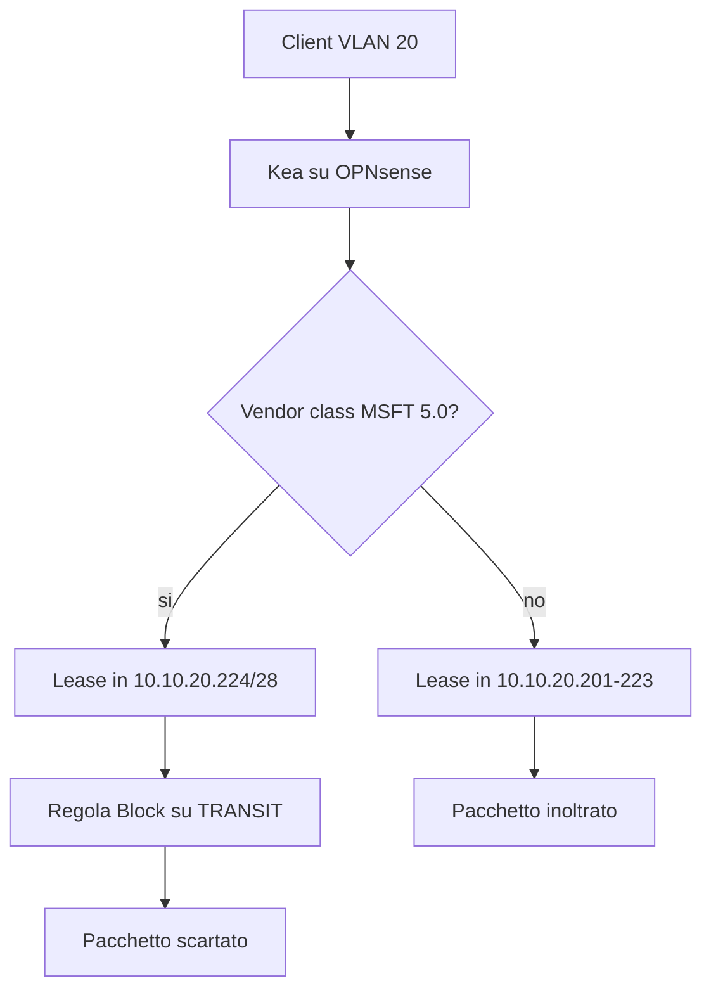

# Piano: Blocco sul firewall dei client Windows riconosciuti in DHCP

Questo piano blocca sul firewall OPNsense **tutti i pacchetti** il cui IP sorgente appartiene a un client identificato come Windows al momento del DHCP. Il piano [[opnsense-captive-portal-windows-detection]] resta obsoleto e non viene riaperto.

Un pacchetto IP che arriva su TRANSIT (`igc1` / `opt4`, `192.168.2.254`) porta l’IP del client e il MAC dello switch. La regola firewall di OPNsense 26.1 non ha un campo «sistema operativo». Il fingerprint TCP di pf, dove esiste, guarda solo il SYN e non copre UDP, ICMP e il resto della sessione. Per questo il riconoscimento avviene nel DHCP, e il firewall blocca il prefisso che ne risulta.

*Fonte architettura: [rete.json](rete.json), piano di allineamento L3 VLAN 20. Fonte Kea: `opnsense-26.1/manual/kea.md` (dataset RAGFlow `opnsense`). Quel manuale documenta subnet, pool, reservation e option data. Non documenta le client class.*

---

## 1. Cosa viene bloccato

Kea è in ascolto su `LAN_CLIENT` e `TRANSIT`. Il relay dello switch inoltra il DHCP della VLAN 20 (`10.10.20.0/24`, pool attuale `10.10.20.201-253`). Dentro la richiesta restano il vendor class del client e il suo MAC, anche se il frame Ethernet verso il firewall è dello switch.

Il client DHCP di Windows invia il vendor class **`MSFT 5.0`** (opzione 60). Kea assegna a quella classe un pool dedicato, allineato a una rete:

- Pool Windows: `10.10.20.224-239` (`10.10.20.224/28`)
- Pool degli altri client dinamici: `10.10.20.201-223`

L’alias firewall `Windows_DHCP` vale `10.10.20.224/28`. La regola su **TRANSIT**, in cima all’interfaccia:

- Action: Block
- Source: `Windows_DHCP`
- Destination: any
- Protocollo: any

Ogni pacchetto di quegli IP che il firewall instrada (verso Internet e verso le altre VLAN, perché il percorso passa da `192.168.2.1` a `192.168.2.254`) viene scartato. Il traffico che resta nella VLAN 20 e non sale su TRANSIT lo switch non lo manda al firewall: due host `10.10.20.x` che si parlano direttamente non entrano in questa regola.

Fuori dal filtro restano gli IP statici già assegnati sotto `.201` o sopra `.239` (Mac Studio `.100`/`.101`, Brother `.127`, iPad `.205`, KEF `.210`) e qualunque Windows con indirizzo impostato a mano fuori da `10.10.20.224/28`.

---

## 2. Fasi

### Fase 0 — Verifica, senza scrivere regole
* Esito del 2026-09-23 sul firewall `OPNsense 26.1.10`. Il generatore è `KeaDhcpv4::generateConfig()` del ramo `stable/26.1`. Con `manual_config` vuoto scrive `/usr/local/etc/kea/kea-dhcp4.conf`.
* Una client class viene creata solo se un’opzione DHCP personalizzata ha `match_code` e `match_data`. Il test emesso è `option[N].hex == 0x…`. Quella class è appesa all’opzione da inviare al client (`option-data.client-classes`). I pool escono come `{"pool": "inizio-fine"}`, senza `client-class`.
* L’opzione 60 si può quindi usare per mandare un’opzione solo ai client che la presentano. Non si può usarla per mettere Windows in `10.10.20.224/28` e gli altri in `10.10.20.201-223`.
* Il piano si arresta qui. Non si passa a `manual_config` e non si crea la regola di blocco: senza pool legato a `MSFT 5.0` l’alias colpirebbe anche i client che non sono Windows.

### Fase 1 — Pool
* In [rete.json](rete.json), spezzare il pool VLAN 20 in `10.10.20.201-223` e `10.10.20.224-239`.
* Allineare Kea con [ansible/playbooks/scripts/opnsense/push_kea_dhcp_to_opnsense.py](ansible/playbooks/scripts/opnsense/push_kea_dhcp_to_opnsense.py) solo dopo che la Fase 0 ha un modo per legare `10.10.20.224-239` alla classe `MSFT 5.0`. Senza quella classe, il pool Windows diventerebbe un normale pool dinamico e la regola bloccherebbe anche telefoni e tablet.

### Fase 2 — Regola, creata disabilitata
* Alias `Windows_DHCP` = `10.10.20.224/28`.
* Regola Block su `opt4` (TRANSIT), disabilitata.
* Verifica da API: alias e regola presenti, regola non attiva.

### Fase 3 — Accensione e prove
Solo su conferma esplicita, dopo un client Windows di prova e un client non Windows di prova:

* Il client Windows riceve un indirizzo in `10.10.20.224/28` e non raggiunge Internet né la VLAN 10.
* Un client non Windows riceve un indirizzo in `10.10.20.201-223` e naviga.
* Brother `10.10.20.127`, Mac Studio `10.10.20.100` e un nodo Talos continuano a passare.
* Rollback: disabilitare la regola e Apply. I lease Windows già emessi restano in `224/28` finché non scadono; con la regola spenta quegli IP tornano a passare.

---

## 💾 Stato di Ripristino (AI Save-State)
- **Fase Attiva**: Fermato in Fase 0
- **Ultima Azione Completata**: Verifica su OPNsense 26.1.10. La client class della GUI non assegna il pool in base all’opzione 60.
- **Prossimo Passo Operativo**: Nessuno, finché non si decide un altro meccanismo. Kea e il firewall non sono stati modificati.
- **Blocchi/Decisioni Pendenti**: Il blocco per prefisso DHCP non è attuabile con la configurazione generata dalla GUI.
