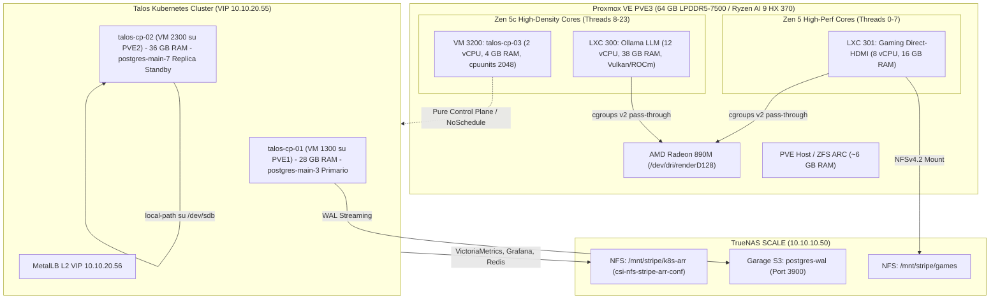

# Architettura Homelab Ibrida: Ottimizzazione del Control Plane Kubernetes e Convergenza Bare-Metal LXC su PVE3

L'infrastruttura iperconvergente del cluster homelab presenta una marcata asimmetria tra la capacità computazionale dell'hardware sottostante e la sua effettiva ripartizione logica. Il nodo Proxmox VE PVE3 integra la piattaforma tecnologica più performante del cluster: SoC AMD Ryzen AI 9 HX 370 (architettura Strix Point Zen 5 a 12 core fisici e 24 thread logici), grafica integrata Radeon 890M basata su microarchitettura RDNA 3.5 (16 Compute Unit), coprocessore neurale NPU XDNA 2 accreditato di 50 TOPS, 64 GB di memoria di sistema LPDDR5-7500 unificata a banda ultra-larga e interfaccia di rete fisica 10 GbE SFP+ attestata direttamente sul core switch Extreme Networks Summit X620-16t.

Attualmente, l'allocazione su PVE3 di un'istanza virtuale monolitica KVM (`talos-cp-03`, identificativo VM `3200`) configurata come nodo ibrido Control Plane e Worker da 8 vCPU e 24 GB di RAM vincola la macchina fisica. L'esecuzione di carichi applicativi generici e di volumi persistenti ancorati localmente impedisce l'accesso diretto bare-metal ai motori hardware integrati e induce un degrado dell'efficienza termica ed energetica.

Il presente piano definisce la riprogettazione strutturale del nodo PVE3: il ridimensionamento della VM Talos Linux alla soglia dimensionale minima (2 vCPU, 4 GB RAM fissa, taint perenne `node-role.kubernetes.io/control-plane:NoSchedule`) preserverà il quorum etcd e l'alta disponibilità (HA) del piano di controllo Kubernetes, restituendo oltre il 90% della memoria volatile e la quasi totalità della potenza computazionale nativa a due container LXC non-K8s dedicati all'inferenza LLM (Ollama) e al gaming Direct-HDMI (Gamescope/Steam verso KVM IP Streamer su VLAN 40).

---

## 1. Dimensionamento Minimo e Ruolo Operativo della VM talos-cp-03

### Analisi dei Requisiti di Risorse per etcd e Control Plane
La stabilità operativa di un cluster Kubernetes basato su Talos Linux poggia in modo critico sulle prestazioni del sottosistema di archiviazione e sulla reattività dello scheduling della CPU per il database a stati distribuiti etcd. In una topologia a tre nodi master iperconvergenti, ogni transazione del piano di controllo richiede il commit sincrono su disco mediante chiamate di sistema `wal fsync`. Quando la latenza di commit supera i 10 millisecondi, etcd emette warning di tipo `etcd slow fdatasync`, rischiando di innescare l'elezione di un nuovo leader, disconnessioni a catena dei nodi e il blocco dell'API server.

All'interno di un cluster homelab che gestisce un volume compreso tra 80 e 120 pod attivi, la memoria del Control Plane deve accogliere:
- La working set memory di etcd, il cui database bbolt mappa in memoria virtuale l'intero albero di chiavi;
- La watch cache del kube-apiserver, che memorizza le risorse serializzate per soddisfare le interrogazioni concorrenti di controller quali CloudNativePG, VictoriaMetrics Operator, Traefik e Cert-Manager;
- La page cache del kernel Linux, indispensabile per mitigare i ritardi di I/O nel file system sovrapposto di Talos;
- I buffer socket di rete TCP per il protocollo HTTP/2 e gRPC.

| Profilo di Risorse | vCPU / RAM | Stabilità etcd & apiserver | Headroom Page Cache Linux | Rischio OOM / Throttling | RAM Rilasciata a PVE3 |
| :--- | :--- | :--- | :--- | :--- | :--- |
| **Minimo Teorico** | 2 vCPU / 2 GB | Critico; sconsigliato in presenza di CRD multiple e DaemonSet | Assente (< 250 MB disponibili per page cache) | Elevato sotto carichi concorrenti o compattazioni | 62 GB |
| **Ottimizzato Bare-Metal** | 2 vCPU / 4 GB | Stabile; consumo a regime ~2.5 GB, gestione fluida di etcd | Adeguata (~ 1.2 – 1.5 GB per cache e buffer di I/O) | Trascurabile (fissando ballooning a 0) | 60 GB |
| **Conservativo Eccessivo** | 2 vCPU / 6–8 GB | Sovradimensionata per soli servizi di sistema | Ampia (> 3 GB costantemente non utilizzati) | Nullo | 56–58 GB |

Il profilo a 2 vCPU e 4 GB RAM (4096 MB dedicati senza memory ballooning) rappresenta il bilanciamento architetturale ottimale. Assicura la stabilità di etcd e del kube-apiserver, mantenendo un'impronta ultraleggera che libera esattamente 60 GB di RAM unificata DDR5 a vantaggio esclusivo dei carichi host Proxmox.

### Selezione della Policy di Schedulazione: Control Plane Puro
La trasformazione di `talos-cp-03` richiede l'applicazione permanente del taint standard `node-role.kubernetes.io/control-plane:NoSchedule`, configurando il nodo come Control Plane Puro.
- **Espulsione deterministica dei carichi generici**: Impedisce allo scheduler di posizionare microservizi applicativi o pod batch sul nodo, evitando contesa di memoria con l'apiserver.
- **Comportamento trasparente dei DaemonSet di infrastruttura**: Componenti critici quali `flannel`, `kube-proxy`, `metallb-speaker`, `node-exporter` e `csi-nfs-node` contengono nativamente le tolleranze globali per i nodi master (`tolerations: [operator: Exists]`). Tali servizi permangono attivi sul nodo, garantendo la continuità dell'instradamento di rete Overlay e della telemetria.
- **Dislocazione controllata dell'Ingress Traefik**: Essendo privo di tolleranza verso nodi tainted Control Plane puro, Traefik evacua `talos-cp-03`. L'attività di reverse proxying HTTP/HTTPS viene integralmente assorbita da `talos-cp-01` e `talos-cp-02`, liberando l'interfaccia virtuale del nodo 03 da flussi di traffico non correlati alla gestione del cluster.

---

## 2. Risoluzione dello Storage Locale e Strategia di Evacuazione Dati

L'ostacolo principale all'evacuazione di `talos-cp-03` risiede nell'infrastruttura di persistenza locale `local-postgres`, basata sul CSI `rancher.io/local-path`. I PersistentVolume generati da questo meccanismo presentano una direttiva immutabile `spec.nodeAffinity` vincolata a `talos-cp-03`, con ancoraggio fisico al percorso `/var/mnt/postgres` sul disco secondario `/dev/sdb`.

| Carico Stateful | Dimensione Attuale | Destinazione Ottimale | Tipologia di Storage | Comportamento I/O e Giustificazione Tecnica |
| :--- | :--- | :--- | :--- | :--- |
| **postgres-main-6** (CNPG Standby) | 100 GiB + 10 GiB WAL | talos-cp-02 (PVE2) | Storage Locale (`local-path` su `/dev/sdb`) | Scritture sincrone WAL `fsync` sub-millisecondo su NVMe locale. Zero overhead di locking di rete. |
| **vmsingle-vm** (VictoriaMetrics TSDB) | 20 GiB | TrueNAS SCALE (Pool `stripe` NVMe) | Rete NFS CSI (`csi-nfs-stripe-arr-conf`) | Scritture sequenziali a blocchi aggregati unificati in background. Ottimale su 10 GbE. |
| **victoria-monitoring-grafana** | 5 GiB | TrueNAS SCALE (Pool `stripe` NVMe) | Rete NFS CSI (`csi-nfs-stripe-arr-conf`) | SQLite per dashboard e preferenze. Volume di transazioni marginale, pienamente compatibile NFSv4. |
| **ragflow-redis-0** | 5 GiB | TrueNAS SCALE (Pool `stripe` NVMe) | Rete NFS CSI (`csi-nfs-stripe-arr-conf`) | In-memory cache. Persistenza limitata a dump RDB periodici e AOF asincrono. |

### Migrazione a Caldo della Replica PostgreSQL CNPG senza Downtime
L'operatore CloudNativePG gestisce autonomamente il ciclo di vita dei pod e dei rispettivi PVC senza dipendere dai controller StatefulSet convenzionali.
1. Il primario attivo risiede su `talos-cp-01` (`postgres-main-3`).
2. Applicando il taint `node-role.kubernetes.io/control-plane:NoSchedule` e cordonando `talos-cp-03`, lo scheduler esclude il nodo 03 da qualsiasi ri-schedulazione.
3. L'eliminazione coordinata del pod `postgres-main-6` e dei suoi PVC (`postgres-main-6` e `postgres-main-6-wal`) induce l'operatore CNPG a riconciliare immediatamente lo stato desiderato (`instances: 2`).
4. Avendo `talos-cp-01` già occupato dall'istanza primaria, l'operatore sceglie deterministicamente `talos-cp-02`.
5. Tramite `local-path-provisioner`, il nuovo pod aggancia il disco `/dev/sdb` di PVE2 ed esegue il bootstrap fisico trasparente (`pg_basebackup`) in streaming replication direttamente dal primario, con RPO = 0 e zero downtime applicativo.

---

## 3. Resilienza dell'Infrastruttura Kubernetes con Due Nodi Worker Effettivi

| Host Fisico | VM Talos Corrispondente | RAM Attuale VM | Consumo Pre-Migrazione | Carico Aggiunto Evacuato | RAM Consuntiva Post-Migrazione | RAM Proposta Nuova Assegnazione | Margine Libero Host Residuo |
| :--- | :--- | :--- | :--- | :--- | :--- | :--- | :--- |
| **PVE1** (32 GB tot) | talos-cp-01 (VM 1300) | 32 GB | 10.7 GB (34%) | ~ 1.5 GB (Microservizi MCP) | 12.2 GB (38%) | **28 GB** (restituisce 4 GB a PVE1) | 4 GB fisici per Proxmox/ZFS |
| **PVE2** (64 GB tot) | talos-cp-02 (VM 2300) | 24 GB | 7.7 GB (33%) | ~ 3.9 GB (Replica DB + Monitoring) | 11.6 GB (48%) | **36 GB** (espansione +12 GB) | 28 GB fisici per Proxmox/ARC |
| **PVE3** (64 GB tot) | talos-cp-03 (VM 3200) | 24 GB | 5.4 GB (23%) | 0 GB (Nodo svuotato) | ~ 2.0 GB (Solo sistema e CP) | **4 GB** (riduzione -20 GB) | 60 GB fisici per LXC Ollama/Game |

### Anti-Affinità e PodDisruptionBudget (PDB)
- **PodAntiAffinity**: Servizi ad alta disponibilità (CoreDNS, Cloudflared) scalati a 2 repliche fisse con anti-affinità distribuita su `talos-cp-01` e `talos-cp-02`.
- **PDB Guard**: Tutti i PDB devono rispettare la clausola `maxUnavailable: 1` per consentire manutenzioni e rolling update senza deadlock di evacuazione.

---

## 4. Coesistenza e Isolamento Hardware su PVE3 (KVM vs LXC Bare-Metal)

### Configurazione Headless VM KVM talos-cp-03
- Display: `vga: none` o serial console.
- Nessun dispositivo PCI passthrough (`hostpci`) configurato: i driver host `amdgpu` e `drm` mantengono il pieno possesso della GPU Radeon 890M.

### Ripartizione CPU e Pinning su Architettura Zen 5 / Zen 5c
Il SoC Ryzen AI 9 HX 370 possiede:
- 4 Core Zen 5 ad alte frequenze (Thread 0–7) con 16 MB L3 cache;
- 8 Core Zen 5c ad alta densità (Thread 8–23) con 8 MB L3 cache.

| Workload Ospitato | Identificativo Entità | Core Fisici Assegnati | Thread Logici Mappati | Pesi Scheduler (cpuunits) | Obiettivo Architetturale |
| :--- | :--- | :--- | :--- | :--- | :--- |
| **LXC Gaming Direct-HDMI** | CT 301 (Gaming) | 4 Core Zen 5 | 0, 1, 2, 3, 4, 5, 6, 7 | 1024 | Rendering nativo Gamescope/Steam su display fisico HDMI verso KVM IP Streamer (VLAN 40) a 120 fps |
| **LXC Inferenza LLM** | CT 300 (Ollama) | 6 Core Zen 5c | 8, 9, 10, 11, 12, 13, 14, 15, 16, 17, 18, 19 | 1024 | Calcolo parallelo multithreading per elaborazione tensoriale e BLAS |
| **Talos Control Plane** | VM 3200 (talos-cp-03) | 2 Core Zen 5c | 20, 21, 22, 23 | 2048 (Priorità Doppia) | Totale isolamento per etcd e apiserver, immunità da latenze di lock |

---

## 5. Fasi Operative di Esecuzione

- **Fase 1**: Verifica e Protezione del Piano di Rete Ingress (CoreDNS, Cloudflared, MetalLB, Traefik).
- **Fase 2**: Evacuazione dei Volumi Stateful verso lo Storage NFS di TrueNAS (`csi-nfs-stripe-arr-conf`).
- **Fase 3**: Spostamento Live della Replica PostgreSQL CNPG verso `talos-cp-02`.
- **Fase 4**: Evacuazione Controllata dei Microservizi Applicativi e della Flotta MCP da `talos-cp-03` via drain.
- **Fase 5**: Riconfigurazione Hardware della VM 3200 (talos-cp-03) a 2 vCPU, 4 GB RAM fissa, distacco `/dev/sdb`.
- **Fase 6**: Verifica etcd quorum, rimozione cordon con taint permanente `control-plane:NoSchedule`.
- **Fase 7**: Provisioning e Deployment del Container LXC Ollama (CT 300).
- **Fase 8**: Provisioning e Deployment del Container LXC Gaming Direct-HDMI (CT 301).
  > [!NOTE]
  > **Output Video Fisico & KVM IP Streamer (VLAN 40)**:
  > Per CT 301 viene impiegato un **KVM IP Streamer hardware** dedicato attestato sulla VLAN 40 (`10.10.40.0/24`, KVM Extender Video Stream).
  > Il container accede in modo diretto al controller KMS/DRM della Radeon 890M (`/dev/dri/card1`), pilotando l'uscita fisica HDMI con una sessione Gamescope / Steam Big Picture.
  > Questo elimina del tutto la necessità di software di streaming di rete come Sunshine o Moonlight, abbattendo la latenza a zero ed evitando qualsiasi spreco di cicli GPU in codifica video.
- **Fase 9**: Validazione End-to-End, collaudo prestazionale e consolidamento Wiki.

## 6. Esito esecuzione (2026-09-21)

Implementazione completata. Residui non bloccanti:
- `gamescope` non è nei repository Ubuntu 24.04; CT 301 ha `steam-installer`, Mesa RADV 890M e bind NFS `/mnt/games` da `stripe/games`.
- Disco locale `unused0` (`vm-3200-disk-1`) non distrutto.
- `kube-state-metrics` può atterrare su `talos-cp-03` (taint tollerato dal chart Helm); footprint minimo.
- `ContinuousArchivingFailing` su CNPG Barman è preesistente e fuori perimetro.
- **Passthrough Periferiche Fisiche USB & Input su CT 301**: configurato accesso cgroup major 189 (USB) e 13 (Input) con mount `/dev/bus/usb` e `/dev/input` e regole udev host `99-usb-lxc.rules` (`MODE="0666"`). Periferica NuPhy Air75 V2 su porta fisica `3-2` (Hub Genesys Logic) pienamente attiva e verificata con permessi di lettura/scrittura all'interno di `lxc-steam`.
