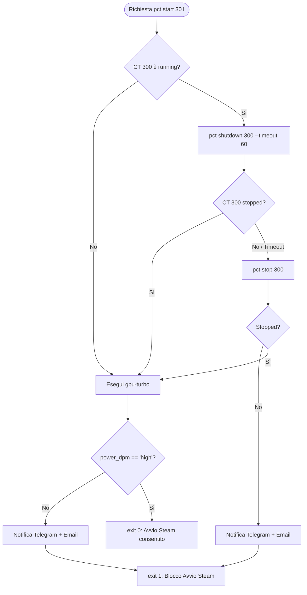
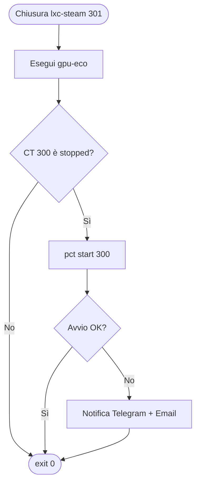

# Piano: Orchestrazione Energetica GPU e Alternanza LXC Steam/Ollama su PVE3

Il presente piano documenta l'architettura, l'implementazione e i test operativi per la gestione automatizzata dei profili energetici della iGPU **AMD Radeon 890M (RDNA 3.5)** e l'orchestrazione a mutua esclusione tra i due container LXC ospitati su **PVE3** (`10.10.10.31`):
1. **LXC Ollama** (`CT 300` - `10.10.20.33`): inferenza LLM e calcolo tensoriale parallelo (Vulkan / ROCm).
2. **LXC Steam** (`CT 301` - `10.10.20.34`): gaming Direct-HDMI KVM / Wayland Cage e streaming Steam Remote Play (PyroWave).

---

## 1. Obiettivi e Vincoli di Progetto

1. **Stato al Boot di PVE3**:
   - La GPU deve partire tassativamente nel profilo a basso consumo `gpu-eco` (governor `auto`, frequenza idle a 600 MHz per ridurre consumi di 8–15W e calore).
   - `lxc-steam` (`CT 301`) deve restare **spento di default** (`onboot: 0`).
   - `lxc-ollama` (`CT 300`) deve essere **acceso di default** (`onboot: 1`).
2. **Avvio di `lxc-steam` (`pre-start` hook)**:
   - Arresto controllato di `lxc-ollama` (`CT 300`) per liberare memoria RAM (oltre 15 GB allocati da Steam) e thread CPU Zen 5c.
   - Polling fino a conferma effettiva dello stato `stopped` (timeout 60s).
   - Commutazione della GPU in modalità `gpu-turbo` (governor `high`, 2900 MHz fissa) per garantire framerate elevato e throughput encoder video.
   - Fail-safe: in caso di timeout arresto Ollama o mancata commutazione GPU, l'avvio di Steam viene bloccato (`exit 1`) e viene emesso un allarme su **Telegram** e via **Email HTML**.
3. **Arresto di `lxc-steam` (`post-stop` hook)**:
   - Ripristino immediato della GPU in modalità `gpu-eco` (`auto` a 600 MHz).
   - Riavvio automatico di `lxc-ollama` (`pct start 300`).
   - Notifica su Telegram ed Email in caso di anomalie.
4. **Allineamento Notifiche (Opzione 2 - Motore Nativo Bash)**:
   - Creazione di una libreria condivisa `utils.sh` con la medesima interfaccia e grafica responsive dei normalizzatori (`custom-normalizer/utils.sh`).
   - Utilizzo di strumenti nativi già presenti sull'hypervisor (`curl` per Telegram e `sendmail` / Postfix per email HTML), senza dipendenze Python (`apprise`) su PVE3.

---

## 2. Architettura dei File e Collocazione

| File | Percorso Git (`k8s-lab`) | Percorso Host (`pve3`) | Permessi | Scopo |
| :--- | :--- | :--- | :--- | :--- |
| **Libreria Notifiche** | `scripts/infrastructure/utils.sh` | `/var/lib/vz/snippets/utils.sh` | `755` | Funzioni `send_telegram`, `build_html_email_template`, `send_summary_email`. |
| **Hookscript LXC** | `scripts/infrastructure/lxc-steam-hook.sh` | `/var/lib/vz/snippets/lxc-steam-hook.sh` | `755` | Hook Proxmox per `pre-start` e `post-stop` di `lxc-steam`. |
| **Systemd Unit Startup** | `scripts/infrastructure/pve3-gpu-eco.service` | `/etc/systemd/system/pve3-gpu-eco.service` | `644` | Imposta `gpu-eco` al boot dell'host PVE3. |
| **Backup PBS Host** | `scripts/infrastructure/pve3-host-backup-pbs.sh` | `/usr/local/bin/pve3-host-backup-pbs.sh` | `755` | Backup notturno su PBS di `/usr/local/bin` e `/var/lib/vz/snippets`. |

---

## 3. Dettagli Implementativi

### A. Systemd Unit Boot Host: `pve3-gpu-eco.service`
Collocato in `/etc/systemd/system/pve3-gpu-eco.service`:
```ini
[Unit]
Description=Set AMD Radeon 890M GPU to ECO mode (auto-scaling) on boot
After=systemd-modules-load.service local-fs.target
DefaultDependencies=no

[Service]
Type=oneshot
ExecStart=/usr/local/bin/gpu-eco
RemainAfterExit=yes

[Install]
WantedBy=multi-user.target
```
Attivato con:
```bash
systemctl daemon-reload
systemctl enable --now pve3-gpu-eco.service
```

### B. Modulo di Notifica: `utils.sh`
Collocato in `/var/lib/vz/snippets/utils.sh`:
* **Telegram**: invio diretto via `curl` all'endpoint `https://api.telegram.org/bot${TELEGRAM_BOT_TOKEN}/sendMessage` con `parse_mode="HTML"`.
  - Bot Token: `6548622283:AAHUfcvGWfj8LBdd_V4420uctNCKk3-D_Xs`
  - Chat ID: `554585346`
* **Template Email HTML**: genera una card responsive con:
  - Header dark gradient (`#1e293b` a `#0f172a`).
  - Badge pill colorato (`#10b981` verde o `#ef4444` rosso).
  - Tabella dettagli operazione a righe alternate.
  - Footer unificato Homelab.
* **Email Sender**: invia tramite `/usr/sbin/sendmail -t` con intestazioni MIME HTML (`Content-Type: text/html; charset=UTF-8`) a `o.pindaro@gmail.com`. Se l'invio mail fallisce, scatta automaticamente il fallback via Telegram.

### C. Hookscript: `lxc-steam-hook.sh`
Collocato in `/var/lib/vz/snippets/lxc-steam-hook.sh` e agganciato al container via:
```bash
pct set 301 -hookscript local:snippets/lxc-steam-hook.sh
```

#### Logica Fase `pre-start`


#### Logica Fase `post-stop`


---

## 4. Configurazione Onboot dei Container su PVE3

```bash
# lxc-steam: spento di default al boot dell'host
pct set 301 -onboot 0

# lxc-ollama: acceso di default al boot dell'host
pct set 300 -onboot 1
```

Verifica configurazione:
```bash
pct config 301 | grep -E 'onboot|hookscript'
# hookscript: local:snippets/lxc-steam-hook.sh
# onboot: 0

pct config 300 | grep -E 'onboot|hookscript'
# onboot: 1
```

---

## 5. Strategia di Backup e Resilienza PBS

I file sorgente risiedono stabilmente in `scripts/infrastructure/` nel repository Git `k8s-lab`.
Inoltre, lo script di backup `/usr/local/bin/pve3-host-backup-pbs.sh` è stato aggiornato per includere sia i comandi binari sia gli snippet:
```bash
proxmox-backup-client backup \
  scripts.pxar:/usr/local/bin \
  snippets.pxar:/var/lib/vz/snippets \
  --backup-id pve3-host \
  --backup-type host \
  --repository "$PBS_REPOSITORY"
```
Il backup notturno (timer systemd `03:30`) esegue la deduplica e cifratura su Proxmox Backup Server (`10.10.10.100:pbs-store`).

---

## 6. Validazione Operativa

* **Verifica Sintassi**: `bash -n` superato senza errori su tutti gli script.
* **Test Notifiche**: Invocata la funzione di notifica su PVE3; confermata la ricezione corretta sia del messaggio HTML sul canale Telegram Homelab sia dell'email HTML su `o.pindaro@gmail.com`.
* **Test GPU Eco Onboot**: `systemctl is-enabled pve3-gpu-eco.service` attivo; `gpu-mode` restituisce `auto` e clock in idle a 600–1300 MHz.
* **Test Snapshot PBS**: Eseguito backup a caldo; creato con successo lo snapshot `host/pve3-host/2026-10-06T17:05:13Z` contenente `scripts.pxar` e `snippets.pxar`.
