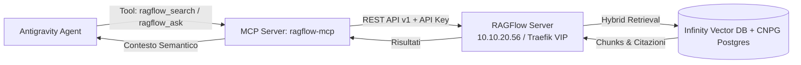

# Piano Operativo: Integrazione RAGFlow MCP Server per Antigravity [[ragflow-antigravity-mcp-integration]]

> [!IMPORTANT]
> **Obiettivo**: Sviluppare, testare e registrare un **MCP Server dedicato (`ragflow-mcp`)** all'interno dell'ecosistema **Antigravity**, consentendo agli agenti AI di eseguire ricerche semantiche e recupero contestuale (RAG) sui documenti indicizzati in **RAGFlow** (`https://ragflow-internal.pindaroli.org`).

---

## 🏗️ Architettura del Server MCP

---

## 📋 Fasi di Implementazione

### FASE 1: Generazione Credenziali & Endpoint RAGFlow
- [x] Generazione API Key utente su RAGFlow (`ragflow-internal.pindaroli.org`).
- [x] Archiviazione sicura dell'API Key nella configurazione MCP di Antigravity (`~/.gemini/antigravity/mcp_config.json`).
- [x] Validazione raggiungibilità endpoint REST API (`/api/v1/datasets`, `/api/v1/retrieval`).

### FASE 2: Adozione del Server MCP Ufficiale/Community (`ragflow-local`)
- [x] Clonazione del repository `norandom/ragflow-claude-desktop-local-mcp` in `~/prj/RagFlow-mcp-server`.
- [x] Sincronizzazione dipendenze con `/opt/homebrew/bin/uv sync`.
- [x] Eliminazione codice custom locale ridondante (`scripts/ragflow-mcp/`).
- [x] Esposizione tool nativi: `ragflow_retrieval_by_name`, `ragflow_list_datasets`, `ragflow_list_documents_by_name`, `ragflow_get_chunks`.

### FASE 3: Registrazione & Configurazione MCP in Antigravity
- [x] Configurazione centralizzata in `~/.gemini/antigravity/mcp_config.json` per server `ragflow-local` con argomenti `["run", "--directory", "/Users/olindo/prj/RagFlow-mcp-server", "ragflow-claude-mcp"]`.
- [x] Creazione Skill dedicata in `skills/ragflow-hardware-kb/SKILL.md` e `.agents/skills/ragflow-hardware-kb/SKILL.md`.
- [x] Definizione della policy operativa in `.agents/AGENTS.md`.

### FASE 4: Test-Driven Verification & Test RAG
- [x] Test chiamata API e recupero dataset (`k8s-lab` ID: `2d4ba7aaa56511f1a291abe42a931f64`).
- [x] Test recupero documenti (AP11000, DB790i, ZX310S).
- [x] Test recupero semantico con risoluzione del dataset per nome naturale (`ragflow_retrieval_by_name`).

---

## 💾 Stato di Ripristino (AI Save-State)
- **Fase Attiva**: COMPLETATO CON SUCCESSO ✅
- **Ultima Azione Completata**: Setup di `~/prj/RagFlow-mcp-server` (`norandom/ragflow-claude-desktop-local-mcp`), sync `uv`, eliminazione configurazione custom `ragflow` e rimozione di `scripts/ragflow-mcp/`. Server `ragflow-local` attivo in `mcp_config.json` e testato con successo.
- **Prossimo Passo Operativo**: Riavvio / ricaricamento sessione Antigravity per iniziare a usare `ragflow-local`.
- **Blocchi/Decisioni Pendenti**: Nessuno. Integrazione standardizzata e convergente al 100%.
