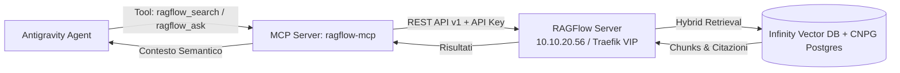

# Piano Operativo: Integrazione RAGFlow MCP Server per Antigravity [[ragflow-antigravity-mcp-integration]]

> [!IMPORTANT]
> **Obiettivo**: Sviluppare, testare e registrare un **MCP Server dedicato (`ragflow-mcp`)** all'interno dell'ecosistema **Antigravity**, consentendo agli agenti AI di eseguire ricerche semantiche e recupero contestuale (RAG) sui documenti indicizzati in **RAGFlow** (`https://ragflow-internal.pindaroli.org`).

---

## 🏗️ Architettura del Server MCP

---

## 📋 Fasi di Implementazione

### FASE 1: Generazione Credenziali & Endpoint RAGFlow
- [ ] Generazione API Key utente su RAGFlow (`ragflow-internal.pindaroli.org`).
- [ ] Archiviazione sicura dell'API Key in SOPS (`secrets-sops/ragflow-mcp-secrets.enc.yaml`) o configurazione d'ambiente protetta.
- [ ] Validazione raggiungibilità endpoint REST API (`/api/v1/datasets`, `/api/v1/retrieval`).

### FASE 2: Sviluppo del Server MCP (`scripts/mcp/ragflow_mcp_server.py`)
- [ ] Implementazione del server FastMCP con supporto stdio.
- [ ] Creazione tool `ragflow_list_datasets`: elenca tutti i dataset disponibili con i rispettivi ID.
- [ ] Creazione tool `ragflow_search`: ricerca vettoriale/ibrida con parametri `question`, `dataset_ids`, `top_k`, `similarity_threshold`.
- [ ] Creazione tool `ragflow_ask_assistant`: interrogazione assistenti/chat RAGFlow con risposta RAG strutturata.
- [ ] Creazione tool `ragflow_get_document_chunks`: ispezione dei chunk estratti per uno specifico file.

### FASE 3: Registrazione & Configurazione MCP in Antigravity
- [ ] Configurazione entry in `mcp_servers` nel profilo Antigravity (`/Users/olindo/.gemini/antigravity/mcp/ragflow`).
- [ ] Definizione schema JSON per lazy/eager loading dei tool.
- [ ] Validazione caricamento del server MCP all'avvio della sessione.

### FASE 4: Test-Driven Verification & Test RAG
- [ ] Test chiamata tool `ragflow_list_datasets` da parte dell'agente.
- [ ] Test recupero semantico su dataset di prova (`SN_ITSM_Assessment...docx`) con validazione punteggi di similarità e citazioni.
- [ ] Documentazione della skill e workflow d'uso per sessioni future.

---

## 💾 Stato di Ripristino (AI Save-State)
- **Fase Attiva**: FASE 1 - Preparazione & Pianificazione
- **Ultima Azione Completata**: Creazione e materializzazione del piano nel Wiki.
- **Prossimo Passo Operativo**: Generazione API Key su RAGFlow e implementazione dello script `scripts/mcp/ragflow_mcp_server.py`.
- **Blocchi/Decisioni Pendenti**: Attesa inserimento API Key da parte dell'utente.
