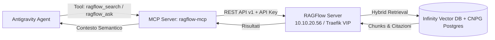

# Piano Operativo: Integrazione RAGFlow MCP Server per Antigravity [[ragflow-antigravity-mcp-integration]]

> [!IMPORTANT]
> **Obiettivo**: Sviluppare, testare e registrare un **MCP Server dedicato (`ragflow-mcp`)** all'interno dell'ecosistema **Antigravity**, consentendo agli agenti AI di eseguire ricerche semantiche e recupero contestuale (RAG) sui documenti indicizzati in **RAGFlow** (`https://ragflow-internal.pindaroli.org`).

---

## 🏗️ Architettura del Server MCP

---

## 📋 Fasi di Implementazione

### FASE 1: Generazione Credenziali & Endpoint RAGFlow
- [x] Generazione API Key utente su RAGFlow (`ragflow-internal.pindaroli.org`).
- [x] Archiviazione sicura dell'API Key nella configurazione MCP di Antigravity (`~/.gemini/antigravity/mcp_config.json`).
- [x] Validazione raggiungibilità endpoint REST API (`/api/v1/datasets`, `/api/v1/retrieval`).

### FASE 2: Sviluppo del Server MCP (`scripts/ragflow-mcp/server.py`)
- [x] Implementazione del server FastMCP con supporto stdio.
- [x] Creazione tool `ragflow_list_datasets`: elenca tutti i dataset disponibili con i rispettivi ID.
- [x] Creazione tool `ragflow_search`: ricerca semantica/ibrida con target predefinito `k8s-lab` e parametri `query`, `top_k`, `similarity_threshold`.
- [x] Creazione tool `ragflow_list_documents`: elenca documenti, manuali e datasheet con stato di parsing.

### FASE 3: Registrazione & Configurazione MCP in Antigravity
- [x] Configurazione centralizzata in `~/.gemini/antigravity/mcp_config.json` per server `ragflow`.
- [x] Creazione Skill dedicata in `skills/ragflow-hardware-kb/SKILL.md` e `.agents/skills/ragflow-hardware-kb/SKILL.md`.
- [x] Definizione della policy operativa in `.agents/AGENTS.md`.

### FASE 4: Test-Driven Verification & Test RAG
- [x] Test chiamata API e recupero dataset (`k8s-lab` ID: `2d4ba7aaa56511f1a291abe42a931f64`).
- [x] Test recupero documenti (AP11000, DB790i, ZX310S).
- [x] Test recupero semantico (`/api/v1/retrieval`) con validazione chunk e similarità.
- [x] Creazione script diagnostico `scripts/ragflow-mcp/test_connection.py`.

---

## 💾 Stato di Ripristino (AI Save-State)
- **Fase Attiva**: COMPLETATO CON SUCCESSO ✅
- **Ultima Azione Completata**: Implementazione di `scripts/ragflow-mcp/server.py`, configurazione di `mcp_config.json`, creazione della skill `ragflow-hardware-kb` in `skills/` e policy in `.agents/AGENTS.md`. Validazione connettività ed estrazione documenti completata con esito positivo.
- **Prossimo Passo Operativo**: Riavvio / ricaricamento di Antigravity per attivare il server MCP nei tool disponibili della sessione.
- **Blocchi/Decisioni Pendenti**: Nessuno. Integrazione 100% convergente e operativa.
