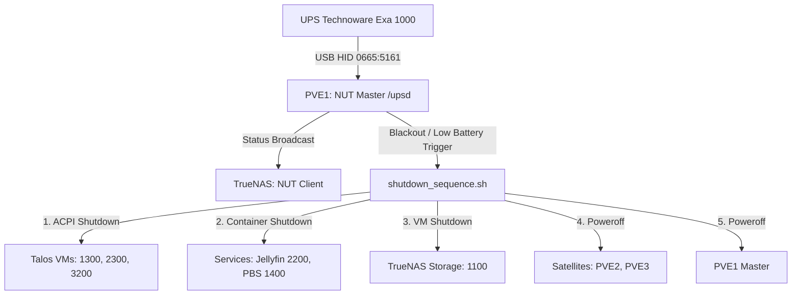

# Configurazione e Orchestrazione UPS Technoware Exa 1000

## 1. Obiettivo
Configurare in modo dichiarativo e resiliente l'UPS Technoware Exa 1000 collegato fisicamente via USB al nodo `pve1`. L'host `pve1` gestirà l'UPS come **NUT Master** e coordinerà lo spegnimento ordinato e sequenziale di tutto l'Homelab (Talos, PBS, TrueNAS, nodi PVE satelliti ed infine se stesso) per evitare perdite di dati e corruzioni nei database distribuiti. TrueNAS agirà da **NUT Client** (Slave) monitorando lo stato energetico.

---

## 2. Architettura di Spegnimento (Runtime)

### Sequenza di Shutdown Orchestrata da PVE1
1. **Talos Kubernetes Cluster**: Comandi `qm shutdown` sulle VM `1300` (su PVE1), `2300` (su PVE2) e `3200` (su PVE3). Le VM Talos supportano lo spegnimento pulito tramite ACPI.
2. **Servizi Dipendenti**: Spegnimento dei container e servizi LXC, inclusi PBS (LXC 1400 su PVE1) e Jellyfin (LXC 2200 su PVE2/PVE3).
3. **TrueNAS (Storage)**: Spegnimento della VM `1100` su PVE1. TrueNAS deve essere spento *dopo* i suoi client per evitare che il network storage NFS scompaia all'improvviso causando blocchi irreversibili e corruzione file.
4. **Nodi Proxmox Satelliti**: Spegnimento fisico di PVE2 (`192.168.100.21`) e PVE3 (`192.168.100.31`) inviando il comando `poweroff` via SSH (i comandi ignorano gli errori in caso i nodi siano offline o in manutenzione).
5. **Host Master (PVE1)**: Spegnimento locale di `pve1` e comando di spegnimento finale (powerdown) all'UPS.

---

## 3. Implementazione tramite Ansible (`setup_ups.yml`)

Il setup viene automatizzato tramite il nuovo playbook `setup_ups.yml` eseguito dal computer di amministrazione.

### A. Configurazione PVE1 (Master)
* Configurazione di NUT in `mode=netserver` in `/etc/nut/nut.conf`.
* Configurazione di `/etc/nut/ups.conf` per utilizzare il driver nativo **`usbhid-ups`** (identificato tramite analisi USB a basso livello sul chip Cypress `0665:5161`).
* Configurazione delle credenziali e dei privilegi in `/etc/nut/upsd.users`:
  * Utente `upsmon` (`master`) per il monitoraggio locale su PVE1.
  * Utente `truenasmon` (`slave`) per TrueNAS.
* Creazione dello script `/etc/nut/shutdown_sequence.sh` con permessi `0755` per gestire la sequenza temporizzata descritta sopra.
* Configurazione del comando di shutdown in `/etc/nut/upsmon.conf` puntando al nostro script personalizzato.

### B. Configurazione TrueNAS (Client)
* Utilizzo del middleware API di TrueNAS SCALE (`midclt`) per impostare i parametri UPS in modalità **SLAVE**:
  * Host remoto: `10.10.10.11`
  * Porta: `3493`
  * Utente: `truenasmon`
  * Password: `{{ ups_truenas_password }}`
* Abilitazione e avvio del servizio `ups` su TrueNAS Scale.

---

## 4. Piano di Verifica

1. **Stato del Collegamento USB**: Verificare che `lsusb` su `pve1` mostri il dispositivo Cypress e che `/dev/hidraw0` / `/dev/usb/hiddev0` vengano creati correttamente.
2. **Lettura Metriche (PVE1)**: Eseguire `upsc ups@localhost` su `pve1` e verificare che vengano visualizzati parametri come `battery.charge`, `input.voltage`, `ups.status`.
3. **Verifica Client TrueNAS**: Verificare che il servizio UPS su TrueNAS passi allo stato `RUNNING` e non registri errori di comunicazione nei log.
4. **Verifica dello script**: Controllare che il file `/etc/nut/shutdown_sequence.sh` sia stato creato correttamente, contenga i VMID aggiornati e abbia permessi di esecuzione.
