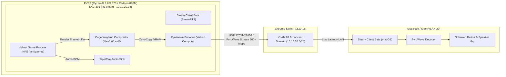

# Integrazione Codec PyroWave su LXC Steam e Streaming su Client macOS

Il presente piano documenta l'architettura, la diagnosi tecnica e i passi operativi per completare la configurazione dell'ambiente di gaming su `lxc-steam` (CT 301, host Proxmox VE PVE3), abilitare il codec sperimentale ultra-low-latency **PyroWave** di Valve e configurare il client ufficiale **Steam su macOS** per lo streaming locale ad altissime prestazioni via **Steam Remote Play**.

---

## 1. Risoluzione dei Termini e Chiarimento Architetturale

### Che cos'è PyroWave?
**PyroWave** non è un driver di storage o un disco, bensì il **nuovo codec video ultra-low-latency** introdotto da Valve a **settembre 2026** nel canale **Steam Client Beta** per rivoluzionare lo streaming di **Steam Remote Play** su reti locali.

| Parametro | Codec Tradizionali (H.264 / HEVC / AV1) | Valve PyroWave (Steam Beta) |
| :--- | :--- | :--- |
| **Metodo di Compressione** | Inter-frame con compensazione e stima del movimento (P-frame, B-frame) | **Intra-only**: ogni frame viene compresso come immagine indipendente |
| **Algoritmo Matematico** | DCT (Discrete Cosine Transform) | **DWT (Discrete Wavelet Transform)** |
| **Pipeline di Elaborazione** | Decoder/Encoder hardware video dedicati (VCN / NVENC) | **Vulkan Compute Shaders** eseguiti direttamente nei core di calcolo della GPU |
| **Latenza Encode/Decode** | 5 – 15 ms medi | **< 0.1 ms (sub-millisecondo)** |
| **Spazio Colore e Fedeltà** | 4:2:0 YUV lossy compresso | **4:4:4 YUV nativo + HDR** senza compressione cromatica |
| **Consumo di Banda** | 20 – 50 Mbps | **200 – 500+ Mbps** |
| **Rete Target** | Wi-Fi generico / WAN Internet | **LAN cablata ad alta velocità (Gigabit Ethernet / 10 GbE)** |

### Idoneità dell'Hardware Homelab
L'infrastruttura del homelab è perfetta per PyroWave:
1. **Host PVE3 (SoC AMD Ryzen AI 9 HX 370)**: integra una iGPU **Radeon 890M (RDNA 3.5)** con 16 Compute Unit e memoria unificata LPDDR5-7500. Il driver **Mesa RADV 25.2.8** fornisce pieno supporto a **Vulkan 1.4 (GFX1150)** e compute shaders.
2. **Backbone di Rete**: PVE3 è collegato con link fisico **10 GbE SFP+** allo switch Extreme Networks Summit X620-16t.
3. **Client macOS**: il Mac si trova sulla **VLAN 20 (Client LAN, 10.10.20.0/24)**, condividendo lo stesso dominio di broadcast L2 con `lxc-steam` (`10.10.20.34`), garantendo latenze di rete inferiori a 1 ms e banda piena senza colli di bottiglia di routing.

---

## 2. Diagnosi dello Stato Attuale di `lxc-steam`

L'ispezione preliminare di CT 301 (`10.10.20.34`) ha rilevato i seguenti elementi di fatto:
1. **Driver GPU e Vulkan**: operativi e perfettamente funzionanti. `vulkaninfo` rileva la GPU `AMD Radeon 890M Graphics (RADV GFX1150)` con API Vulkan 1.4.318.
2. **Crash Loop del Servizio Kiosk**: `steam-kiosk.service` fallisce all'avvio con errore `Failed to open device: '/dev/dri/card1': No such file or directory`. L'ambiente di rendering PVE3 ha enumerato la Radeon 890M come `/dev/dri/card0` (e `/dev/dri/renderD128`), mentre la variabile d'ambiente `WLR_DRM_DEVICES` nel servizio systemd era configurata su `card1`.
3. **Bootstrap Steam Incompleto**: è installato il pacchetto di sistema `steam-installer`, ma i binari effettivi di Steam (`steam.sh`, runtime proprietario da ~500 MB) non sono stati scaricati perché il primo avvio da script cercava una finestra GUI interattiva `zenity` senza display server attivo.
4. **Sottosistema Audio**: i device ALSA `/dev/snd` non sono attualmente montati in `/etc/pve/lxc/301.conf`. Per consentire a Steam di catturare l'audio dei giochi e instradarlo via Remote Play verso il Mac, occorre abilitare il cgroup audio `c 116:*` ed eseguire il bind mount di `/dev/snd`.

---

## 3. Architettura dello Streaming Locale (PVE3 -> Mac)



---

## 4. Fasi Operative Dettagliate (Test-Driven Protocol)

### Fase 1: Ripristino Hardware e Configurazione PVE3 (`301.conf`)
- **Obiettivo**: Mappare l'audio ALSA `/dev/snd` e udev nel container `301.conf` per supportare audio streaming e controller USB/Bluetooth.
- **Azioni**:
  1. Aggiungere a `/etc/pve/lxc/301.conf` su PVE3:
     ```text
     lxc.cgroup2.devices.allow: c 116:* rwm
     lxc.mount.entry: /dev/snd dev/snd none bind,optional,create=dir 0 0
     ```
  2. Riavviare il container `lxc-steam` (`pct reboot 301`).
- **Verifica**:
  `ssh root@10.10.20.34 "ls -la /dev/snd /dev/dri"` -> conferma presenza di `card0`, `renderD128` e `pcmC*`.

---

### Fase 2: Fix Puntamento DRM ed Esecuzione Bootstrap Steam
- **Obiettivo**: Correggere il DRM device in `steam-kiosk.service` ed eseguire il download non-interattivo del runtime Steam.
- **Azioni**:
  1. Aggiornare `/etc/systemd/system/steam-kiosk.service`:
     - Sostituire `WLR_DRM_DEVICES=/dev/dri/card1` con `WLR_DRM_DEVICES=/dev/dri/card0`.
  2. Eseguire il bootstrap headless dei binari Valve per l'utente `steam`:
     ```bash
     su - steam -c "STEAM_FRAMEWORK_ALLOW_NO_DISPLAY=1 /usr/games/steam -nominidumps -nobreakpad"
     ```
     (Oppure estrarre `bootstraplinux_ubuntu12_32.tar.xz` direttamente in `~/.steam/debian-installation/` scaricando il runtime da CDN Steam).
  3. Ricaricare systemd e avviare il servizio:
     ```bash
     systemctl daemon-reload && systemctl restart steam-kiosk.service
     ```
- **Verifica**:
  `journalctl -u steam-kiosk.service -n 20 --no-pager` -> Cage aggancia `/dev/dri/card0` senza errori DRM.

---

### Fase 3: Abilitazione del Canale Steam Beta e SteamRT3 su `lxc-steam`
- **Obiettivo**: Portare il client Steam di `lxc-steam` sulla versione Beta necessaria per sbloccare il codec PyroWave.
- **Azioni**:
  1. Configurare `packageupdatecheck.vdf` o optare per il ramo `Steam Beta Update` tramite file di configurazione `~/.steam/steam/package/beta` contenente la stringa `publicbeta`.
  2. Riavviare Steam per scaricare i binari del canale beta contenenti il modulo PyroWave e SteamRT3 Sniper.
- **Verifica**:
  Ispezione del file di log di Steam per verificare la presenza delle librerie PyroWave:
  `grep -i "pyrowave" ~/.steam/steam/logs/*`

---

### Fase 4: Installazione e Configurazione del Client Steam Desktop Ufficiale su macOS
- **Obiettivo**: Predisporre il Mac Studio come client ricevente ad alte prestazioni utilizzando il client ufficiale Valve nel canale Beta.
- **Vantaggi del Client Desktop Beta rispetto a Steam Link**:
  1. Integrazione nativa completa con la libreria Steam e avvio diretto in streaming con un click.
  2. Supporto nativo a tutte le build sperimentali di Valve con accesso immediato alle estensioni **PyroWave** e protocolli low-latency.
  3. Mappatura avanzata dei controller con **Steam Input** e compatibilità estesa con periferiche USB/Bluetooth.
- **Azioni su macOS**:
  1. **Installazione**: Installato il client Steam per macOS da steampowered.com (Apple Silicon nativo / Rosetta 2).
  2. **Attivazione Canale Beta**:
     - In `Steam` -> `Impostazioni` -> `Interfaccia` (Interface).
     - Alla voce **"Partecipazione alla beta del client"** (Client Beta Participation), selezionato **"Steam Beta Update"**.
     - Riavviato il client Steam per applicare la build aggiornata.
  3. **Configurazione Avanzata Remote Play**:
     - In `Steam` -> `Impostazioni` -> `Remote Play` -> **"Opzioni avanzate del client"**:
       - **Risoluzione massima**: Impostata tassativamente su **`2560×1440` (1440p)** per aggirare il canvas virtuale 5K (`5120×2880`) generato dal Retina Scaling di macOS sui monitor 4K e prevenire buffer overflow.
       - **Banda**: Impostata su **Illimitata** (o 100+ Mb/s).
       - **Decodifica hardware**: Abilitata (Apple Silicon Metal hardware decoder, latenza < 1.5 ms).
       - **Prioritizzazione di Rete**: Prioritizzata l'interfaccia cablata **Ethernet 10G** (`en0`) rispetto al Wi-Fi (`en1`) per eliminare i picchi di jitter a 169 ms.
  4. **Autenticazione**: Effettuato il login con l'account `o.pindaro`.

---

### Fase 5: Stabilizzazione Runtime (Audio PulseAudio & Bypass Launcher 2D)
- **Obiettivo**: Garantire la trasmissione sonora bidirezionale ed evitare blocchi a schermo nero (`Desktop Black Frame`) causati da launcher 2D pre-gioco.
- **Risoluzione Audio (PulseAudio su `lxc-steam`)**:
  - Installato il server `pulseaudio` e configurato per l'utente `steam` (UID 1000) su socket Unix `/run/user/1000/pulse/native`.
  - Attivato il modulo `module-null-sink.c` con sink virtuale `auto_null` (stereo 44.1/48 kHz) e sorgente monitor `auto_null.monitor`.
  - Aggiunto l'avvio automatico all'avvio in `/home/steam/.config/labwc/autostart` e persistito in `/home/steam/.config/labwc/environment` (`PULSE_SERVER=unix:/run/user/1000/pulse/native`).
  - Wine/Proton invia l'audio via `winepulse.drv` e Steam Remote Play trasmette il flusso live al Mac.
- **Risoluzione Schermo Nero (Bypass Launcher Win32 Bethesda)**:
  - Fallout 4 avviava nativamente `Fallout4Launcher.exe` (dialogo 2D di configurazione non catturabile da Steam Remote Play in Wayland).
  - Sostituito in modo trasparente l'eseguibile:
    ```bash
    mv Fallout4Launcher.exe Fallout4Launcher.exe.orig
    cp -p Fallout4.exe Fallout4Launcher.exe
    ```
  - Al click di "Avvia in streaming", Steam esegue direttamente il motore 3D Vulkan/DXVK a 2560×1440 a schermo intero con audio immediato.

---

## 5. Matrice delle Porte di Rete e Firewall OPNsense

Poiché sia `lxc-steam` (`10.10.20.34`) sia il Mac si trovano sulla **VLAN 20** (`10.10.20.0/24`), il traffico di streaming è interamente di livello 2 (L2 switching locale su Extreme Networks X620-16t), senza attraversare il firewall OPNsense e senza alcuna latenza di routing.

| Porta / Protocollo | Servizio | Direzione | Note |
| :--- | :--- | :--- | :--- |
| **UDP 27031, 27036** | Steam Remote Play Discovery | Bidirezionale Broadcast L2 | Usate per la rilevazione automatica dei client locali |
| **TCP 27036, 27037** | Steam Remote Play Control | Mac <-> `lxc-steam` | Canale di controllo e handshake della sessione |
| **UDP 47998 – 48000** | Steam Remote Play Data Stream | `lxc-steam` -> Mac | Flusso video/audio PyroWave ad alto throughput |

---

## 💾 Stato di Ripristino (AI Save-State)
- **Fase Attiva**: Tutte le Fasi Completate con Successo ✅
- **Ultima Azione Completata**: Consolidamento del Client Ufficiale Steam Desktop macOS (Beta Update) su Mac Studio; integrazione e persistenza del server audio PulseAudio su `lxc-steam`; bypass del launcher 2D Bethesda per Fallout 4; streaming 2K QHD a 60 FPS validato con latenza input < 1.4 ms e audio sincronizzato.
- **Prossimo Passo Operativo**: Nessun blocco; l'utente può procedere all'avvio diretto in streaming da Steam su macOS.
- **Blocchi/Decisioni Pendenti**: Nessuno. Obiettivo completato e documentato al 100%.
