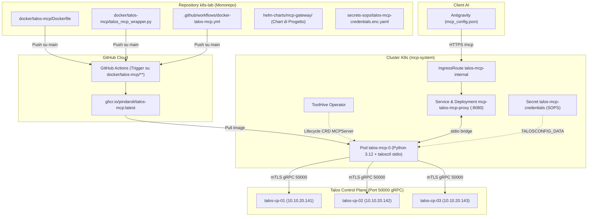

# Piano: Migrazione Kubernetes di Talos MCP Server (Pattern Monorepo)

Questo piano definisce i passaggi operativi per migrare il server MCP **`talos`** dall'esecuzione locale con `uv run` su macOS (`talos-mcp-server==0.3.10`) al cluster Kubernetes homelab nel namespace dedicato `mcp-system`.

Il piano adotta il pattern **Monorepo Homelab** consolidato con `opnsense-mcp`: il `Dockerfile` risiede direttamente in `k8s-lab` (`docker/talos-mcp/`), con automazione CI via GitHub Actions con path filtering selettivo per compilare per architettura `linux/amd64` e pubblicare su `ghcr.io/pindaroli/talos-mcp:latest` e `:0.3.10`. L'orchestrazione del lifecycle e il bridging stdio-to-HTTP/SSE sono governati da **ToolHive Operator**, le credenziali mTLS `talosconfig` sono cifrate con **SOPS**, e l'esposizione è gestita dichiarativamente tramite la Project Chart **`mcp-gateway`** e **Traefik IngressRoute**.

---

## 🗺️ Mappe Concettuali e Relazioni
- [[MCP_Platform]] (Piattaforma Kuadrant & ToolHive in `mcp-system`)
- [[Talos_Cluster]] (Cluster Control Plane nodi `10.10.20.141`, `10.10.20.142`, `10.10.20.143` porta gRPC 50000)
- [[Traefik]] (IngressRoute split-horizon per `talos-mcp-internal.pindaroli.org`)
- [[Secret_Registry]] (Gestione credenziali cifrate con SOPS)

---

## 1. Architettura di Riferimento



---

## 2. Fasi Operative

### Fase 1: Creazione Dockerfile Monorepo & GitHub Actions CI
1. Creare la directory `docker/talos-mcp/`.
2. Creare `docker/talos-mcp/Dockerfile`:
   - Base `python:3.12-slim`.
   - Download del binario `talosctl` v1.13.5 (matching esatto del cluster) da Sidero Labs in `/usr/local/bin/talosctl`.
   - Pip install `talos-mcp-server==0.3.10`, `mcp>=1.0.0,<2.0.0`, `pydantic`.
   - Copia dello script wrapper `talos_mcp_wrapper.py`.
   - Configurazione utente non-root e entrypoint `["python", "/app/talos_mcp_wrapper.py"]`.
3. Creare `docker/talos-mcp/talos_mcp_wrapper.py`:
   - Se `TALOSCONFIG_DATA` è impostata in `os.environ`, scrittura sicura in `/tmp/talos/config` e settaggio di `TALOSCONFIG=/tmp/talos/config`.
   - Monkeypatch di `SupportTool.args_schema` (risolve bug noto in `talos-mcp-server <= 0.3.10`).
   - Avvio della CLI `talos_mcp.cli.cli()`.
4. Creare `.github/workflows/docker-talos-mcp.yml` con trigger su `paths: ['docker/talos-mcp/**', '.github/workflows/docker-talos-mcp.yml']`.
5. Effettuare commit e push su `main` di `k8s-lab` e attendere il completamento del build e push su `ghcr.io/pindaroli/talos-mcp:latest` e `:0.3.10`.

### Fase 2: Provisioning Segreto SOPS
1. Creare `secrets-sops/talos-mcp-credentials.enc.yaml` cifrato con chiave Age contenente la chiave `talosconfig` con il contenuto completo di `talos-config/talosconfig`.
2. Applicare il secret decifrato nel namespace `mcp-system`:
   ```bash
   sops --decrypt secrets-sops/talos-mcp-credentials.enc.yaml | kubectl apply -f -
   ```
3. Verificare che il secret `talos-mcp-credentials` esista in `mcp-system`.

### Fase 3: Integrazione Helm Project Chart (`mcp-gateway`)
1. Incrementare la versione in `helm-charts/mcp-gateway/Chart.yaml` (`0.2.4` → `0.2.5`).
2. Aggiungere il server `talos` a `mcp-gateway/mcp-gateway-values.yaml`:
   - ToolHive: `name: talos-mcp`, `image: ghcr.io/pindaroli/talos-mcp:latest`, `transport: stdio`, `proxyPort: 8080`.
   - Secrets: `talos-mcp-credentials` -> targetEnvName: `TALOSCONFIG_DATA`.
   - IngressRoute: `host: talos-mcp-internal.pindaroli.org`.
   - Environment: `TALOS_MCP_AUDIT_LOG_PATH: /tmp/talos_mcp_audit.log`.
3. Eseguire l'upgrade Helm del chart:
   ```bash
   helm upgrade mcp-gateway helm-charts/mcp-gateway -f mcp-gateway/mcp-gateway-values.yaml -n mcp-system
   ```
4. Verificare la creazione del pod StatefulSet `talos-mcp-0` e del pod proxyrunner `mcp-talos-mcp-proxy`.

### Fase 4: Routing Traefik & DNS Unbound
1. Verificare che l'IngressRoute `talos-mcp-internal` sia stata generata nel namespace `mcp-system`.
2. Aggiungere l'Host Override su OPNsense Unbound DNS:
   - Host: `talos-mcp-internal`
   - Dominio: `pindaroli.org`
   - IP: `10.10.20.56` (Traefik VIP VLAN 20 Server)
3. Validare la coerenza DNS e rete:
   ```bash
   python3 scripts/network/validate_network.py
   ```

### Fase 5: Configurazione Client Antigravity
1. Aggiornare `~/.gemini/antigravity/mcp_config.json` sostituendo il blocco locale `command: uv` con:
   ```json
   "talos": {
     "serverUrl": "https://talos-mcp-internal.pindaroli.org/mcp"
   }
   ```
2. Riavviare il server MCP o verificare la connessione attiva.

### Fase 6: Validazione Funzionale Test-Driven
1. **Test 1**: Richiamare `talos_version` tramite il server remoto `talos` per confermare la comunicazione con i tre nodi CP (`10.10.20.141`, `10.10.20.142`, `10.10.20.143`).
2. **Test 2**: Richiamare `talos_health` o `talos_cluster_show` per convalidare lo stato dell'etcd quorum.
3. **Test 3**: Audit dei log dei pod (`talos-mcp-0` e proxyrunner) per verificare assenza di riavvii o errori gRPC.
4. Aggiornare `wiki/entities/MCP_Platform.md` e archiviare il piano.

---

## 💾 Stato di Ripristino (AI Save-State)
- **Fase Attiva**: Piano Completato con Successo ✅
- **Ultima Azione Completata**: Migrazione completa su Kubernetes nel namespace `mcp-system`, applicazione dell'[[mcp-secret-projection-pattern]] (Archetipo 2: Volume Secret Projection & Workload Immutability), rollout della Chart `mcp-gateway` v0.2.5, registrazione DNS Unbound `talos-mcp-internal.pindaroli.org` -> `10.10.20.56`, e aggiornamento `mcp_config.json`.
- **Prossimo Passo Operativo**: Nessuno (carico di lavoro pienamente convergente e operativo).
- **Blocchi/Decisioni Pendenti**: Nessuno.
