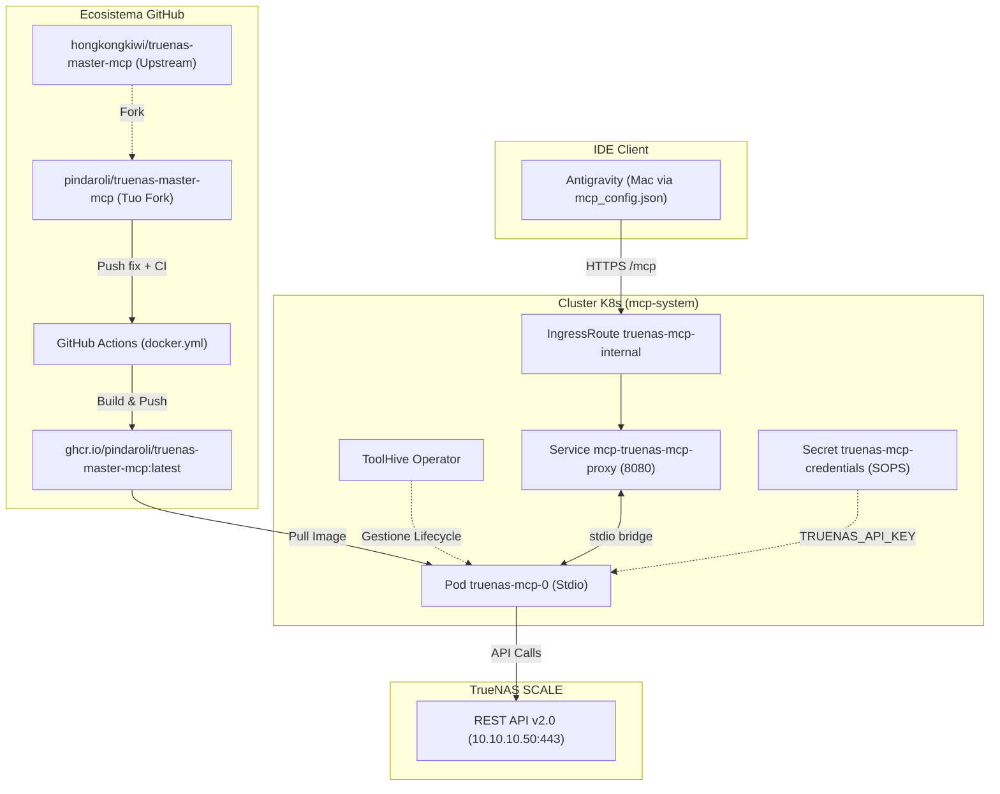

# Piano: Migrazione Kubernetes di TrueNAS Master MCP

Questo piano definisce i passaggi operativi per migrare il server MCP **`truenas-master-mcp`** dall'esecuzione come binario standalone su macOS (`/Users/olindo/.cargo/bin/truenas-master-mcp`) al cluster Kubernetes homelab, collocato nel namespace `mcp-system`.

Il piano adotta la strategia del **Fork GitHub** (`hongkongkiwi/truenas-master-mcp` → `pindaroli/truenas-master-mcp`), integrando le correzioni al protocollo e al client HTTP già validate localmente, e pubblicando l'immagine container su GHCR tramite GitHub Actions.

---

## 🗺️ Mappe Concettuali e Relazioni
- [[MCP_Platform]] (Piattaforma Kuadrant & ToolHive in `mcp-system`)
- [[TrueNAS]] (TrueNAS SCALE `10.10.10.50`, API v2.0)
- [[Traefik]] (IngressRoute split-horizon per `truenas-mcp-internal.pindaroli.org`)
- [[OPNsense]] (Risoluzione DNS locale Unbound)
- [[Secret_Registry]] (Gestione credenziali cifrate con SOPS)

---

## 1. Architettura di Riferimento



---

## 2. Fasi Operative

### Fase 1: Fork GitHub e Riconfigurazione Remotes
1. Creare il fork di `hongkongkiwi/truenas-master-mcp` sotto l'account `pindaroli` tramite API GitHub (`fork_repository`).
2. Nella directory `/Users/olindo/prj/truenas-master-mcp`:
   - Rinominare il remote esistente: `git remote rename origin upstream`.
   - Aggiungere il nuovo origin: `git remote add origin git@github.com:pindaroli/truenas-master-mcp.git`.
   - Verificare l'allineamento con `git remote -v`.

### Fase 2: Containerizzazione e Pubblicazione GHCR
1. Aggiornare `Dockerfile` con una build multi-stage Rust (`linux/amd64`) su base Alpine con entrypoint stdio.
2. Creare il workflow `.github/workflows/docker.yml` per la compilazione automatica e il push su `ghcr.io/pindaroli/truenas-master-mcp:latest`.
3. Committare i fix homelab già collaudati in `src/main.rs` (gestione `protocolVersion`, silenziamento notifiche senza ID) e `src/client.rs` (disattivazione forzatura HTTP/2 prior knowledge).
4. Effettuare il push su `origin main` e attendere il completamento della GitHub Action su GHCR.

### Fase 3: Provisioning Segreto SOPS
1. Creare `secrets-sops/truenas-mcp-credentials.enc.yaml` cifrato con chiave Age.
2. Applicare il secret nel namespace `mcp-system`:
   ```bash
   sops --decrypt secrets-sops/truenas-mcp-credentials.enc.yaml | kubectl apply -f -
   ```

### Fase 4: Integrazione Helm Project Chart (`mcp-gateway`)
1. Incrementare la versione in `helm-charts/mcp-gateway/Chart.yaml` (`0.2.2` → `0.2.3`).
2. Aggiungere il server `truenas` a `mcp-gateway/mcp-gateway-values.yaml`:
   - ToolHive: `image: ghcr.io/pindaroli/truenas-master-mcp:latest`, `transport: stdio`, `proxyPort: 8080`.
   - IngressRoute: `host: truenas-mcp-internal.pindaroli.org`.
   - Environment: `TRUENAS_SERVER_URL: https://10.10.10.50`, `TRUENAS_VERIFY_SSL: false`, `TRUENAS_VERSION: scale`.
3. Eseguire il deploy:
   ```bash
   helm upgrade --install mcp-gateway helm-charts/mcp-gateway -f mcp-gateway/mcp-gateway-values.yaml -n mcp-system
   ```

### Fase 5: Networking & DNS Split-Horizon
1. Aggiungere l'alias `truenas-mcp-internal` al VIP Traefik (`10.10.20.56`) in `rete.json`.
2. Eseguire `python3 scripts/network/validate_network.py`.
3. Registrare l'host override in OPNsense Unbound per `truenas-mcp-internal.pindaroli.org` → `10.10.20.56`.

### Fase 6: Migrazione Configurazione Client Antigravity
1. Modificare `~/.gemini/antigravity/mcp_config.json`:
   ```json
   "truenas-master-mcp": {
     "serverUrl": "https://truenas-mcp-internal.pindaroli.org/mcp",
     "disabledTools": [
       "get_chart_release"
     ]
   }
   ```

### Fase 7: Validazione Test-Driven & Wiki Consolidation
1. Verificare l'avvio regolare dei pod in `mcp-system`.
2. Testare l'handshake JSON-RPC su Traefik con curl.
3. Verificare l'invocazione di uno strumento da Antigravity (es. `list_pools`).
4. Rigenerare il contesto wiki: `python3 scripts/wiki/build_wiki_context.py`.

---

## 3. Verification Plan

### Test Automatizzati
- `helm lint helm-charts/mcp-gateway`
- `python3 scripts/network/validate_network.py`
- `python3 scripts/wiki/build_wiki_context.py`

### Test Manuali
- `kubectl get pods -n mcp-system -l toolhive-name=truenas-mcp`
- `kubectl get ingressroute truenas-mcp-internal -n mcp-system`
- Handshake test con curl su `https://truenas-mcp-internal.pindaroli.org/mcp`.

---

## 💾 Stato di Ripristino (AI Save-State)
- **Fase Attiva**: Completato (Archiviato)
- **Ultima Azione Completata**: Migrazione Kubernetes completata con successo. Container compilato e distribuito via ToolHive Operator su Kubernetes, IngressRoute Traefik e DNS OPNsense operativi, endpoint remoto integrato in `mcp_config.json`, documentazione e diagrammi di `MCP_Platform.md` aggiornati.
- **Prossimo Passo Operativo**: Nessuno.
- **Blocchi/Decisioni Pendenti**: Nessuno.
