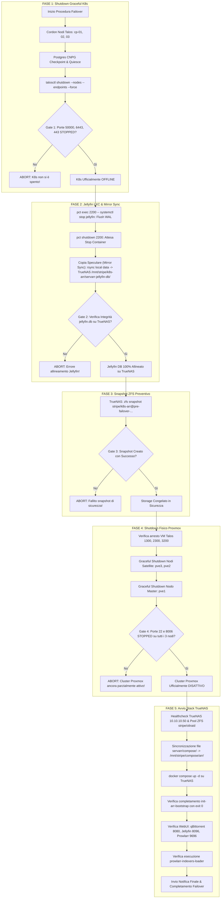

# Piano: Migrazione a Configurazione Solo TrueNAS (Failover & Disaster Recovery)

## 1. Obiettivo e Scenario Operativo
Questo piano definisce l'architettura, la sequenza temporale e l'implementazione del playbook Ansible unificato (`ansible/playbooks/infrastructure/migrate_to_truenas_only.yml`) per eseguire la transizione controllata dell'infrastruttura Homelab da configurazione standard (Kubernetes su hypervisor Proxmox) a **configurazione "Solo TrueNAS"** (Docker Compose Failover).

### Scenari d'Uso
1. **Manutenzioni Hardware e OS Proxmox**: Interventi sui nodi fisici `pve1`, `pve2`, `pve3` (upgrade del kernel, sostituzione componenti, test di rete) mantenendo i servizi multimediali attivi.
2. **Risparmio Energetico / Emergenza UPS**: Blackout prolungato o necessità di ridurre drasticamente il consumo elettrico del rack, spegnendo i 3 server Proxmox e lasciando acceso esclusivamente TrueNAS Bare Metal.
3. **Manutenzione del Database o Rete K8s**: Riconfigurazioni del cluster PostgreSQL CNPG o delle policy di rete del cluster Talos.

---

## 2. Principi Architetturali e Gate di Sbarramento



---

## 3. Dettaglio delle Fasi Operative

### Fase 1: Shutdown Graceful di Kubernetes (Talos)
- **Riuso Componente Collaudato**: Invocazione del flusso di [`shutdown_talos_graceful.yml`](file:///Users/olindo/prj/k8s-lab/ansible/playbooks/infrastructure/shutdown_talos_graceful.yml).
- **Sequenza Operativa**:
  1. `kubectl cordon talos-cp-01 talos-cp-02 talos-cp-03`: previene rescheduling dei pod.
  2. `kubectl exec -n default -c postgres postgres-main-1 -- psql -U postgres -c "CHECKPOINT;"`: forza il flush del Write-Ahead Log (WAL) su storage TrueNAS.
  3. `talosctl shutdown --nodes 10.10.20.141,10.10.20.142,10.10.20.143 --endpoints 10.10.20.141 --force --wait=false`.
- **Gate di Sbarramento 1**:
  - Verifica arresto porta `50000` (Talos API) sui tre nodi (`10.10.20.141`, `10.10.20.142`, `10.10.20.143`).
  - Verifica arresto porta `6443` (Kubernetes API Server VIP `10.10.20.55`).
  - Verifica arresto porta `443` (Traefik Ingress VIP `10.10.20.56`).

### Fase 2: Chiusura Graceful LXC Jellyfin (2200) & Copia Speculare (Mirror Sync) verso TrueNAS
- **Origine**: Nodo Proxmox `pve3` (`10.10.10.31`), storage locale container `/var/lib/lxc/2200/rootfs/var/lib/jellyfin/data/`.
- **Destinazione**: TrueNAS Bare Metal (`10.10.10.50`), dataset ZFS `/mnt/stripe/k8s-arr/servarr-jellyfin-db/`.
- **Sequenza Operativa**:
  1. `pct exec 2200 -- systemctl stop jellyfin`: chiusura pulita di Jellyfin, arresto transazioni e checkpoint completo di `jellyfin.db`.
  2. `pct shutdown 2200`: arresto del container LXC con verifica stato `stopped`.
  3. **Mirror Sync ad Alta Velocità (10GbE DAC)**:
     ```bash
     rsync -av --delete /var/lib/lxc/2200/rootfs/var/lib/jellyfin/data/ root@10.10.10.50:/mnt/stripe/k8s-arr/servarr-jellyfin-db/
     ```
  4. Sincronizzazione file XML di configurazione:
     ```bash
     rsync -av /var/lib/lxc/2200/rootfs/etc/jellyfin/ root@10.10.10.50:/mnt/stripe/k8s-arr/servarr-jellyfin-config/
     ```
  5. Assegnazione permessi corretti su TrueNAS:
     ```bash
     chown -R 1000:1000 /mnt/stripe/k8s-arr/servarr-jellyfin-* && chmod -R 775 /mnt/stripe/k8s-arr/servarr-jellyfin-*
     ```
- **Gate di Sbarramento 2**:
  - Verifica presenza fisica di `jellyfin.db` su TrueNAS con dimensione consistente (> 100 MB).

### Fase 3: Snapshot ZFS Preventivo di Sicurezza (Rollback Paracadute)
- **Motivazione**: Quando Docker Compose si avvia, Jellyfin e gli altri servizi aprono e modificano i database. Creare uno snapshot immediato garantisce un tasto "Annulla" istantaneo (1 millisecondo) prima di qualsiasi scrittura di Docker.
- **Comando**:
  ```bash
  zfs snapshot stripe/k8s-arr@pre-failover-$(date +%F_%H%M%S)
  ```
- **Gate di Sbarramento 3**:
  - Verifica che lo snapshot figuri nell'output di `zfs list -t snapshot stripe/k8s-arr`.

### Fase 4: Shutdown Ordinato dei Nodi Fisici Proxmox VE
- **Target**: Nodi `pve3` (10.10.10.31), `pve2` (10.10.10.21), `pve1` (10.10.10.11).
- **Sequenza Operativa**:
  1. Verifica stato delle VM Talos (`1300` su PVE1, `2300` su PVE2, `3200` su PVE3): attesa stato `stopped`.
  2. Invia segnale di spegnimento ACPI ai nodi satellite (`pve3` e `pve2`):
     ```bash
     ssh -o BatchMode=yes -o ConnectTimeout=5 root@10.10.10.31 "shutdown -h now"
     ssh -o BatchMode=yes -o ConnectTimeout=5 root@10.10.10.21 "shutdown -h now"
     ```
  3. Invia segnale di spegnimento ACPI al nodo master (`pve1`):
     ```bash
     ssh -o BatchMode=yes -o ConnectTimeout=5 root@10.10.10.11 "shutdown -h now"
     ```
- **Gate di Sbarramento 4**:
  - `wait_for` porta 22 (SSH) `state: stopped` su `10.10.10.31`, `10.10.10.21`, `10.10.10.11` (timeout 120s).
  - `wait_for` porta 8006 (PVE WebUI) `state: stopped` su `10.10.10.31`, `10.10.10.21`, `10.10.10.11` (timeout 30s).

### Fase 5: Avvio e Validazione dello Stack Docker Compose su TrueNAS
- **Target**: TrueNAS SCALE Bare Metal (`10.10.10.50`, user `olindo` con `become: true`).
- **Sequenza Operativa**:
  1. Sincronizzazione dichiarativa dei file dello stack da repository locale `servarr/compose/` verso `/mnt/stripe/compose/arr/` su TrueNAS:
     - `docker-compose.yml`
     - `load_indexers.py`
     - `indexers_dump.json`
     - `.env`
  2. Esecuzione del comando di avvio:
     ```bash
     cd /mnt/stripe/compose/arr && docker compose up -d
     ```
  3. Ispezione container `init-arr-bootstrap`:
     - Conferma che il probe Traefik ha rilevato K8s spento (`K8S_ACTIVE=0`).
     - Applicazione patch di sicurezza LAN su `qBittorrent.conf`.
     - Creazione sottocartella `sqlite/` e allineamento ApiKey di Prowlarr.
     - Completamento con codice `exit 0`.
  4. Healthcheck delle porte applicative su TrueNAS (`10.10.10.50`):
     - `wait_for` porta 8080 (qBittorrent WebUI) `state: started`.
     - `wait_for` porta 8096 (Jellyfin WebUI con DB allineato) `state: started`.
     - `wait_for` porta 9696 (Prowlarr WebUI) `state: started`.
  5. Verifica importazione indexer:
     - Ispezione log del container one-shot `prowlarr-indexers-loader` per attestare il caricamento da `indexers_dump.json`.
  6. Notifica e riepilogo operativo a video e via Telegram (se configurato).

---

## 4. Matrice di Storage e Corrispondenza Volumi

| Servizio | Origine (K8s/Proxmox) | Destinazione TrueNAS | Mount Container Docker | Note |
| :--- | :--- | :--- | :--- | :--- |
| **Jellyfin DB** | `pve3:/var/lib/lxc/2200/rootfs/var/lib/jellyfin/data/` | `/mnt/stripe/k8s-arr/servarr-jellyfin-db` | `/config/data` | Database SQLite `jellyfin.db` |
| **Jellyfin Config** | `pve3:/var/lib/lxc/2200/rootfs/etc/jellyfin/` | `/mnt/stripe/k8s-arr/servarr-jellyfin-config` | `/config` | File XML e configurazioni UI |
| **Jellyfin Media** | Dataset NFS TrueNAS | `/mnt/oliraid/arrdata/media` | `/media` | Libreria multimediale su HDD |
| **Jellyfin GPU** | CPU host | `/dev/dri` | `/dev/dri` | Passthrough GPU AMD Ryzen Vega |
| **qBittorrent** | Dataset NFS TrueNAS | `/mnt/stripe/k8s-arr/servarr-qbittorrent` | `/config` | File `.fastresume` e configurazione |
| **qBittorrent Temp** | Dataset NFS TrueNAS | `/mnt/stripe/qb_temp` | `/data/incomplete` | Temp download su NVMe |
| **Prowlarr** | K8s CNPG PostgreSQL | `/mnt/stripe/k8s-arr/servarr-prowlarr/sqlite` | `/config` | SQLite isolato con ApiKey sincronizzata |

---

## 5. Procedura Simmetrica di Rientro su Kubernetes (Switch-Back)

Quando la finestra di manutenzione o l'emergenza energetica termina, il rientro alla configurazione ordinaria avviene in sicurezza:
1. **Arresto dello Stack Docker su TrueNAS**:
   ```bash
   cd /mnt/stripe/compose/arr && docker compose down
   ```
2. **Retro-Copia Speculare Dati Jellyfin (Opzionale/Consigliata)**:
   Se durante il failover sono stati visualizzati contenuti o aggiunti preferiti, sincronizzare a ritroso `jellyfin.db` da `/mnt/stripe/k8s-arr/servarr-jellyfin-db/` verso il disco locale di `pve3` prima di riavviare LXC 2200.
3. **Accensione Fisica Nodi Proxmox**:
   Accensione manuale/PDU dei server `pve1`, `pve2`, `pve3`.
4. **Esecuzione Playbook Startup**:
   Esecuzione di [`startup_talos_graceful.yml`](file:///Users/olindo/prj/k8s-lab/ansible/playbooks/infrastructure/startup_talos_graceful.yml):
   - Verifica NFS TrueNAS (porta 2049).
   - Avvio VM Talos `1300`, `2300`, `3200`.
   - Attesa quorum etcd (porta 6443 su VIP `10.10.20.55`).
   - Uncordon globale dei 3 nodi.

---

## 6. Protocollo di Verifica e Sicurezza
- **Nessun hardcoding di credenziali**: Connessioni SSH unicamente basate su `id_ed25519` con `BatchMode=yes`.
- **Nessun port-forwarding effimero**: Accesso diretto su IP TrueNAS (`10.10.10.50:8080`, `8096`, `9696`).
- **Verifica automatica idempotenza e stato**: Timeout controllati e fallimento esplicito in caso di mancato raggiungimento dello stato target.

---

## 💾 Stato di Ripristino (AI Save-State)
- **Fase Attiva**: Fase 3 / Validazione Sintattica Completata (Pronto per Finestra di Manutenzione)
- **Ultima Azione Completata**: Creati e validati sintatticamente con successo sia il playbook di migrazione (`ansible/playbooks/infrastructure/migrate_to_truenas_only.yml`) che il playbook di ripristino (`ansible/playbooks/infrastructure/restore_from_truenas_only.yml`).
- **Prossimo Passo Operativo**: Esecuzione reale controllata su finestra di manutenzione concordata con l'utente (Nessuna esecuzione a caldo durante la normale operatività).
- **Blocchi/Decisioni Pendenti**: In attesa di pianificazione della finestra operativa da parte dell'utente.
