# Piano: Cambio Regime di Funzionamento On-Demand (Cluster Proxmox/K8s ↔ Mononodo TrueNAS)

## 1. Obiettivo e Scenario Operativo

Questo piano definisce l'architettura a **regime duale (Dual-Regime Architecture)** e l'orchestrazione automatizzata Ansible (`ansible/playbooks/infrastructure/migrate_to_truenas_only.yml` per lo spegnimento e `ansible/playbooks/infrastructure/restore_from_truenas_only.yml` per il rientro) per eseguire un **cambio di regime di funzionamento controllato, reversibile e su intervento dell'operatore**:

- **NON è uno switch definitivo**: il cluster Kubernetes su Proxmox VE rimane l'infrastruttura primaria ad alta disponibilità del laboratorio.
- **NON è una procedura di Disaster Recovery (DR)**: non interviene a seguito di guasti o incidenti, ma opera su nodi sani per decisione gestionale dell'operatore.
- **È un Cambio di Regime Reversibile On-Demand per Risparmio Energetico**:
  - **Scopo Primario — Risparmio Energetico (Green / Eco Mode)**: Ridurre drasticamente il consumo elettrico, la rumorosità e la dissipazione termica del rack **quando le piene funzionalità del cluster Kubernetes (ridondanza, quorum etcd, database distribuiti, microservizi ausiliari) e degli hypervisor Proxmox non sono strettamente necessarie** (ad esempio durante le ore notturne, periodi di assenza da casa, mesi estivi caldi o normale fruizione multimediale che richiede solo storage e riproduzione).
  - **Accensione e Spegnimento dei 3 Nodi Proxmox a Richiesta**:
    - **Regime Mononodo TrueNAS (Low-Power Mode)**: I 3 nodi fisici Proxmox (`pve1`, `pve2`, `pve3`) vengono spenti in modo pulito e coordinato. TrueNAS SCALE Bare Metal (`10.10.10.50`) rimane l'unico server di calcolo attivo nel rack, erogando lo stack essenziale: Homepage (porta `3000`), qBittorrent (`8080`), Jellyfin 12 (`8096` con GPU AMD Vega) e Prowlarr (`9696` con SQLite).
    - **Regime Cluster Ordinario (High-Availability Mode)**: Quando l'operatore necessita nuovamente dell'intera flotta di servizi o della piena potenza di calcolo, riaccende i 3 nodi Proxmox. Il rientro è completamente simmetrico e automatico, ripristinando il cluster Kubernetes e l'LXC Jellyfin **senza alcuna perdita di dati o dello storico visioni generato durante il periodo su TrueNAS**.

---

## 2. Principi Architetturali e Gate di Sbarramento

```mermaid
flowchart TD
    subgraph FASE 1: Shutdown Graceful K8s
        A[Inizio Procedura Failover] --> B[Cordon Nodi Talos: cp-01, 02, 03]
        B --> C[Postgres CNPG Checkpoint & Quiesce]
        C --> D[talosctl shutdown --nodes --endpoints --force]
        D --> E{Gate 1: Porte 50000, 6443, 443 STOPPED?}
        E -- No --> E_FAIL[ABORT: K8s non si è spento!]
        E -- Sì --> F[K8s Ufficialmente OFFLINE]
    end

    subgraph FASE 2: Jellyfin 12 LXC Stop & DB Sync
        F --> G1[pct exec 2200 -- systemctl stop jellyfin: Flush WAL]
        G1 --> G2[pct shutdown 2200: Attesa Stop Container]
        G2 --> G3["Mirror Sync: rsync local NVMe data -> TrueNAS /mnt/stripe/k8s-arr/servarr-jellyfin-db/"]
        G3 --> G4{Gate 2: Verifica Integrità jellyfin.db su TrueNAS?}
        G4 -- No --> G_FAIL[ABORT: Errore allineamento Jellyfin!]
        G4 -- Sì --> H[Jellyfin DB Produzione Allineato su TrueNAS]
    end

    subgraph FASE 3: Preparazione Storage Isolato -truenas & Tuning Vega
        H --> CLN["Clean-Slate: rm -rf servarr-jellyfin-*-truenas"]
        CLN --> CP["Copia Locale Rapida: cp -a prod -> -truenas"]
        CP --> TUNE["Adattamento encoding.xml AMD Vega VA-API & network.xml LAN"]
        TUNE --> VER_ISOL{Gate 3: File jellyfin.db, encoding.xml, network.xml pronti?}
        VER_ISOL -- No --> ISOL_FAIL[ABORT: Errore preparazione storage isolato!]
        VER_ISOL -- Sì --> I1[Storage Segregato Failover Pronto]
    end

    subgraph FASE 4: Shutdown Fisico Proxmox
        I1 --> I2[Verifica arresto VM Talos 1300, 2300, 3200]
        I2 --> I3[Graceful Shutdown Nodi Satellite: pve3, pve2]
        I3 --> I4[Graceful Shutdown Nodo Master: pve1]
        I4 --> J{Gate 4: Porte 22 e 8006 STOPPED su tutti i 3 nodi?}
        J -- No --> J_FAIL[ABORT: Cluster Proxmox ancora parzialmente attivo!]
        J -- Sì --> K[Cluster Proxmox Ufficialmente DISATTIVO]
    end

    subgraph FASE 5: Avvio Stack Failover TrueNAS
        K --> L[Healthcheck TrueNAS 10.10.10.50 & Pool ZFS stripe/oliraid]
        L --> M["Sincronizzazione servarr/compose/ (inclusa homepage-config-truenas)"]
        M --> N[docker compose up -d su TrueNAS]
        N --> O[Verifica completamento init-arr-bootstrap con exit 0]
        O --> P[Verifica WebUI: Homepage 3000, qBittorrent 8080, Jellyfin 8096, Prowlarr 9696]
        P --> Q[Verifica esecuzione prowlarr-indexers-loader]
        Q --> R[Invio Notifica Finale & Failover Attivo]
    end
```



---

## 3. Dettaglio delle Fasi Operative

### Fase 1: Shutdown Graceful di Kubernetes (Talos)
- **Riuso Componente Collaudato**: Invocazione del flusso di [`shutdown_talos_graceful.yml`](file:///Users/olindo/prj/k8s-lab/ansible/playbooks/infrastructure/shutdown_talos_graceful.yml).
- **Sequenza Operativa**:
  1. `kubectl cordon talos-cp-01 talos-cp-02 talos-cp-03`: previene rescheduling dei pod.
  2. `kubectl exec -n default -c postgres postgres-main-1 -- psql -U postgres -c "CHECKPOINT;"`: forza il flush del Write-Ahead Log (WAL) su storage TrueNAS.
  3. `talosctl shutdown --nodes 10.10.20.141,10.10.20.142,10.10.20.143 --endpoints 10.10.20.141 --force --wait=false`.
- **Gate di Sbarramento 1**:
  - Verifica arresto porta `50000` (Talos API) sui tre nodi (`10.10.20.141`, `10.10.20.142`, `10.10.20.143`).
  - Verifica arresto porta `6443` (Kubernetes API Server VIP `10.10.20.55`).
  - Verifica arresto porta `443` (Traefik Ingress VIP `10.10.20.56`).

### Fase 2: Chiusura Graceful LXC Jellyfin 12 (2200) & Mirror Sync verso TrueNAS
- **Origine**: Nodo Proxmox `pve3` (`10.10.10.31`), storage NVMe locale container `/rpool/data/jellyfin-db/`.
- **Destinazione**: TrueNAS Bare Metal (`10.10.10.50`), dataset ZFS NFS `/mnt/pve/k8s-arr/servarr-jellyfin-db/` (path locale TrueNAS: `/mnt/stripe/k8s-arr/servarr-jellyfin-db/`).
- **Sequenza Operativa**:
  1. `pct exec 2200 -- systemctl stop jellyfin`: chiusura pulita di Jellyfin, arresto transazioni e checkpoint completo di `jellyfin.db`.
  2. `pct shutdown 2200`: arresto del container LXC con verifica stato `stopped`.
  3. **Mirror Sync ad Alta Velocità (10GbE DAC)**:
     ```bash
     rsync -av --delete /rpool/data/jellyfin-db/ /mnt/pve/k8s-arr/servarr-jellyfin-db/
     ```
  4. Assegnazione permessi corretti su TrueNAS:
     ```bash
     chown -R 1000:1000 /mnt/pve/k8s-arr/servarr-jellyfin-db/ && chmod -R 775 /mnt/pve/k8s-arr/servarr-jellyfin-db/
     ```
- **Gate di Sbarramento 2**:
  - Verifica presenza fisica di `jellyfin.db` su TrueNAS con dimensione consistente.

### Fase 3: Preparazione Storage Isolato Jellyfin 12 (-truenas) e Tuning Hardware AMD Vega / LAN
- **Motivazione Architetturale**: L'istanza Docker Jellyfin su TrueNAS **NON deve operare direttamente sui file di produzione** di Kubernetes/LXC per evitare contaminazioni e incompatibilità hardware (Intel QSV vs AMD Vega). Opera invece su directory segregate usa-e-getta.
- **Sequenza Operativa**:
  1. **Clean-Slate**: Eliminazione ricorsiva preventiva di eventuali vecchie directory temporanee su TrueNAS:
     - `/mnt/stripe/k8s-arr/servarr-jellyfin-config-truenas`
     - `/mnt/stripe/k8s-arr/servarr-jellyfin-db-truenas`
  2. **Copia Locale Rapida (`cp -a`)**:
     - `cp -a /mnt/stripe/k8s-arr/servarr-jellyfin-config /mnt/stripe/k8s-arr/servarr-jellyfin-config-truenas`
     - `cp -a /mnt/stripe/k8s-arr/servarr-jellyfin-db /mnt/stripe/k8s-arr/servarr-jellyfin-db-truenas`
  3. **Adattamento `encoding.xml` per GPU AMD Radeon Vega (Cezanne APU Ryzen 5 PRO 5650G)**:
     - Driver VA-API generico: `/dev/dri/renderD128`.
     - Codec supportati: H.264, HEVC 10-bit, VP9, HDR Tone Mapping.
     - **AV1 Disabilitato**: Vega 8 (VCN 2.2) non supporta decodifica hardware AV1.
  4. **Adattamento `network.xml` per Routing L3 (Anti-403 Forbidden)**:
     - `<EnableRemoteAccess>true</EnableRemoteAccess>`
     - `<LocalNetworkSubnets>10.10.0.0/16</LocalNetworkSubnets>` (garantisce accesso senza blocchi dai client su VLAN 20 verso TrueNAS su VLAN 10).
  5. **Normalizzazione Permessi**: `chown -R 1000:1000` e `chmod -R 775` sui percorsi `-truenas`.
- **Gate di Sbarramento 3**:
  - Verifica presenza fisica dei file `jellyfin.db`, `encoding.xml` e `network.xml` nei percorsi `-truenas`.
- **Nota di Sicurezza**: Lo snapshot ZFS preventivo non è più necessario in quanto i dataset di produzione rimangono totalmente incontaminati e read-only durante l'intera durata del failover.

### Fase 4: Shutdown Ordinato dei Nodi Fisici Proxmox VE
- **Target**: Nodi `pve3` (10.10.10.31), `pve2` (10.10.10.21), `pve1` (10.10.10.11).
- **Sequenza Operativa**:
  1. Verifica stato delle VM Talos (`1300` su PVE1, `2300` su PVE2, `3200` su PVE3): attesa stato `stopped`.
  2. Invia segnale di spegnimento ACPI ai nodi satellite (`pve3` e `pve2`):
     ```bash
     ssh -o BatchMode=yes -o ConnectTimeout=5 root@10.10.10.31 "shutdown -h now"
     ssh -o BatchMode=yes -o ConnectTimeout=5 root@10.10.10.21 "shutdown -h now"
     ```
  3. Invia segnale di spegnimento ACPI al nodo master (`pve1`):
     ```bash
     ssh -o BatchMode=yes -o ConnectTimeout=5 root@10.10.10.11 "shutdown -h now"
     ```
- **Gate di Sbarramento 4**:
  - `wait_for` porta 22 (SSH) `state: stopped` su `10.10.10.31`, `10.10.10.21`, `10.10.10.11` (timeout 120s).
  - `wait_for` porta 8006 (PVE WebUI) `state: stopped` su `10.10.10.31`, `10.10.10.21`, `10.10.10.11` (timeout 30s).

### Fase 5: Avvio e Validazione dello Stack Docker Compose su TrueNAS
- **Target**: TrueNAS SCALE Bare Metal (`10.10.10.50`, user `olindo` con `become: true`).
- **Sequenza Operativa**:
  1. Sincronizzazione dichiarativa dei file dello stack da repository locale `servarr/compose/` verso `/mnt/stripe/compose/arr/` su TrueNAS:
     - `docker-compose.yml`
     - `load_indexers.py`
     - `indexers_dump.json`
     - `.env`
     - Directory configurazione dashboard: `homepage-config-truenas/`
  2. Esecuzione del comando di avvio:
     ```bash
     cd /mnt/stripe/compose/arr && docker compose up -d
     ```
  3. Ispezione container `init-arr-bootstrap`:
     - Conferma che il probe Traefik e nodi PVE ha rilevato K8s/PVE spenti.
     - Applicazione patch di sicurezza LAN su `qBittorrent.conf`.
     - Creazione sottocartella `sqlite/` e allineamento ApiKey di Prowlarr.
     - Verifica permessi cartelle Jellyfin `-truenas`.
     - Completamento con codice `exit 0`.
  4. Healthcheck delle porte applicative su TrueNAS (`10.10.10.50`):
     - `wait_for` porta 3000 (Homepage Failover Dashboard) `state: started`.
     - `wait_for` porta 8080 (qBittorrent WebUI) `state: started`.
     - `wait_for` porta 8096 (Jellyfin WebUI con DB allineato e AMD Vega VAAPI) `state: started`.
     - `wait_for` porta 9696 (Prowlarr WebUI) `state: started`.
  5. Verifica importazione indexer:
     - Ispezione log del container one-shot `prowlarr-indexers-loader` per attestare il caricamento da `indexers_dump.json`.
  6. Notifica e riepilogo operativo finale.

---

## 4. Matrice di Storage e Corrispondenza Volumi

| Servizio | Origine (K8s/Proxmox) | Destinazione TrueNAS | Mount Container Docker | Note |
| :--- | :--- | :--- | :--- | :--- |
| **Homepage** | Config locale repo | `/mnt/stripe/compose/arr/homepage-config-truenas` | `/app/config` | Solo apparati statici e container TrueNAS |
| **Jellyfin Config** | Replica locale da prod | `/mnt/stripe/k8s-arr/servarr-jellyfin-config-truenas` | `/config` | **Segregato usa-e-getta**: `encoding.xml` Vega, `network.xml` LAN |
| **Jellyfin DB** | Replica locale da prod | `/mnt/stripe/k8s-arr/servarr-jellyfin-db-truenas` | `/config/data` | **Segregato usa-e-getta**: `jellyfin.db` SQLite EF Core |
| **Jellyfin Media** | Dataset NFS TrueNAS | `/mnt/oliraid/arrdata/media` | `/mnt/media` e `/media` | Doppia mappatura per parità assoluta path DB EF Core |
| **Jellyfin GPU** | Silicio host | `/dev/dri` | `/dev/dri` | Passthrough GPU AMD Cezanne Vega 8 (`renderD128`) |
| **qBittorrent** | Dataset NFS TrueNAS | `/mnt/stripe/k8s-arr/servarr-qbittorrent` | `/config` | File `.fastresume` e configurazione condivisa |
| **qBittorrent Temp** | Dataset NFS TrueNAS | `/mnt/stripe/qb_temp` | `/data/incomplete` | Temp download su NVMe |
| **Prowlarr** | K8s CNPG PostgreSQL | `/mnt/stripe/k8s-arr/servarr-prowlarr/sqlite` | `/config` | SQLite isolato con ApiKey clonata da prod |

---

## 5. Procedura Simmetrica di Rientro su Kubernetes (Switch-Back Reversibile)

Quando l'operatore decide di terminare il periodo a basso consumo e ripristinare il **Regime Cluster Ordinario**, il rientro avviene in modo controllato preservando tutti i dati generati:

1. **Arresto dello Stack Docker su TrueNAS e Consolidamento Transazioni**:
   - Stop del container Jellyfin su TrueNAS.
   - Checkpoint forzato del database SQLite per riversare le pagine WAL nel file principale:
     ```bash
     sqlite3 /mnt/stripe/k8s-arr/servarr-jellyfin-db-truenas/jellyfin.db "PRAGMA wal_checkpoint(TRUNCATE);"
     ```
   - Chiusura completa dello stack: `cd /mnt/stripe/compose/arr && docker compose down`.
2. **Accensione dei Nodi Proxmox VE**:
   - Accensione manuale (pulsante fisico) o da remoto (Wake-on-LAN / Smart PDU) dei server `pve1`, `pve2`, `pve3`.
   - Il playbook `restore_from_truenas_only.yml` attende la disponibilità della porta SSH 22 su tutti e tre i nodi.
3. **Retro-Sincronizzazione Atomica Jellyfin 12 (TrueNAS → PVE3)**:
   - Copia selettiva del solo `jellyfin.db` consolidato da TrueNAS NFS verso il filesystem NVMe locale di `pve3`:
     ```bash
     rsync -av --no-owner --no-group /mnt/pve/k8s-arr/servarr-jellyfin-db-truenas/jellyfin.db /rpool/data/jellyfin-db/jellyfin.db
     ```
   - **Isolamento Hardware Preservato**: `encoding.xml` (tarato su AMD Radeon 890M RDNA 3.5 con AV1) e `network.xml` su `pve3` rimangono intatti e non vengono sovrascritti.
   - Normalizzazione dei permessi POSIX per l'utente `jellyfin` all'interno del container LXC (`pct exec 2200 -- chown -R jellyfin:jellyfin /var/lib/jellyfin/data`).
4. **Avvio Container Jellyfin 12 (LXC 2200)**:
   - Avvio del container su `pve3`: `pct start 2200`.
   - Jellyfin riparte con tutti i nuovi progressi di visione, segnalibri e preferiti registrati durante la modalità TrueNAS.
5. **Avvio VM Talos & Quorum K8s**:
   - Avvio coordinato delle VM Talos `1300`, `2300`, `3200` su Proxmox.
   - Attesa quorum etcd e raggiungibilità API Server K8s (porta 6443 su VIP `10.10.20.55`).
   - Uncordon globale dei 3 nodi Talos per riattivare lo scheduling dei pod.

---

## 6. Protocollo di Verifica e Sicurezza
- **Nessun hardcoding di credenziali**: Connessioni SSH unicamente basate su `id_ed25519` con `BatchMode=yes`.
- **Nessun port-forwarding effimero**: Accesso diretto su IP TrueNAS (`10.10.10.50:3000`, `8080`, `8096`, `9696`).
- **Verifica automatica idempotenza e stato**: Timeout controllati e fallimento esplicito in caso di mancato raggiungimento dello stato target.

---

## 💾 Stato di Ripristino (AI Save-State)
- **Fase Attiva**: Riformulazione Completata (Pronto al Collaudo Controllato)
- **Ultima Azione Completata**: Formalizzato lo scopo primario di risparmio energetico on-demand (Green / Eco Mode), integrata la sincronizzazione bidirezionale di Jellyfin 12.0 nel piano e allineata l'architettura a regime duale reversibile.
- **Prossimo Passo Operativo**: Allineamento del playbook Ansible `restore_from_truenas_only.yml` con il task di checkpoint e retro-copia atomica di `jellyfin.db`.
- **Blocchi/Decisioni Pendenti**: Nessuno. Piano attivo e approvato dall'operatore.
