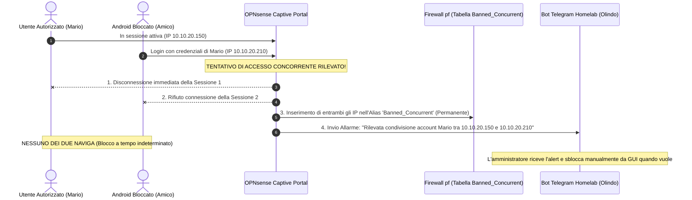

# Piano: Installazione Zenarmor (Filtro Windows) e Captive Portal con Allarme Telegram e Sblocco Manuale

Questo piano descrive l'implementazione coordinata di **Zenarmor (Next-Gen Firewall L7)** per il blocco automatico dei dispositivi Windows e del **Captive Portal di OPNsense** per il filtraggio selettivo degli smartphone Android (con trappola anti-condivisione, blackout a tempo indeterminato, allarme push Telegram e sblocco manuale), ottimizzato per la dotazione hardware del Mini PC firewall (**Intel Celeron J4125**, **8 GB RAM**).

---

## 1. Obiettivi e Architettura di Rete

1. **Blocco Windows L7**: Blocco incondizionato e automatico di tutti i computer Windows basato su Deep Packet Inspection e OS Fingerprinting, a prova di spoofing di MAC e IP.
2. **Accesso Selettivo Android**: Accesso a Internet consentito solo agli smartphone Android autorizzati tramite credenziali personali. Gli Android non autorizzati rimangono bloccati alla schermata di autenticazione del portale.
3. **Protezione Anti-Condivisione con Blackout Totale e Notifica Telegram**:
   - Disabilitazione dei login concorrenti (`Concurrent user logins: Disabled`) sul Captive Portal.
   - In caso di collisione di sessione (stesso account usato contemporaneamente su due dispositivi), entrambe le sessioni vengono immediatamente terminate e gli IP vengono inseriti nella tabella firewall permanente `Banned_Concurrent`.
   - Viene inviato un allarme istantaneo via Telegram bot all'amministratore con timestamp, account e dettagli IP/MAC.
   - **Nessun timer automatico**: il blocco permane a tempo indeterminato finché l'amministratore non esegue lo **sblocco manuale** da WebGUI OPNsense.
4. **Resilienza Hardware**: Utilizzo esclusivo del motore di database **SQLite** per Zenarmor per contenere l'ingombro di memoria entro 1 GB, garantendo la coesistenza fluida con la cache ZFS (ARC) e il processore Celeron J4125.
5. **Integrazione L3 Switch**: Salvaguardia dell'infrastruttura di gestione homelab (DNS Unbound `192.168.2.254`, subnet server `10.10.10.0/24`, cluster Kubernetes Talos `10.244.0.0/16`, OOB `192.168.100.0/24`) tramite elenchi di pass-through (*Allowed Addresses*).

---

## 2. Flusso Operativo della Trappola Anti-Condivisione

---

## 3. Fasi Operative

### Fase 0: Backup Preventivo e Verifica Risorse (Pre-Flight)
* **Azione 0.1**: Dump di backup della configurazione di OPNsense (`config.xml`) da GUI o API (**System $\rightarrow$ Configuration $\rightarrow$ Backups**).
* **Azione 0.2**: Ispezione baseline risorse (RAM libera, carico CPU J4125, ZFS ARC ~4.1 GB).

### Fase 1: Installazione Repository e Plugin Zenarmor
* **Azione 1.1**: Installazione plugin `os-sunnyvalley` in **System $\rightarrow$ Firmware $\rightarrow$ Plugins**.
* **Azione 1.2**: Aggiornamento e installazione del plugin `os-sensei` (Zenarmor).
* **Test di Verifica**: Comparsa del menu "Zenarmor" nella sidebar di OPNsense.

### Fase 2: Configurazione Guidata Iniziale (Configuration Wizard)
* **Azione 2.1**: Controllo opzioni hardware offloading in **Interfaces $\rightarrow$ Settings** (disabilitare CRC/TSO/LRO per netmap).
* **Azione 2.2**: Selezione database: scegliere tassativamente **`SQLite (Local Database)`**. *(Vietato Elasticsearch)*.
* **Azione 2.3**: Modalità di deployment: **`Routed Mode (L3)`** con driver emulato Netmap.
* **Azione 2.4**: Assegnazione interfaccia protetta: `igc1` (`TRANSIT`).
* **Test di Verifica**: Stato Zenarmor Engine = `RUNNING` in **Zenarmor $\rightarrow$ Status**.

### Fase 3: Configurazione Policy Zenarmor per Blocco Windows
* **Azione 3.1**: In **Zenarmor $\rightarrow$ Policies $\rightarrow$ Default**, navigare in **Device / OS Categories**.
* **Azione 3.2**: Impostare la categoria **`Microsoft Windows`** su **`BLOCK`**.
* **Test di Verifica**: Tentativo di navigazione da client Windows: connessione bloccata da Zenarmor e tracciata nei log di *Live Sessions*. Navigazione da Mac Studio e Android autorizzati funzionante regolarmente.

### Fase 4: Configurazione Captive Portal con Allarme Telegram e Sblocco Manuale
* **Azione 4.1**: Creazione account utente personali in **System $\rightarrow$ Access $\rightarrow$ Users** per gli utenti autorizzati.
* **Azione 4.2**: Creazione tabella firewall permanente (`Banned_Concurrent`):
  * In **Firewall $\rightarrow$ Aliases**, creare un alias `Banned_Concurrent` di tipo *IP List / Host(s)*.
  * Regola di blocco in cima all'interfaccia `TRANSIT` (`Action: Block`, `Source: Banned_Concurrent`, `Destination: any`).
* **Azione 4.3**: Configurazione zona Captive Portal su interfaccia `TRANSIT`:
  * `Authenticate using`: Local Database
  * `Concurrent user logins`: **DISABILITATO**
  * `Idle timeout`: 1440 min
  * `Hard timeout`: 10080 min
  * `Allowed Addresses`: `10.10.10.0/24`, `192.168.100.0/24`, `192.168.2.254`, `10.244.0.0/16`
* **Azione 4.4**: Configurazione hook script per notifica Telegram e auto-ban:
  * Al rilevamento della collisione concorrente, inserisce gli IP in `Banned_Concurrent` e invia notifica Telegram al bot homelab (`chat_id=554585346`).
* **Azione 4.5**: Procedura di sblocco manuale:
  * In **Firewall $\rightarrow$ Diagnostics $\rightarrow$ Aliases $\rightarrow$ Banned_Concurrent**, rimozione manuale dell'IP autorizzato con un clic.
* **Test di Verifica**:
  1. Connessione Android non autorizzato: compare la schermata di login, navigazione bloccata.
  2. Connessione Android autorizzato: login effettuato con successo, navigazione abilitata.
  3. Test collisione concorrente: secondo login con lo stesso account da altro dispositivo $\rightarrow$ disconnessione immediata di entrambi, allarme push su Telegram, inserimento in `Banned_Concurrent`.
  4. Test persistenza blocco: verifica che nessuno dei due navighi anche riavviando il Wi-Fi.
  5. Test sblocco manuale: rimozione IP autorizzato dall'alias e ripristino navigazione.

### Fase 5: Verifica Stabilità e Monitoraggio Risorse
* **Azione 5.1**: Monitoraggio memoria e CPU del Mini PC J4125 durante traffico reale.
* **Azione 5.2**: Test di throughput e latenza WAN.

---

## 4. Piano di Rollback (Emergenza)
* **Sblocco Totale Rapido**: Clic su *Flush* sull'alias `Banned_Concurrent` e disabilitazione della spunta *Enabled* nella zona Captive Portal.
* **Disattivazione rapida Zenarmor**: Impostare Zenarmor in modalità *Bypass* o cliccare su *Stop Engine* in **Zenarmor $\rightarrow$ Status**.

---

## 💾 Stato di Ripristino (AI Save-State)
- **Fase Attiva**: Fase 0 (Pre-Flight & Backup)
- **Ultima Azione Completata**: Persistenza del piano operativo nel Wiki e sincronizzazione in `todo.md` e `GEMINI.md`.
- **Prossimo Passo Operativo**: Avviare la Fase 0: Backup preventivo OPNsense (`config.xml`) e ispezione telemetria baseline J4125.
- **Blocchi/Decisioni Pendenti**: Approvazione esplicita dell'utente prima di eseguire il backup e avviare le operazioni su OPNsense.
